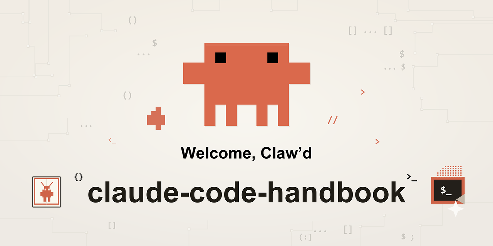

<p align="center">
  
</p>

<p align="center">
  <a href="./src/cc-python-runtime/"></a>
  <a href="./src/cc-python-runtime/tests/"></a>
  <a href="./docs/"></a>
  <a href="./LICENSE"></a>
</p>

---

## 两条主线，按需选择

本仓库是 **Claude Code 的完整知识库**，包含互补的两条主线：

<table>
<tr>
<td width="50%" valign="top">

### 🔬 理解内核

**源码拆解 × 架构重建**

适合想深入理解 Agent Runtime 机制的开发者。

- 完整论文 9 章
- 源码级系统分析
- Python 运行时复刻
- 独立深度调研报告

**→ [进入内核知识库](./docs/internals/)**

</td>
<td width="50%" valign="top">

### 🚀 高效使用

**实战指南 × 工作流方法论**

想快速上手并高效使用 Claude Code 的用户。

- 8 部分实战手册
- 刘小排 / Matt Pocock / 徐文浩 / 小米实践
- Skills / Hooks / MCP 配置
- 安全闭环与团队协作

**→ [进入使用手册](./docs/manual/)**

</td>
</tr>
</table>

---

## 📚 内容地图

### 理解内核

| 区域 | 内容 | 入口 |
|------|------|------|
| **项目总览** | 定位、边界、架构分层 | [`00-overview.md`](./docs/internals/00-overview.md) |
| **论文** | 技术基础 → 详细设计 → 核心模块 → 可靠性 → 部署 | [`01-final-thesis/`](./docs/internals/01-final-thesis/) |
| **系统分析** | query loop、工具系统、权限、记忆、Agent Teams | [`02-system-analysis/`](./docs/internals/02-system-analysis/) |
| **调研报告** | 缓存优化、上下文连续性、Harness 架构 | [`03-research-reports/`](./docs/internals/03-research-reports/) |
| **源码复刻** | Python 运行时核心实现 | [`src/cc-python-runtime/`](./src/cc-python-runtime/) |

### 高效使用

| 区域 | 内容 |
|------|------|
| **认识** | [`part-01-overview/`](./docs/manual/part-01-overview/) — 核心定位、三种形态 |
| **配置** | [`part-02-basics/`](./docs/manual/part-02-basics/) — 安装、会话、项目配置 |
| **工作流** | [`part-03-workflow/`](./docs/manual/part-03-workflow/) — 需求驱动、安全闭环、小米实践 |
| **上下文** | [`part-04-context/`](./docs/manual/part-04-context/) — 记忆、窗口管理、质量提升 |
| **扩展** | [`part-05-extension/`](./docs/manual/part-05-extension/) — Skills、Hooks、MCP |
| **协作** | [`part-06-parallel/`](./docs/manual/part-06-parallel/) — 多任务、Worktree、流水线 |
| **安全** | [`part-07-security/`](./docs/manual/part-07-security/) — 权限、隔离 |
| **进阶** | [`part-08-advanced/`](./docs/manual/part-08-advanced/) — 自动化、失败修复 |

---

## 💻 源码复刻

本仓库包含一个**Python 复刻版**的 Claude Code 运行时核心，用于理解其内部机制。

### 核心模块

| 模块 | 路径 | 说明 |
|------|------|------|
| **查询循环** | [`cc/core/query_loop.py`](./src/cc-python-runtime/cc/core/query_loop.py) | Agent 主状态机，Phase 1-6 循环 |
| **查询引擎** | [`cc/core/query_engine.py`](./src/cc-python-runtime/cc/core/query_engine.py) | 模型调用与事件流编排 |
| **工具执行器** | [`cc/tools/streaming_executor.py`](./src/cc-python-runtime/cc/tools/streaming_executor.py) | 流式工具调用与结果回注 |
| **权限门控** | [`cc/permissions/`](./src/cc-python-runtime/cc/permissions/) | 四级决策链与规则引擎 |
| **记忆系统** | [`cc/memory/`](./src/cc-python-runtime/cc/memory/) | 跨会话知识提取与召回 |
| **上下文压缩** | [`cc/compact/`](./src/cc-python-runtime/cc/compact/) | Token 阈值检测与摘要生成 |
| **Agent Teams** | [`cc/swarm/`](./src/cc-python-runtime/cc/swarm/) | 多 Agent 协调与邮箱通信 |
| **MCP 客户端** | [`cc/mcp/`](./src/cc-python-runtime/cc/mcp/) | 外部工具协议集成 |

### 运行测试

```bash
cd src/cc-python-runtime
uv sync
pytest tests/ -v
```

### 目录结构

```
src/cc-python-runtime/
├── cc/
│   ├── main.py              # CLI 入口
│   ├── api/                 # Claude API 客户端
│   ├── commands/            # 命令注册
│   ├── compact/             # 上下文压缩
│   ├── core/                # 查询循环 + 查询引擎
│   ├── hooks/               # 事件钩子
│   ├── mcp/                 # MCP 协议客户端
│   ├── memory/              # 记忆提取与存储
│   ├── models/              # 消息模型与内容块
│   ├── permissions/         # 权限门控
│   ├── prompts/             # Prompt 构建器
│   ├── session/             # 会话管理
│   ├── skills/              # Skill 加载器
│   ├── swarm/               # Agent Teams
│   ├── tools/               # 20+ 内置工具
│   ├── ui/                  # 终端渲染
│   └── utils/               # 工具函数
└── tests/                   # 单元 + 集成 + E2E 测试
```

---

## 🚀 快速开始

### 读手册

→ 从 [`认识 Claude Code`](./docs/manual/part-01-overview/ch-01-what-is-it.md) 开始

### 读论文

→ 从 [`第 1 章 引言`](./docs/internals/01-final-thesis/ch-01-introduction.md) 开始

### 跑源码

```bash
cd src/cc-python-runtime
uv sync
pytest tests/ -v
```

---

## 🔗 交叉主题速查

| 主题 | 使用手册 | 内核论文 | 源码实现 |
|------|----------|----------|----------|
| Memory | [ch-10](./docs/manual/part-04-context/ch-10-memory-system.md) | [ch-07](./docs/internals/01-final-thesis/ch-07-deployment.md) | [`cc/memory/`](./src/cc-python-runtime/cc/memory/) |
| Query Loop | [ch-24](./docs/manual/part-08-advanced/ch-24-failure-modes.md) | [ch-04](./docs/internals/01-final-thesis/ch-04-detailed-design.md) | [`cc/core/query_loop.py`](./src/cc-python-runtime/cc/core/query_loop.py) |
| Skills | [ch-13](./docs/manual/part-05-extension/ch-13-skills.md) | [ch-05](./docs/internals/01-final-thesis/ch-05-core-modules.md) | [`cc/skills/`](./src/cc-python-runtime/cc/skills/) |
| Permissions | [ch-20](./docs/manual/part-07-security/ch-20-permissions.md) | [ch-06](./docs/internals/01-final-thesis/ch-06-reliability.md) | [`cc/permissions/`](./src/cc-python-runtime/cc/permissions/) |
| Worktree | [ch-18](./docs/manual/part-06-parallel/ch-18-worktree.md) | [ch-08](./docs/internals/01-final-thesis/ch-08-testing-evaluation.md) | [`cc/tools/agent/worktree.py`](./src/cc-python-runtime/cc/tools/agent/worktree.py) |

---

## 📁 仓库结构

```
.
├── docs/
│   ├── internals/                 # 内核知识库（论文 + 分析 + 调研）
│   ├── manual/                    # 使用手册（8 部分 24 章）
│   └── assets/                    # 静态资源（横幅、插图）
├── src/
│   └── cc-python-runtime/         # Python 运行时源码复刻
└── scripts/                       # 维护脚本
```

---

## 🛠️ 技术栈

| 层级 | 技术 |
|------|------|
| 语言 | Python 3.13 |
| 依赖管理 | uv |
| 测试 | pytest |
| 文档 | Markdown |

---

## 📝 命名规范

- **目录**: `kebab-case`
- **Markdown**: `kebab-case`
- **Python 模块**: `snake_case`

---

## ⚠️ 声明

本仓库中的 Python 源码是对 Claude Code 运行时机制的**独立复刻实现**，用于学习与研究目的。原始 TypeScript 源码映射仅用于分析理解，本仓库**不包含**任何受版权保护的原始商业源码。

---

## ⭐ Star History

[](https://star-history.com/#vitoworleone/ClaudeCode-Complete&Date)
