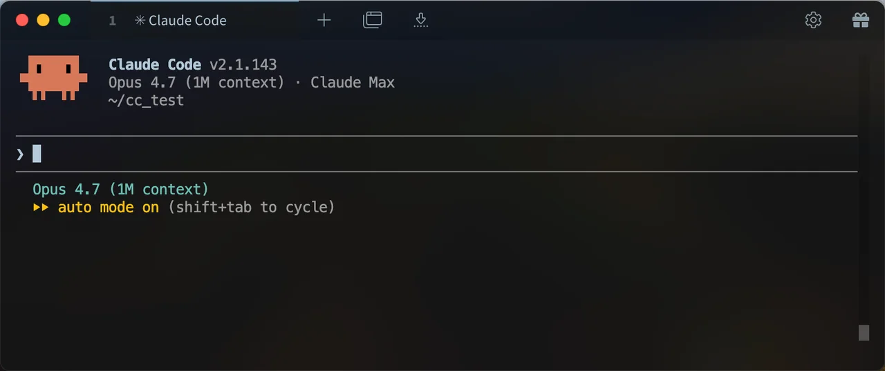
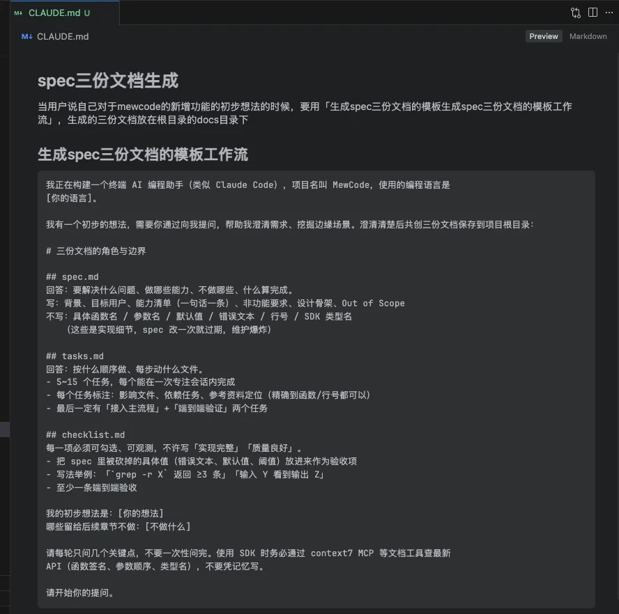
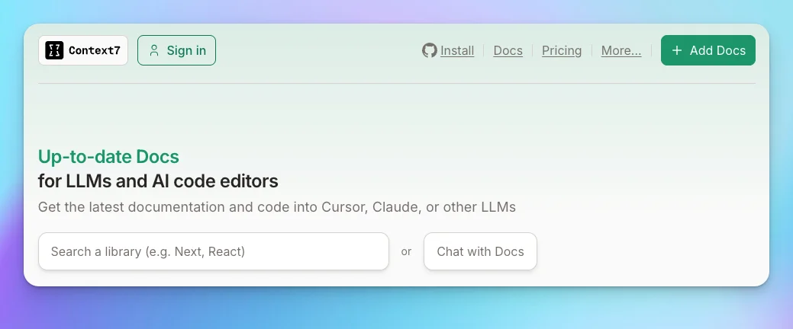
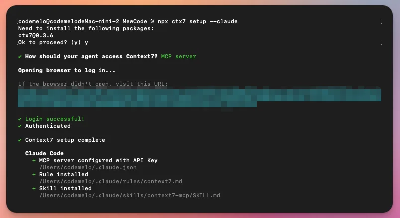
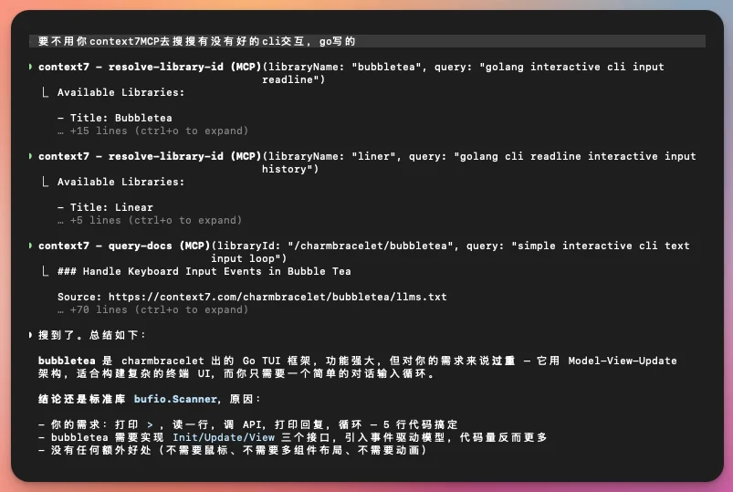

# 前置准备

# 第1章：实战篇

## 前置准备

这门课教的是 **语言无关的 Agent 架构**

实战篇是为了让你 **动手把理论落地** ，真正理解 Agent 架构的运作方式，你可以用任何你熟悉的编程语言来实现 MewCode。

你需要选择三样东西：

### 1、编程语言

课程目前会涉及Python、Java、Go三种语言，自行挑选一种你最熟悉，或者面试主语言

### 2、LLM API

项目兼容两种格式：Anthropic和OpenAI，有条件的购买官方的Api最好

如果模型效果太差，可能会导致这个Coding Agent工作不理想

-   有条件和能力同学，首先推荐用 Claude Opus 模型或者 GPT 模型来 Vibe Coding，但是使用这些海外模型，还是挺麻烦的，需要一些魔法技巧，不适合大多数人。

-   国内的编程模型也是能完成我们mewcode项目的 Vibe Coding 开发的，国内的模型推荐GLM、MiniMax、Kimi、DeepSeekV4 这些，国内最好用的是GLM模型，但是官方coding plan 套餐太难抢了，抢不到的可以用 MiniMax 或者 deepseek， 目前价格最便宜的是 DeepSeekV4，在校的同学图省钱就首选DeepSeekV4就行。

而且这些国产的模型也完全会兼容Anthropic和OpenAI协议格式，所以一般来说我们直接对接这两个格式就可以了！

### 3、安装你的开发环境

安装你选择的编程语言和相关工具，确保能在终端里编译和运行你的代码。

如果准备跟我VibeCoding完成的，还需要准备好Vibe Coding工具。

项目教程会使用Claude Code来进行 VibeCoding 实战。

如果没有用过 Claude Code 或者对它不熟悉的同学，也不用担心，学起来很快的，我们也准备了一些新手入门 Claude Code 的资料：

> 文档资料：

-   安装和配置教程： [📄 安装Claude Code](https://my.feishu.cn/wiki/PIEWw8TZui3VvhkKwMrcDhKvnx2?fromScene=spaceOverview)

-   常见Claude Code命令熟悉： [面试官：“你 Claude Code 用得这么 6？” 我暗喜：“我早把 /powerup 命令的流程都做了”，他：你牛逼](https://mp.weixin.qq.com/s/tO15UKQG0WtTBTNz8QLQjQ)

> B站优质Claude Code入门教程推荐：

-   [Claude Code 从 0 到 1 全攻略：MCP / SubAgent / Agent Skill / Hook / 图片 / 上下文处理/ 后台任务](https://www.bilibili.com/video/BV14rzQB9EJj/?spm_id_from=333.337.search-card.all.click&vd_source=894a223b85ae44e61e16dcd1a7356db0)

-   [全网最全！60分钟全面掌握Claude Code～【附完整文档】](https://www.bilibili.com/video/BV1NvRyBzEhq/?spm_id_from=333.1365.list.card_archive.click&vd_source=894a223b85ae44e61e16dcd1a7356db0)

-   [5个 Claude Code 高性价比技巧，让你 Vibe Coding 效率翻倍！| AI 实战](https://www.bilibili.com/video/BV1mdXWB2Et3/?spm_id_from=333.1007.tianma.12-4-46.click&vd_source=894a223b85ae44e61e16dcd1a7356db0)

> ⚠️强调：有一些同学会误解 Claude 模型不是国内用不了吗？那还能用 Claude Code？这两个不是一个东西哈，Claude Opus 是大模型，确实要有魔法才能用，但是 Claude Code 只是一个客户端，也就是AI编程工具，无需苛刻的网络环境，实际上用 Claude Code 并不是只能用 Claude 自家的模型，它是可以接入其他大模型来用的，比如可以接入国内的模型来进行编程。

当然大家也可以选择自己更熟悉的AI编程工具，比如Codex、Cursor、Trae、Qoder都可以。

---

## 如何实战？

### 这门课的学习方式

在开始动手之前，聊聊这门课的学习方式，因为它跟传统的编程课不一样。

每一章的后半部分，你会看到一个「Vibe Coding 提示词」。你把它复制到你的 AI 编程助手里（比如 Claude Code、Cursor、Codex、Trae），告诉它你用什么语言，AI 会帮你生成代码。

虽然我会采用VibeCoding的方式来实现，但这不意味着你可以不思考。恰恰相反，Vibe Coding 要求你 **想得更清楚** 。你得理解前面讲的概念和设计原则，才能判断 AI 生成的代码好不好。

打个比方，Vibe Coding 就像当甲方。一个好甲方不需要自己砌砖，但他得清楚地知道要建什么样的房子、怎么验收。前半部分教你「怎么当一个懂行的甲方」，后半部分让你拿着需求去找 AI 施工。

每一章你都可以选择两种学习方式：

**方式一** ：先自己写，卡住了再用提示词VibeCoding。适合想练手的同学。

**方式二** ：直接用提示词让 AI 生成，然后认真读代码，对照前面的理论检查 AI 做得对不对。适合想快速理解架构的同学。

但是注意，无论哪种方式， **最后都要对照验收标准检查，不然代码很容易就会偏离你的想法**

### Spec 模式：给 AI 一套施工图纸

直接把需求丢给 AI 让它写代码，效果往往不稳定。有时候写出来的东西偏离需求，有时候漏掉关键细节，有时候做着做着方向就歪了。

一个简单有效的做法是，把需求按三份文档组织起来再交给 AI：

**spec.md** ：项目范围。你在做什么、为什么要做、做了哪些决策和权衡、哪些东西在范围内哪些不在。这是整个任务的北极星，AI 的所有实现都围绕它展开。

**tasks.md** ：任务拆解。把 spec 具体化成若干个子模块，每个子模块下面有子任务，每个子任务再细化成执行步骤。AI 在推进的过程中逐个勾选，你随时能看到进展。

**checklist.md** ：验证清单。AI 完成全部实现后，逐项过一遍这份清单，确认没有遗漏。编译通过、功能正确、边界情况覆盖，全部对完才算收工。

这三份文档的关系你可以这样理解：spec 定义做什么，tasks 规划怎么做，checklist 确认做没做完。后续每一章的提示词都会按这个结构组织。

接下来的课程中，我们整个项目的完成也会按照Spec模式来进行开发，这三份文档我们可以选择放在一个docs目录中，比如docs/ch01/spec.md、docs/ch01/tasks.md、docs/ch01/checklist.md

除此之外，这三份文档其实都会比较结构化以及字数多，自己手写是不可能的，我们需要让 AI 来帮我们生成这三份文档

但是也不能完全让它自己发挥，毕竟你不说你的想法的话，AI 是不知道你想要的结果的，最好的办法就是人在回路（HITL，Human-in-the-Loop）

具体来说我们可以做一个模板，比如这里这样子

这样子，我们每次学习一个新的章节的时候，就在这个框架上，把任务换成我们每章学习的、需要新增的功能即可

对于这个框架，我们也不用每次都复制，我们可以把框架抽取出来复用，后续每个章节我们讲初步想法就行

那么如何复用呢，就得说到Coding Agent的一个项目指令文件，以Claude code为例子，就是CLAUDE.md

`CLAUDE.md` 是 Claude Code 使用的项目级上下文配置文件，本质上就是给 AI Agent 的项目说明书。你可以在里面写项目介绍、技术栈、代码规范、目录结构、开发命令、接口约定、注意事项等内容

Claude 会在工作时自动读取，从而更理解你的项目，减少重复解释，提高代码生成一致性。

我们通常放在项目根目录，用来约束 Claude 不乱改代码、遵守团队规范、保持架构一致。

所以基于这些特性，它就很适合放置我们的一些模板，毕竟模板就算是我们的团队规范一样的东西，具体我们可以这样写

后面我们每章新增功能的时候，直接说我们的初步想法，然后Claude Code就会跟随CLAUDE.md的指引，开始进行提问了

### 文档工具

大模型（LLM）你可以理解为是一个不会更新自己知识的大脑，所以我们在开发的时候，用到的一些组件SDK可能会有所更新，因此我们还需要给我们的开发环境，安装一个获取最新开发文档的工具

这里我推荐用context7这个MCP

> https://context7.com/

这上面有非常多的文档，供我们的LLM去使用，安装方式也很无脑，比如我们以Claude Code为例子

我们打开终端，用官方的命令，安装到Claude Code

> npx ctx7 setup --claude

然后我们让Claude Code 用这个MCP去搜索有没有好的cli交互框架，然后它就会调用context7MCP，去搜索了

安装好这些后，我们算是把我们的环境配好了，这下可以去进行学习和开发了