# 初识 Coding Agent

## 先来看一个场景

想象一下，你刚接手一个新项目，代码库有几十个文件，老板让你「把用户认证从 Session 换成 JWT」。

你会怎么做？

大概率是这样：先翻一遍项目结构，找到跟认证相关的文件。读几个关键文件，搞明白现在的 Session 是怎么用的。然后开始动手改代码，加上 JWT 的逻辑。改完跑一下测试，发现有两个地方漏了，回头补。再跑测试...如此反复，直到所有测试通过。

你可能觉得这再普通不过了。但我想让你注意一下这个过程的结构：

**读代码 → 理解 → 做决策 → 写代码 → 看结果 → 调整 → 再来一轮**

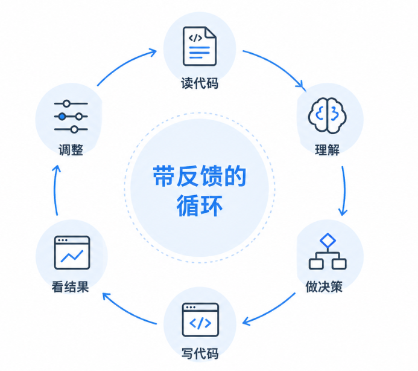

带反馈的循环

这是一个循环。而且是一个带反馈的循环：你每做一步，都会根据上一步的结果来决定下一步怎么走。

现在把问题换一下：如果有个 AI 也能跑这个循环呢？

你只要跟它说一句「帮我把认证从 Session 换成 JWT」，它就自己翻代码、自己读文件、自己写代码、自己跑测试、自己根据报错修改。就像一个新来的同事，你给他一个任务，他自己搞定。

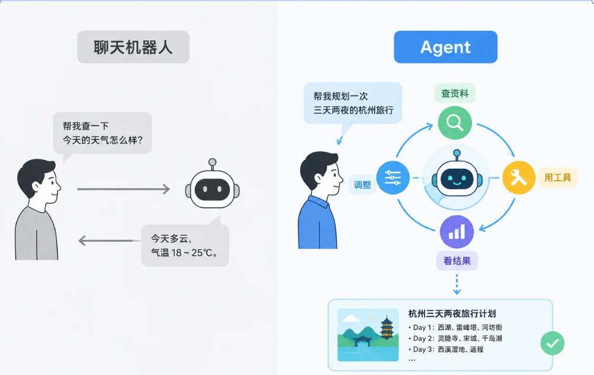

从一句需求到自主执行

这就是 Coding Agent 做的事情。而这门课，就是教你从零把这样一个东西造出来。

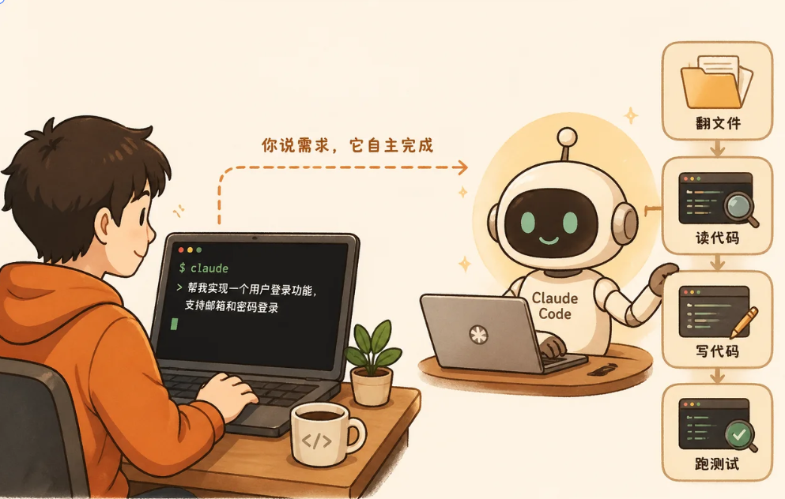

---

## 所以 Agent 到底是什么

「Agent」这两年被说烂了。几乎每个 AI 产品都说自己是 Agent。但如果你停下来想想，你能说清它跟一个普通的聊天机器人到底有什么区别吗？

抛开那些花哨的定义，从最直觉的角度理解。

一个普通的聊天机器人是什么样的？你问它一个问题，它回你一个答案。一问一答，结束。就像去餐厅点菜，你说「来份宫保鸡丁」，服务员端上来，完事。

Agent 呢？你给它一个目标，它自己想办法完成。过程中它可能需要查资料、用工具、看结果、调整方案，反复好几轮，直到搞定。

聊天机器人与 Agent 对比

打个比方，你跟一个厨师说「我想吃顿川菜」。厨师会自己打开冰箱看看有什么食材，决定做宫保鸡丁和麻婆豆腐，然后开始切菜、炒菜、尝一口味道不够辣加点辣椒、再尝一口满意了装盘上菜。整个过程你没告诉他每一步怎么做，他自己规划、自己执行、自己根据反馈调整。

厨师自主完成川菜需求

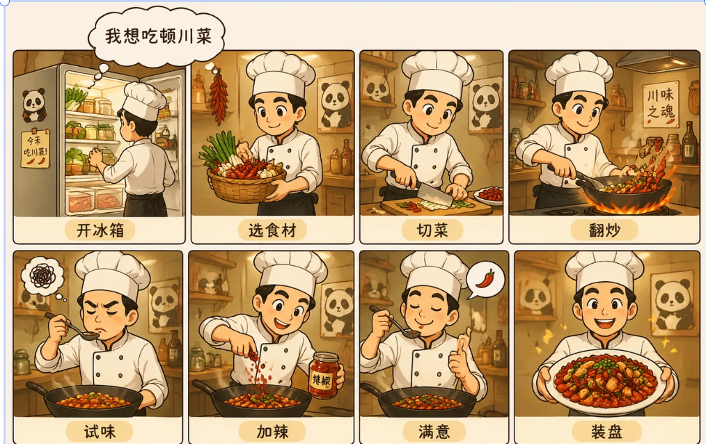

所以 Agent 和聊天机器人的核心区别就两个字： **自主** 。

Anthropic（做 Claude 的公司）给了一个非常简洁的定义：

> Agent 就是 LLM 在循环中根据环境反馈自主使用工具的系统。

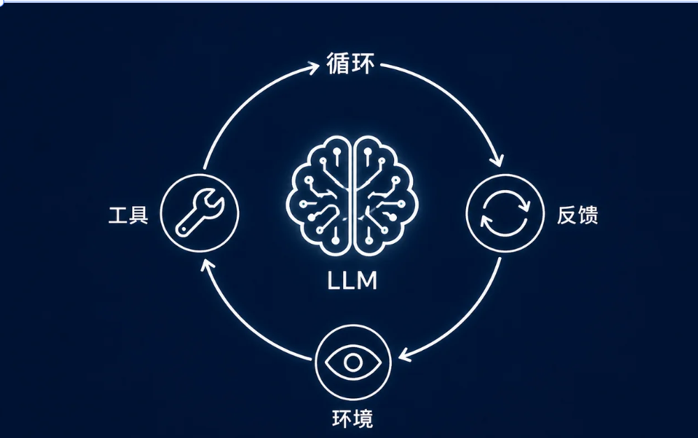

Agent 定义四要素

这句话很短，但每个词都有分量。我们拆开来感受一下。

**LLM** 是大脑，负责理解和思考。没有它，就没有「理解任务」的能力。

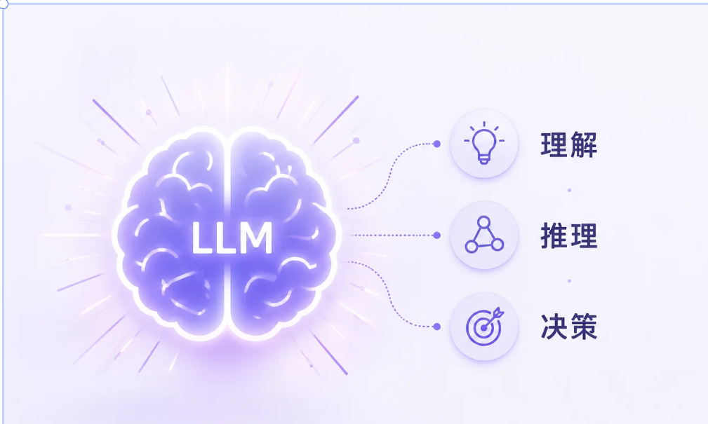

LLM 作为理解推理决策的大脑

**循环** 意味着不是一次性问答就结束。做完一步，看看结果，再决定下一步。就像你调试代码，不可能跑一次就完美，总要反复几轮。

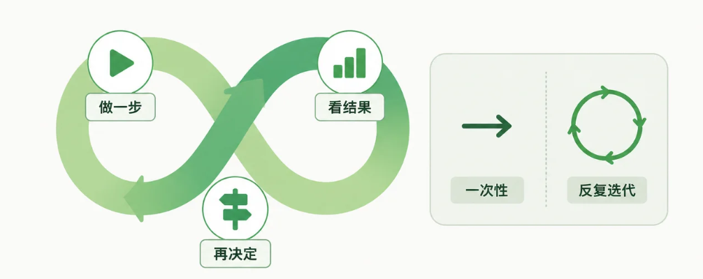

循环不是一次性问答

**环境反馈** 是关键中的关键。Agent 每做一步操作，都能感知到结果。执行了一个命令，拿到了输出；读了一个文件，拿到了内容；跑了一个测试，拿到了报错信息。这些反馈驱动着下一轮决策。

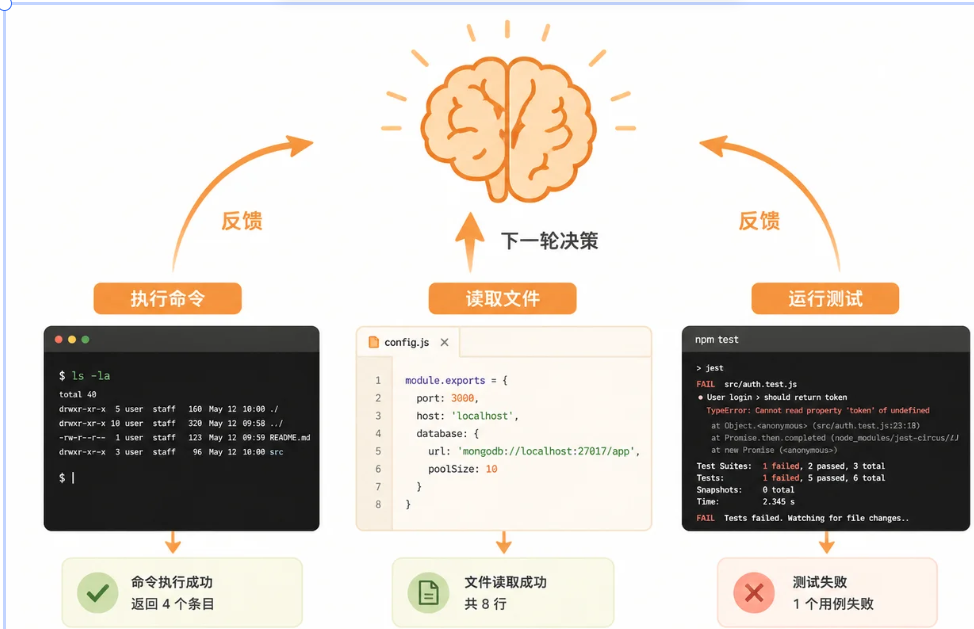

环境反馈驱动下一轮决策

**自主使用工具** 是说 Agent 自己判断该用什么工具。是该读文件还是写文件？是该搜索代码还是执行命令？这些决策由 LLM 自己做，不是你预先写好的 if-else 逻辑。

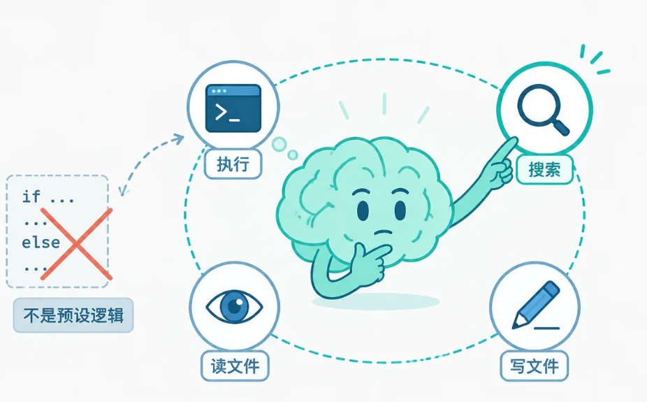

自主选择工具而非预设逻辑

你可能会问：这四个要素缺一个行不行？

不行。缺了 LLM，没有理解和推理能力，就是一个死板的脚本。缺了循环，只能做一步就停，碰到意外情况就傻了。缺了反馈，Agent 就像闭着眼开车，不知道自己做的对不对。缺了工具，Agent 就是个空想家，想了一大堆但什么都做不了。

缺少四要素之一的后果

四个要素缺一不可。这就是 Agent 的全部本质。没有什么魔法，也不神秘。

---

## 为什么偏偏是 Coding Agent

Agent 能干很多事。客服、数据分析、写文案、做研究...但如果你想 **学会怎么造** Agent，Coding Agent 是一个特别好的起点。

Coding Agent 适合作为学习沙盘

为什么？因为跟其他类型的输出相比，代码有一个巨大优势： **可以自动验证** 。

你让 Agent 写了一个函数，编译一下，过了就是过了，没过就是没过。你让 Agent 改了一个 bug，跑一下测试，绿了就是绿了，红了就是红了。这是非黑即白的，不需要人来判断。

你想想别的场景：让 Agent 写一篇营销文案，怎么自动判断写得好不好？让 Agent 做一份数据分析报告，怎么确认结论对不对？这些都需要人工判断，没法自动化。

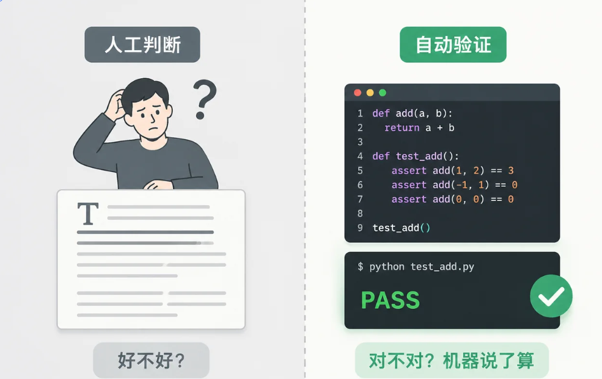

代码验证与人工判断对比

但代码不一样。编译器、测试框架、Lint 工具，这些就是天然的自动评判机制。这意味着什么？意味着 Agent 可以 **自己验证自己的输出** 。写了一段代码，跑一下，报错了，把报错信息喂回 LLM，LLM 修改代码，再跑一下...这个循环可以完全自动化，不需要人介入。

再加上编程本身就是一个「写代码 → 运行 → 看报错 → 修改 → 再运行」的循环过程，跟 Agent 的核心循环完美契合。

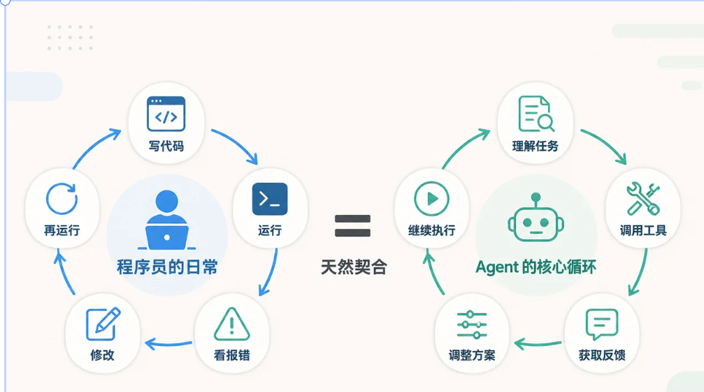

程序员循环与 Agent 循环天然契合

所以 Coding Agent 不只是 Agent 的一种应用。它几乎是 **学习 Agent 架构最理想的沙盘** ：反馈即时、结果可验证、循环天然存在。在这个场景下学到的架构思维，可以迁移到任何 Agent 场景。

---

## 我们要造什么：JiMiCode

说了半天理论，说点具体的。

这门课你会从零构建一个叫 **JiMiCode** 的 Coding Agent。简单说，它就是一个终端里的 AI 编程助手。你在终端里跟它对话，它能帮你读文件、写代码、执行命令、搜索代码库，而且是自主决策的。

JiMiCode终端对话

你可能会问：这不就是 Claude Code 吗？

确实，JiMiCode的设计一定程度上参考了 Claude Code 的架构思想。Claude Code 是目前最成熟的 Coding Agent 之一，它的很多设计决策经过了大量实战打磨，非常值得学习。

JiMiCode参考 Claude Code 的架构设计，实现了一个轻量化的 Coding Agent。这门课带你深入理解 JiMiCode每个核心模块是怎么设计和实现的：从对话管理到工具系统，从 Agent Loop 到权限控制，从上下文管理到记忆系统，最终拼成一个完整可用的产品。

JiMiCode核心模块拼图

### JiMiCode的五层架构

一个 Coding Agent 看着是一个程序，但它里面有很多模块在协作。怎么组织这些模块？如果你去看 Claude Code 的源码，会发现它把不同职责的代码放在不同的模块里，模块之间通过清晰的接口通信，互不干扰。

我们把这种思路提炼一下，给 JiMiCode设计了五层架构，每层解决一类问题：

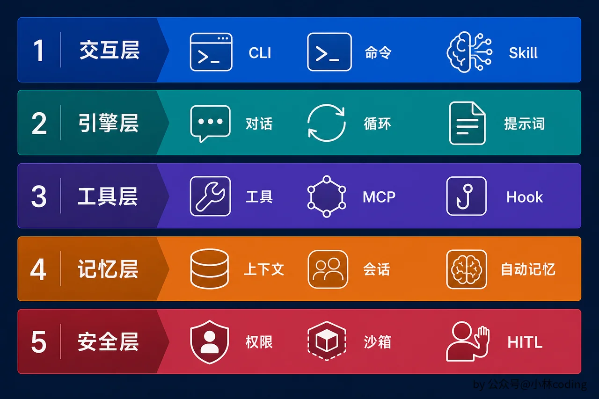

JiMiCode五层架构

为什么要分层？因为每层只管自己的事，互不干扰。交互层不需要知道 LLM 怎么调用，工具层不需要关心界面怎么渲染，安全层贯穿所有操作但不干预具体逻辑。每一层只做自己的事，通过接口跟其他层通信。

这跟你写 Web 应用时的 Controller-Service-Repository 分层是一个道理。只不过 Coding Agent 的「层」更多，因为它要处理的事情更复杂：不只是接请求返数据，还要自主决策、管理上下文、控制安全。

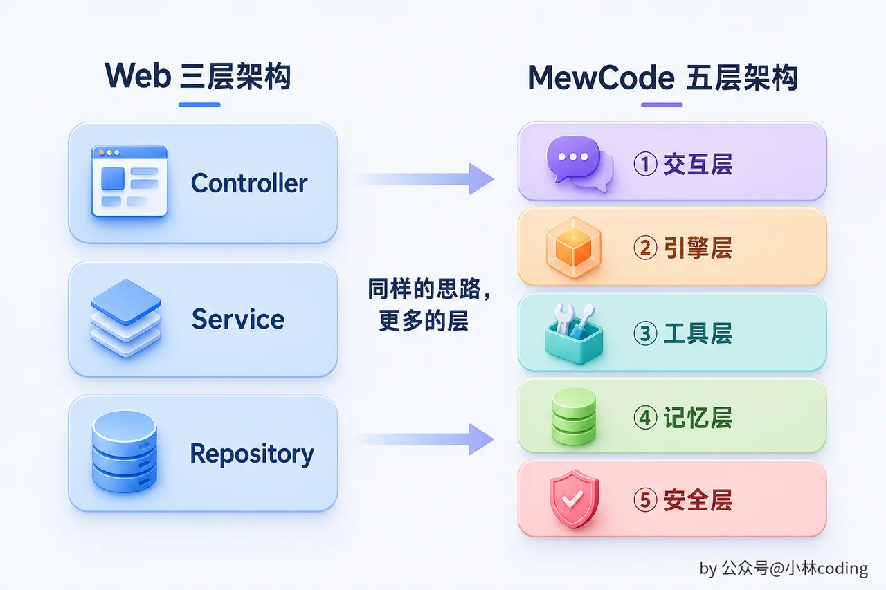

Web 三层架构与 JiMiCode五层架构对比

你现在不需要完全理解每一层，后面每一章都会深入展开。但请记住这张图，它是整个课程的骨架。后面每进入一个新章节，我都会告诉你「你在架构的哪一层」，帮你保持全局视野。

整个课程走完，你会亲手填满这张图的每一个格子。到时候回来看这张图，你会有完全不同的理解。

---

## 本章小结

回顾一下这一章做了什么。

首先搞清楚了 Agent 的本质： **LLM + 工具 + 循环 + 反馈** ，四个要素缺一不可。不是什么能聊天的东西都叫 Agent，关键在于「自主」和「循环」。

然后理解了为什么 Coding Agent 是学 Agent 的最佳路径：代码输出可以自动验证，天然形成反馈循环。

最后认识了 JiMiCode的五层架构。现在它还只是一张蓝图，但地图有了，后面每一章你都知道自己在填哪个格子。

下一章，我们来看看 Coding Agent 的第一个核心模块：LLM API 与对话管理。