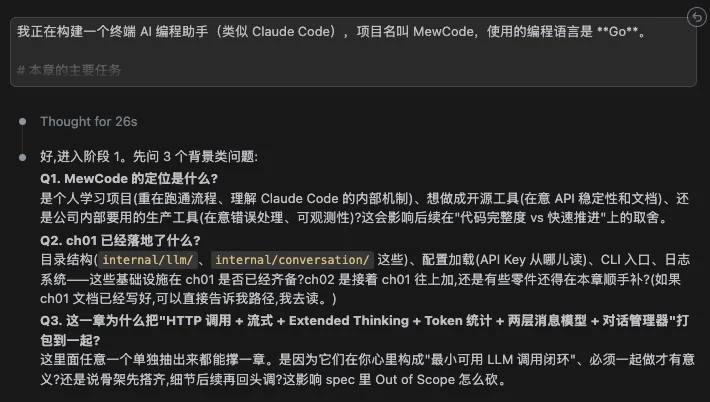
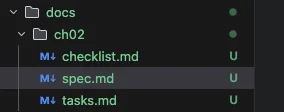
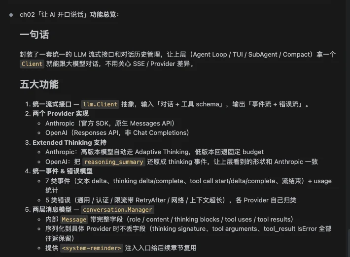
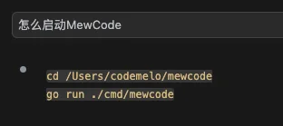
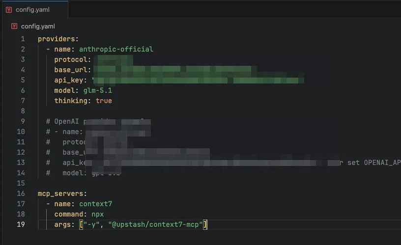
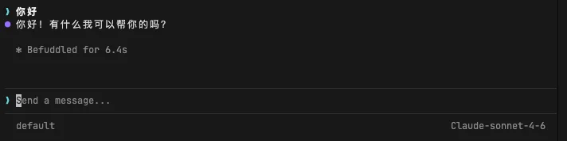
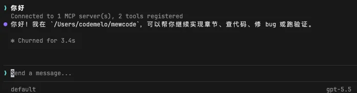
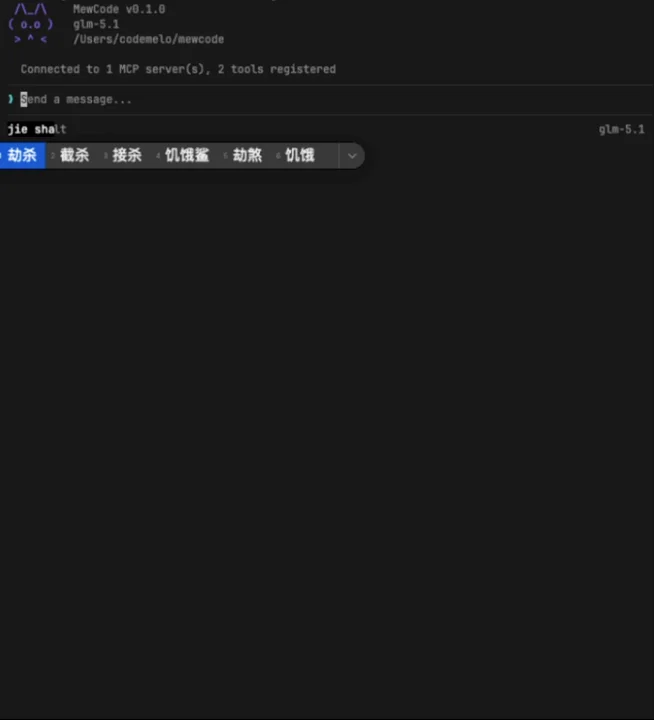

# 实战演练：让 AI 开口说话

## 本章需要做什么

上一章理论篇搞清楚了 Agent 的本质和 MewCode 的六层架构。这一章开始写代码，做两件事：调通 LLM API，然后套上终端界面支持多轮对话。

先是配置系统。用 YAML 配置文件管理 LLM 供应商信息，四个核心字段：

-   protocol 决定走哪家协议

-   model 指定模型

-   base\_url指定请求的地址

-   api\_key 做认证。

这样就能在 Anthropic、OpenAI 或其他兼容服务之间自由切换，改配置文件就行，代码不用动。

然后是 LLM 客户端。封装一层，把 API 返回的 SSE 流式事件转成统一的内部类型：文字片段、完成信号、错误。上层代码只认你自己定义的类型，不依赖任何 SDK。本章实现 Anthropic 和 OpenAI 两种协议。

接下来是消息管理。多轮对话意味着每次调 API 都要带上完整的对话历史，所以需要一个对话管理器来维护消息列表。

消息模型分两层：API 层只有 `role` + `content` ，内部层增加 ID、状态、时间戳、token 用量这些元数据。

格式转换函数 `toAPIFormat()` 负责过滤、合并、交替校验，把内部状态转成 API 能接受的干净格式。

最后是终端界面。用 TUI 框架搭一个有标题栏、对话区、状态栏和输入框的界面，流式显示 AI 回复，回复完了再做 Markdown 渲染。状态栏实时显示模型名、token 用量和响应耗时。

这一章不涉及工具调用和 Agent 循环，那是第三章和第四章的事。

---

## Vibe Coding 实战

### 生成三份文档

先按照我们的第一章说的模板，去生成spec三份文档的提示词，CLAUDE.md会引导

比如我们第二章的主要任务是

**调通 LLM API，套上终端界面，支持多轮对话**

然后给 AI 提问，它就会给我们去问问题，进行需求澄清，让 AI 知道我们的脑子里需要什么东西

我们根据 AI 的提问，回答，一直这样反复循环对齐需求，最后就能生成我们的三份文档了，每章的这三份文档我都会放在最后的 **「参考提示词和代码」** 这一节，给同学作为参考

这样，AI编程时，按照spec的大目标作为一个概览，然后按照task的一个个事项，进行实际落地，最后用checklist去作为验收，就能组成一道严密的vibe coding流水线啦

### 正式开发

三份文档有了之后，就相当于施工图纸已经定好了，然后我们让 Claude Code 去根据这三份文档进行开发即可

经过一段时间后，就会开发完成，对应的总结也会告诉我们，让我们了解情况

### 功能验证过程

之后我们可以来验收下结果。

我们先问AI，怎么启动程序

根据AI的指示，进入后，首先看到，我们已经有一个终端ui了，上面是MewCode的名字和Logo，下面是输入框和模型名字

现在需要看看是不是Anthropic的Claude和Openai的Gpt都能接上，先在config.yaml里面配置

然后启动MewCode，说句你好

Claude成功，接下来看看GPT

也成功了，输入一个问题，看看 AI 回复是不是流式蹦出来的，连续问几个问题看看多轮对话有没有记住上下文

验收没问题，AI的回答能够进行流式输出，那么本章的主要任务就完成了。下一章，我们给 MewCode 装上手脚：工具系统。

---

## 参考提示词和代码

如果你在澄清需求的过程中遇到困难，或者生成的三份文件效果不理想，可以直接使用下面的参考版本。

把下面三个文件保存到项目根目录，然后告诉你的 AI 编程助手：

> 提示词如果需要复制，移步到这里： [💡 提示词复制](https://my.feishu.cn/wiki/JM5Kw5TIGiIehqks1BYcYdpLnzd?fromScene=spaceOverview)