# 让 AI 开口说话

---

## 概念有了，但 MewCode 还不会思考

上一章我们搞清楚了 Agent 的本质和 MewCode 的架构全景。但到目前为止，一行代码都没写。MewCode 还只是一张蓝图。

这一章开始动手。做两件事： **调通 LLM API，然后套上终端界面支持多轮对话** 。

API 调用看着简单，但里面藏着 Agent 架构的核心概念。消息格式决定了对话怎么组织，流式响应决定了用户体验的下限，Token 计费决定了你的钱包能撑多久。

而多轮对话引出了消息管理、状态设计、格式转换这些 Agent 必备的基础设施。把这些搞明白，后面的路才走得稳。

## 先看看 API 长什么样

在写任何客户端代码之前，强烈建议你先去翻一遍 Anthropic 官方的 Messages API 文档：

> https://docs.anthropic.com/en/api/messages

文档里有完整的参数说明、请求示例和响应结构，随着 API 更新也会同步，是最可靠的一手资料。

MewCode 同时兼容 Anthropic 和 OpenAI 两套协议，这一章先以 Claude 的 Messages API 为例。OpenAI 协议的适配在封装层处理，后面会讲到。

我们这里只提炼跟 Agent 开发直接相关的几个要点。

先用一个 curl 命令直观感受一下 API 的请求和响应。你可以在终端里直接跑这条命令（把 `$ANTHROPIC_API_KEY` 换成你的真实 Key）：

```Bash
curl https://api.anthropic.com/v1/messages \
    -H 'Content-Type: application/json' \
    -H 'anthropic-version: 2023-06-01' \
    -H "X-Api-Key: $ANTHROPIC_API_KEY" \
    -d '{
          "max_tokens": 1024,
          "messages": [
            {
              "content": "Hello, world",
              "role": "user"
            }
          ],
          "model": "claude-sonnet-4-6"
        }'
```

对应的响应（省略了部分字段）：

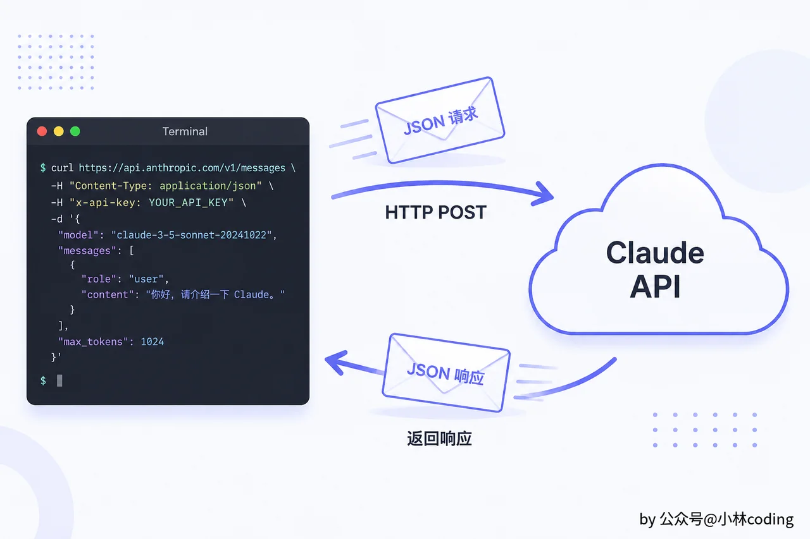

API JSON 往返

```JSON
{
  "id": "msg_013Zva2CMHLNnXjNJJKqJ2EF",
  "type": "message",
  "role": "assistant",
  "content": [
    {
      "type": "text",
      "text": "Hello! How can I help you today?"
    }
  ],
  "model": "claude-sonnet-4-6",
  "stop_reason": "end_turn",
  "usage": {
    "input_tokens": 10,
    "output_tokens": 12
  }
}
```

一个 HTTP POST，发一段 JSON 过去，拿一段 JSON 回来。本质上所有 LLM 应用都在干这件事，只是上面包了不同的壳。

但这个简单的 JSON 里有好几个值得琢磨的细节。

---

## Messages 格式：比你想的更有讲究

先看请求里的 `messages` 。它是一个数组，每条消息有 `role` 和 `content` 两个字段。

`role` 只有两个值： `user` （用户说的话）和 `assistant` （模型的回复）。

Claude 的模型是按 user 和 assistant **交替对话** 的模式训练的，所以 messages 数组里最好保持两个角色交替出现，第一条通常是 user。

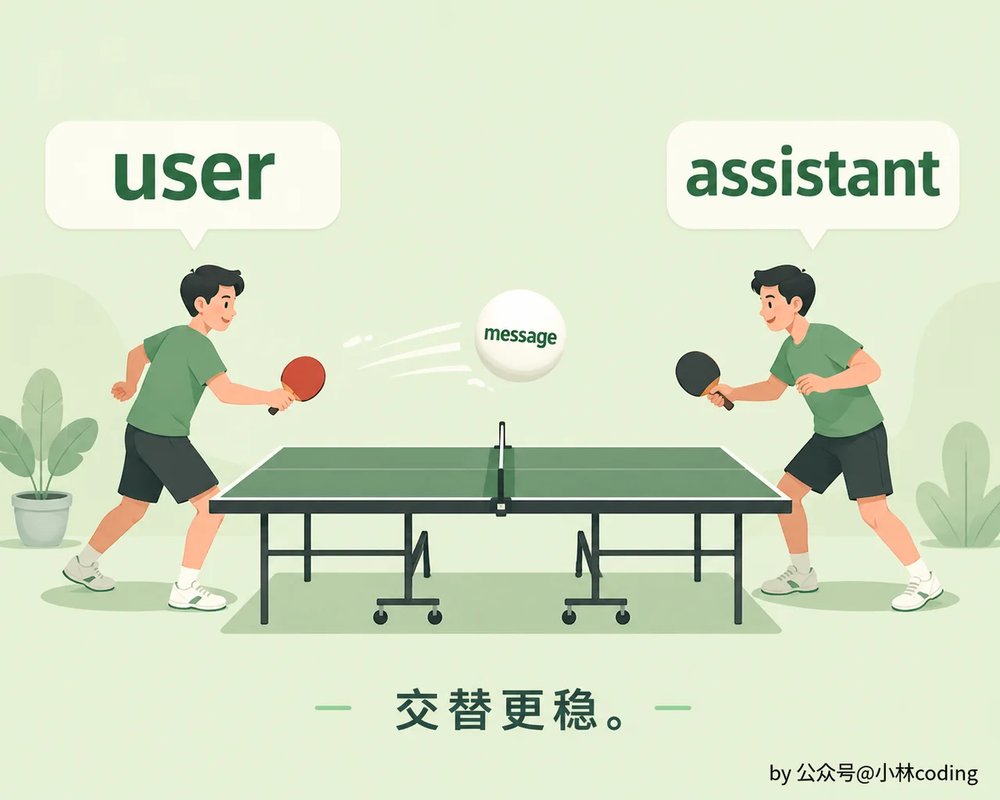

user 与 assistant 交替消息

不过这不是硬性限制。如果你连续放了两条 user 消息，API 不会报错，它会自动把它们合并成一条。

但在实际写 Agent 的时候， **保持交替仍然是个好习惯** 。等到你实现工具调用时就会碰到一个坑：LLM 返回一个工具调用请求，这算 assistant 的消息。你执行完工具拿到了结果，需要把结果发回去—— **这个结果要作为 user 消息发送** ，因为从 API 的视角看，所有你发给模型的东西都归 user，模型返回的都归 assistant。如果你搞错了角色，把工具结果也当成 assistant 发出去，就会出现两条 assistant 连在一起，API 会直接拒绝：

```JSON
{
  "type": "error",
  "error": {
    "type": "invalid_request_error",
    "message": "messages: roles must alternate between \"user\" and \"assistant\", but found multiple \"assistant\" roles in a row"
  }
}
```

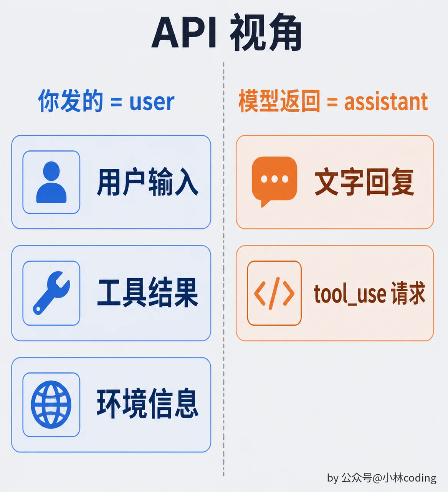

你发的是 user 模型回的是 assistant

消息管理逻辑如果不注意拼接顺序，很容易出问题。实现 Agent 循环的时候你会深刻体会到这一点，现在先在脑子里记着。

再看响应里的 `content` 字段。你注意到了吗？ **响应里的 content 永远是一个数组** ，不是一个字符串（虽然发送请求时 content 可以用字符串简写，但响应里永远是数组格式）。

为什么是数组？因为模型的一次回复可能包含多种内容。它可能先说一段话，然后请求调用一个工具，甚至一次调多个工具。

每种内容是一个独立的 `content block` ，类型可能是 `text` 、 `tool_use` 等等。

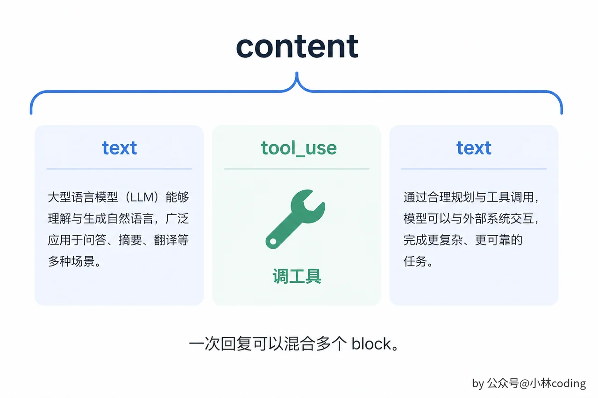

content 是内容块数组

现在你只会看到 `type: "text"` 的内容块。但到实现工具系统时你就会遇到 `tool_use` 了。到时候如果你忘了 content 是数组，代码大概率会出 bug。

---

## 流式响应：不是可选的，是必须的

前面的 curl 示例用的是普通请求：模型生成完所有内容，一次性返回。这在调试的时候没问题，但在产品里完全不能用。

为什么？因为 Claude 生成一段长回复可能需要 10 到 30 秒。你能想象用户盯着一个空白屏幕等 30 秒吗？等 3 秒都够他按 Ctrl+C 了。

所以你必须用流式响应。流式的意思是：模型一边生成一边推送给你，你一边收到一边显示。用户会看到文字一个一个蹦出来，就像有人在实时打字。

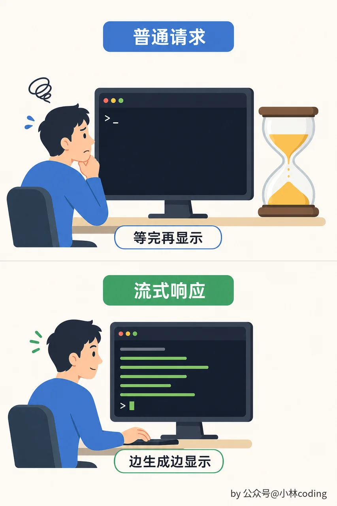

普通请求与流式响应对比

流式响应基于 SSE（Server-Sent Events）协议。你不需要深入了解 SSE 的所有细节，只需要知道它本质是一个长连接的 HTTP 响应，服务器往里面持续写数据。

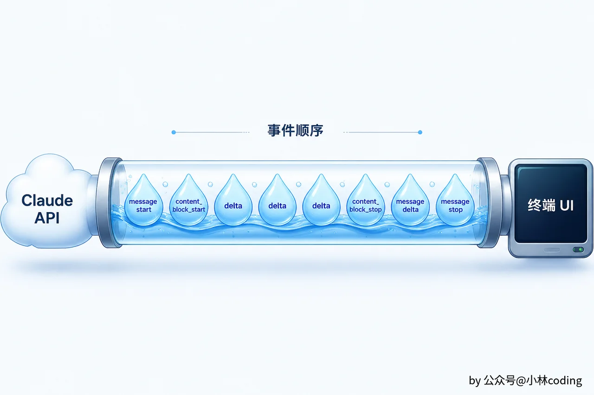

SSE 流式事件时间线

Claude 的流式事件是有固定顺序的：

```Plaintext
message_start          整个响应开始，带着 input_tokens 信息
  └─ content_block_start   一个内容块开始（文本或工具调用）
       └─ content_block_delta  内容增量，文字一个词一个词地到达
  └─ content_block_stop    一个内容块结束
message_delta            消息级别的增量（output_tokens、停止原因）
message_stop             整个响应结束
```

你的代码需要在不同事件上做不同的事。 `message_start` 到达时记录输入 Token 数， `content_block_delta` 每来一个就把文字增量推给 UI 显示， `message_delta` 里提取输出 Token 数，最后 `message_stop` 做收尾。

有一个容易踩的坑： **一次响应可能有多个 content\_block** 。比如模型先输出一段文字，再请求调用一个工具，这就是两个 block。你的解析代码不能假设只有一个文本块。现在可能还遇不到这种情况，但代码要留好扩展空间。

### 不同语言的流式处理模式

流式处理的核心需求是一样的：生产者持续产生事件，消费者逐个处理。但不同语言有不同的惯用模式：

|     |     |     |
| --- | --- | --- |
| 语言  | 流式原语 | 消费方式 |
| Go  | channel | for event := range ch |
| Python | async generator | async for event in stream |
| Java | Iterable<Event> | for (Event e : stream) |

选择你的语言最惯用的模式就好。不管用哪种，核心就是让生产者和消费者各干各的、互不阻塞。流跑完了连接要自动关掉，不能漏资源。用户按 Ctrl+C 的时候也得能干净退出，不能挂在那儿。

---

## 一个请求里的三个抽屉

到目前为止你已经见过了 `messages` 数组。但 Claude API 的请求里其实有好几个不同的信息字段，各管各的事：

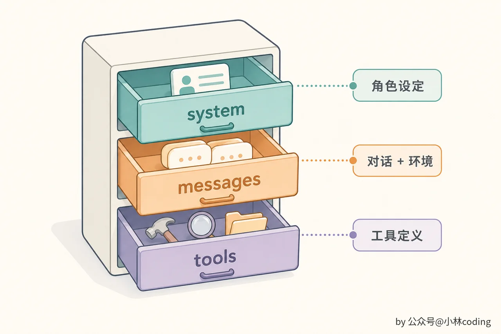

API 请求的三个字段

system 参数放的是角色设定和环境信息。告诉模型你是谁、该怎么行为，也告诉它当前工作目录是什么、操作系统是什么。你总不希望模型在 Linux 上给你建议用 PowerShell 吧。这部分在一次会话内相对固定，不随对话变化。

messages 数组放的是对话历史和动态上下文。用户和模型之间你一句我一句的对话，以及后续会讲到的项目指令、动态提醒等信息，都放在这里。

**tools 参数** 放的是工具描述。你的 Agent 有哪些工具可以用、每个工具的参数是什么格式、返回什么结果。这就是 Function Calling，工具系统章节会详细展开。

把三个字段放在一起看，一个完整的 API 请求长这样：

```JSON
{
  "model": "claude-sonnet-4-6",
  "max_tokens": 4096,

  "system": "你是 MewCode，一个终端环境中的 AI 编程助手。\n\n# Environment\n当前工作目录: /home/dev/myproject\n操作系统: Linux\n当前时间: 2026-05-27",

  "messages": [
    {"role": "user", "content": "帮我读一下 app.py 的内容"},
    {"role": "assistant", "content": "好的，我来读取 app.py 的内容。\ndef main():\n    print(\"hello\")\n\nif __name__ == \"__main__\":\n    main()"},
    {"role": "user", "content": "这个文件里有什么函数？"}
  ],

  "tools": [
    {
      "name": "read_file",
      "description": "读取指定路径的文件内容",
      "input_schema": {
        "type": "object",
        "properties": {
          "path": {"type": "string", "description": "文件路径"}
        },
        "required": ["path"]
      }
    }
  ]
}
```

system 里放了角色设定和环境信息，messages 是正常的对话历史，user 和 assistant 交替出现。tools 里声明了 Agent 能用的工具（工具结果的真实格式在第 3 章展开，这里先简化）。三个字段各司其职，把信息放对地方，模型才能正确理解你要它做什么。

---

## Token：你钱包需要关心的数字

Token 是 LLM 的计费单位。粗略来说，英文每个单词大约 1-2 个 token，中文每个字大约 1-2 个 token。具体取决于模型使用的 tokenizer，你不需要精确计算，只需要知道它是衡量输入输出量和计费的基本单位。

回头看前面响应示例里的 `usage` 字段：

```JSON
"usage": {
  "input_tokens": 10,
  "output_tokens": 12
}
```

Claude API 的计费分两部分： **input\_tokens** 是你发给模型的所有内容，包括 system prompt、messages 和 tools 描述。 **output\_tokens** 是模型生成的回复。

一个重要的事实：输出 Token 比输入 Token 贵得多。Claude 当前全系列模型的输出价格都是输入的 5 倍。所以让模型废话连篇是很花钱的。

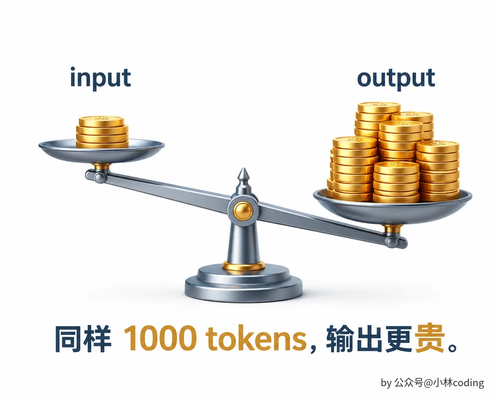

输入输出 token 成本天平

但更隐蔽的成本陷阱在别的地方。

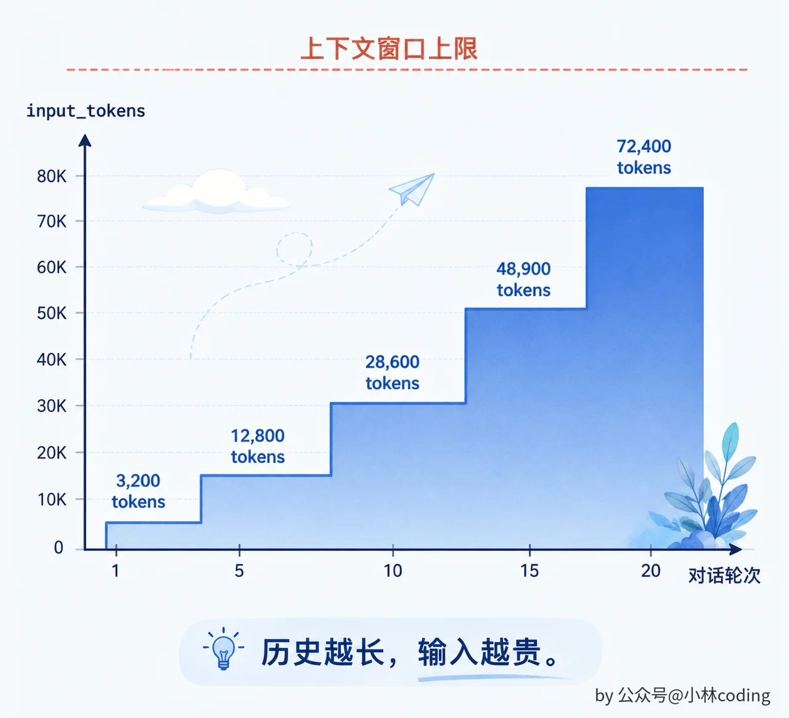

上下文增长阶梯

你想一下多轮对话的场景：每一轮请求，你都要把 **完整的对话历史** 发过去。如果你跟模型聊了 20 轮，第 21 轮请求会包含前 20 轮的所有消息。input\_tokens 会随着对话轮次 **线性增长** 。

具体算一下。假设每次请求的固定开销（system prompt、环境信息、工具描述等）加起来有 1000 tokens，每轮用户输入 50 tokens，模型回复 500 tokens。

到第 20 轮，仅 input\_tokens 就是 1000 + 20 × (50 + 500) = 12000 tokens。而第 1 轮只有 1050 tokens。差了 10 倍还多。

这就是为什么后面要专门讲上下文压缩。目前我们先把 Token 用量显示出来，让自己对成本有个直观感知。

---

## Extended Thinking：让模型先想再说

Claude 支持 Extended Thinking，让模型在正式回复之前先进行一轮内部推理。开启后响应的 content 数组里会多一个 `thinking` 类型的内容块，排在 `text` 块之前。

对 Agent 开发来说，只需要记住两件事。第一，thinking 的 Token 算在 `output_tokens` 里，是有成本的，本质上是用钱换更准确的工具调用决策。Agent 场景下这通常值得，因为一次准确的工具调用可以省掉好几轮纠错的开销。第二， **thinking 内容不能放进后续请求的 messages 里** ，维护对话历史时必须把 thinking 块过滤掉，只保留 text 和 tool\_use 块发给 API，否则 API 会报错。

具体的 API 参数、响应格式和流式处理细节可以查阅 Anthropic 官方文档，源码走读篇也会展开实现。

---

## 封装的核心原则

想象一个场景：你花了两周写好了 MewCode，代码里到处 import 着 Anthropic 的 SDK 类型。有一天老板说，来，换个 GPT 试试。你打开项目一看，消息类型用的是 Anthropic 的、事件解析用的是 Anthropic 的、连错误处理都跟 Anthropic 的 API 绑死了。改一处牵一片，整个项目得翻一遍。

这就是为什么你的 LLM 客户端需要做一层封装。上层代码只认你自己定义的类型：消息、流式事件、Token 用量。至于底下到底调的是 Claude 还是 GPT，上层完全不关心。

配置上只需要四个字段就能覆盖所有主流供应商： `protocol` 决定走哪家的 API 协议， `model` 指定模型， `base_url` 指定端点地址， `api_key` 做认证。

封装层干的事情说白了就是翻译。往外发请求的时候，把你的统一类型翻译成对应供应商的格式。收到响应的时候，再翻译回来。

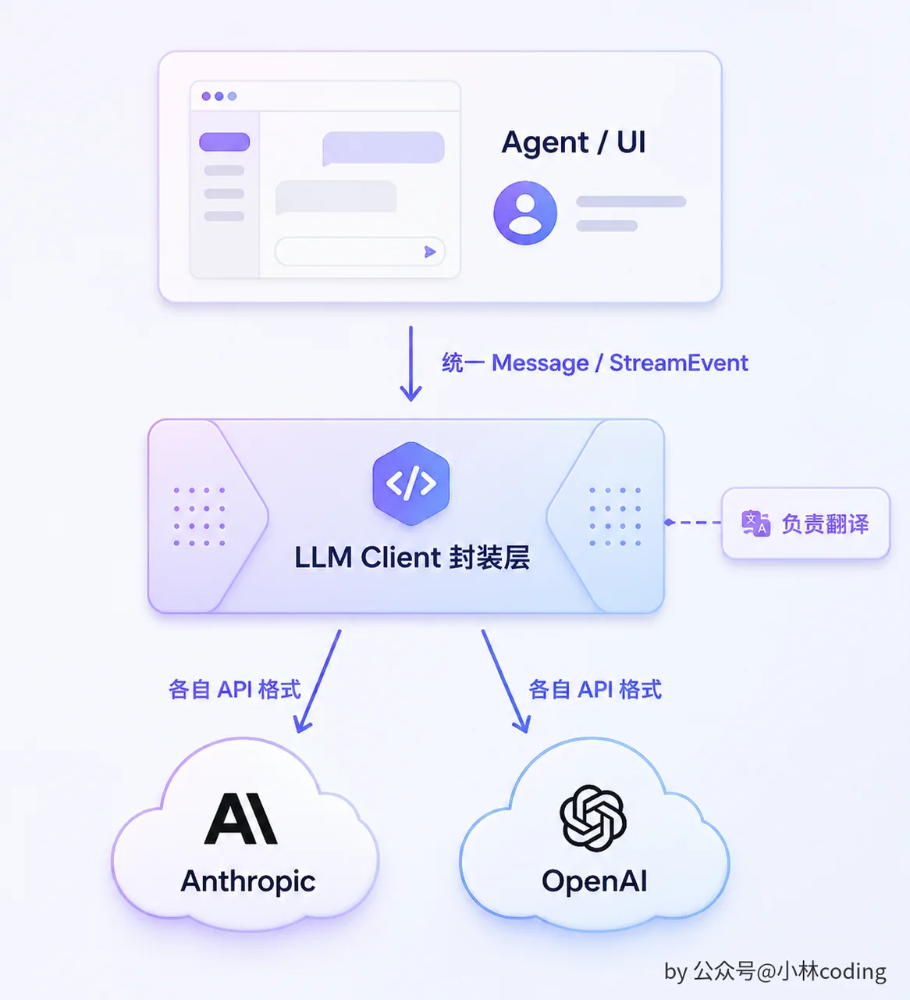

LLM Client 适配层

用伪代码来说就是这样：

```Plaintext
// 你自己定义的类型（上层代码只用这些）
Message { role, content }
StreamEvent { type, text?, usage?, error? }
Usage { inputTokens, outputTokens }

// 你的客户端（根据 protocol 分发到不同的后端实现）
class LLMClient:
    constructor(protocol, model, baseURL, apiKey)

    function streamChat(systemPrompt, messages) -> Stream<StreamEvent>:
        // 1. 把自定义 Message 转成对应供应商的格式
        // 2. 调用对应的流式 API
        // 3. 把供应商的事件转成自定义 StreamEvent
        // 4. 通过异步流返回给调用方
```

封装层内部怎么折腾是它自己的事，调用方完全不需要知道。从调用方的视角看，用起来就这么几行：

```Plaintext
events = client.streamChat(systemPrompt, messages)
for event in events:
    if event.type == "text":
        print(event.text)          // 逐词打印
    if event.type == "done":
        print(event.usage)         // 显示 token 用量
    if event.type == "error":
        handleError(event.error)   // 处理错误
```

看到了吗？不管底层走的是 Anthropic 协议还是 OpenAI 协议，调用方的代码完全一样。用户想换模型，改一下配置文件就行，代码一行不用动。

---

## 从单轮到多轮

到目前为止，我们讨论的都是单次 API 调用：发一个请求，拿一个回复，结束。

但对于一个 Coding Agent 来说，多轮对话是基本能力。用户描述一个需求，Agent 问几个澄清问题，然后开始执行。这个过程天然就是多轮的。

没有上下文记忆的 Agent，每次都要用户把需求从头说一遍，根本没法用。

那多轮对话是怎么实现的？

答案可能出乎你意料： **每次调 API，把完整的对话历史发过去** 。就这么简单。

Claude API 没有什么会话 ID 让服务器记住之前的对话。每次你发请求，都要把从第一轮到最新一轮的所有消息打包发送。模型靠这些历史消息来理解上下文。

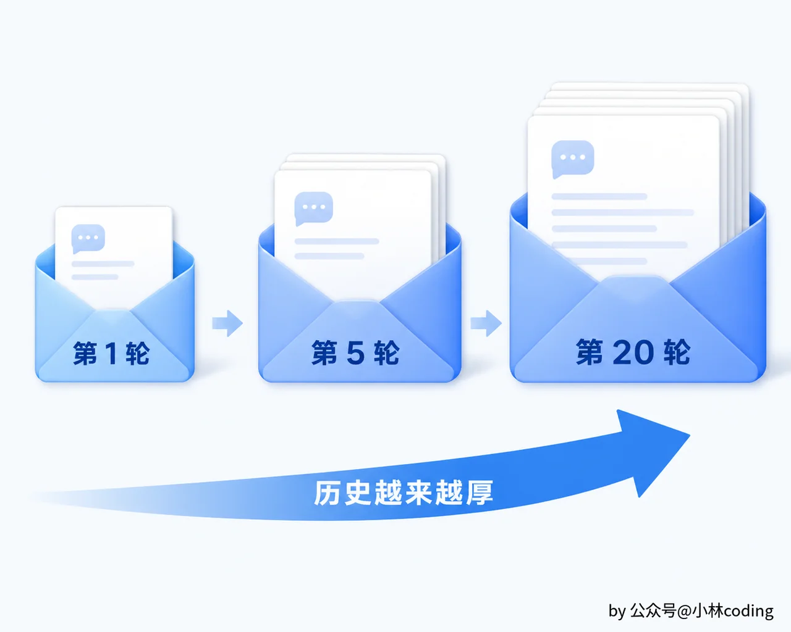

历史消息越来越厚

```Plaintext
第1轮请求: [user: "写个快排"]
第2轮请求: [user: "写个快排", assistant: "好的...(完整回复)", user: "改成泛型版本"]
第3轮请求: [user: "写个快排", assistant: "好的...", user: "改成泛型版本", assistant: "...", user: "加上单测"]
```

每一轮请求都包含之前所有轮次的完整内容。你需要在客户端维护完整的消息列表，每次用户发消息、模型回复，都要记录下来。

token 消耗随对话轮数线性增长这件事，前面已经算过了。后续章节会处理，目前用最简单的全量发送策略。

---

## 消息模型：两层设计

前面我们定义了面向 API 的消息结构： `role` + `content` 。但你有没有想过，光这两个字段够用吗？

想想 Agent 运行过程中会产生哪些信息：用户输入、模型回复、启动时的欢迎语、API 调用失败的错误信息，后面还会有工具调用记录。这些东西的角色各不相同，光 user 和 assistant 两种根本不够分。

再想想流式接收的场景。模型的回复是一个字一个字蹦出来的，这条 assistant 消息在接收过程中算什么状态？接收完了呢？中间断了呢？一条消息从创建到结束，其实是有生命周期的。

API 层那个简单的 `role` + `content` 根本表达不了这些。

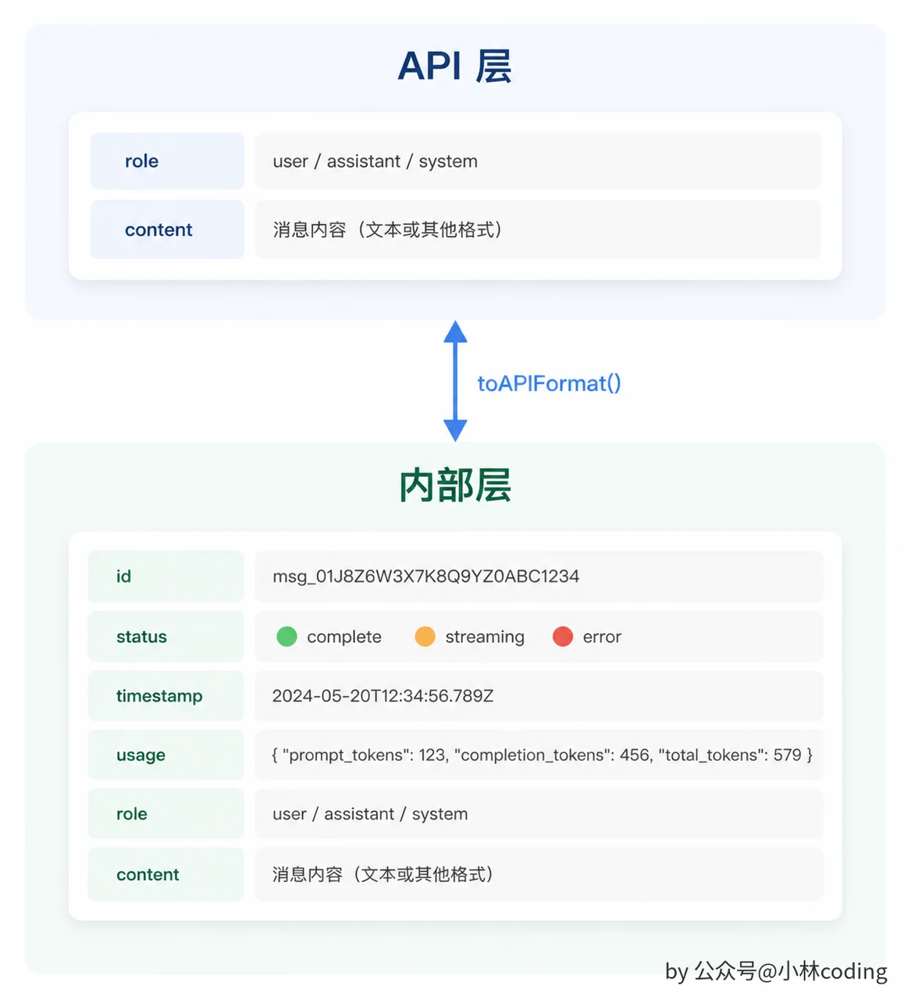

API 层与内部层消息模型

所以我们需要两层消息模型。

**API 层** 还是那个 `role` + `content` ，专门用来跟 LLM 通信，保持简单干净。

**内部层** 则丰富得多。角色从两种扩展到四种： `user` 、 `assistant` 、 `system` 、 `tool` 。每条消息带一个唯一 ID，方便定位和更新。还有时间戳、Token 用量、响应耗时这些元数据。

最关键的是多了一个状态字段。一条 assistant 消息刚创建时是 `streaming` ，流式接收完毕变成 `complete` ，出错变成 `error` 。

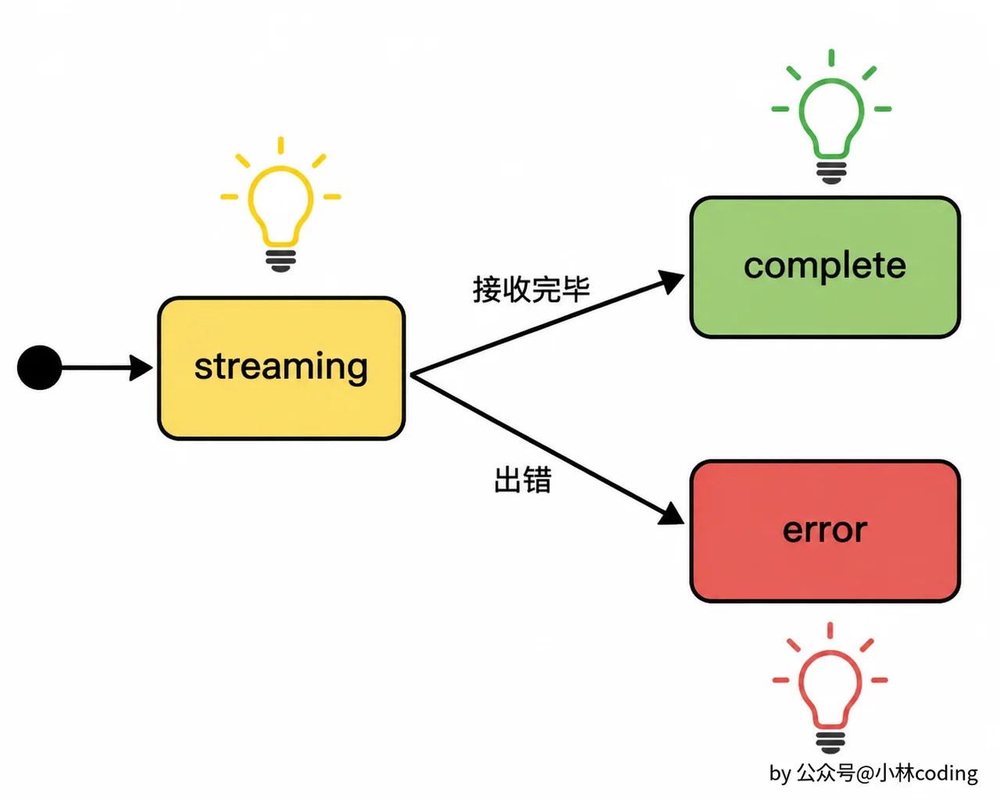

消息状态状态机

有了状态，UI 就能根据它决定怎么渲染。格式转换的时候也能把 `error` 状态的回复过滤掉，别发给 API 让模型困惑。

唯一 ID 也很关键。流式接收时，你需要根据 ID 定位到那条正在接收的 assistant 消息，不断追加文本。没有 ID，你就得靠「最后一条 assistant 消息」这种脆弱的假设来定位，后面场景一复杂就会出问题。

---

## 对话管理器

有了消息模型，接下来想一个问题：谁来管这些消息？

你可能觉得，搞一个数组往里面 append 不就行了。但别忘了流式接收的场景：后台正在往一条 assistant 消息里追加文字，同时另一边正在读这个消息列表来渲染。两处同时操作同一个列表，不加保护就是数据竞争。

所以你需要一个对话管理器，把消息列表包起来，内部保证并发安全（不同语言做法不同，有的用锁，有的靠单线程异步天然避免竞争）。外部调用方只需要：添加消息的时候拿到一个唯一 ID，流式更新的时候根据 ID 追加内容，需要渲染的时候拿一份消息列表的快照。并发的事情全交给管理器。

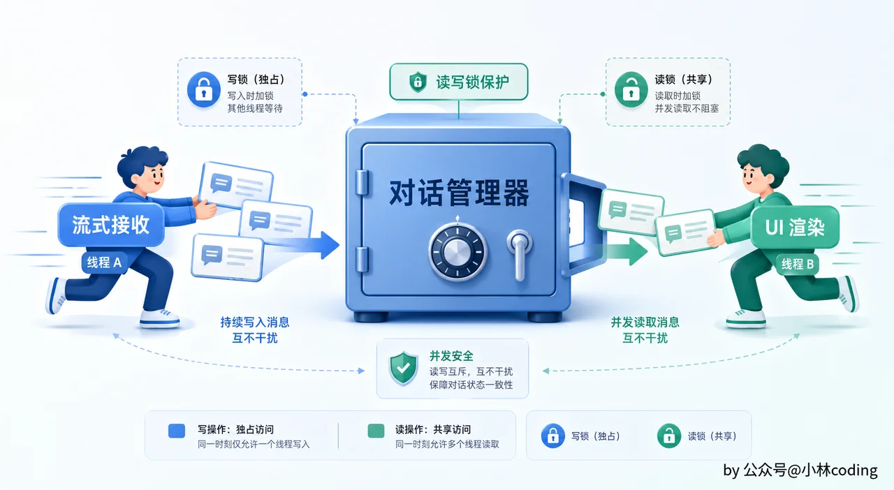

对话管理器读写锁保护

### 格式转换：从内部消息到 API 消息

对话管理器里最关键的方法是 `toAPIFormat()` ：把内部层的消息列表转换成 API 层的格式。

这个转换看似只是格式映射，但里面藏着不少坑。

首先是过滤。内部层有些消息不该发给 API。 `system` 角色的消息（比如欢迎语）是内部概念，API 有单独的 system prompt 参数，你再发一条 system 过去会让模型困惑。 `error` 状态的 assistant 消息也得过滤掉，你总不希望模型看到一条报错信息然后尝试接着它说。

然后是合并。虽然 Claude API 能自动合并相邻的同角色消息，但客户端主动合并是更好的做法，减少冗余 token，消息结构也更清晰，方便调试。

最后还得确保首条消息是 user，并且 user/assistant 交替出现。如果过滤掉 system 消息后第一条变成了 assistant，模型可能理解不了上下文。

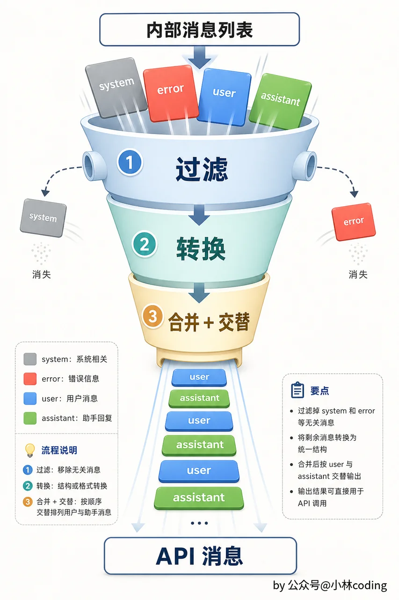

API 消息转换管道

整个流程串起来就是：过滤掉 system 和 error 消息，转成 API 格式，合并相邻同角色，确保首条为 user、两种角色交替出现。

这个函数一定要写单元测试。空列表、只有一条消息、连续三条 user、第一条是 system，这些边界情况都得覆盖到。消息格式越规范，模型的理解越准确，后续调试也越轻松。

---

## 流式更新与多轮协作

前面分别讲了流式响应和多轮对话两个概念。在真实的 Agent 里，它们要配合起来工作：

```Plaintext
function sendMessage(userText):
    // 1. 用户消息加入对话管理器
    conversation.addMessage({
        role: "user",
        content: userText,
        status: "complete"
    })

    // 2. 创建一条空的 assistant 消息，状态为 streaming
    assistantId = conversation.addMessage({
        role: "assistant",
        content: "",
        status: "streaming"
    })

    // 3. 把完整对话历史转换成 API 格式
    apiMessages = conversation.toAPIFormat()

    // 4. 异步调用 LLM，流式更新 assistant 消息
    stream = llmClient.streamChat(systemPrompt, apiMessages)
    for event in stream:
        if event.type == "text":
            conversation.updateMessage(assistantId, appendText(event.text))
        if event.type == "done":
            conversation.updateMessage(assistantId, setComplete(event.usage))
        if event.type == "error":
            conversation.updateMessage(assistantId, setError(event.error))
```

注意第 2 步：先创建一条空的 assistant 消息，拿到 ID，后续通过这个 ID 不断追加内容。这样不管 UI 怎么渲染，数据层的更新逻辑都是一样的。

第 4 步的异步执行方式取决于你用的框架。有的用 Command 模式，有的用 async/await，有的用回调。形式不同，但核心模式一样：后台消费流式事件，实时更新对话管理器里的消息。

整个多轮对话的节奏就是：用户输入 → 加入历史 → 转换格式 → 调 API → 流式更新 → 等待下一轮输入。

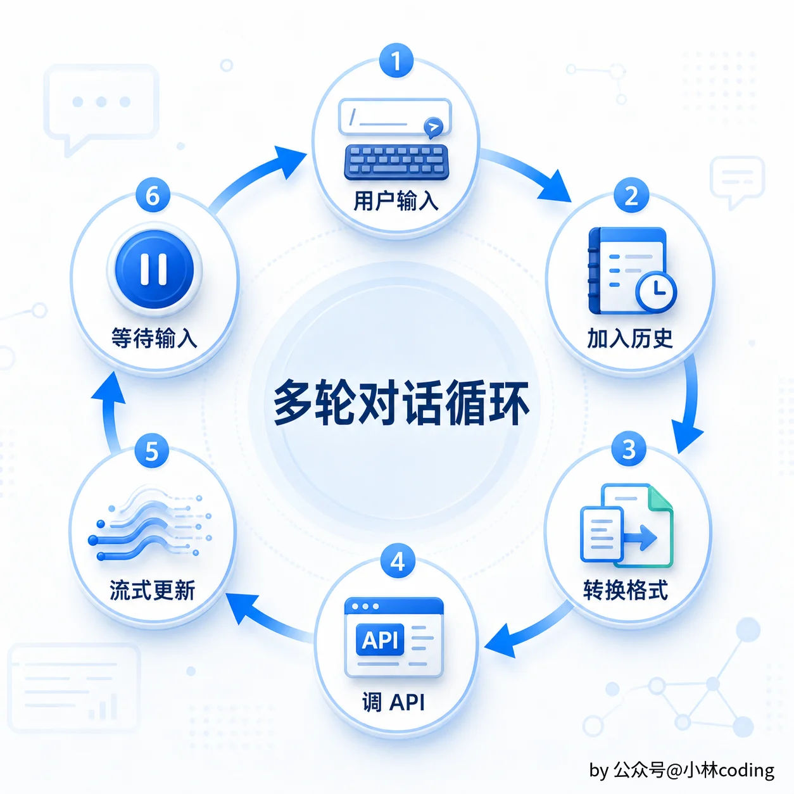

多轮对话循环

每一轮都带着完整的对话历史，模型就记住了之前说过的话。

---

---

## 终端界面：最终要做成什么样

前面讲的 LLM 客户端和对话管理器都是引擎层的基础设施，用户看不见也摸不着。最终用户看到的，是一个运行在终端里的交互界面。MewCode 采用 TUI（Terminal User Interface）方案：上方是对话区域，模型的回复流式显示；下方是输入框，用户在这里输入指令；底部状态栏展示当前模型、Token 用量等信息。下面这张截图就是我们要做成的样子：

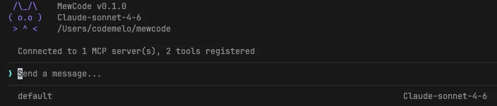

其实也就是参考ClaudeCode这种简洁UI来实现

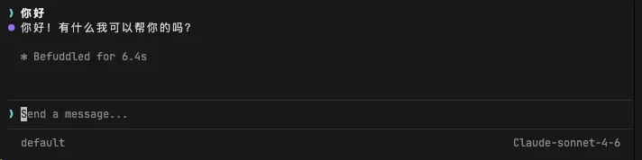

## 本章小结

这一章做了两件事：调通 LLM API，套上终端 UI 支持多轮对话。

Messages 里 user 和 assistant 交替出现的惯例，会深刻影响后面 Agent 循环里的消息管理逻辑。响应里的 content 永远是数组而不是字符串，这个设计到工具调用的时候会变得非常重要。

流式响应是基本要求。SSE 事件序列（message\_start → content\_block\_start → content\_block\_delta → content\_block\_stop → message\_delta → message\_stop）是处理流式响应的基本框架，后面每一章都会用到。

封装外部依赖的核心原则是暴露领域语义，隐藏实现细节。定义自己的消息和事件类型，把 SDK 藏在内部。将来换供应商，上层代码完全不受影响。

LLM API 是无状态的，多轮对话全靠客户端维护消息历史。消息模型分两层：API 层只有 role + content，内部层增加了状态、ID、元数据。

格式转换负责过滤、合并、交替校验，把内部状态转成 API 能用的干净格式。

下一章，我们给 MewCode 装上手脚：工具系统。