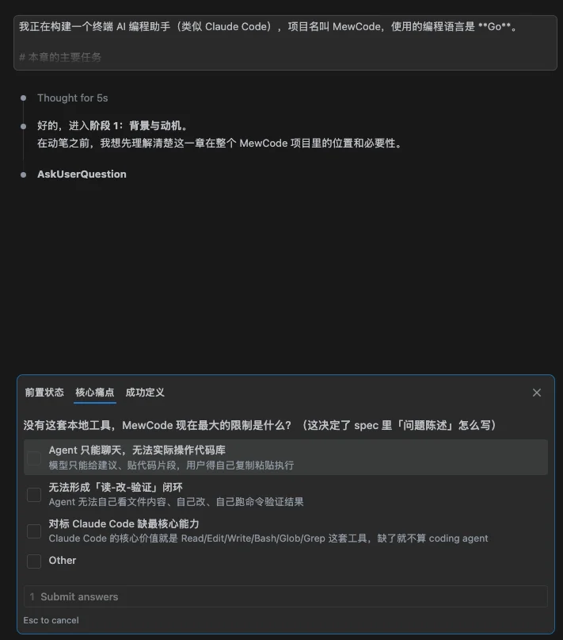
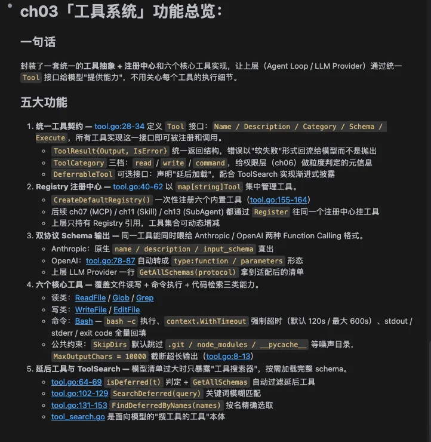
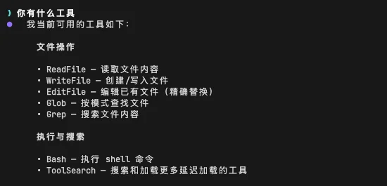
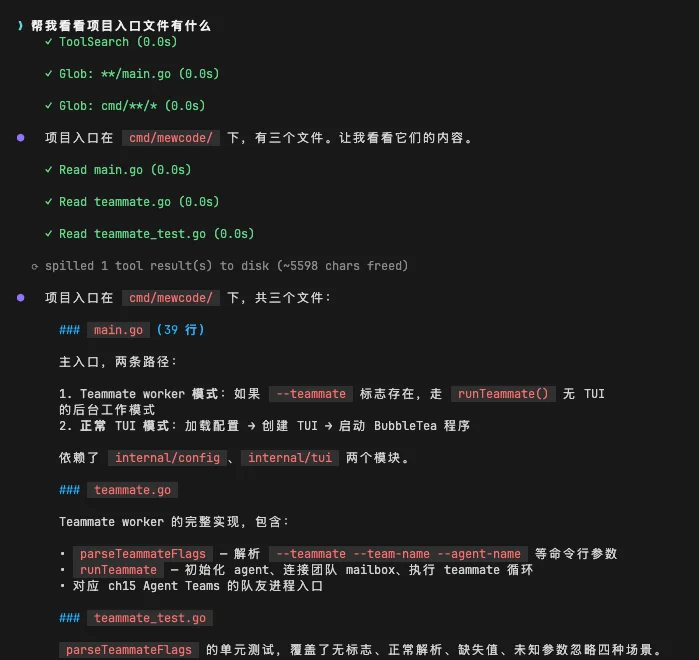
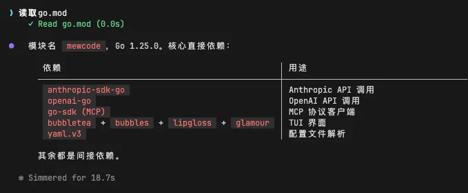
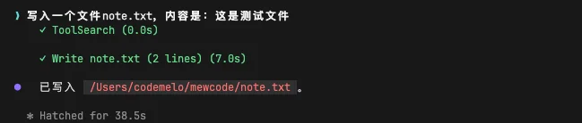
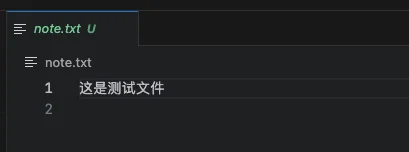
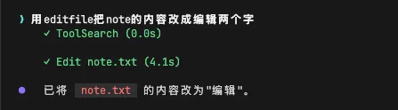
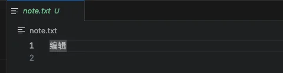
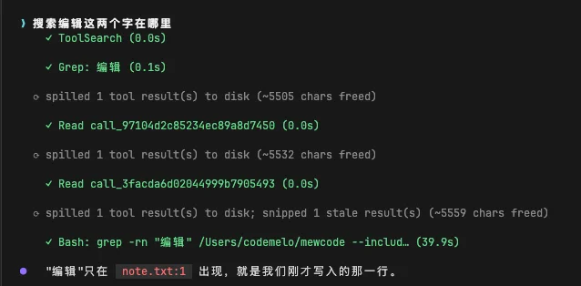

# 实战演练：工具系统

# 第3章：实战篇

## 本章需要做什么？

上一章我们让 MewCode 接通了 LLM API，能在终端里输入问题拿到流式回复。但它还是只能动嘴，不能动手。你说「帮我看看入口文件有什么」，它只会回答「抱歉，我无法访问你的文件系统」。

这一章要给 MewCode 装上工具系统。做完之后，模型能读文件、写文件、改文件、执行命令、搜索代码。它从「聊天机器人」变成了真正能干活的 Agent。

具体要新增这些东西：

-   **工具框架** ：工具接口、BaseTool 通用实现、ToolResult 执行结果

-   **六个核心工具** ：ReadFile、WriteFile、EditFile、Bash、Glob、Grep

-   **工具注册中心** ：集中管理工具的注册、启用、禁用，转成 API 格式

-   **LLM 客户端扩展** ：支持流式 tool\_use 解析（JSON 碎片拼接）和 tool\_result 回传

-   **终端 UI 扩展** ：工具调用过程的视觉展示

这章 **不做** ：Agent 循环（工具调用只走一步，连环调用是下一章）、权限系统（元信息标记先定义，确认流程后面做）、并发执行（多工具先串行）。

---

## Vibe Coding 实战

### 生成三份文档

把任务换成本章的内容：

```Markdown
# 我的初步想法
- 想用一个统一的 Tool interface，每个工具实现这个 interface
- 用一个 registry 集中注
- 工具执行要带超时和错误处理
- EditFile 想做成多段编辑
```

然后 AI 就会开始问你问题，进行需求澄清。



你根据理论篇学到的内容回答这些问题，一直这样反复循环对齐需求，最后就能生成三份文档了。

### 正式开发

三份文档有了之后，就相当于施工图纸已经定好了，然后让 Claude Code 根据这三份文档进行开发


经过一段时间后，开发完成。



### 功能验证过程

来验收一下结果

启动 MewCode，我们先看工具有没有注册成功



可以看到模型已经知道我们注册的六大工具和延后加载工具了，接着我们输入「帮我看看项目入口文件有什么」。



如果工具系统正常工作，你会看到类似这样的画面：模型决定要读文件，然后去通过工具读，你的代码去执行，结果反馈回模型，模型基于结果回答。这就是 Function Calling 跑通的样子。

正是因为有了这个工具去帮助模型拿到这些文件，才能帮助模型准确地回答，所以也有个专业术语称呼这种行为，叫做RAG（Retrieval-Augmented Generation，检索增强生成）

再依次看看其他五个工具有没有成功能使用

比如我们要读取文件，会调用ReadFile



写入文件，会调用WriteFile

> 写入一个文件note.txt，内容是：这是测试文件



文件内容也是成功写入了



要编辑文件，会调用EditFIle

> 用editfile把note的内容改成编辑两个字



我们可以看到文件内容变成了编辑了



要搜索文件，会用Grep、Bash、Read

> 搜索编辑这两个字在哪里



验收没问题，那么本章的主要任务就完成了。下一章，我们让工具调用自动循环起来：Agent Loop。

---

## 参考提示词和代码

如果你在澄清需求的过程中遇到困难，或者生成的三份文件效果不理想，可以直接使用下面的参考版本。

把下面三个文件保存到项目根目录，然后告诉你的 AI 编程助手：

> 提示词如果需要复制，移步到这里： [💡 提示词复制](https://my.feishu.cn/wiki/JM5Kw5TIGiIehqks1BYcYdpLnzd?fromScene=spaceOverview)