# 工具系统

---

## 光会说话的 Agent 不是好 Agent

经过前两章的努力，MewCode 已经是一个挺像样的终端聊天应用了。你可以跟它多轮对话，它的回复还有 Markdown 渲染，看起来挺专业。

但你试试跟它说「帮我看看项目入口文件里有什么」。

它会回答：「抱歉，我目前无法直接访问你的文件系统。你可以把文件内容粘贴给我，我来帮你分析。」

这就像雇了一个精通编程的顾问，结果他被绑在椅子上。脑子好使，手脚不能动。你得自己翻文件、复制内容、粘贴给他看，他看完告诉你怎么改，你还得自己动手改。这不叫 Agent，这叫顾问。


只会说不会做的顾问

还记得开篇说的吗？Agent 的四个要素是 LLM + 工具 + 循环 + 反馈。目前我们只有 LLM，没有工具，也就不可能有反馈循环。MewCode 本质上还是一个聊天机器人。

工具系统是 Agent 从「聊天机器人」进化为「自主代理」的关键一步。有了工具，模型不只是生成文本，它能读文件、写文件、执行命令、搜索代码。它从「说」变成了「做」。


工具系统让聊天机器人进化为 Agent

这一章内容很多，因为工具系统是整个 Agent 架构的核心基础设施。我们不仅要理解 Function Calling 协议，还要设计一套可扩展的工具框架，实现 6 个核心工具，并且把流式 tool\_use 解析集成到 LLM 客户端中。

---

## Function Calling：模型怎么「动手」

先搞清楚一个根本问题：模型是怎么调用工具的？

你可能以为模型能直接访问你的文件系统、执行你的命令。不是的。模型永远只做一件事：生成文本。它不能直接操作任何东西。

那怎么让它「动手」？答案是一个协作协议，我们叫它 Function Calling（也叫 Tool Use）。整个流程分四步，我们一步一步看。

### 第一步：告诉模型有哪些工具

在调 API 的时候，你通过 `tools` 参数告诉模型：「你现在有这些工具可以用」。每个工具有名字、描述、参数格式。

```JSON
{
  "tools": [{
    "name": "ReadFile",
    "description": "读取指定路径的文件内容。返回带行号的文件文本。路径必须是绝对路径。",
    "input_schema": {
      "type": "object",
      "properties": {
        "path": {
          "type": "string",
          "description": "文件的绝对路径"
        }
      },
      "required": ["path"]
    }
  }]
}
```

这就像你入职第一天，Leader 跟你说：「公司有 Jira、GitLab、Jenkins 这几个工具，Jira 用来管任务，GitLab 用来管代码...」。你知道有哪些工具、各自干什么，才能在需要的时候用对。

### 第二步：模型决定调用工具

当模型认为需要使用某个工具时，它会在回复里输出一个结构化的「请求」：我想调这个工具，参数是这些。

```JSON
{
  "role": "assistant",
  "content": [
    {"type": "text", "text": "让我读取这个文件的内容。"},
    {
      "type": "tool_use",
      "id": "toolu_abc123",
      "name": "ReadFile",
      "input": {"path": "/home/user/project/main.py"}
    }
  ]
}
```

注意两个细节。第一，模型可以在同一条回复里既输出文本又请求调用工具，甚至同时请求调用多个工具。第二，每个 `tool_use` 都有一个唯一的 `id` ，后面返回结果的时候要用。

还有一点非常重要：模型输出了 `tool_use` 并不意味着工具已经被执行了。它只是一个「建议」，或者说一个「请求」。实际执行与否，由你的代码决定。

### 第三步：你执行工具，把结果告诉模型

你的代码拿到 `tool_use` 请求后，在本地执行对应的操作（比如读文件），然后把结果作为 `tool_result` 发回给模型：

```JSON
{
  "role": "user",
  "content": [{
    "type": "tool_result",
    "tool_use_id": "toolu_abc123",
    "content": "1\tdef main():\n2\t    print('hello')\n3\t"
  }]
}
```

`tool_use_id` 必须和上面的 `id` 对应。这样模型才知道这是哪个工具调用的结果。

注意 `tool_result` 是以 `user` 角色发送的。为什么？因为从对话协议的角度，工具执行是用户侧做的事情，结果是你反馈给模型的。模型只负责思考和决策，不负责执行。

### 第四步：模型继续

模型收到工具结果后，有两种可能。一是它觉得信息够了，直接给出最终回复。二是它觉得还需要更多信息，再请求调用另一个工具。比如它先搜索找到相关文件，再读取内容，再修改代码。

这种「调工具 → 看结果 → 再调工具」的链条，就是下一章 Agent Loop 的雏形。这一章我们先实现单步工具调用，让整个流程跑通。

### Function Calling 的本质

整个 Function Calling 的本质可以用一句话概括： **模型负责决策，你负责执行，结果反馈回模型** 。模型永远不直接操作你的系统。这是一个安全边界，也是一个架构边界。

用一张图来总结这四步：

---

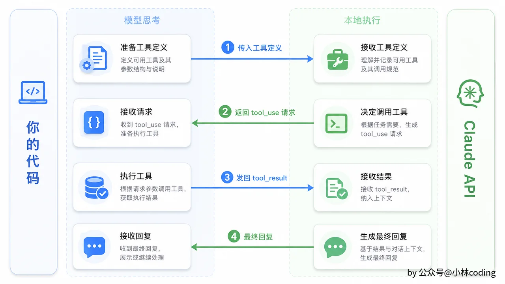

Function Calling 四步时序

## 工具描述是最值得打磨的部分

在实现工具之前，有一个反直觉的事实必须强调： **工具描述（Description）是整个工具系统里最重要的部分** 。

Anthropic 在其工具使用文档中也强调了这一点：工具描述的质量直接决定了模型的工具使用行为，包括什么时候调、调哪个、参数怎么传。

> 来源： [Define tools - Claude API Docs](https://platform.claude.com/docs/en/agents-and-tools/tool-use/define-tools)

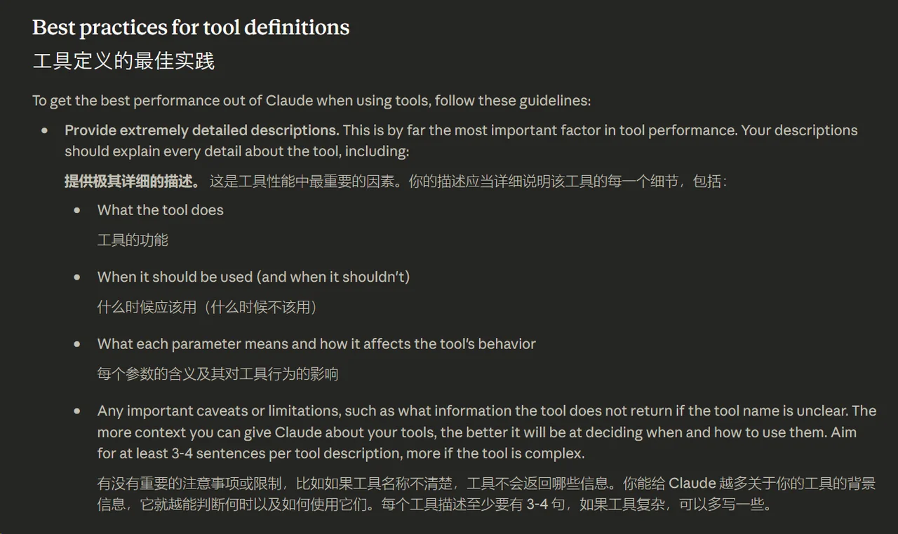

为什么？因为模型在决定是否使用某个工具时，主要依据就是工具描述。如果描述不清楚，模型要么不知道什么时候该用这个工具，要么用错工具，要么传错参数。

来对比一下好描述和差描述：

```Plaintext
# 差描述
"读取文件"

# 好描述
"读取指定路径的文件内容。返回带行号的文件文本。
对于大文件，建议先用 Grep 定位相关行，再用 ReadFile 读取指定范围。
路径必须是绝对路径。如果文件不存在，返回错误信息。
二进制文件不可读取，请改用 Bash 执行合适的命令。"
```

差描述只说了「做什么」，好描述还说了「什么时候该用」「什么时候不该用」「参数有什么约束」「返回值长什么样」。模型拿到好描述，就知道：遇到大文件先搜索再定位读取，传参必须用绝对路径，碰到二进制文件换命令行。

一个好的工具描述应该包含这些信息：

|     |     |     |
| --- | --- | --- |
| 信息  | 说明  | 示例  |
| 做什么 | 工具的核心功能 | 「读取指定路径的文件内容」 |
| 什么时候该用 | 典型使用场景 | 「需要查看文件完整内容或特定行时使用」 |
| 什么时候不该用 | 反模式提示 | 「二进制文件不可读取，请改用 Bash」 |
| 参数约束 | 输入的限制条件 | 「路径必须是绝对路径」 |
| 返回格式 | 输出长什么样 | 「返回带行号前缀的文本」 |
| 与其他工具的配合 | 工作流建议 | 「大文件建议先 Grep 定位再 ReadFile」 |

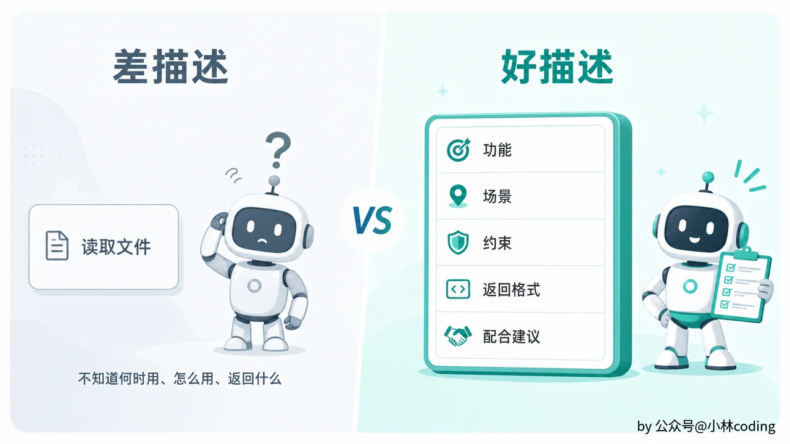

好工具描述与差工具描述对比

所以写工具的时候，不要觉得代码逻辑最重要。花在描述上的时间，比花在代码上的时间更值得。后面 第 5 章讲 System Prompt 时会更深入地讨论描述的写法技巧，现在先照着上面的原则写，后面学完再回来打磨。

---

## 工具接口设计：为什么不能只有名字和执行

搞清楚了 Function Calling 的机制，现在来设计工具的接口。

最直觉的设计可能是：一个工具有名字，有执行方法，够了吧？

不够。差得远。

你想一下这些场景：ReadFile 是只读操作，模型随便调，不用征求用户同意。但 WriteFile 会修改文件，是不是应该先让用户确认一下？Bash 可能执行 `rm -rf /` ，是不是需要更严格的审批？如果接口里没有「只读」「破坏性」这样的元信息，你的权限系统怎么判断该不该放行？

再想一下：模型可能传一个相对路径给 ReadFile。你是执行之后报错，还是执行之前就拒绝？如果接口没有参数校验的环节，你只能在执行逻辑里硬写校验，校验失败和执行失败混在一起，很难区分。

还有：你需要把工具定义发给 API（名称、描述、参数 Schema），这些信息如果不在接口里，你就得在别的地方维护一份，很容易和实际实现不一致。

所以一个生产级的工具接口应该包含这些能力：

```Plaintext
工具接口 {
    name() -> string
    description() -> string
    inputSchema() -> JSON Schema
    execute(context, input) -> ToolResult
    isReadOnly() -> boolean
    isDestructive() -> boolean
    isConcurrencySafe(input) -> boolean
    category() -> string
    validateInput(input) -> error or null
}
```

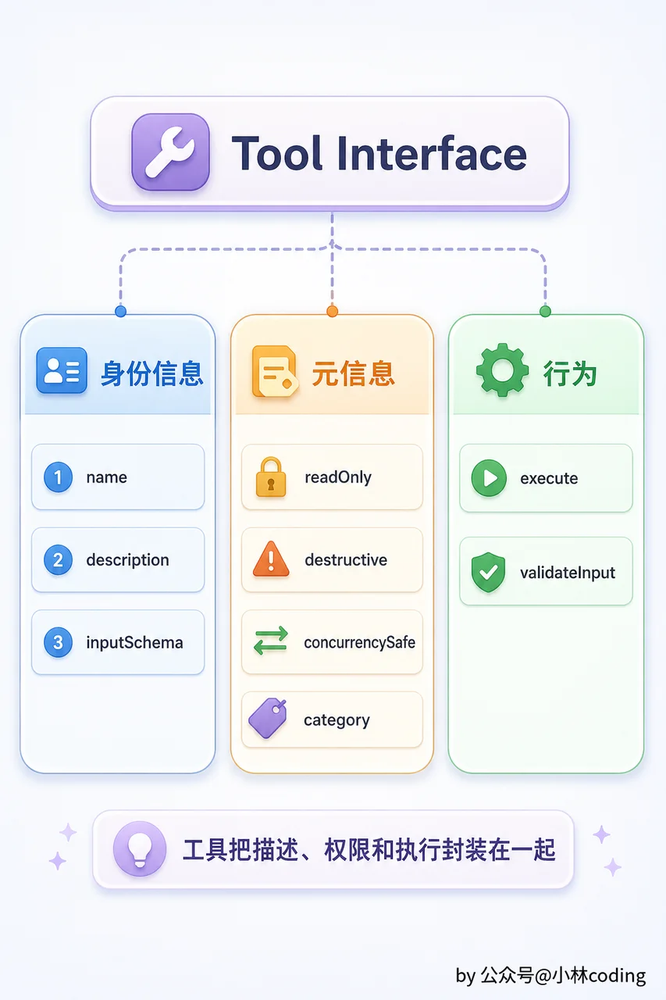

工具接口结构

每个方法都有明确的职责。 `name()` 、 `description()` 、 `inputSchema()` 用来生成 API 请求里的工具定义。 `isReadOnly()` 和 `isDestructive()` 用来让权限系统自动判断是否需要用户确认。

`isConcurrencySafe()` 标记这个工具能否和其他安全工具并发执行。它接收工具的输入参数，返回 true 表示可以并发，false 表示必须串行，默认 false，保守优先。模型一次返回多个工具调用时，执行引擎会根据这个标记决定哪些可以同时跑、哪些必须排队，下一章会实现。

`category()` 用来做工具分类，比如 file、shell、search，方便 UI 展示和批量管理。 `validateInput()` 在执行前校验参数，该拒绝的早拒绝，别等到执行一半才报错。校验失败时，把错误信息包装成 isError: true 的 ToolResult 返回给模型，让模型能调整参数重试，而不是抛出程序异常中断整个 Agent Loop。

### 执行结果：错误也是有价值的信息

执行结果的设计也有讲究：

```Plaintext
ToolResult {
    content: string           // 返回给模型的文本内容
    isError: boolean          // 标记为错误结果
    metadata: map             // 额外信息（给 UI 用，不发给模型）
}
```

这里有一个关键设计： `isError` 字段。

当工具执行失败时，你把失败信息包装成一个 `isError: true` 的 ToolResult 返回给模型。为什么？想象一下，用户说「帮我读一下 config.yaml」，模型调了 ReadFile，但文件不存在。

如果你把这个当成程序错误处理，Agent 循环可能直接中断，给用户弹一个「内部错误」。但如果你把「文件不存在」作为 ToolResult 返回给模型，模型拿到这个信息之后可能会说：「config.yaml 不存在，让我找找看有没有类似的配置文件」，然后调 Glob 搜索。

**工具执行失败对模型来说是有价值的反馈信息，它会引导模型调整策略。** 只有真正的系统级错误（比如内存不足、程序崩溃）才应该作为程序级 error 上报。

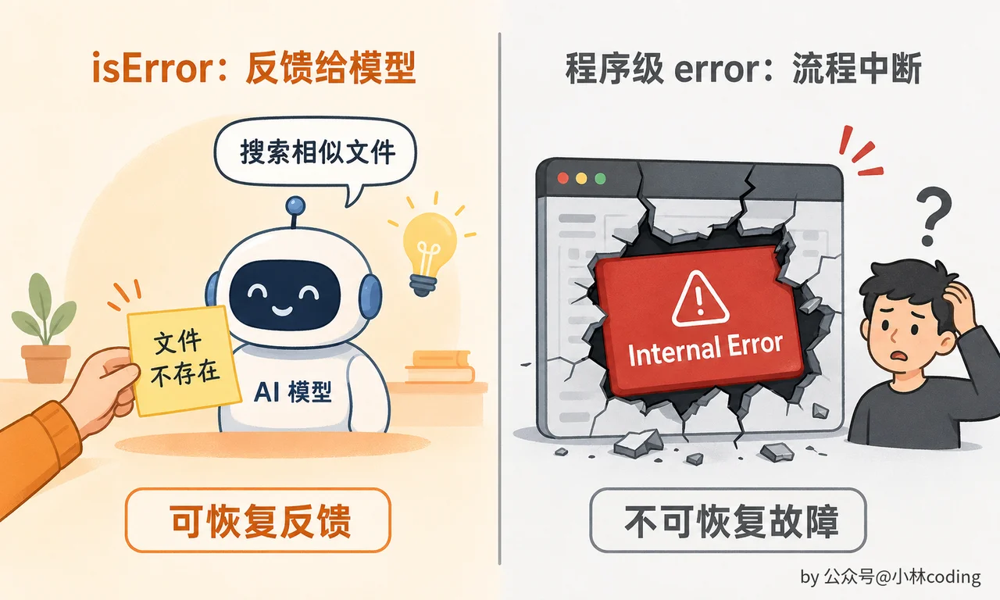

工具错误反馈与程序崩溃对比

`metadata` 是给 UI 层用的额外信息，比如文件的修改时间、命令的执行耗时。这些信息不发给模型，避免浪费 token，但可以在界面上展示。

### 通用基础实现：别让每个工具重复造轮子

6 个工具都要实现工具接口的所有方法，如果每个工具都从零实现一遍，代码会很重复。所以我们用一个「基础工具」做通用实现：

用伪代码描述这个模式：

```Plaintext
BaseTool {
    name: string
    description: string
    inputSchema: JSON
    readOnly: boolean
    destructive: boolean
    concurrencySafe: boolean or function(input) -> boolean   // 默认 false
    category: string
    executeFn: function(context, input) -> ToolResult
    validateFn: function(input) -> error or null
}

// BaseTool 实现接口的所有方法，把具体逻辑委托给 executeFn 和 validateFn
```

这样每个工具只需要写一个工厂函数，填入自己的名称、描述、Schema 和执行函数就行：

```Plaintext
function newReadFileTool() -> Tool:
    return BaseTool {
        name: "ReadFile",
        description: "读取指定路径的文件内容...",
        inputSchema: { ... },
        readOnly: true,
        destructive: false,
        concurrencySafe: true,    // 只读操作，可以并发
        category: "file",
        executeFn: executeReadFile
    }
```

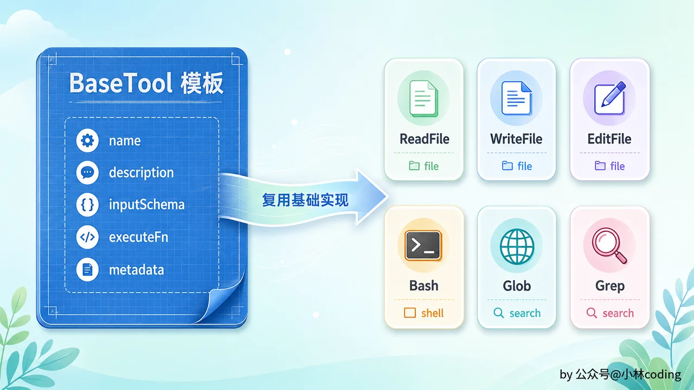

BaseTool 工厂流水线

所有工具的构造风格一致，新增工具只需要写一个工厂函数。工具的元信息在构造时就确定了，运行时不会变。 `concurrencySafe` 的取值很简单：天然只读的工具（ReadFile、Grep、Glob）返回 `true` ，其他一律返回 `false` 。你可能会想：Bash 能不能看具体命令来判断？理论上可以，但解析任意 shell 命令不可靠， `ls > /tmp/file` 是写操作，管道和 subshell 更难分析。Claude Code 的做法是 Bash 一律不并发，保守但安全。

### 不同语言的惯用模式

工具接口的设计在不同语言里有不同的惯用表达方式：

|     |     |     |     |
| --- | --- | --- | --- |
| 语言  | 接口表达 | 基础实现复用 | Schema 处理 |
| Go  | interface + baseTool struct | 组合（嵌入 struct） | json.RawMessage |
| Python | Protocol / ABC + dataclass | 继承或 mixin | dict / Pydantic model |
| TypeScript | interface + 工厂函数 | 闭包或 class | 纯 JSON 对象 |
| Rust | trait + 默认实现 | 泛型或宏 | serde\_json::Value |

选择你的语言最惯用的方式就行。

---

## 工具注册中心：集中管理的威力

现在你有 6 个工具，手动管理问题不大。但想象一下，半年后你加到了 20 个工具。有些只在只读模式下启用，禁用所有写操作。有些依赖外部环境，比如 Docker 工具需要 Docker daemon 在跑。

如果工具散落在代码各处，这些逻辑写在哪？

答案是工具注册中心（Registry）。它是工具的统一管理入口，把工具的创建和使用解耦。

注册中心的能力很直观：注册工具、按名称启用或禁用、获取单个或所有启用的工具。最关键的是一个 `toAPIFormat()` 方法，它遍历所有启用的工具，把每个工具的名称、描述、参数 Schema 组装成 Claude API 要求的格式。每次调 API 前调用它，告诉模型当前可用的工具列表。

注册中心支持条件启用，你可以根据配置灵活控制：

```Plaintext
function setupTools(registry, config):
    // 基础读取工具始终启用
    registry.register(newReadFileTool())
    registry.register(newGlobTool())
    registry.register(newGrepTool())

    // 写操作需要显式开启
    if config.allowWrite:
        registry.register(newWriteFileTool())
        registry.register(newEditFileTool())

    // Bash 最危险，单独授权
    if config.allowBash:
        registry.register(newBashTool(config.bashTimeout))
```

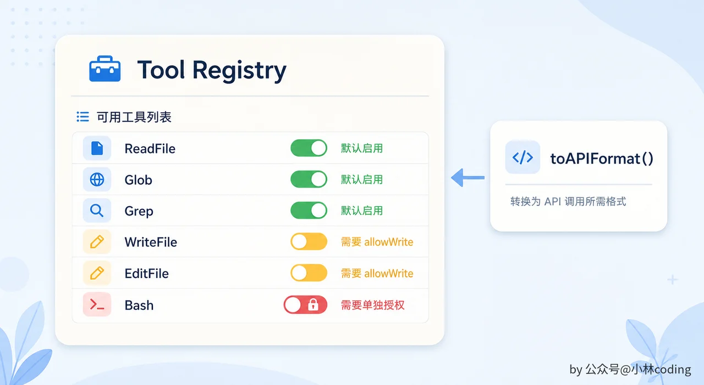

Tool Registry 控制面板

这种模式让工具管理变得集中、可控、可扩展。想加新工具？写个工厂函数，注册到 Registry 就行。想在某个场景下禁用某些工具？一行 `disable` 搞定。

---

## 六个核心工具，每个都有故事

MewCode 的第一版需要 6 个核心工具。为什么是这 6 个？因为它们覆盖了 Coding Agent 最基本的操作需求：读代码、写代码、改代码、跑命令、找文件、搜内容。缺了任何一个，Agent 的能力都会有明显短板。

我们逐个看，重点不是列参数，而是讲每个工具背后的设计考量。

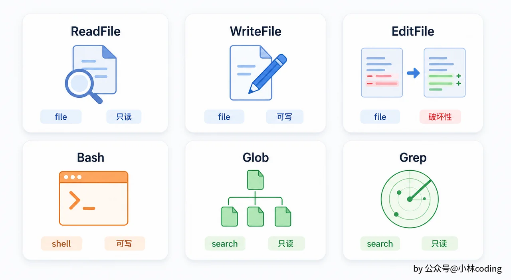

六个核心工具工具箱

### ReadFile：最简单，但有暗坑

读文件，能有什么难的？一行文件读取调用搞定。

真动手就会发现没那么简单。

**第一个问题是行号** 。你可能觉得返回原始文件内容就行了，但模型后续要引用代码位置的时候（比如「第 42 行有个 bug」），没有行号它只能用上下文描述，又长又不精确。所以返回内容要带行号前缀： `1<tab>def main():` 、 `2<tab> print('hello')` 。

**第二个问题是大文件** 。一个几千行的文件全部读进来，光这一条消息就消耗大量 token。所以要支持 offset 和 limit 参数，指定从第几行开始、读几行，让模型可以分段读取。

**第三个问题是二进制文件** 。如果模型尝试读一个图片或编译后的二进制文件，你把一堆乱码返回给它也没用。检测方法是读取文件前 512 字节，如果里面包含 NUL 字符（ `\x00` ），就判定为二进制文件并拒绝读取，提示模型改用命令行工具处理。

错误处理方面，文件不存在、路径非绝对、二进制文件、权限不足，每种情况返回不同的 `isError: true` 结果，提示信息要告诉模型为什么失败以及怎么调整。

元信息：只读，非破坏性，分类为 file。

### WriteFile：创建和覆盖

WriteFile 是完整覆盖写入，不是追加。模型给完整的文件内容，你写入指定路径。

有个小细节：如果目标路径的父目录不存在怎么办？比如模型要写 `/home/user/project/src/utils/helper.py` ，但 `utils/` 目录还没有。直接写入会报错。所以执行前先递归创建父目录（权限 0755），文件本身用 0644 权限。

返回值是一条确认信息：「成功写入 N 字节到 path」。

你可能会问，WriteFile 为什么不标记为 destructive？因为覆盖一个文件通常是开发工作中的正常操作。而 destructive 保留给那些「一旦执行就很难撤回」的操作。当然，后面做权限系统的时候，WriteFile 也需要用户确认，只是不需要「额外确认」。

元信息：非只读，非破坏性，分类为 file。

### EditFile：最复杂，也最省 token

为什么有 WriteFile 还需要 EditFile？

想象一下，一个 500 行的文件，模型只需要改第 42 行的一个变量名。如果用 WriteFile，模型得输出完整的 500 行内容，其中 499 行跟原来一模一样，白白浪费几千个 token。

EditFile 让模型只描述「改哪里」：给出要替换的原文本（old\_string）和替换后的文本（new\_string）。

执行逻辑看起来简单：在文件里找到 old\_string，替换成 new\_string，写回文件。但有一个关键约束： **old\_string 必须在文件中唯一匹配** 。

为什么要这个约束？因为如果 old\_string 出现了多次（比如模型给了一个太短的字符串 `return` ），你不知道模型想改哪一个。猜错了就是 bug。所以找到多次时直接报错，提示「该字符串出现了 N 次，请提供更多上下文使其唯一」。模型收到这个反馈后，会给出更长、更有区分度的 old\_string。

未找到时也报错，提示模型可能记错了文件内容。长对话中这很常见，模型记忆的文件内容可能已经过时。

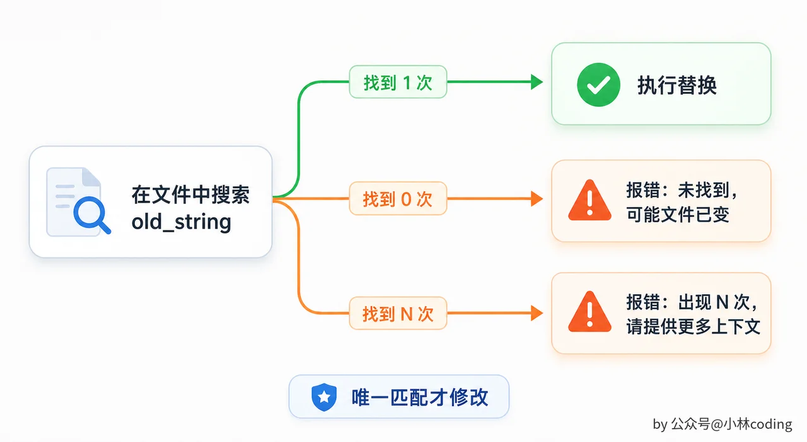

EditFile 匹配分支

替换成功后，返回修改位置附近几行的内容（带行号），让模型能确认修改是否正确。

new\_string 为空字符串表示删除该段文本。

元信息：非只读，非破坏性，分类为 file。

### Bash：最强大，也最危险

Bash 工具让模型可以执行任意 shell 命令。这是最强大的工具，因为它把整个操作系统的能力都暴露给了模型。编译、测试、安装依赖、查看进程、网络请求，什么都能做。

但「能做什么都行」也意味着「能搞什么都行」。一条 `rm -rf /` 就够你喝一壶的。所以 Bash 工具的设计需要格外小心。

执行方面，通过系统 shell 执行命令，工作目录设为项目根目录。默认超时 30 秒，防止死循环或者 `sleep 999` 之类的命令把 Agent 卡住。

输出方面，把 stdout 和 stderr 合并到同一个流。如果输出超过 10000 字符，保留前 2000 和后 8000 字符，中间用截断标记连接。为什么保留更多尾部？因为编译错误和测试结果通常在输出末尾。

返回格式包含合并后的输出内容和 exit code，可以用结构化标签包裹，比如 `<output>` 和 `<exit_code>` 。

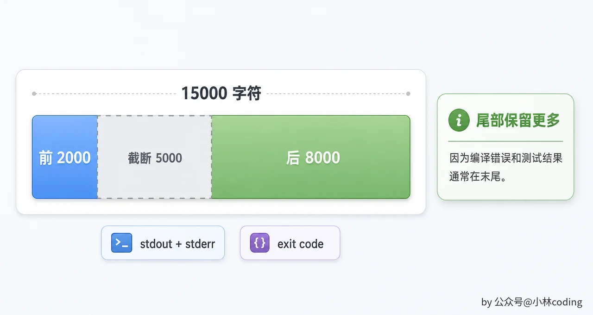

Bash 输出截断策略

一个关键设计： **非零退出码不是 error** 。编译报错退出码为 1 这类命令执行失败是正常的反馈信息，模型需要看到报错内容才能修复问题。只有超时才作为 `isError: true` 返回。

元信息：非只读， **破坏性** ，分类为 shell。Bash 是唯一标记为破坏性的工具。后面做权限系统时，它会触发最严格的用户确认流程。

### Glob：Agent 的眼睛（找文件）

当模型需要了解项目结构，或者找一类文件（比如所有的源文件、所有的测试文件）时，它需要 Glob。

核心参数是 glob 模式，比如 `**/*.py` ，加上可选的搜索根目录。

支持 `**` 递归匹配是必须的，不然搜不到子目录里的文件。自动排除 `.git` 、 `node_modules` 、 `vendor` 、 `.idea` 、 `__pycache__` 等目录，这些目录文件多、没意义、搜进去只会浪费 token。

结果按修改时间倒序排列，最近修改的排在前面，因为模型通常关心最近改过的文件。最多返回 200 个结果，避免一个 `**/*` 把整个文件系统吐出来。

每行一个文件路径（相对于搜索根目录）。

元信息：只读，非破坏性，分类为 search。

### Grep：Agent 的眼睛（找内容）

Glob 找的是文件名，Grep 找的是文件内容。当模型要在项目里搜索某个函数定义、某个变量引用、某段错误信息时，用 Grep。

核心参数是正则表达式模式。可选参数包括搜索路径、按 glob 过滤文件名、指定上下文行数来显示匹配行前后的内容。

逐文件逐行匹配，自动排除二进制文件和 `.git` 等目录。最多返回 100 个匹配结果。

输出格式： `文件路径:行号: 匹配行内容` 。

元信息：只读，非破坏性，分类为 search。

### 六个工具的设计全景

Glob 和 Grep 是「眼睛」工具。模型用它们在项目中找到需要的文件和代码位置，然后再用 ReadFile 深入阅读。一个典型的工作流是：Grep 搜索关键词 → 发现目标文件 → ReadFile 读取完整内容 → EditFile 修改 → Bash 编译测试。

把六个工具的元信息总结在一张表里：

|     |     |     |     |     |
| --- | --- | --- | --- | --- |
| 工具  | 分类  | 只读  | 破坏性 | 典型场景 |
| ReadFile | file | 是   | 否   | 查看文件内容、读取配置 |
| WriteFile | file | 否   | 否   | 创建新文件、覆盖写入 |
| EditFile | file | 否   | 否   | 精确修改文件某几行，节省 token |
| Bash | shell | 否   | 是   | 编译、测试、安装依赖、执行命令 |
| Glob | search | 是   | 否   | 了解项目结构、查找特定类型文件 |
| Grep | search | 是   | 否   | 搜索代码中的函数定义、变量引用 |

---

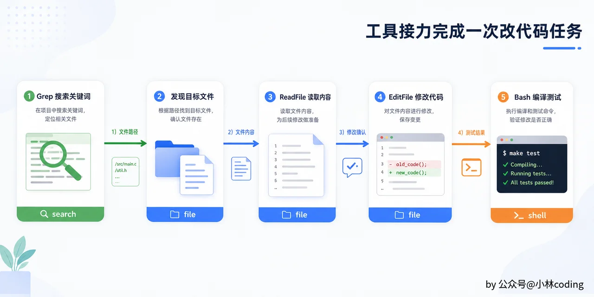

工具协作工作流

## 集成到 LLM 客户端：处理流式 tool\_use

工具框架写好了，接下来要把 Function Calling 集成到 LLM 客户端中。这涉及请求侧和响应侧两部分改动。

### 请求侧

每次调 API 时，从注册中心拿到当前启用的工具列表，转成工具定义放进请求参数。

### 响应侧：内容类型扩展

上一章我们处理的内容块只有 `text` 类型。现在要支持 `tool_use` 和 `tool_result` 。

内容块需要扩展的字段：

|     |     |     |
| --- | --- | --- |
| 内容类型 | 新增字段 | 说明  |
| tool\_use | id  | 工具调用的唯一标识 |
|     | name | 工具名称 |
|     | input | 调用参数（JSON） |
| tool\_result | tool\_use\_id | 对应的 tool\_use id |
|     | content | 执行结果文本 |
|     | is\_error | 是否为错误结果 |

流式事件也要扩展，新增一种「工具调用」事件类型，携带 id、name、input 三个字段。

### 流式 tool\_use 解析：拼 JSON 碎片

这是本章技术上最 tricky 的部分。

在流式响应中，文本内容是一段一段到的，你直接追加就行。但 tool\_use 的输入参数也是一段一段到的，而且是 JSON 碎片。你要把碎片拼起来，最后解析成完整的 JSON。

流式事件的顺序是这样的：

```Plaintext
content_block_start  → type: "tool_use", id: "toolu_xxx", name: "ReadFile"
content_block_delta  → type: "input_json_delta", partial_json: "{"
content_block_delta  → type: "input_json_delta", partial_json: "\"path\""
content_block_delta  → type: "input_json_delta", partial_json: ": \"/main.py\"}"
content_block_stop
```

`content_block_start` 告诉你一个新的 tool\_use 块开始了，给你 id 和 name。然后一系列 `content_block_delta` 给你 JSON 的碎片。最后 `content_block_stop` 告诉你这个块结束了。

你的处理逻辑就三步：收到 `content_block_start` 且 type 为 `tool_use` 时，记下 id 和 name，初始化一个字符串缓冲区。后续每个 `input_json_delta` 到达，把 `partial_json` 追加到缓冲区。最后 `content_block_stop` 时，把缓冲区里的完整 JSON 解析出来，发送一个 ToolUse 事件。

这比文本流复杂不少。如果 JSON 拼接出错或格式不对，不能崩溃，要优雅降级，报错但让程序继续运行。

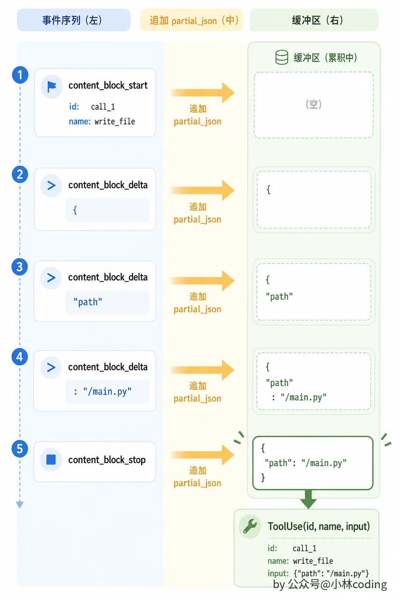

流式 tool\_use 解析

---

## 消息管道的变化

工具调用引入了一种新的消息模式。之前的对话是简单的 user → assistant → user → assistant 交替。现在变成了：

```Plaintext
user: "帮我读一下项目入口文件"
assistant: [text: "好的，让我读取这个文件"] [tool_use: ReadFile({path: "/project/main.py"})]
user: [tool_result: "1\tdef main():\n2\t    print('hello')\n..."]
assistant: "这个文件包含了程序的入口..."
```

有几个点需要注意。

第一， `tool_result` 是以 user 角色发送的，这是 Claude API 的要求。所以 user/assistant 交替的惯例依然成立，只是 user 消息的内容变成了 tool\_result 而非普通文本。

第二，一条 assistant 消息可能同时包含 text 和 tool\_use 两种内容块，它们必须放在同一条消息里，不能拆成两条。

第三，如果模型在一次回复中请求了多个工具调用（比如同时 ReadFile 和 Grep），所有 tool\_use 块在同一条 assistant 消息里，所有 tool\_result 在同一条 user 消息里，通过 id 配对。

上一章写的格式转换方法需要更新来处理这种消息模式。特别是 tool\_use 和 tool\_result 的 id 配对不能出错。

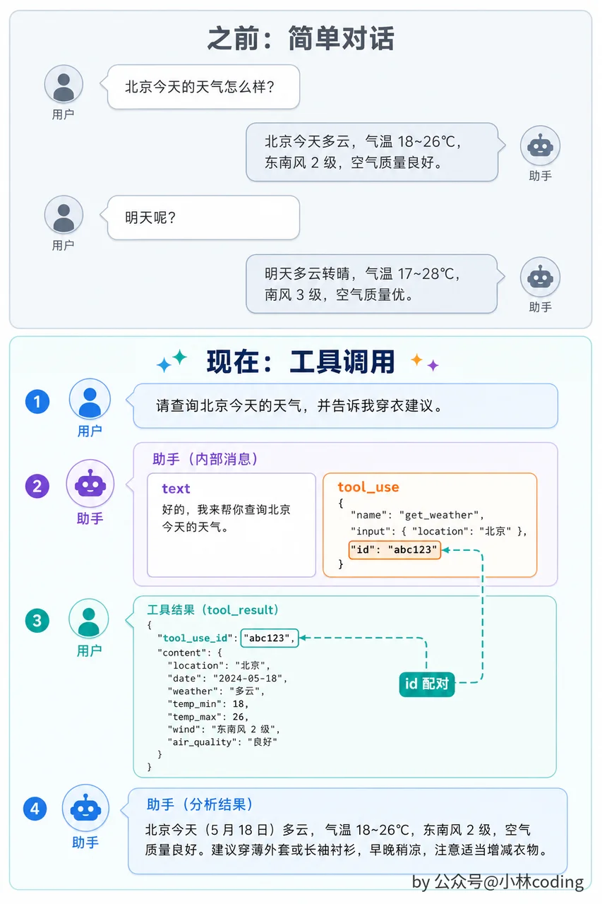

工具调用后的消息管道

---

## 本章小结

这一章是整个课程里代码量最大的一章，但核心思想可以浓缩成三点。

Function Calling 的核心是决策与执行的分离：模型只管想，你的代码负责做，结果再反馈回来驱动下一步。

工具接口不只是「名字 + 执行」，只读/破坏性标记、输入校验这些元信息是后面权限系统自动化运转的基础。

而在所有工程投入中，工具描述是回报率最高的：描述写得好，模型选对工具、传对参数的概率会显著提升。

现在 MewCode 有手有脚了，但每次只能走一步。用户说一句话，模型调一次工具，返回结果，结束。如果一个任务需要先搜索、再读取、再修改、再测试呢？这就需要让工具调用自动循环起来。下一章，Agent Loop。