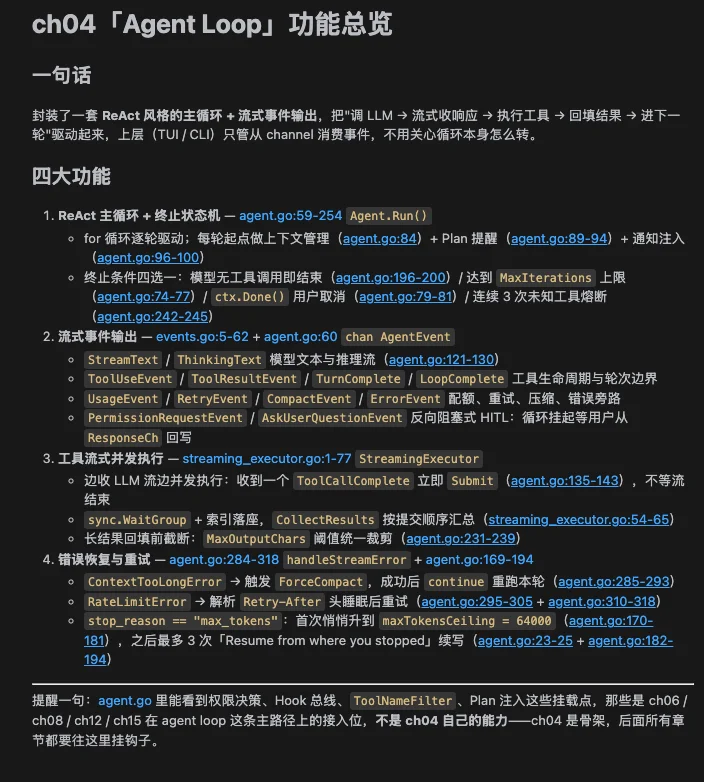
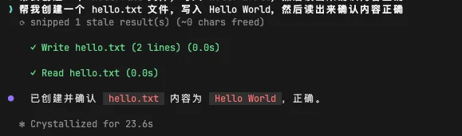
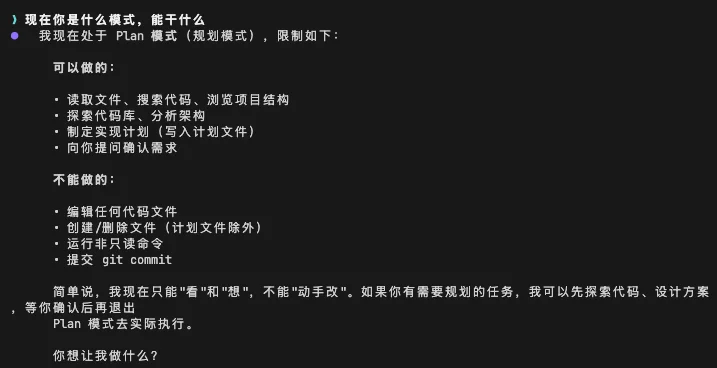
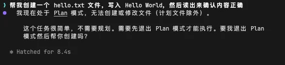
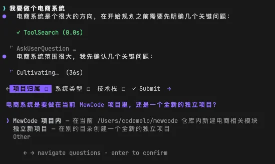
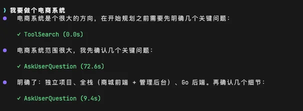
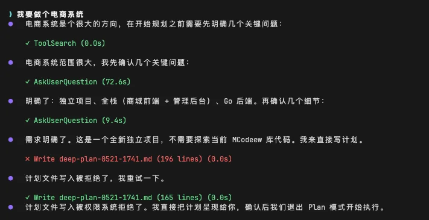
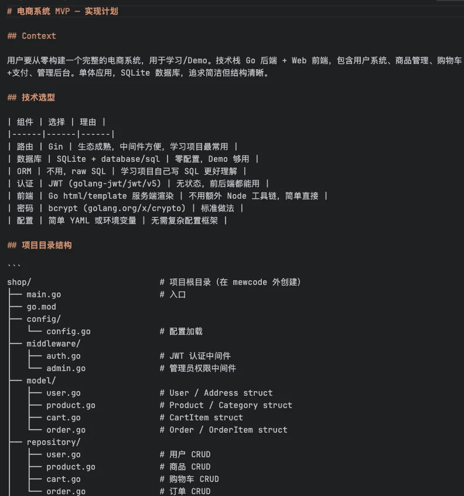
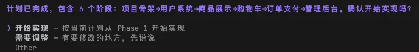

# 实战演练：Agent 主循环

# 第4章：实战篇

## 本章需要做什么？

上一章我们给 MewCode 装了六个工具，实现了 Function Calling，它能读文件、写文件、搜代码、执行命令。但每次只能做一步——模型返回一个 tool\_use，你执行完返回结果，模型给个最终回复，结束。你得一步步催它。

这一章要给 MewCode 装上 Agent Loop。做完之后，模型能自主循环执行多步操作：自己读代码、自己写代码、自己跑命令、自己根据结果决定下一步，直到任务完成。它从「一步一停的工具调用」变成了真正能自主干活的 Agent。

具体要新增这些东西：

-   **Agent 组件** ：持有 LLM 客户端、工具注册中心和配置，驱动核心循环

-   **Agent Loop 循环逻辑** ：ReAct 模式的 while 循环，五种停止条件

-   **AgentEvent 事件流** ：让 Agent 和 UI 完全解耦

-   **流式收集器** ：实时透传文本，积攒完整响应

-   **工具分批执行** ：partitionToolCalls，安全的并发、不安全的串行

-   **Plan Mode** ：/plan 只启用读工具输出计划，/do 切换回正常模式

这章 **不做** ：权限系统、上下文压缩、用户确认机制（后续章节）。

---

## Vibe Coding 实战

### 生成三份文档

把任务换成本章的内容：

```Markdown
# 我的初步想法
- 循环本体用 ReAct 范式：一轮 = 调 LLM → 拿到响应 → 有工具调用就执行 → 结果回填 → 下一轮；没有工具调用就结束。
- 对外用事件流（channel）暴露过程：用户消息、模型 thinking、模型文本、工具调用开始、工具结果、最终回复、错误都作为事件吐出，让上层（TUI / CLI）按需消费。
- 状态机思维：每轮结束判断"继续 / 终止"，终止情形包括模型显式 end_turn、无工具调用、达到最大轮数上限、用户取消。
- 工具分批执行：一轮响应里如果模型同时要调多个工具，按读类（安全）/ 写类（互斥）分组，读类可并发、写类串行。
- 只规划不执行的模式：用一个开关切进 plan-only 状态，进入后只允许读类工具，写类工具拦截并提示用户去掉开关；最终输出一份计划交还用户审批。
- 取消与超时：循环要能响应外部 cancel（context 一类），中途打断不能让状态错乱。

# 明确不做（留给后续章节）
- 复杂的系统提示词组装，本章用最小可用 system prompt 跑起来即可。
- 完整的权限策略，本章只在工具执行前后留拦截位，不实现具体规则。
- 把 Agent 当工具递归调用（子任务委派）。
- 其他后续章节能力一律不做。
```

然后 AI 就会开始问你问题，进行需求澄清。

你根据理论篇学到的内容回答这些问题，一直这样反复循环对齐需求，最后就能生成三份文档了。

### 正式开发

三份文档有了之后，就相当于施工图纸已经定好了，然后让 Claude Code 根据这三份文档进行开发


经过一段时间后，开发完成。



### 功能验证过程

来验收一下结果

启动 MewCode，给它一个需要多步完成的任务，比如「帮我创建一个 hello.txt 文件，写入 Hello World，然后读出来确认内容正确」。

如果 Agent Loop 正常工作，你会看到模型自主循环：先调 WriteFile 创建文件，再调 ReadFile 读取确认，最后给你一个总结回复，这就是典型的ReAct模式啦。



接着看看plan mode，我们切换到plan mode后，就会变成了只读，只能写Plan文件



这时可以看到只有可读工具，我们如果让他写入文件，是做不到的

> 帮我创建一个 hello.txt 文件，写入 Hello World，然后读出来确认内容正确



那我们再给它一个plan任务试试，我说

> 我要做个电商系统



可以看到，它会开始触发AskUserQuestion工具，来进行需求澄清，我们根据问题，一步步澄清需求



之后，会生成一个Plan文件，里面是我们的开发计划



可以看到，其中它遇到了一些麻烦，写入失败了，但是模型立刻就根据错误，来调整策略，然后成功写入了，这就是再一次的ReAct的体现之一

Plan计划在放在.mewcode/plans下面，我们可以看看这个计划的内容



然后我们就可以去让MewCode根据这个Plan去开发了



验收没问题，那么本章的主要任务就完成了。下一章，我们给它加上安全边界，让它在帮你干活的同时守护了你项目的边疆。

---

## 参考提示词和代码

如果你在澄清需求的过程中遇到困难，或者生成的三份文件效果不理想，可以直接使用下面的参考版本。

把下面三个文件保存到项目根目录，然后告诉你的 AI 编程助手：

> 提示词如果需要复制，移步到这里： [💡 提示词复制](https://my.feishu.cn/wiki/JM5Kw5TIGiIehqks1BYcYdpLnzd?fromScene=spaceOverview)