# Agent 主循环

---

## 工具齐了，但 Agent 还不会「自己干活」

上一章我们给 MewCode 装了 6 个工具。它能读文件、写文件、搜代码、执行命令。听起来能力已经很全了，对吧？

但你试试让它做一个稍微复杂点的事情。比如你说「帮我写一个 HTTP 服务器，编译一下，确保没报错」。

理想情况下，Agent 应该这样工作：先用 Glob 扫一眼项目结构，看看有哪些文件。然后用 ReadFile 读一下现有代码，理解项目的风格和结构。接着用 WriteFile 创建新文件，写好 HTTP 服务器的代码。然后用 Bash 执行编译命令，看看能不能编译通过。如果编译报错了，再用 EditFile 修改代码。再编译一次，直到通过为止。

这是 5、6 步操作。但现在的 MewCode 只能做一步。模型返回一个 `tool_use` ，你执行完返回 `tool_result` ，模型给一个最终回复，结束。它不会自动往下走。

就好比你请了一个实习生，他确实会写代码、会跑命令、会查文档，但每做完一步就停下来看着你，等你说「继续」。你得一步步催。


做一步就停的猫咪实习生

现在还只是一个高级版的命令行补全工具，算不上 Agent。

**Agent Loop 就是让模型学会「自己干活」的那个机制。** 它是 MewCode 从「工具辅助聊天」进化到「自主编程助手」的最后一块拼图。而且说出来你可能不信，它的核心就是一个 while 循环加几次 API 调用。真的就这么简单。

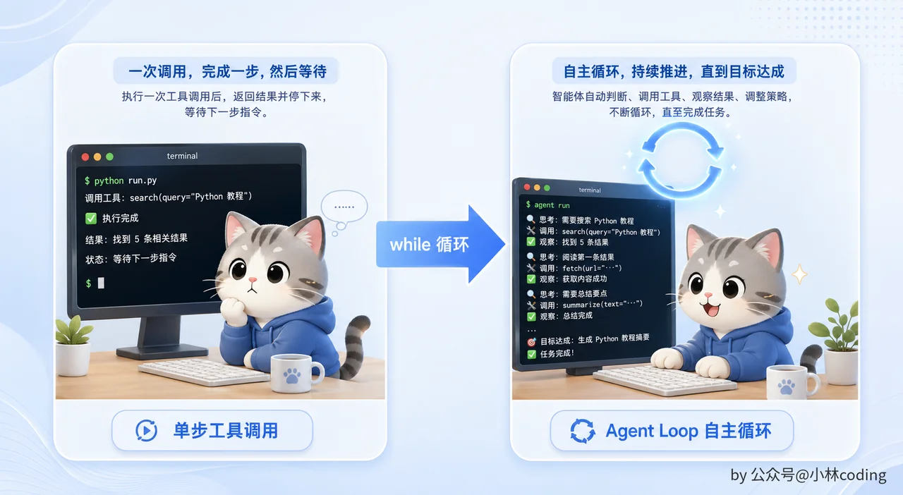

单步工具调用与 Agent Loop

---

## ReAct：先想清楚，再动手

在写代码之前，我们先聊一个学术概念。别怕，这个概念不复杂，而且理解了它之后，Agent Loop 的代码你闭着眼都能写出来。

你平时写代码的时候是怎么工作的？不可能上来就敲键盘吧。你会先想一想：这个需求要改哪些文件？现有代码是什么结构？我应该从哪里入手？想好了，动手改。改完看一下效果，编译通不通过？测试过不过？如果有问题，再想想为什么，然后继续改。

这个过程用三个词概括就是： **想（Think）→ 做（Act）→ 看结果（Observe）** 。

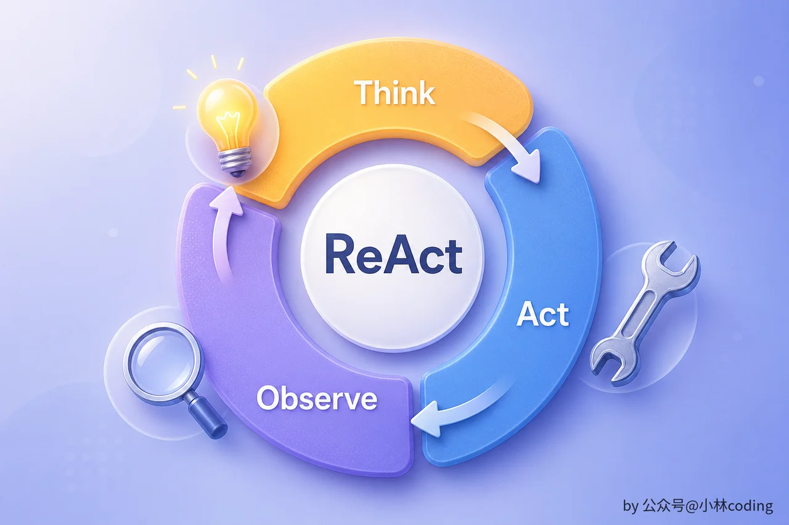

ReAct Think Act Observe 循环

2022 年 Shunyu Yao 等人发表了一篇叫 [ReAct（Reasoning + Acting）](https://arxiv.org/abs/2210.03629) 的论文，把这个过程形式化了。它的核心思想特别简单：让 LLM 交替进行「推理」和「行动」。

在 ReAct 出现之前，大家用 LLM 做事要么是纯推理，也就是 Chain-of-Thought，让模型一步步想但光想不做；要么是纯行动，直接让模型调工具但不让它解释为什么要调。ReAct 说：你让它一边想一边做不就行了？

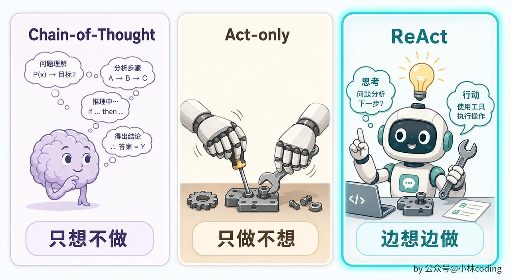

Chain-of-Thought Act-only 与 ReAct 对比

用一个具体例子感受一下。假设你让 MewCode 帮你写一个 HTTP 服务器：

```Plaintext
Think: 用户想写 HTTP 服务器，先看看项目里有哪些文件。
Act:   Glob(pattern="**/*")
Observe: main.py, handler.py, requirements.txt

Think: 已经有 handler.py 了，看看现有路由怎么组织的。
Act:   ReadFile(path="/project/handler.py")
Observe: from flask import Flask ... def handle_health(): ...

Think: 用 Flask，加新路由就行。改完编译看看。
Act:   EditFile(path="/project/handler.py", ...)
Observe: 文件修改成功
Act:   Bash(command="python -m py_compile handler.py")
Observe: exit code: 0
```

看到了吗？每一轮都是三步：模型先解释自己为什么要做这一步（Think），然后选一个工具去执行（Act），看到执行结果后（Observe），再决定下一步怎么走。

最妙的是，Claude API 的消息结构天然就支持这个模式。Think 就是 assistant 消息里的 `text` 内容，Act 就是 `tool_use` ，Observe 就是 `tool_result` 。我们不需要发明任何新格式，API 本身就是为 ReAct 设计的。

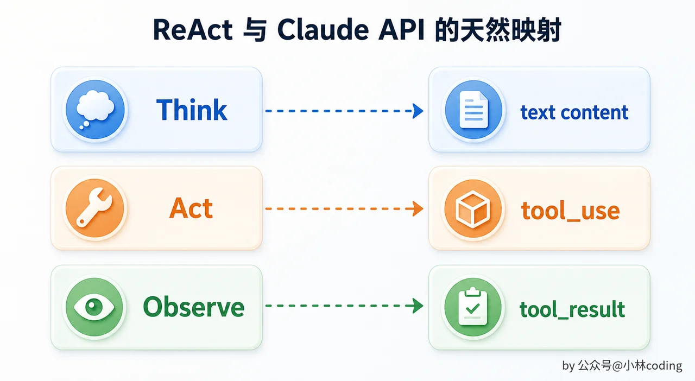

ReAct 与 Claude API 映射

### ReAct 和其他范式的对比

你可能听过别的 Agent 范式。简单对比一下，帮你把 ReAct 放进全景里。

|     |     |     |     |
| --- | --- | --- | --- |
| 范式  | 核心思路 | 优点  | 局限  |
| Chain-of-Thought | 只推理，不行动 | 推理质量高 | 无法与环境交互 |
| Act-only | 只行动，不推理 | 执行快 | 盲目调工具，容易出错 |
| ReAct | 推理与行动交替 | 两全其美：想清楚再做 | 每轮都要一次 LLM 调用，成本较高 |
| Plan-then-Execute | 先出完整计划，再逐步执行 | 全局规划好 | 计划可能过时，不如边走边看灵活 |

对 Coding Agent 来说，ReAct 是最自然的选择。写代码这件事本来就是边想边做的：你不可能在动手前把所有细节都想好，很多决策要看到中间结果才能做。

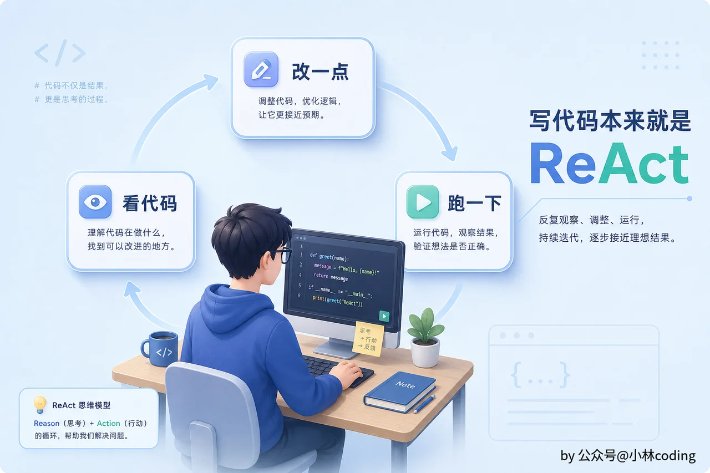

写代码本来就是 ReAct

---

## Agent Loop 的核心：就是一个 while 循环

理解了 ReAct 之后，Agent Loop 的代码简直是顺理成章的事。

用伪代码写出来：

```Plaintext
function agentLoop(userMessage):
    messages = [...历史消息, userMessage]
    while true:
        response = callLLM(systemPrompt, messages, tools)
        if response 没有 tool_use:
            return response
        messages.append({role: "assistant", content: response.content})
        results = []
        for each toolUse in response.toolUses:
            result = executeTool(toolUse.name, toolUse.input)
            results.append(tool_result(toolUse.id, result))
        messages.append({role: "user", content: results})
```

就这么短。你可能会想「就这？」对，就这。 **Agent 的核心循环真的就是这么简洁。** 一个 while 循环加几次 API 调用，这就是所有 Coding Agent 的心脏。

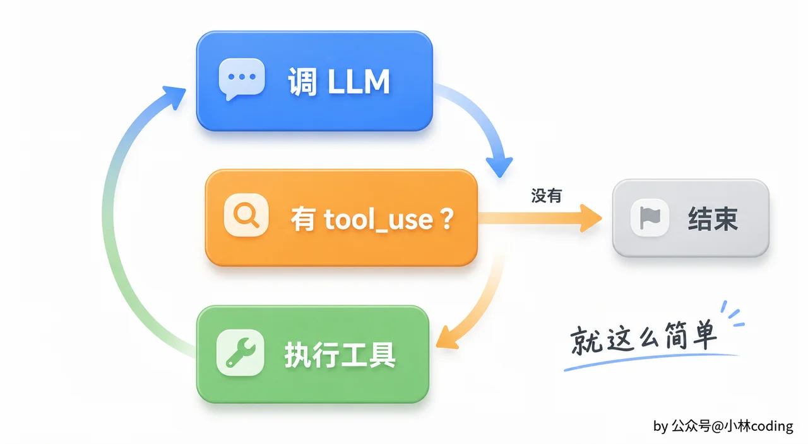

最小 Agent Loop 流程

## 停不下来的 Agent 比没有 Agent 更可怕

循环好写，但你有没有想过一个问题：这个 while 循环什么时候停下来？

如果模型进入了某种循环状态，比如它反复调用 ReadFile 读同一个文件，每次都觉得还需要再看一遍，那这个循环就永远不会结束。或者更糟糕的场景，工具执行总是返回错误，模型总是重试，API 费用蹭蹭往上涨，而你还在傻等。

**一个停不下来的 Agent 比没有 Agent 更可怕。** 所以停止条件是 Agent Loop 里跟循环本身同等重要的设计。


失控循环与 API 费用

MewCode 需要四种停止条件，缺一不可。

**第一种：模型主动说「我做完了」。** Claude API 返回的 `stop_reason` 如果是 `end_turn` ，并且响应里没有任何 `tool_use` ，就表示模型认为任务已经完成。这是最理想的停止方式，模型自然地收尾。

**第二种：迭代上限。** 设一个最大循环次数，比如 50 次。超过之后强制停止，给用户一个提示：「Agent 已经执行了 50 步但仍未完成，已自动停止」。这是安全网。正常的编码任务很少需要超过 50 次工具调用，如果超了，大概率是模型陷入了某种无意义的循环。

**第三种：用户取消。** 用户按 Esc 主动中断当前循环。注意这里是中断循环，程序本身不退出，用户还可以继续输入新问题。Ctrl+C 才是真正退出整个程序。

你的实现需要支持取消信号传播：用户在 UI 层触发取消，信号传递到 Agent Loop，Loop 在下一轮循环开始前检测到取消信号，干净退出。不同语言有不同的惯用做法：

|     |     |     |
| --- | --- | --- |
| 语言  | 取消机制 | 典型用法 |
| Go  | context.Context | `select { case <-ctx.Done(): return }` |
| Python | asyncio.CancelledError | `task.cancel()` + try/except |
| TypeScript | AbortController | `signal.addEventListener('abort', ...)` |
| Rust | tokio CancellationToken | `tokio::select! { _ = token.cancelled() => ... }` |

关键原则是一样的：每一轮循环开始前检查取消信号，如果被取消了就干净退出，释放所有资源。

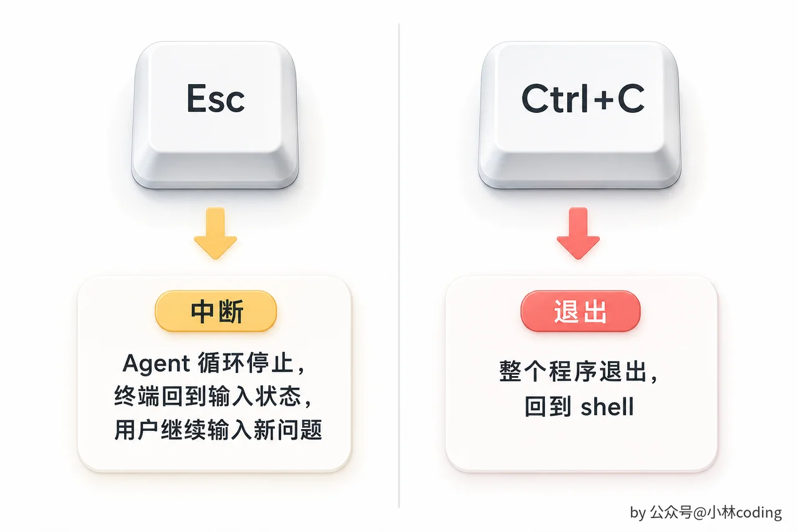

Esc 中断与 Ctrl+C 退出

**第四种：异常状态检测。** 如果模型请求调用的工具不存在，比如工具名拼错了，或者那个工具被禁用了，返回一个错误结果让模型自己调整。如果连续好几次都请求不存在的工具，说明模型已经迷失了，可以提前终止。

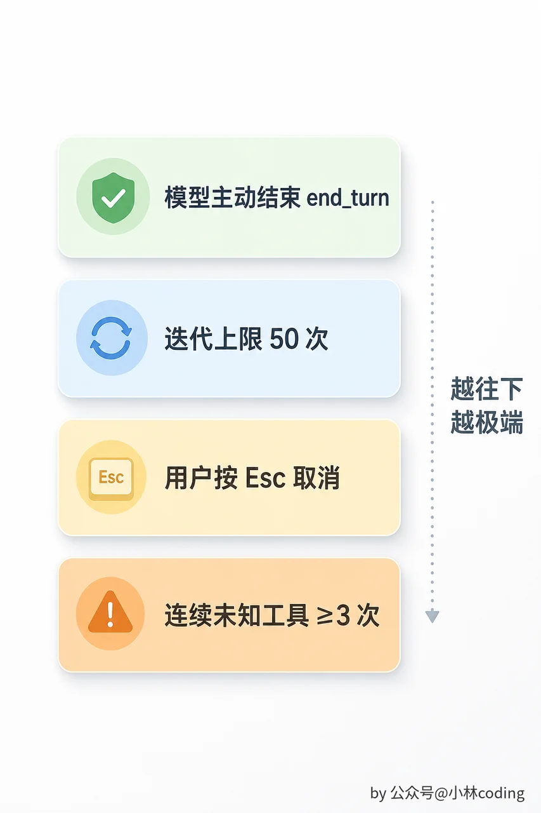

Agent Loop 停止防护层

---

## AgentEvent 流：让 UI 实时看到 Agent 在干什么

Agent Loop 可能跑几秒，也可能跑几分钟。这期间会产生大量事件：模型输出的流式文本、工具调用请求、工具执行结果、Token 用量更新、进度信息。如果用一个同步函数等它全部跑完再返回，用户就得盯着一个空白屏幕干等，体验极差。

所以 MewCode 的 Agent Loop 采用「事件流」模式：输入是用户消息，输出是一个 AgentEvent 的异步流。

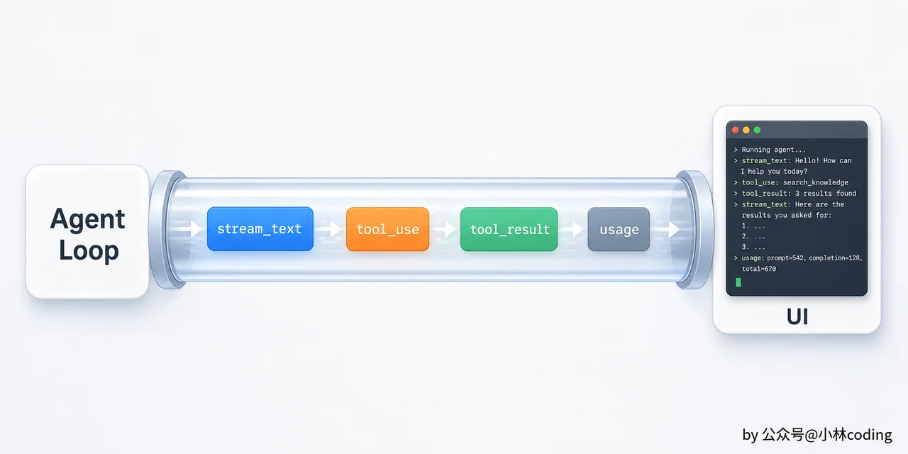

Agent 事件流到 UI

Agent Loop 产生的事件类型有这些：

|     |     |     |
| --- | --- | --- |
| 事件类型 | 含义  | 携带的数据 |
| stream\_text | 模型正在输出的文字增量 | 一小段文本 |
| tool\_use | 模型请求调用工具 | 工具名、工具输入、请求 ID |
| tool\_result | 工具执行完成 | 执行结果、是否出错、耗时 |
| turn\_complete | 一轮 LLM 调用完成 | 当前轮次序号 |
| loop\_complete | 整个循环结束 | 总轮次 |
| usage | Token 用量更新 | 累计输入/输出 token 数 |
| error | 发生错误 | 错误信息 |

UI 层只需要从事件流里消费事件，根据事件类型更新界面就行了。收到 `stream_text` ？把文字追加到输出区域。收到 `tool_use` ？显示一个「正在执行 ReadFile...」的提示。收到 `tool_result` ？把工具结果折叠展示。收到 `loop_complete` ？整个交互结束。

这种设计有一个很大的好处： **Agent 和 UI 完全解耦。** Agent 不知道 UI 长什么样，UI 不知道 Agent 内部跑了几轮循环。你甚至可以把 UI 层整个换掉，换成一个 Web 界面或者一个纯 JSON 输出，Agent 那边一行代码不用改。

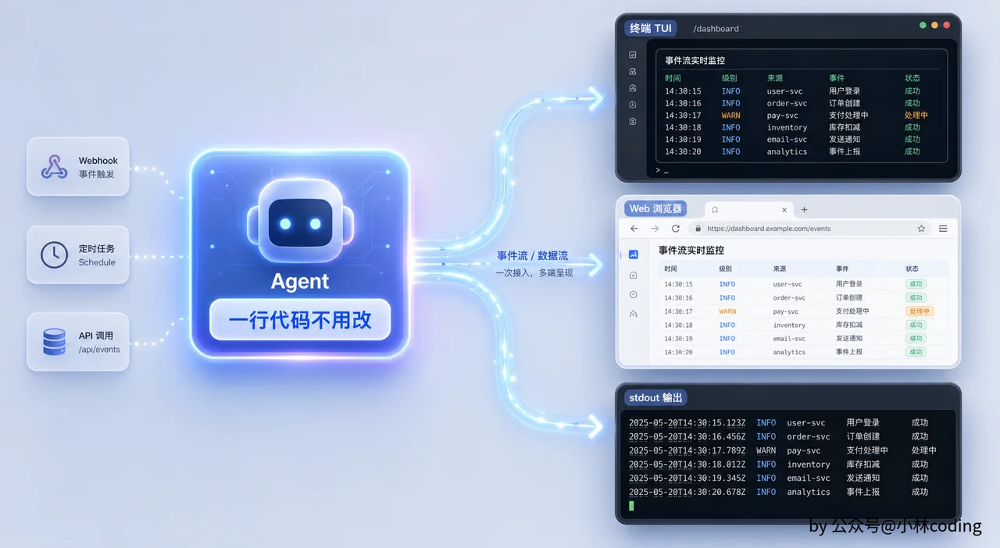

事件驱动的 UI 适配

不同语言实现这种事件流的方式不同，但核心模式是一样的：Agent Loop 作为生产者持续产生事件，UI 作为消费者逐个处理。

|     |     |     |
| --- | --- | --- |
| 语言  | 事件流原语 | 消费方式 |
| Go  | channel | `for event := range ch` |
| Python | async generator | `async for event in stream` |
| TypeScript | async iterable / EventEmitter | `for await (const event of stream)` |
| Rust | tokio mpsc channel | `while let Some(e) = rx.recv().await` |

你的 AgentEvent 需要携带足够的信息，让 UI 层能完成渲染。工具调用事件要带上工具名和输入参数，这样 UI 才能显示「ReadFile /project/main.py」。工具结果事件要带耗时，UI 才能显示「50ms」。用量事件要带累计值，状态栏才能实时更新 token 消耗。

---

## 状态机思维：每轮循环只有两条路

Agent Loop 的每一轮其实可以用一个非常简单的状态机来理解。模型每次响应之后，只有两种可能： **继续循环** ，或者 **终止循环** 。

```Plaintext
function classifyResponse(response):
    if response.toolUses is not empty:
        return CONTINUE   // 有工具调用，继续循环
    else:
        return TERMINAL   // 没有工具调用，任务结束
```

你可能觉得这个分类也太简单了，两行代码就搞定了，有必要单独抽出来吗？

有必要。因为把「是否继续」的判断逻辑集中到一个地方，后续扩展会非常自然。随着 MewCode 的功能越来越复杂，你可能需要加入更多状态。比如 `NEED_CONFIRM` ，遇到破坏性操作时需要用户确认才能继续。或者 `RATE_LIMITED` ，被 API 限流时需要暂停一会儿再重试。如果一开始就用状态机的思维来写，加新状态就是加一个分支的事。如果判断逻辑散落在循环的各个角落，加新状态就变成了到处打补丁。

把状态机画出来，Agent Loop 的全貌一目了然：

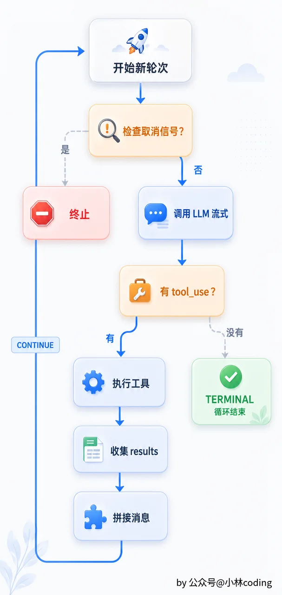

Agent Loop 全景图

---

## 工具执行的分批逻辑

前面提到工具可以串行执行，但模型一次可能返回多个工具调用，比如同时 ReadFile 三个不同文件。串行跑就得等三次磁盘 IO，完全没必要。

更聪明的做法是按每个工具的 `isConcurrencySafe` 声明做分批：安全的并发执行，不安全的串行执行。 `partitionToolCalls` 就干这件事，它把工具调用列表扫一遍做分区：

```Plaintext
function partitionToolCalls(toolUses, registry) -> Batch[]:
    batches = []
    for tc in toolUses:
        tool = registry.get(tc.name)
        safe = tool is not null and tool.isConcurrencySafe(tc.input)

        if safe and batches is not empty and batches.last().isConcurrencySafe:
            batches.last().calls.append(tc)
        else:
            batches.append(Batch(isConcurrencySafe=safe, calls=[tc]))
    return batches
```

举个例子。模型返回 `[Read, Read, Edit, Read, Read]` ，会被分成三批： `[Read, Read]` 并发 → `[Edit]` 串行 → `[Read, Read]` 并发。每一批串行批只包含一个不安全的调用，并发批可以包含多个安全调用。

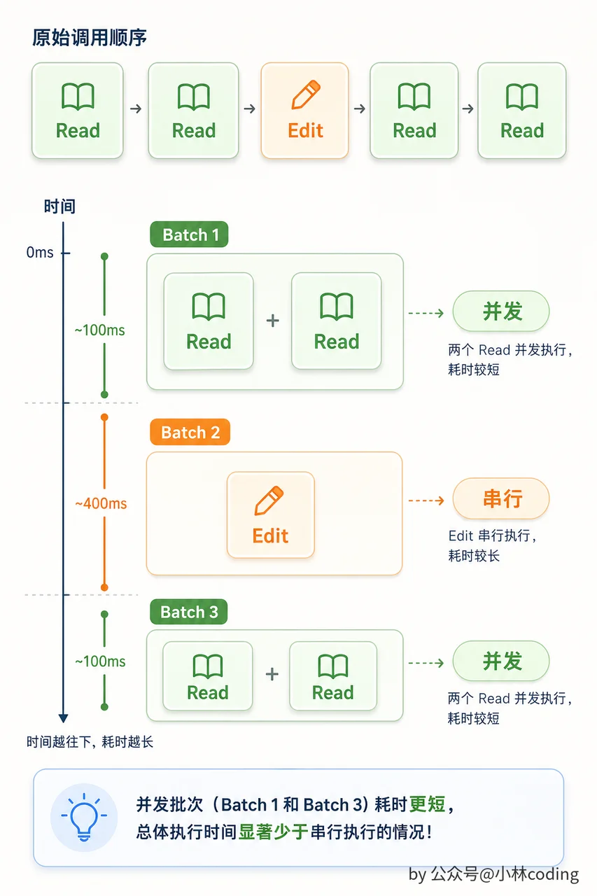

工具调用并发批次

并发执行 `runConcurrently` 的实现很简单，每个工具调用起一个协程/线程，同时执行，等全部完成。为了防止无限并发拖垮系统，可以加一个并发上限。串行执行 `runSerially` 就是逐个跑，跟之前一样。

这套机制让 Agent 在单次 turn 内就能获得并行加速。三个 ReadFile 同时跑，比排队快三倍。同时写操作和有副作用的命令自动被隔离到串行批次，不需要额外的依赖检测。

---

## System Prompt 与环境信息

Agent Loop 每轮都需要把 System Prompt 传给 Claude。这里先配一个最简版，第 5 章会专门展开完整设计。

System Prompt 包含角色设定、环境信息和模式指令：

```Plaintext
function buildSystemPrompt(config):
    parts = []

    // 角色设定
    parts.append("你是 MewCode，一个终端环境中的 AI 编程助手。
    你擅长阅读代码、编写代码和调试问题。
    你会先思考再行动，每一步都解释你的推理过程。")

    // 环境信息
    parts.append("# Environment")
    parts.append("当前工作目录：" + config.workDir)
    parts.append("操作系统：" + getOS())
    parts.append("当前时间：" + now().format())

    // 模式特定指令
    if config.planMode:
        parts.append(PLAN_MODE_INSTRUCTIONS)

    return parts.join("\n\n")
```

环境信息很容易被忽略，但它非常重要。如果模型不知道当前工作目录在哪里，它执行命令的时候就不知道该用绝对路径还是相对路径。如果不知道操作系统是什么，它可能在 Linux 上给你写 Windows 的命令。这些信息对人类来说是不言自明的，但模型需要你明确告诉它。工作目录和 OS 在一次会话内不会变，放在 system 里正好可以利用 Prompt Cache。

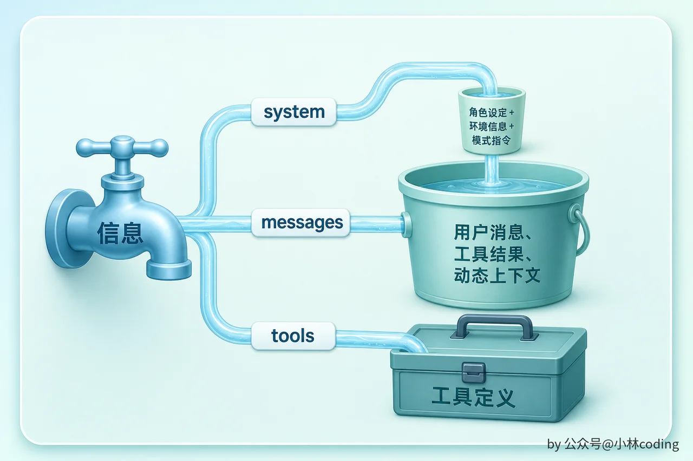

上下文信息三类字段

---

## Plan Mode：只想不做

有时候你不想让 Agent 直接动手，而是先让它出一个计划。比如你想重构项目的错误处理方式，这种涉及十几个文件的大工程，你肯定不想让 Agent 一上来就改，万一改出一堆问题呢？

这就是 Plan Mode 的应用场景。你可能以为实现方式是「把写工具全禁了，只留读工具」。但这样做太粗暴了：Agent 在规划阶段经常需要用 Bash 跑只读命令来探索项目，比如 `grep -r "TODO" .` 、 `find . -name "*.go"` 、 `ls -la src/` 。如果把 Bash 整个禁掉，这些探索操作全做不了，Agent 只能用 ReadFile 一个文件一个文件地读，效率很低。

所以 Plan Mode 的实现核心是 **通过 Prompt 指令约束模型行为** 。系统注入一段强指令，告诉模型当前是规划模式：

```Plaintext
Plan mode is active. 你不能执行任何修改操作，不能编辑文件、不能提交代码、不能修改配置。
唯一可以写入的文件是下面指定的 plan file。

你的工作流程：
1. 用 ReadFile、Grep、Glob、Bash（只读命令）探索代码
2. 分析用户需求，设计实现方案
3. 把计划写入 plan file
4. 等待用户确认后再执行
```

Plan Mode 下的权限矩阵和 Default 模式 **完全一致** （read=allow, write=ask, command=ask）。权限系统唯一的特殊处理是 plan 文件自动放行，不需要用户确认。如果 LLM 不听 prompt 的话尝试写非 plan 文件，用户会看到和正常模式一样的权限确认框，由用户决定是否批准。

你可能会问：既然权限没变，Plan Mode 的安全保障是不是太弱了？实际上 prompt 约束对目前主流的 LLM 已经非常有效。大部分模型在收到「不要用写工具」的指令后，几乎不会主动尝试调用写工具。权限系统保持 ask 而不是 deny 的好处是灵活性：万一你在规划过程中确实需要让 Agent 做一些小修改（比如写 plan 文件的同时顺手创建一个测试数据文件），你可以手动批准，不会被硬性拦截卡住。

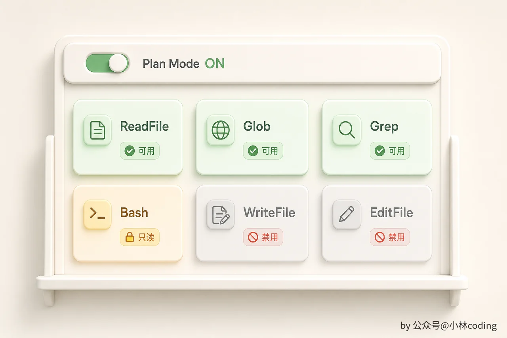

---

## 完整的数据流全景

到这里，让我们站高一点，看看 MewCode 现在的完整数据流：

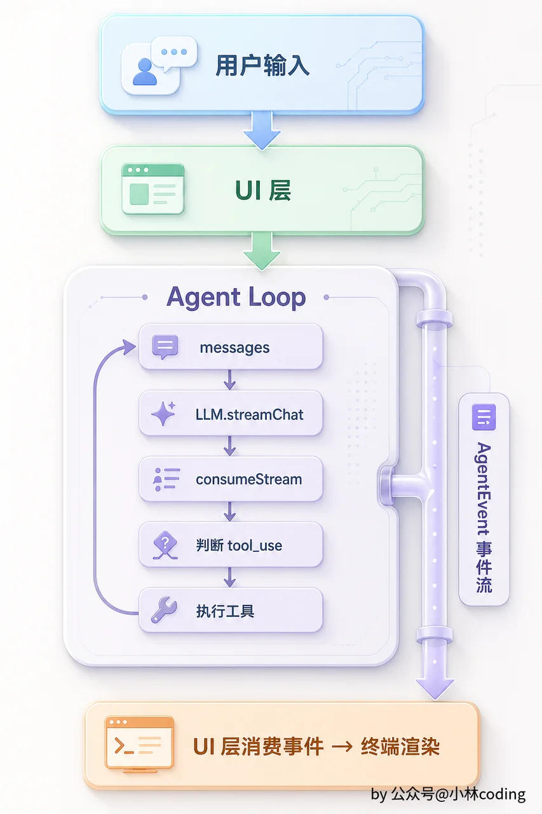

Agent Loop 架构分层

每一层都通过事件流解耦。Agent 不知道 UI 的存在，UI 不知道 Agent 内部跑了几轮循环。这让每一层都可以独立测试、独立替换。你甚至可以写一个纯命令行的 Agent 测试工具，完全绕过 UI 框架，直接从事件流读事件打印到 stdout。

---

## 里程碑时刻

**恭喜。走到这里，MewCode 已经是一个真正的 Agent 了。**

回想一下开篇讲的 Agent 四要素：LLM、工具、循环、反馈。现在四个都有了。LLM 是 Claude，工具是上一章实现的 6 个，循环是这一章写的 Agent Loop，反馈是工具执行的结果。

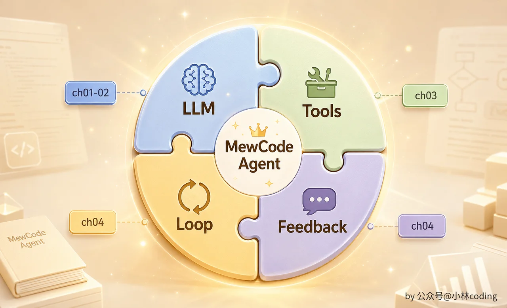

完整 Agent 四要素拼图

说白了就是一个 while 循环加上几次 API 调用。但这个简单的循环能做出令人惊讶的事情，因为循环里的那个「大脑」真的很强。你给它足够的工具和足够的自由度，它就能像一个初级程序员一样工作。自己读代码、自己写代码、自己跑测试、自己根据报错修改，直到任务完成。

当然，它还不完美。它会犯错、会走弯路、有时候会陷入循环。但它已经能真正帮你干活了。下一章我们先给它写好驾驶手册，定义它该怎么做事、什么不能做。

---

## 本章小结

这一章我们实现了 MewCode 的心脏。

ReAct 范式说白了就是「想一步做一步」，Agent Loop 说白了就是「一个 while 循环不停调 API 直到模型不再需要工具」。代码不复杂，但它把一堆独立的工具串成了一个能自主工作的系统。

几个关键设计值得记住。消息拼接要保证 assistant 的 text 和 tool\_use 不能拆开， `tool_result` 以 user 角色发送且 id 一一对应。四种停止条件缺一不可，尤其是迭代上限这个安全网。AgentEvent 事件流让 Agent 和 UI 完全解耦，这个模式在后续章节会反复出现。Plan Mode 通过 prompt 约束引导模型只做探索，权限系统作为兜底确保写操作仍需用户确认。

从这一章开始，MewCode 不再需要你一步步手动催它了。