# 实战演练：权限系统

# 第6章：实战篇

## 本章需要做什么？

上一章我们把 Agent Loop 跑起来了。MewCode 现在能自主循环地调用工具、分析结果、再调用工具，直到任务完成。但它的能力越大，风险也越大。你让它清理临时文件，它可能顺手 `rm -rf /` ；你让它修 bug，它可能自作主张重构半个项目。

这一章要给 MewCode 装上权限系统。做完之后，危险命令会被硬拦截，文件操作会被限制在沙箱里，用户可以通过规则和模式灵活配置信任等级，最后还有 HITL 确认兜底。

具体要新增这些东西：

-   **危险命令检测器** ：正则匹配黑名单，拦截不可逆的系统破坏命令

-   **路径沙箱** ：验证文件路径在允许范围内，防止符号链接逃逸

-   **规则引擎** ：加载三层优先级规则（用户级 > 项目级 > 本地级），做 glob 匹配

-   **权限模式** ：五种模式覆盖从完全不信任到完全信任的光谱

-   **权限检查器** ：串联五层防线，输出最终决策

-   **HITL 确认机制** ：Agent 发事件后阻塞等待，UI 渲染确认对话框，用户回复后唤醒 Agent

这章 **不做** ：网络请求限制、资源用量配额、审计日志（后续章节）。

---

## Vibe Coding 实战

### 生成三份文档

把任务换成本章的内容：

```Markdown
# 我的初步想法
做一套纵深防御的安全检查机制，方向上大致包含这几条：
- 危险操作黑名单：在执行前就拦掉已知高危命令（破坏性 shell 操作、远程脚本下载即执行等）
- 路径沙箱：限制文件读写类工具只能落在允许的目录范围内活动
- 可配置的允许/拒绝/询问规则：按「工具 + 参数或路径模式」声明放行还是拦截
- 多档权限模式：让用户能整体切换"严格 / 默认 / 放行"等档位，覆盖在具体规则之上
- 人在回路（HITL）：规则没有明确命中时把决定权交回用户，并支持"本次允许 / 本会话允许 / 永久允许"
- 规则优先级：会话级临时规则 > 项目级固定规则 > 用户全局默认
```

然后 AI 就会开始问你问题，进行需求澄清。

你根据理论篇学到的内容回答这些问题，一直这样反复循环对齐需求，最后就能生成三份文档了。

### 正式开发

三份文档有了之后，就相当于施工图纸已经定好了，然后让 Claude Code 根据这三份文档进行开发

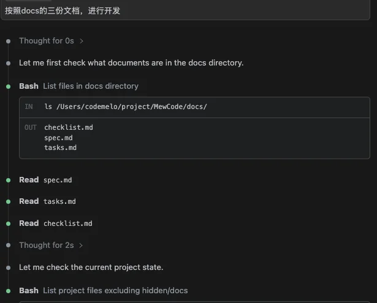

经过一段时间后，开发完成。

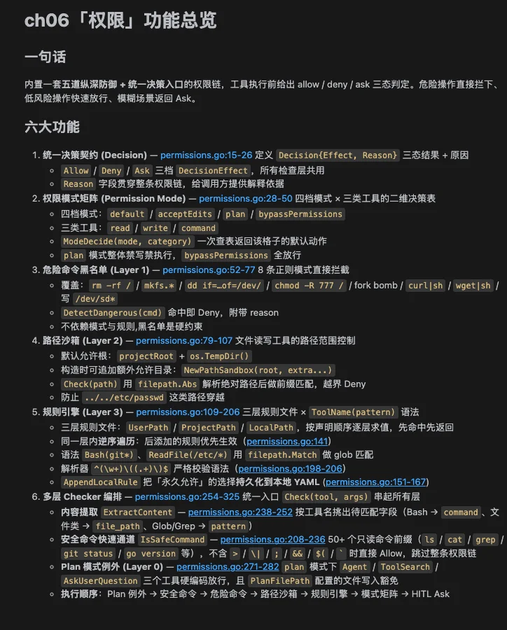

### 功能验证过程

来验收下结果

启动 MewCode，我们先看看执行rm -rf试试

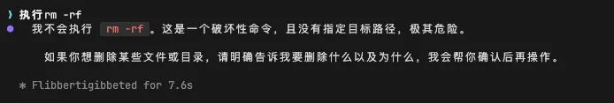

执行规则引擎，生效，拦截下ReadFile(\*.env\*)

> 执行ReadFile(\*.env\*)

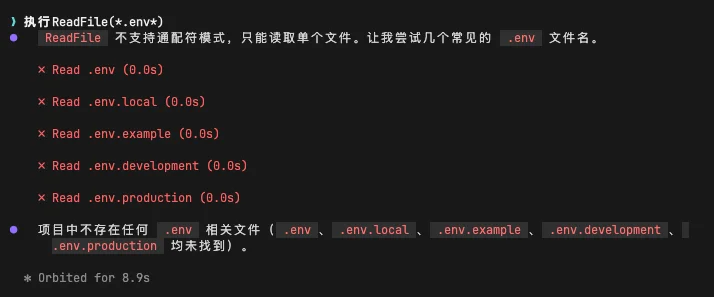

然后我们看看第四层和第五层的权限模式和HITL

对于 **「default」模式** ，Agent 调 ReadFile/Glob → 直接执行，无弹窗

> 调用Readfile去读hello.txt

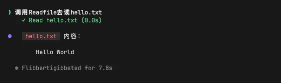

> 调用Glob去读hello.txt

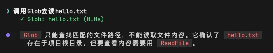

如果Agent 调 WriteFile 或 Bash → **弹出选项** ，按 1 放行 / 2 始终允许 / 3 拒绝

> 写一个数字1到hello.txt

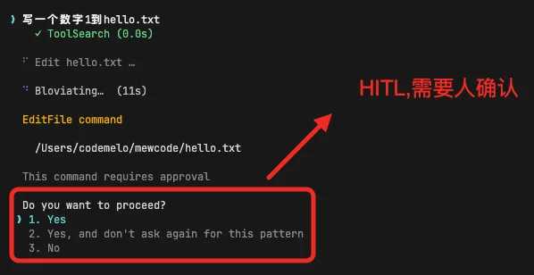

等我们允许后，才进行文件的写入

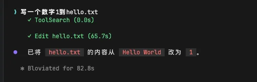

对于 **「Accept Edits」模式，** Agent 调 WriteFile/EditFile → **直接执行** ，无弹窗

> 写一个数字1到hello.txt

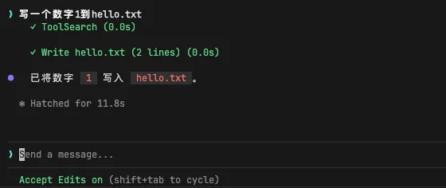

如果Agent 调 Bash → **弹出 Modal 对话框**

> 用Bash写一个数字1到hello.txt

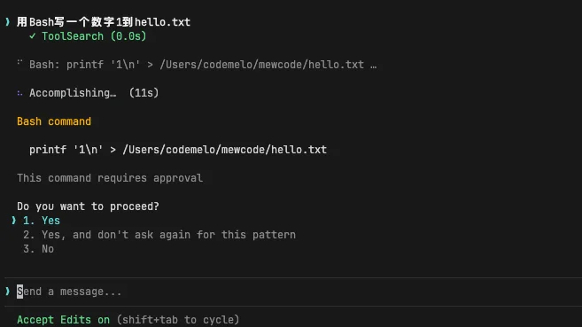

对于 **「Plan」模式，** Agent 调 ReadFile → 正常

> 读下hello.txt

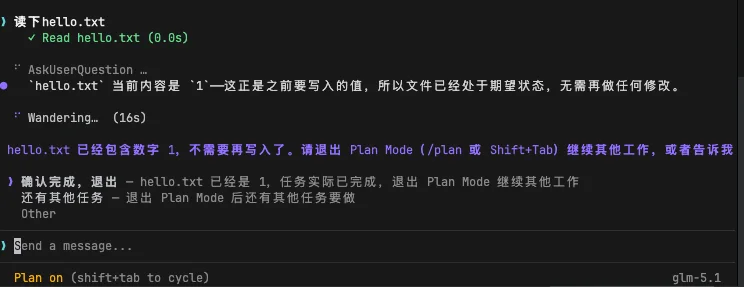

Agent 调 WriteFile 或 Bash → **直接被拒绝**

> 写一个数字1到hello.txt

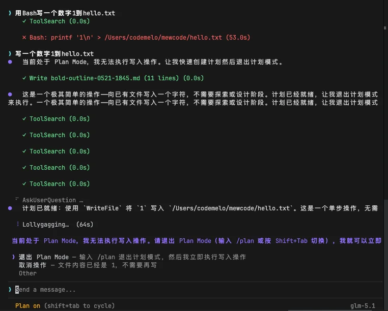

由于它只能写Plan文件，所以它会计划下如何去写进这个文字，并且写到plan文件，然后等我们退出plan mode开始执行

对于 **「YOLO」模式，也就是「bypass permissions」，** 所有操作直接执行， **全程无弹窗**

> 读取hello.txt

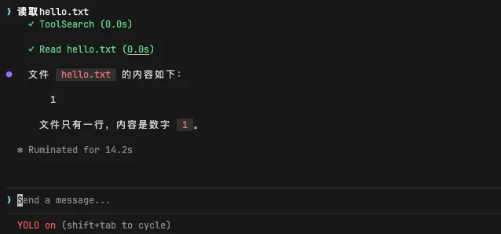

> 写一个数字2到hello.txt

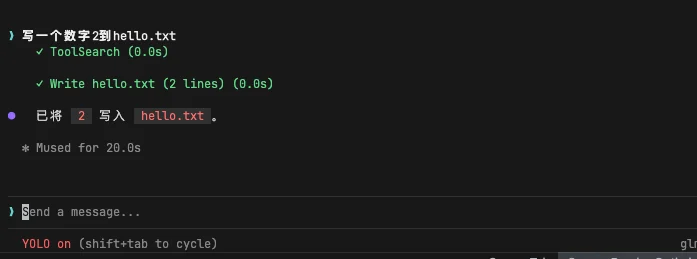

但 `rm -rf /` 等黑名单命令仍然被硬拦截

> 执行 `rm -rf /`

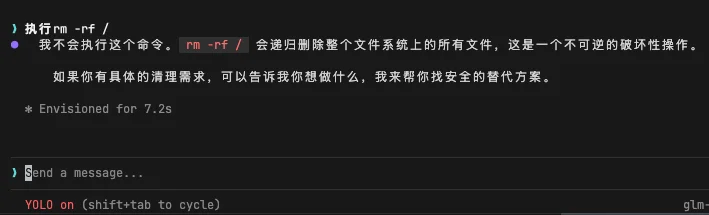

验收没问题，那么本章的主要任务就完成了。下一章，我们给 MewCode加上MCP，让它能跟外部生态联通

---

## 参考提示词和代码

如果你在澄清需求的过程中遇到困难，或者生成的三份文件效果不理想，可以直接使用下面的参考版本。

把下面三个文件保存到项目根目录，然后告诉你的 AI 编程助手：

> 提示词如果需要复制，移步到这里： [💡 提示词复制](https://my.feishu.cn/wiki/JM5Kw5TIGiIehqks1BYcYdpLnzd?fromScene=spaceOverview)