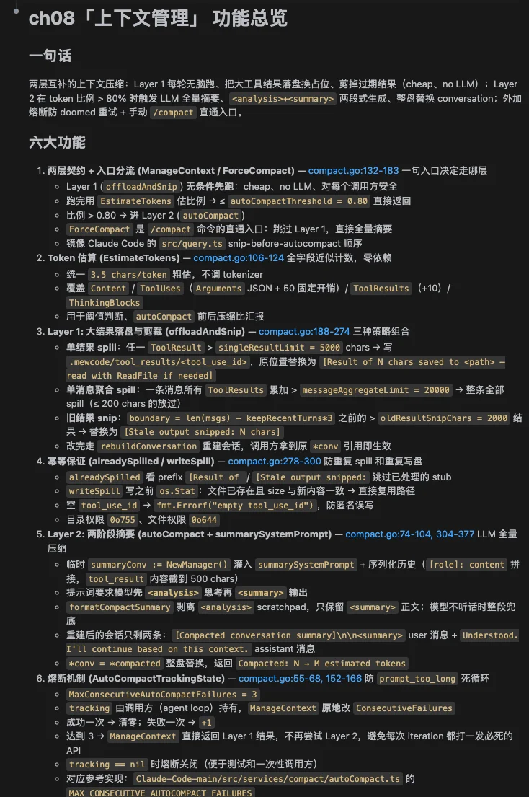
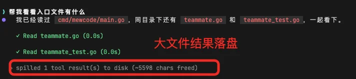
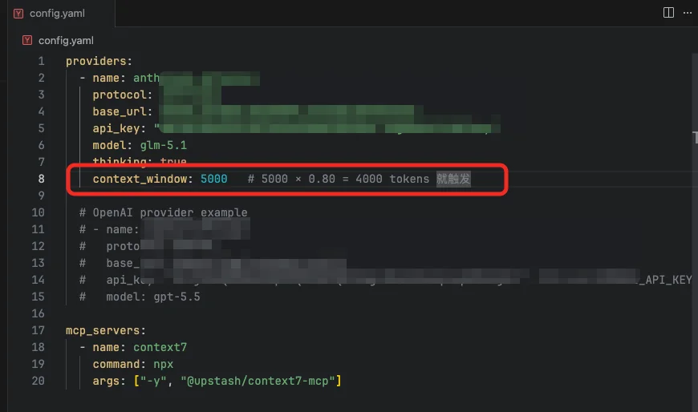
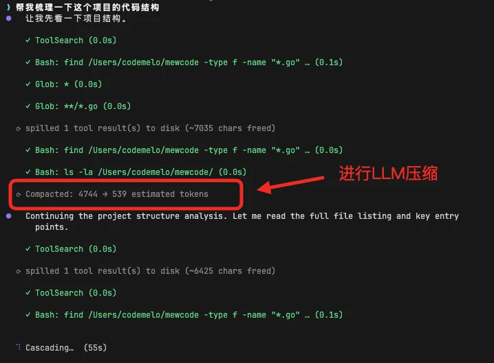
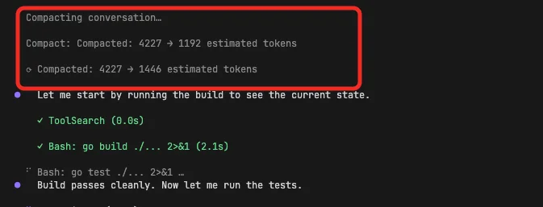

# 实战演练：上下文管理

# 第8章：实战篇

## 本章需要做什么？

上一章我们给 MewCode 接上了 MCP Client，它终于能通过标准化协议动态接入外部工具了。但随着 Agent 能力越来越强，一个新问题浮出水面：它干活的时间越来越长，读的文件越来越多，Token 消耗直线飙升，直到撞上上下文窗口的天花板。

这一章要给 MewCode 装上上下文管理能力。做完之后，Agent 能在有限的 Token 预算内长时间工作，不会因为对话太长而瘫掉。

具体要新增这些东西：

-   **Token 估算** ：近似计算当前对话占了多少 Token

-   **大结果存磁盘** ：工具输出超过阈值时，完整内容写到本地文件，对话里只保留预览和路径

-   **全量摘要（Auto-Compact）** ：上下文逼近窗口上限时，调用 LLM 生成结构化摘要替换旧消息，压缩后恢复关键上下文

-   **手动 /compact 命令** ：用户随时可以触发压缩，显示压缩前后的 Token 变化

-   **Agent Loop 集成** ：每轮循环前自动执行两层压缩，压缩结果赋值回外层对话历史

这章 **不做** ：精确 tokenizer（用近似估算就够了）、压缩策略的机器学习优化。

---

## Vibe Coding 实战

### 生成三份文档

把任务换成本章的内容：

```Markdown
# 我的初步想法
- Token 消耗的大头是工具结果，压缩从这里下手；用户的原始消息要尽量原文保留，不能被摘要改写
- 第一层做预防：单个工具结果超阈值时把完整内容写到磁盘，对话里只留预览和文件路径；同时控制单条消息内所有工具结果的合计大小，超了挑大的依次存盘
- 第二层做兜底：整体对话逼近窗口上限时，调 LLM 生成结构化摘要替换旧消息；摘要按多个固定部分组织（主要请求、关键概念、文件代码、错误修复、解决过程、用户原话、待办、当前工作、下一步）
- 摘要 Prompt 必须明确禁止 LLM 调用任何工具（首尾各强调一次），并要求先输出分析草稿再写正式摘要，草稿用完即弃
- 压缩后要附加一条边界消息，提示模型如需文件细节请重新读取，避免根据摘要脑补出不存在的代码
- 用户可以通过命令手动触发压缩；摘要连续失败要熔断，停止自动触发避免死循环
- 每次 API 请求前按顺序执行两层：先轻量预防（管单条消息大小），再昂贵兜底（管累积历史长度）
```

然后 AI 就会开始问你问题，进行需求澄清。

你根据理论篇学到的内容回答这些问题，一直这样反复循环对齐需求，最后就能生成三份文档了。

### 正式开发

三份文档有了之后，就相当于施工图纸已经定好了，然后让 Claude Code 根据这三份文档进行开发


经过一段时间后，开发完成。



### 功能验证过程

来验收一下结果

启动 MewCode，给 Agent 一个复读机任务，必定会超过阈值成为大结果

> 帮我看看入口文件有什么



可以看到，大文件的工具输出被自动存盘。

接下来看看自动压缩，为了方便演示，我们先把自动压缩的阈值调低



我们给个长点的任务。

> 帮我梳理一下这个项目的代码结构



在不断的梳理中，输入token会累积，等对话累积到阈值时自动压缩，Token 用量大幅回落，但 Agent 仍然记得之前在做什么。

最后试试输入 `/compact` 手动触发，能看到压缩前后的 Token 变化。



验收没问题，那么本章的主要任务就完成了。事实上这个只是Agent的记忆系统的一部分，下一章，我们来进一步巩固我们的记忆系统更完整的体系

---

## 参考提示词和代码

如果你在澄清需求的过程中遇到困难，或者生成的三份文件效果不理想，可以直接使用下面的参考版本。

把下面三个文件保存到项目根目录，然后告诉你的 AI 编程助手：

> 提示词如果需要复制，移步到这里： [💡 提示词复制](https://my.feishu.cn/wiki/JM5Kw5TIGiIehqks1BYcYdpLnzd?fromScene=spaceOverview)