# 上下文管理

---

## Agent 干了半小时活，怎么越来越慢了

你用 MewCode 跑了一个稍微复杂的任务，比如重构一个模块。Agent 先读了十几个文件了解代码结构，然后改了五六个文件，中间跑了好几次测试和编译。一切顺利。

但你慢慢会发现一个问题：越到后面，Agent 的响应越慢，而且 Token 用量蹭蹭往上涨。第一轮对话只用了 1000 多 input tokens，到第二十轮可能已经飙到十几万了。

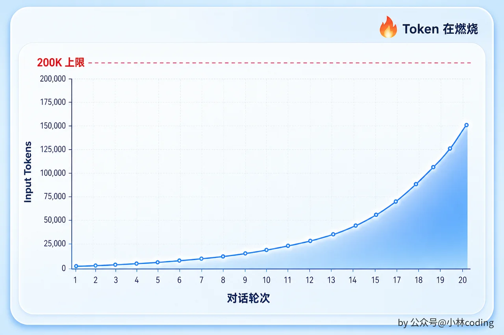

为什么？

因为 Claude API 是无状态的。每一轮请求，你都得把完整的对话历史发过去。Agent 读的每一个文件、执行的每一条命令、产生的每一段输出，全部堆在消息列表里。Token 数量随着对话轮次 **线性增长** 。

而 Claude 的上下文窗口有上限。200K tokens 听起来很多，但在 Agent 场景下真的不够用。一个 1000 行的源文件大约 15,000 tokens，读 10 个文件就是 15 万。再加上命令输出、搜索结果、AI 的回复，轻轻松松逼近 200K。一旦撞到上限，API 直接报错，Agent 就瘫了。

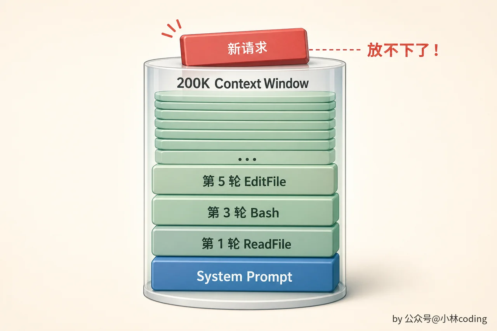

上下文管理要解决的核心问题就一个：在有限的 Token 预算内，保留最有价值的信息，丢掉可以牺牲的信息。

---

## Token 到底花在哪里了

在想解决方案之前，先搞清楚钱花在哪了。

你可能以为 Token 主要花在用户的问题和 AI 的回复上。但实际分布跟你的直觉差很远：

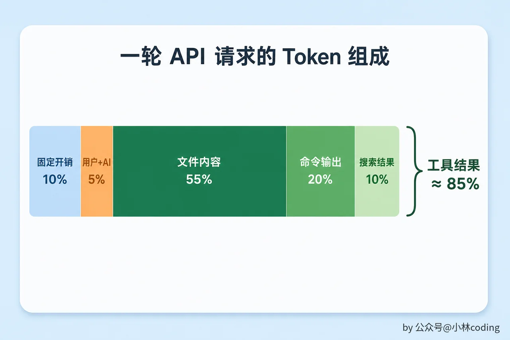

|     |     |     |
| --- | --- | --- |
| 消息类型 | 典型 Token 量 | 占比  |
| 固定开销（角色设定、环境信息、工具描述） | 5,000 - 15,000 | ~10% |
| 用户输入 | 50 - 500 | ~1% |
| AI 文字回复 | 200 - 2,000 | ~3% |
| 工具调用请求 | 50 - 200 | ~1% |
| 工具结果（文件内容） | 5,000 - 20,000 | ~55% |
| 工具结果（命令输出） | 500 - 5,000 | ~20% |
| 工具结果（搜索结果） | 500 - 3,000 | ~10% |

**工具结果是 Token 消耗的绝对大头** ，占了 85% 左右。而且很多工具结果的「保质期」很短。Agent 在第 3 轮读了 `handler.go` ，第 5 轮改了它，到第 10 轮，第 3 轮读的那个旧版本还占着 Token 预算，但内容已经过时了。

既然工具结果占比最高又最容易过时，压缩自然要从它们下手，用户的对话反而是需要着重保留的核心。

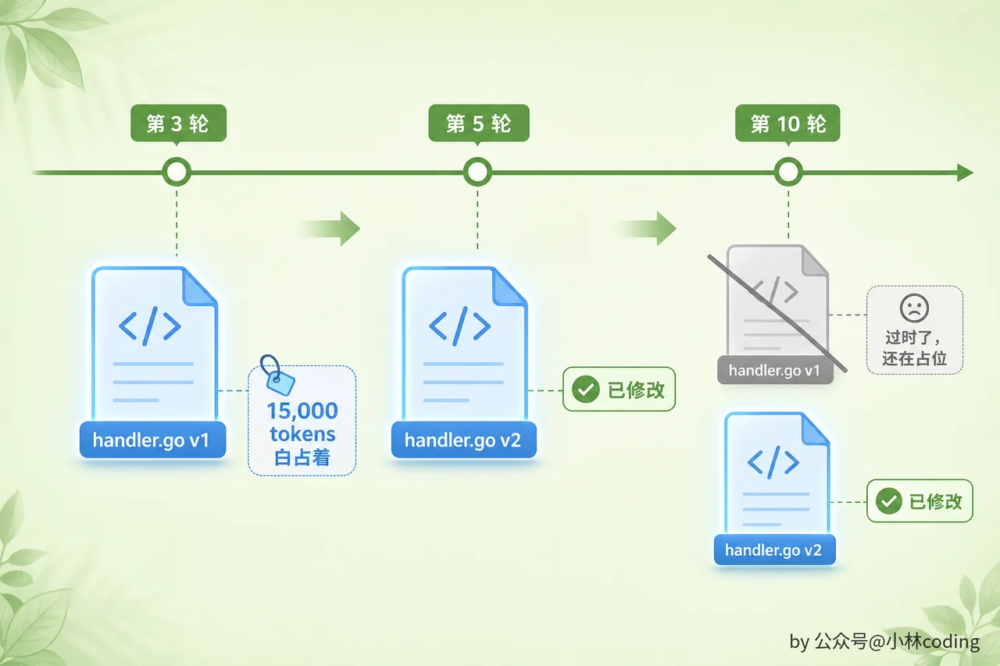

---

## 两层压缩：便宜的预防 + 贵但强的兜底

怎么解决？实际落地的策略可以归纳成 **两层** ：

|     |     |     |     |     |
| --- | --- | --- | --- | --- |
| 层级  | 手段  | 信息损失 | API 开销 | 触发条件 |
| 第 1 层 | 大结果存磁盘 | 几乎为零 | 零   | 工具结果超阈值 |
| 第 2 层 | 全量摘要（Auto-Compact） | 高   | 高（一次 API 调用） | token 数逼近窗口上限 |

第一层几乎不花钱也不丢信息，挡住的是单次工具输出过大的情况。第二层代价高但压缩效果强，是上下文快爆的时候的终极兜底。两层之间的设计哲学就四个字： **能轻则轻** 。轻量手段能扛住的，绝不动用昂贵的全量摘要。

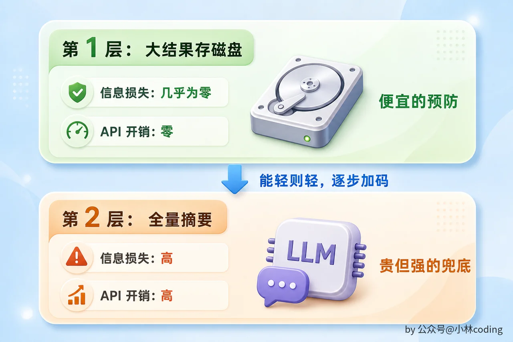

---

## 第 1 层：大结果存磁盘

这是最轻量的一层，几乎零信息损失。

### 单个工具结果超限

当一个工具的执行结果超过 50,000 个字符（大约 12,500 tokens），系统不会把完整内容塞进对话历史。而是做两件事：把完整结果 **写到磁盘上的一个文件** 里，然后在对话历史里只放一个 **预览加文件路径** 。

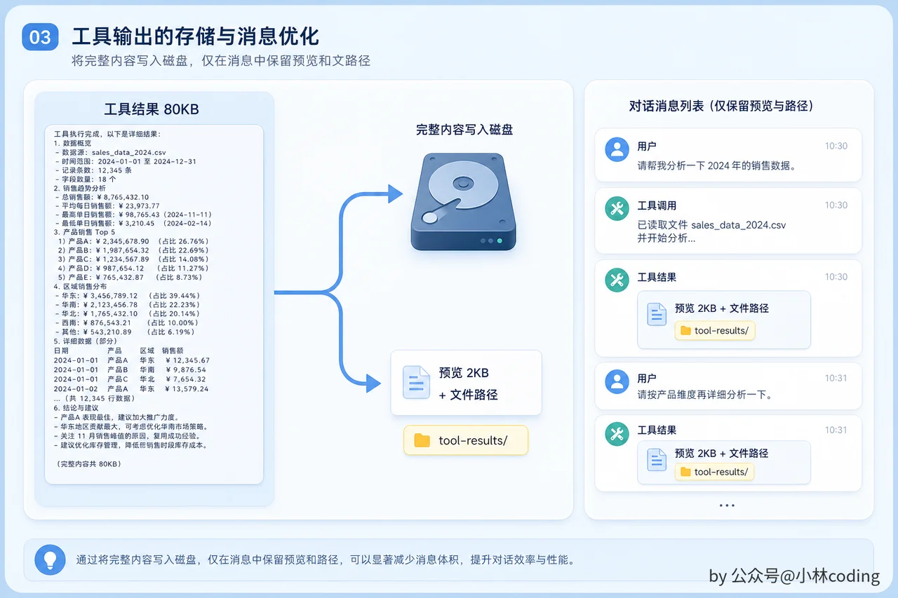

模型看到的是这样的：

```Plaintext
<persisted-output>
输出太大（80KB），完整内容已保存到：
.mewcode/session/tool-results/toolu_abc123.txt

预览（前 2KB）：
=== 测试运行结果 ===
PASS: TestUserCreate (0.02s)
PASS: TestUserUpdate (0.01s)
FAIL: TestUserDelete (0.03s)
    expected: nil, got: permission denied
...
</persisted-output>
```

为什么这一层几乎零损失？因为完整结果还在磁盘上。如果模型后面需要看完整内容，用 ReadFile 读那个文件就行。而且这一层没有任何额外 API 开销，就是一次本地文件写入。

### 每条消息的聚合限制

光管单个结果还不够。想象一下，一轮循环里 Agent 并行调了 10 个工具，每个结果都是 40K 字符，单个没超 50K 阈值，但合起来就是 400K。

所以除了单个工具的阈值，还有一个 **每条消息的聚合限制** ：200K 字符。超了就把最大的那些存盘，直到总量降到预算以内。

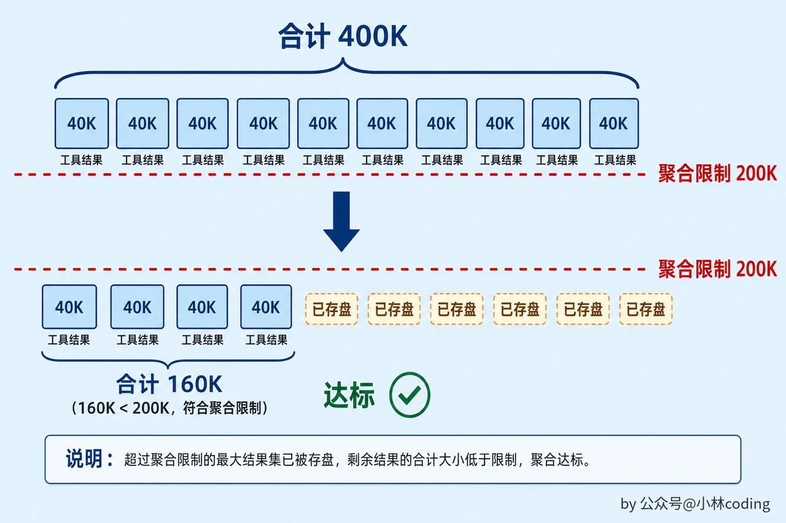

### 幂等写入

这一层还有一个细节：存磁盘的文件名用的是 `tool_use_id` ，而且用 `wx` 模式写入（文件已存在就跳过）。为什么？因为每次调 API 之前都会重新执行这一层的检查。如果每一轮都重新写一次同样的文件就太浪费了。 `tool_use_id` 是唯一的，内容也是确定的，写过一次就够了。

### Prompt Cache 与决策冻结

第1层每轮都要重新检查所有工具结果是否超限。但这里藏着一个不明显的坑。

假设第 5 轮有一个 40K 字符的工具结果，没超 50K 阈值，保留在对话历史里。到了第 15 轮，这条消息所在的聚合总量超了 200K 限制，按规则应该把这个 40K 的结果存盘替换成预览。但这一替换，对话历史的前缀就变了。

前缀一变，Anthropic 的 Prompt Cache 就失效了。Prompt Cache 的工作原理是：如果这一轮请求的消息列表前缀和上一轮完全一样（逐字节一致），API 可以跳过前缀部分的处理，只处理新增的消息。一个长会话如果 cache 持续命中，每轮只需要处理最新一两条消息的增量；如果 cache 反复失效，每轮都要重新处理几万甚至十几万 token 的前缀，延迟和成本都上去。

MewCode 采用的解决方案叫「决策冻结」，这也是 Claude Code 使用的策略。系统维护一个 `ContentReplacementState` ，记录每个 `tool_use_id` 的替换决策。规则很简单：

**一旦某个工具结果在某一轮被决定「不替换」，这个决定在整个会话内永远不变。** 即使后来按聚合限制它应该被替换，也不替换，因为替换会破坏前缀。反过来，如果决定了「替换」，那每一轮都用完全一样的预览字符串去替换，确保前缀逐字节不变。

每一轮面对工具结果时，系统把它们分成三类：

```Plaintext
已替换过的    → 用缓存的预览字符串原样重放，不重新生成
已决定不替换的 → 永远保留原文，不再评估
新产生的      → 正常评估是否需要替换，做出决策后冻结
```

#### 用一个三轮的场景走一遍

光看规则不够直观，跑一遍三轮的场景就清楚了。

**设定** ：单条消息的预算上限 20K 字符。Agent 连着跑三轮 bash，每轮产生一条 tool result： `X` 是 8K、 `Y` 是 7K、 `Z` 是 9K。每一轮都要把到目前为止的整段对话重新发给 Anthropic（API 是无状态的），所以「X 这一段该不该被替换」这种问题，每一轮发请求前都得重新问一次。

state 就两本账本：

```Plaintext
seenIds       = 之前问过的 id 集合（不管答案是替换还是不替换）
replacements  = 之前问过、且答案是「替换」的 id → 当时给出的那串 preview 字符串
```

**第一轮发请求前** ，消息里只有 `X(8K)` 。

查 X：两本账本都没它，说明是个全新的候选，本轮做决定。算账：8K ≤ 20K，没超预算，X 保留原文。记账：seenIds 加入 X。模型本轮看到 `X 原文 8K` 。

注意 X 这时候只进了 seenIds，没进 replacements。这一点第三轮会用上。

**第二轮发请求前** ，消息里有 `X(8K)` 、 `Y(7K)` 。

查 X：seenIds 命中、replacements 没有，意思是「以前问过、答案是不替换」。结论已经定了，跳过，不再评估。查 Y：两本账本都没有，新候选，本轮做决定。算账：8K + 7K = 15K，仍然没超。Y 保留原文。记账：seenIds 加入 Y。模型本轮看到 `X 原文` + `Y 原文` 。

关键是 X 这一段跟第一轮一模一样，前缀稳得住，prompt cache 命中。

**第三轮发请求前（重点）** ，消息里有 `X(8K)` 、 `Y(7K)` 、 `Z(9K)` 。

X 和 Y 都被前面冻结过，跳过判断。Z 是新候选。算账：8K + 7K + 9K = 24K，超了 4K，必须从这一轮里挑一段出来替换。

挑谁？X 不能动：它在第一轮、第二轮模型看到的都是原文，要是第三轮突然变成「\[X 已存盘…\]」，前缀就漂了，整条 cache 失效。Y 同理。剩下能挑的只有 Z，它是这一轮才第一次出现，还没被冻结过，可以做替换决定。

于是 Z 被替换：内容写盘，生成 preview 字符串「\[Z 的 9K 内容已存到 /tmp/abc/Z.txt，用 Read 读取\]」。记账两条：seenIds 加入 Z；replacements 也写一条 Z → 这串 preview。模型本轮看到 `X 原文` + `Y 原文` + `[Z 已存盘…]` 。

往后第四轮、第五轮不管再产生什么新工具结果，X、Y、Z 这三段都不会再变了。X 永远原文，Y 永远原文，Z 永远是同一串 preview。前缀逐字节稳定，cache 一路命中下去。

这个优化揭示了一个容易被忽视的设计约束： **上下文管理不仅要考虑「保留什么信息」，还要考虑「改动对话前缀的代价」** 。很多自己做 Agent 的人会天真地每轮重新评估所有工具结果，结果 prompt cache 命中率为零，每轮请求都在为重复处理前缀买单。

---

## 第 2 层：全量摘要（Auto-Compact）

当第一层不够用了，上下文仍然接近爆炸，就要动用最后的手段： **调用 LLM 自己来生成一份对话摘要** ，替换掉旧消息。

这是代价最高的一层：需要额外调一次 API，花钱，而且摘要不可能保留所有细节，信息丢失不可避免。但它也是压缩效果最强的一层，能把十几万 Token 的对话压缩到几千 Token。

### 什么时候触发

以 200K Token 的上下文窗口为例，阈值是这么算的：

```Plaintext
上下文窗口               200,000
 - 预留给摘要输出         - 20,000    摘要本身也要占空间
= 有效窗口              180,000
 - 安全余量              - 13,000    防止 Token 估算误差导致临界抖动
= 自动压缩阈值          167,000     超过这个数就触发全量摘要
```

为什么要留 13,000 的安全余量？因为自动压缩的检查点是每轮循环开始时，两次检查之间 Agent 可能读了一个大文件或执行了一条长输出的命令。这里要配合第一层一起看：单个工具结果超过 50K 字符的部分已经被存盘了，能渗进上下文的单轮增量基本都在万 token 以内，13,000 的 buffer 够应对这种波动，防止「上一轮检查时没超，这一轮一个工具结果直接撞墙」的情况。

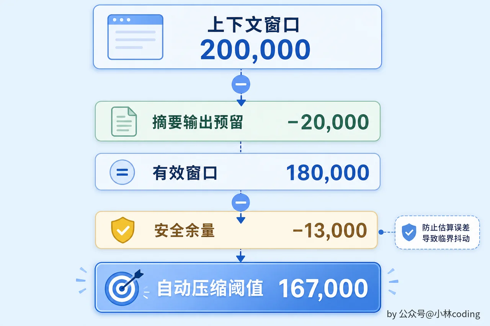

### 为什么是固定值而不是百分比

你可能会问：为什么不简单地设成「上下文用到 X% 就触发」？

因为 buffer 保护的是「单轮波动」，不是「总量」。每一轮 Agent 循环新增的 token 量是相对固定的：读一个文件 ~15K token，跑一条命令几百到几千 token。不管你的窗口是 200K 还是 1M，一次 ReadFile 都是那么大。buffer 要防的风险是「下一轮突然多了一个大工具结果」，这个风险的大小取决于单次工具结果有多大，跟总窗口无关。

如果用百分比会怎样？以「90% 触发」为例：

|     |     |     |     |
| --- | --- | --- | --- |
| 窗口大小 | 触发点 | 剩余空间 | 问题  |
| 200K | 180K | 20K | 刚好够一次大文件 |
| 1M  | 900K | **100K** | **浪费了** ，100K 的 buffer 能装 7 个大文件 |

1M 窗口下留 100K buffer，意味着白白浪费了 100K token 的空间。你付了 1M 的钱，却只用了 900K。

反过来如果把百分比设高一点，比如 98%：

|     |     |     |     |
| --- | --- | --- | --- |
| 窗口大小 | 触发点 | 剩余空间 | 问题  |
| 200K | 196K | **4K** | **太危险了** ，一次普通文件读取就撞墙 |
| 1M  | 980K | 20K | 刚好  |

**不存在一个百分比能同时适配所有窗口大小。** 而固定值没有这个问题：33K 的 buffer（20K + 13K）在任何窗口大小下都恰好够「挡住一到两次大工具调用」。

用同一套公式算 1M 窗口的阈值：

```Plaintext
上下文窗口             1,000,000
 - 预留给摘要输出       -  20,000
= 有效窗口              980,000
 - 安全余量             -  13,000
= 自动压缩阈值          967,000
```

1M 窗口下 Agent 可以用到 967K 才触发压缩，充分利用了大窗口的容量。而 buffer 仍然是 33K，刚好够应对单轮波动。

### 为什么预留 20K 给摘要输出

这个 20,000 是被两个约束从两头夹出来的。

下限来自摘要本身的需求。摘要有 9 个结构化部分（后面会详细讲），加上 `<analysis>` 草稿块，一次复杂会话的摘要输出大约 15,000 到 18,000 tokens。设成 15K 就有被截断的风险，20K 刚好够用。

上限来自有效窗口的压力。预留越大，有效窗口越小，压缩就触发得越频繁。如果预留 50K，有效窗口缩到 150K，自动压缩在 137K 就触发了。但摘要根本用不了 50K，模型不会因为你给了更多输出空间就写更长的摘要，摘要长度取决于对话的复杂度。多出来的 30K 预留纯粹是浪费。

### 为什么安全余量是 13K 而不是更大

同样的逻辑。13K 约等于一个大源文件的 token 量，恰好够防止两次检查之间一个意外偏大的工具结果把上下文撑爆。

手动 `/compact` 的安全余量只有 3K，比自动的 13K 小得多。原因也很简单：用户主动触发意味着他知道自己在做什么，Agent 不需要那么大的反应空间来「预防意外」。

这三个数（20K、13K、3K）都有一个共同特点： **它们由单轮操作的特征决定，不由窗口总量决定。** 摘要输出的大小跟窗口无关，单次工具结果的大小跟窗口无关，用户手动触发时的风险跟窗口无关。所以它们是固定值。

### 摘要 Prompt 的设计

摘要质量直接决定了压缩后 Agent 的表现。一个好的摘要 Prompt 要求 LLM 生成一份 **结构化摘要** ，明确指定 9 个部分：

```Plaintext
1. 主要请求和意图        用户到底想做什么
2. 关键技术概念          讨论过的重要技术点
3. 文件和代码段          涉及哪些文件，关键代码片段要保留
4. 错误和修复            遇到了什么错，怎么解决的
5. 问题解决过程          解决问题的思路和方法
6. 所有用户消息          用户说过的所有非工具结果的话（原文保留！）
7. 待办任务              还没完成的事
8. 当前工作              最近在做什么（要最详细）
9. 可能的下一步          接下来打算做什么
```

注意第 6 条： **用户说过的话尽量原文保留** 。为什么不能摘要改写？因为用户的原始表述包含意图、偏好、语气。如果用户说「不要用 interface{}，用 any」，你把它摘要成「用户偏好现代语法」，模型下次可能给出 `type any = interface{}` 这种不是用户想要的东西。

原文才能准确传达意图。当然，如果对话很长、用户消息很多，LLM 不可能在有限的摘要空间里塞进所有原文。这更多是一个 **优先级指引** ：告诉 LLM 用户消息优先保留原文而不是随意改写，空间不够时自然会取舍。

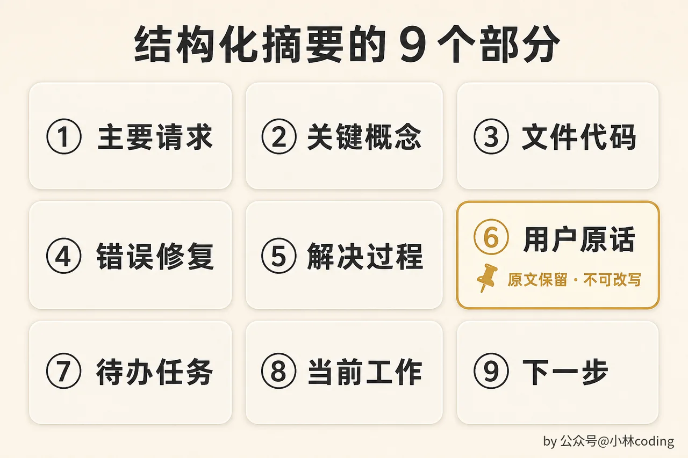

### 两阶段生成：先打草稿再写正文

还有一个很聪明的设计：Prompt 要求 LLM 先产出一个 `<analysis>` 草稿块来梳理思路，然后产出正式的 `<summary>` 块。最终 **只保留 summary，analysis 被丢弃** 。

为什么要「先打草稿再写正文」？因为实验发现这能显著提升摘要质量。分析阶段让 LLM 先把对话中发生了什么梳理一遍，然后在此基础上写摘要会更全面、更准确。但 analysis 本身作为中间产物没有保留价值，占了空间反而浪费，所以生成完就扔掉。

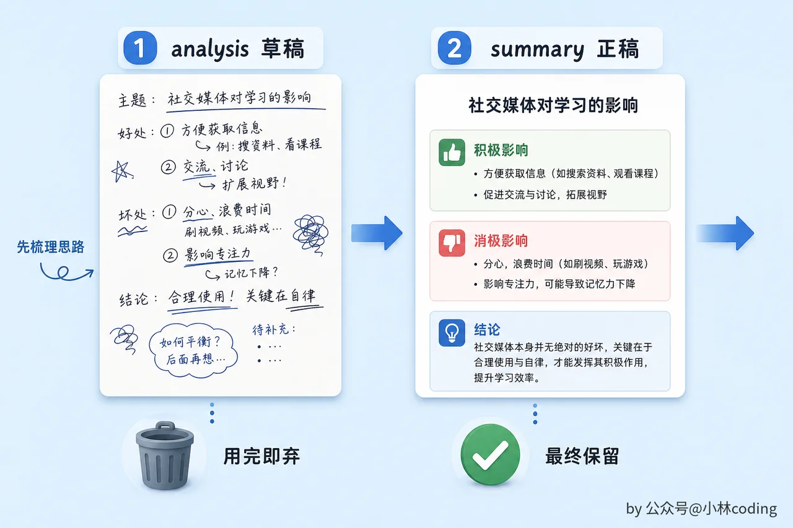

### 禁止工具调用

Prompt 还需要一段强硬的开头，明确禁止模型调用任何工具、只输出纯文本。为什么需要这条禁令？因为摘要 API 调用复用了原对话的消息上下文，工具定义会随消息一起传入这次调用，模型仍然「看得到」可用工具。如果不明确禁止，LLM 可能「好心」地试图调一个工具来帮你，结果浪费了这次调用。

还有一种更彻底的做法：调摘要 API 时直接不传 `tools` 参数，模型完全看不到工具定义，自然不会调。MewCode 走的就是这条路。Claude Code 则保留 `tools` （少一次重新组织 messages 的开销），靠 prompt 把模型「拦」在文本输出。两种思路都对，看实现取舍。

实践中，这段禁令往往出现两次：开头一次，结尾再强调一次。开头说「你只能输出纯文本」，结尾说「提醒：不要调任何工具，工具调用会被拒绝，你会失败」。两头堵，防止模型在长上下文中「忘记」开头的指令。

### 压缩后恢复

摘要替换了旧消息，但不能什么都不管。有些关键上下文需要 **重新附加** ：

-   **最近访问的文件** ：最多恢复 5 个，每个最多 5,000 Token。Agent 压缩后仍然「记得」最近读过的文件

-   **技能定义** ：如果之前使用过 Skill，重新注入定义，总预算 25,000 Token

-   **工具列表** ：重新声明所有可用工具，确保摘要后的首次请求仍携带完整工具定义

-   **压缩边界消息** ：一条特殊消息，告诉模型「这里之前是摘要，如果需要文件的具体内容请重新用 ReadFile 读取，不要靠摘要猜测」

压缩后的消息列表看起来像这样：

```Plaintext
[system]    你是一个编程助手...
[user]      [摘要] 用户要求重构 auth 模块。读取了 handler.go、
            middleware.go、router.go，修复了第 42 行错误处理 bug，
            测试全部通过。待办：还需要更新 API 文档...
[assistant] [边界消息] 上面是之前对话的摘要。如果需要文件的具体内容，
            请用 ReadFile 重新读取，不要根据摘要猜测代码细节。
[user]      [恢复文件] handler.go 的当前内容：...（最多 5,000 Token）
[user]      [恢复文件] middleware.go 的当前内容：...
[user]      好，接下来帮我更新 API 文档     ← 最近 5 条消息完整保留
[assistant] 我来看一下当前的文档结构...
...
```

这里的边界消息非常重要。它防止模型「编造」摘要里没有提到的细节。没有这条提示，模型可能根据摘要里「修复了 handler.go」这种模糊描述，脑补出一段不存在的代码。

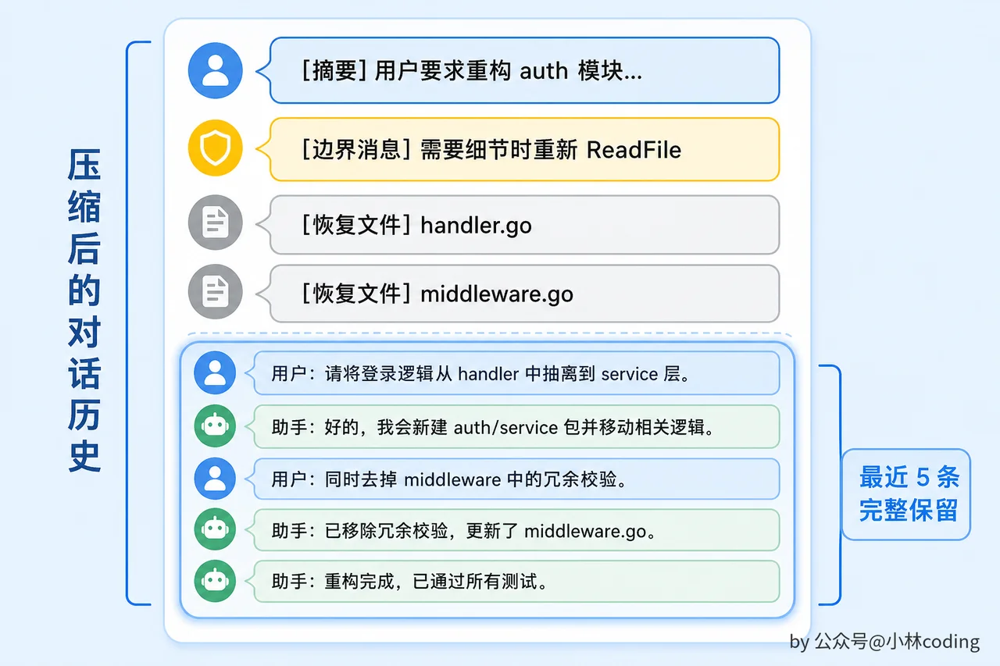

### 熔断机制

如果全量摘要因为网络问题、API 错误或 prompt-too-long 等原因连续失败 3 次，系统 **停止自动触发** 。

为什么？想象一下：上下文已经超限了，每一轮都触发摘要，每一轮都失败，然后每一轮又重试...Agent 被卡在死循环里。熔断打破这个循环：3 次失败后认输，让用户手动处理。


还有一种极端情况： **摘要请求本身太大了** 。要摘要的内容太多，超出了 API 限制。可以用这样一套重试逻辑来应对：

```Plaintext
如果摘要请求报 Prompt Too Long：
  1. 把消息按 API 轮次分组
  2. 丢弃最旧的几组
  3. 用剩余消息重试
  4. 最多重试 3 次
  5. 还不行就丢掉 20% 的消息组再试
```

### 紧急压缩：撞墙后的自救

前面讲的熔断和 PTL 重试都是「压缩请求自身出问题」的情况。但还有一条路径需要处理： **正常的对话请求** 发出去后，API 返回 `prompt_too_long` 错误。

这说明自动压缩的阈值没挡住。可能是 token 估算偏差太大，也可能是某一轮工具结果异常巨大，两次检查之间直接跳过了阈值。不管什么原因，结果就是上下文已经超了 API 的硬限制，请求被拒绝了。

如果没有任何处理，Agent 就直接报错停工了。用户只能手动 `/compact` 然后重试，体验很差。

MewCode 的做法是在 Agent Loop 里捕获这个错误，立刻触发一次 `ForceCompact` ，压缩完成后用新的消息列表 **重试原来的请求** 。相当于「撞墙了，赶紧压缩，然后再试一次」。如果压缩后仍然超限，就按正常错误流程处理，不再无限重试。

这是 Agent 的最后一道自救机制。它和自动压缩的关系是：自动压缩是预防，紧急压缩是治疗。大部分情况下自动压缩能在撞墙前拦住，但如果因为估算误差或极端情况漏过去了，紧急压缩兜底，让 Agent 不至于因为一次估算偏差就彻底瘫痪。

---

## 手动 /compact

除了自动压缩，用户随时可以输入 `/compact` 手动触发。两个典型场景：

**预防性压缩** ：你知道接下来要读一大堆文件，提前压缩腾出空间。

**话题切换** ：前面的对话在调 bug A，现在要处理 bug B。手动压缩清理掉 bug A 的细节，减少噪声。

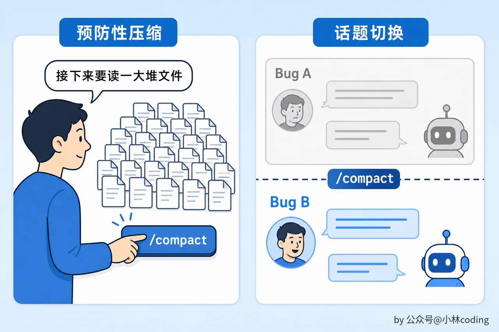

手动压缩的安全余量只有 3,000，比自动的 13,000 小得多，因为用户主动触发意味着他知道自己在做什么。

---

## 两层的协作关系

最后整理一下两层之间的关系。

每次调 API 之前， `applyToolResultBudget` 先执行，检查新产生的工具结果有没有超限。它解决的是「单次工具输出太大」的问题，是一个 **预防性** 措施。

紧接着 `autoCompact` 执行，检查整体上下文有没有逼近窗口上限。它解决的是「对话累积过长」的问题，是一个 **治疗性** 措施。

两层解决的是不同维度的问题。第 1 层管的是单条消息的大小，防止一次超大工具输出直接把上下文撑爆。第 2 层管的是对话历史的累积长度，防止几十轮对话下来 Token 总量超限。

一个常见的运行场景：Agent 连续读了 20 个小文件，每个都没超 50K 阈值，第 1 层什么都没做。但累积下来总 Token 数逼近 167K，第 2 层触发全量摘要，把 20 轮对话压缩成一份几千 Token 的结构化摘要。

另一个场景：Agent 执行了一条命令，输出了 80K 字符的日志。第 1 层把它存盘，只留 2K 预览。上下文总量远没到阈值，第 2 层不触发。

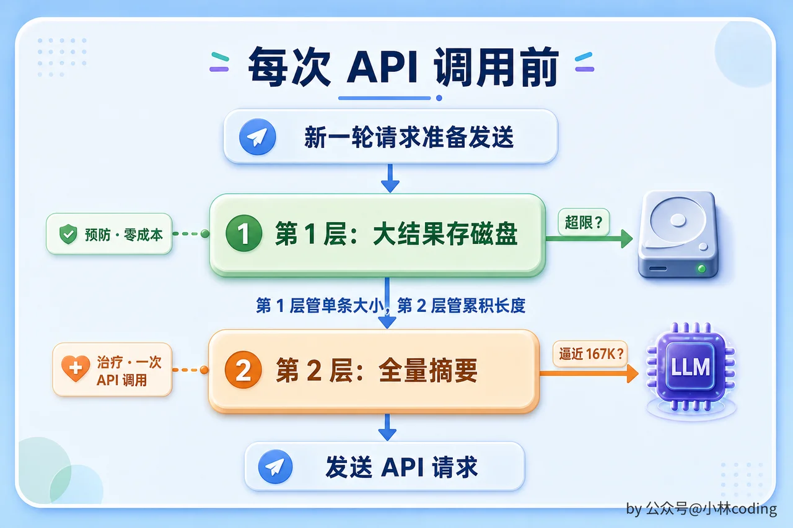

---

## 本章小结

上下文管理是 Agent 从「短任务玩具」变成「长时间工作伙伴」的关键。没有它，Agent 跑几轮就撞墙。

两层压缩体现了一个简洁但有效的设计哲学： **能轻则轻** 。大结果存磁盘几乎零损失零成本，只有当对话累积到临界点时才动用全量摘要这个昂贵但强力的手段。

有意思的是，早期的 Coding Agent 产品在上下文管理上做了很多层，比如裁剪旧消息、清理过期工具输出、读时投影压缩，层层叠叠。但随着模型上下文窗口越来越大、智能度越来越高，趋势反而是层数越来越少。很多精细的中间层被证明收益不大，最终留下来的就是这两层最简洁的策略。对于我们自己做 Agent 来说，先用存盘挡住大结果，再用全量摘要兜底长对话，就足够了。