# 实战演练：记忆系统

# 第9章：实战篇

## 本章需要做什么？

上一章我们给 MewCode 加了上下文管理，Agent 在一个会话里工作几个小时也不会撞墙了。但关掉终端、开个新会话，一切归零。昨天花两小时讨论的项目架构、你强调了三次的编码偏好，全部忘得干干净净。

这一章要给 MewCode 装上跨会话记忆系统。做完之后，Agent 每次开新会话都能自动恢复项目知识和用户偏好，从「每次失忆」变成「越用越懂你」。

具体要新增这些东西：

-   **指令文件加载器** ：按优先级发现和加载 MEWCODE.md，支持 @include 模块化引入，注入 messages 上下文

-   **会话持久化** ：JSONL 格式的会话存档与恢复，崩溃安全，消息链完整性验证

-   **自动记忆** ：Agent 在对话结束后自动提取值得记住的信息，写入 memories.md，下次会话自动加载

-   **UI 命令** ：/session 管理会话，/memory 管理记忆

这章 **不做** ：向量数据库、RAG 检索。

---

## Vibe Coding 实战

### 生成三份文档

把任务换成本章的内容：

```Markdown
# 我的初步想法
- 项目指令文件：在项目根目录放一份手写的 Markdown，记录技术栈、编码规范、注意事项，新会话启动时自动读取并作为独立消息注入对话开头
- 指令文件支持多层优先级（项目级 > 用户级），高优先级排在前面让 LLM 优先遵循；支持 `@include` 模块化引用其他文件，但要限制嵌套深度、拦截跳出项目目录的路径
- 会话存档用 JSONL 追加写入：追加 O(1)、崩溃只丢最后一行不完整数据、恢复时坏行可跳过；每个会话另存一份小的 meta 文件存 ID/标题/摘要/消息数等概要，方便会话列表展示时不用扫整个 JSONL
- 会话恢复要处理几类异常：解析失败的行跳过继续、`tool_use` 没配上 `tool_result` 时截断到最后完整位置、token 超限先触发一次压缩、距上次活跃超过一定时长时插入时间跨度提醒
- 自动笔记：每隔几轮对话或应用退出时异步调一次 LLM，让它读当前笔记和最近对话，按固定几类（用户偏好、纠正反馈、项目知识、参考资料）更新笔记文件；去重交给 LLM 判断，不自己实现相似度算法
- 用户级和项目级笔记分开存储（用户偏好/纠正反馈进用户级目录，项目知识/参考资料进项目级目录），提供命令让用户查看、清空、定位编辑笔记和会话
```

然后 AI 会开始问你问题，进行需求澄清。

你根据理论篇学到的内容回答这些问题，一直这样反复循环对齐需求，最后就能生成三份文档了。

### 正式开发

三份文档有了之后，就相当于施工图纸已经定好了，然后让 Claude Code 根据这三份文档进行开发


经过一段时间后，开发完成。

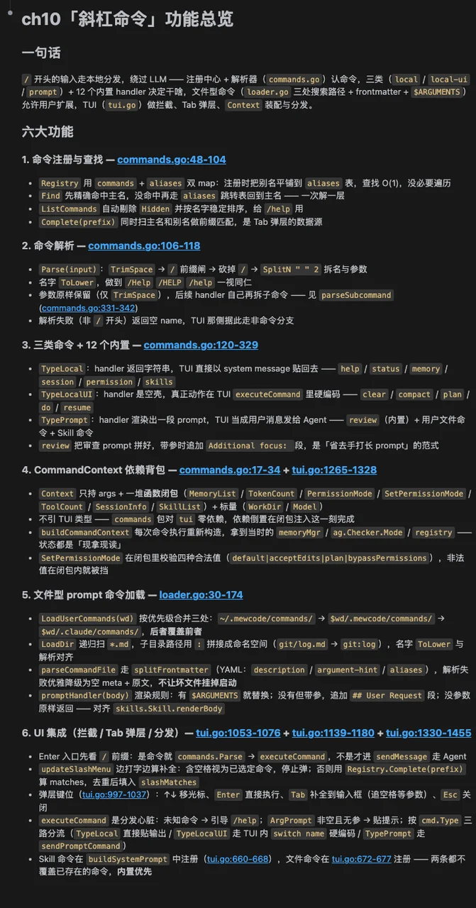

### 功能验证过程

来验收一下结果：

先在项目根目录创建一个 `MEWCODE.md` ，随便写点项目信息：

> cat > MEWCODE.md << 'EOF' # MewCode 项目 ## 技术栈 - Go ## 代码规范 - commit message 用英文 - 变量命名用 snake\_case EOF

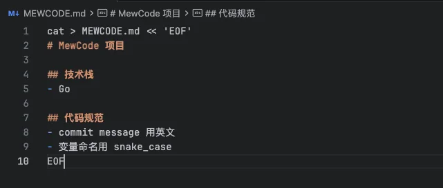

然后启动MewCode，先来验证下项目指令加载，进入后问 Agent：

> **这个项目用的什么技术栈**

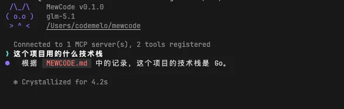

可以看到，Agent 根本没读代码，就能根据项目指令回答，这块没问题

然后看看记忆文档的提取，我们先显式让MewCode进行记忆，我们输入

> 记住我是 Go 工程师，具备深入 Go 语言专业知识

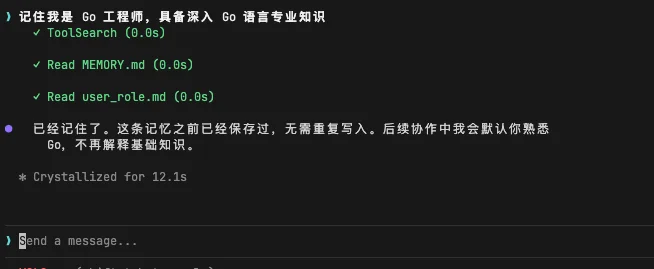

这时MewCode会将此条记忆，记忆到MEMORY.md，同时由于这个还属于用户角色，所以还记录到了user\_role.md里面，我们可以在.mewcode/memory/MEMORY.md和.mewcode/memory/user\_role.md看到内容

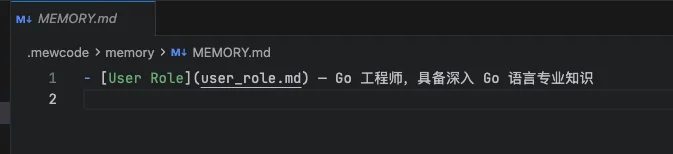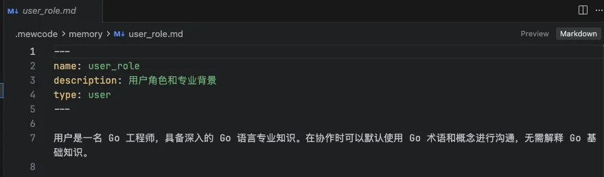

除了我们显式让MewCode记忆，还有自动记忆的场景，比如每五轮或者LLM觉得值得记忆的话会进行一次提取，我们可以在刚刚的对话里，输入

> 我是一名27届的计算机毕业生，打算学习最新的AI AGent开发，你觉得能给我啥建议吗

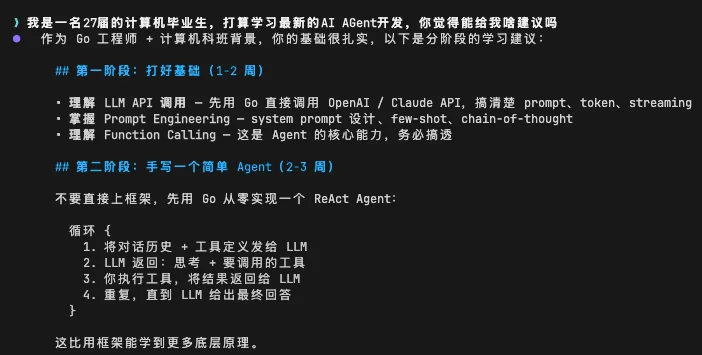

然后就能看到，我们的记忆文件是有进行更新的

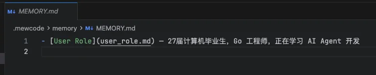

同时还有用户级别的，也进行了更详细的补充

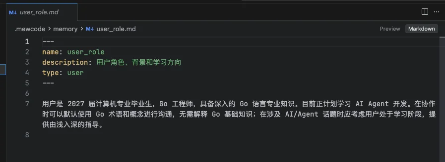

同时这个是长期跨会话的记忆，我们新开一个终端后，Agent对我们的记忆也会保存，可以看到，会记得我们是谁

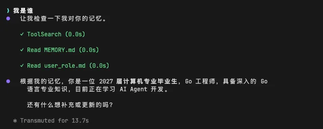

同时我们还可以比如说我们想看看直接在ui终端里看看Agent对我们的记忆，输入

> /memory

在会话中就会展示Agent对我们的记忆，包括用户画像等等

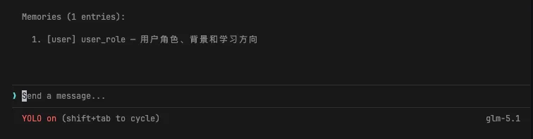

接下来看看我们的会话管理，我们可以看到我们的会话的jsonl文件和meta文件都记录好了，分别是我们的全量聊天记录，以及我们的会话元信息，包括摘要、标题、会话id等等

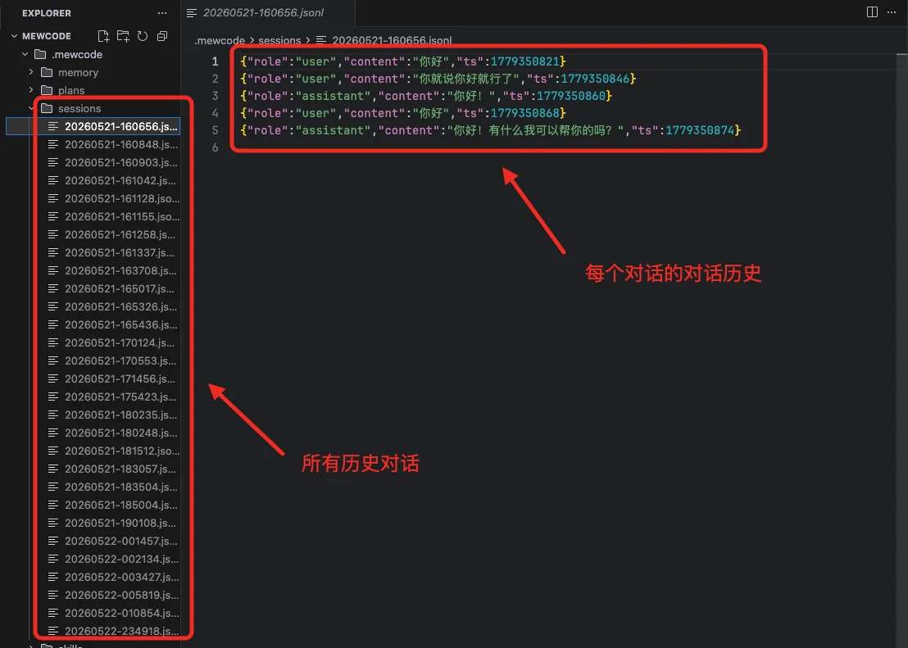

这些在我们的ui终端也能通过命令去查看会话列表，还有回溯到某个会话中

比如输入

> /resume

会展示会话列表，我们一个个选就可以进入对应的历史对话

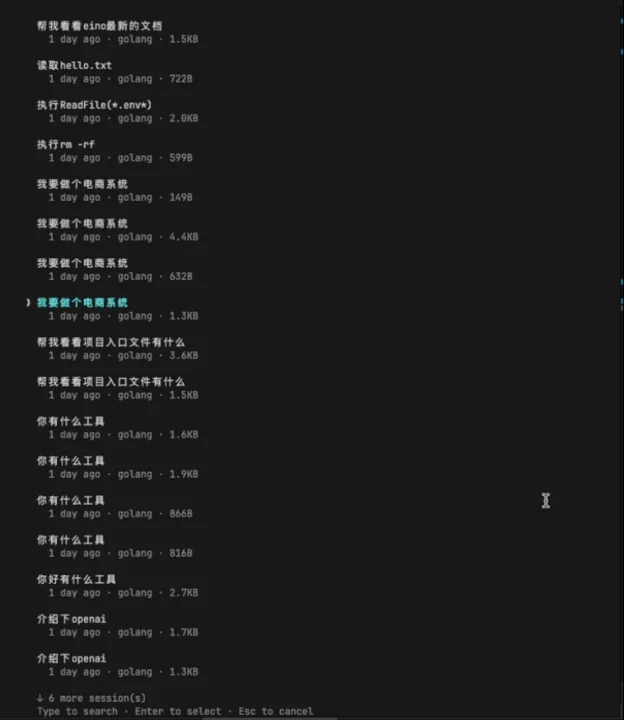

然后就能成功回溯，并且加载出来历史聊天记录

验收没问题，那么本章的主要任务就完成了。现在你估计已经发现，我们现在都十多个命令了，MewCode的命令可以说是越来越多，必须要进行管理，因此下一章，我们必须要给MewCode弄个命令管理框架。

---

## 参考提示词和代码

如果你在澄清需求的过程中遇到困难，或者生成的三份文件效果不理想，可以直接使用下面的参考版本。

把下面三个文件保存到项目根目录，然后告诉你的 AI 编程助手：

> 提示词如果需要复制，移步到这里： [💡 提示词复制](https://my.feishu.cn/wiki/JM5Kw5TIGiIehqks1BYcYdpLnzd?fromScene=spaceOverview)