# 记忆系统

---

## 每次开新会话都像失忆了一样

MewCode 有了上下文管理之后，可以在一个会话中持续工作好几个小时而不撞墙。但你试着用了几天之后，会发现一个越来越让人抓狂的问题。

昨天下午你花了两个小时跟 Agent 讨论项目架构，它对你的代码了如指掌：知道 handler 放在哪个目录，知道数据库用的是 PostgreSQL 15，知道你们团队的 commit message 必须用英文。一切配合得很默契。

今天早上你打开终端，输入「帮我在 handler 里加个接口」。

Agent 回了一句：「handler 在哪个目录？这个项目是做什么的？」

你深呼一口气，又开始把 README 喂给它，又开始解释项目结构。

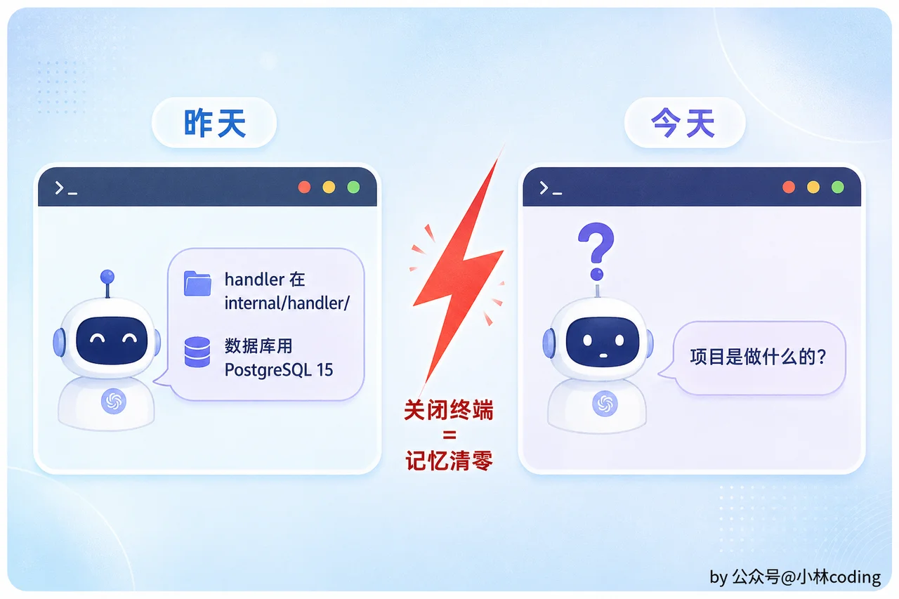

跨会话失忆

更烦的是那些个人偏好。你已经说过三次「我不喜欢用 `interface{}` ，请用 `any` 」。每个新会话，Agent 还是会写 `interface{}` 。你已经强调过「commit message 用英文」，新会话里 Agent 又开始写中文 commit message。

人类同事不会这样。你跟同事说过一次「我们团队的命名规范是驼峰式」，他就记住了，不需要每天早上重复一遍。

问题出在哪？上一章的上下文管理解决的是「会话内」的记忆管理：在一个对话窗口里，如何在有限的 token 空间里保留最有价值的信息。但一旦关闭终端、开启新会话，一切归零。对话历史没了，Agent 的「记忆」彻底清空。

这一章要解决的就是「跨会话」的记忆问题：如何让 Agent 在新会话开始时，快速回到「了解你和你的项目」的状态。

---

## 记忆是分层的

在设计记忆系统之前，我们先想想人类的记忆是怎么工作的。

你现在正在读这段文字，你的大脑里同时「记着」两层东西。表层是你此刻正在处理的内容：这段话的意思、上一段讲了什么。这是 **工作记忆** ，容量极小，访问速度极快，用完就丢。

深层是经过反复巩固的长期知识。你的编程语言偏好、你们团队的开发规范、项目的整体架构、昨天跟同事讨论的方案。这些信息被持久地存储在大脑中，需要时可以调取出来。这是 **长期记忆** 。

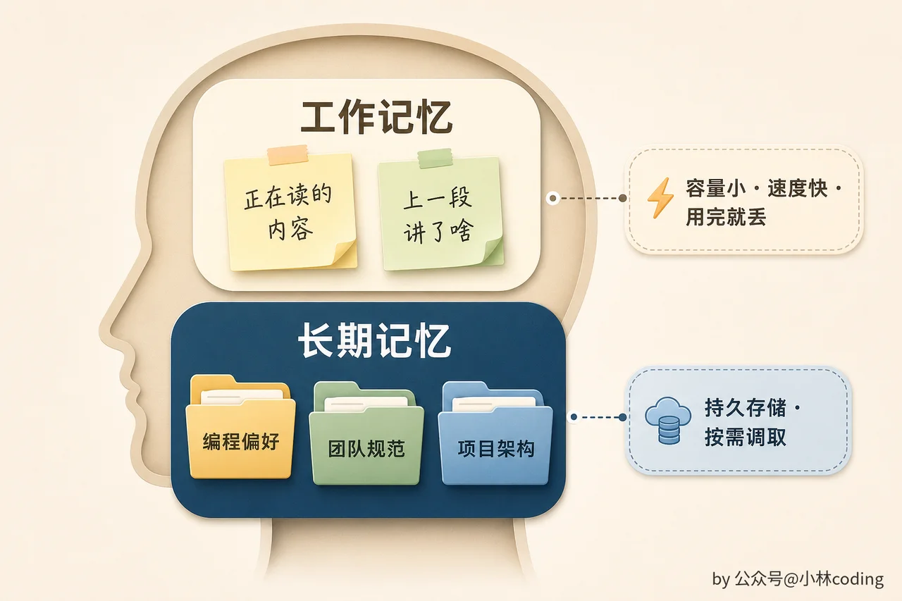

工作记忆与长期记忆

MewCode 的记忆系统正好对应这两层。

**工作记忆** ，就是上一章讲的上下文窗口。那个 200K token 的空间就是 Agent 的「大脑带宽」，当前正在处理的所有信息都在这里，容量有限，需要压缩管理。

**长期记忆** ，对应的是所有持久化到磁盘上的信息。这又分为三种形态：

-   **会话持久化** ：你跟 Agent 的每次对话都保存下来，下次可以恢复。就像你第二天早上打开电脑，看到昨天的聊天记录，上下文立刻回来了。

-   **项目指令文件** ：预先写好的项目知识和编码规范，相当于员工的「入职文档」。

-   **自动记忆** ：Agent 在对话中自动积累的经验，比如你的编码偏好、项目的技术细节。

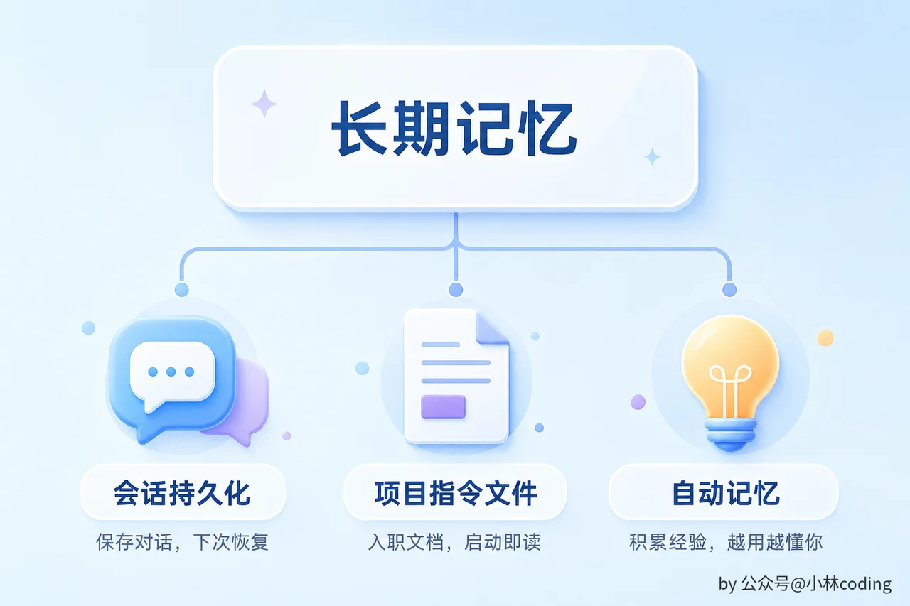

长期记忆三种来源

---

## 项目指令文件：Agent 的入职文档

新员工入职第一天，你不会让他自己去翻代码猜这个项目是干嘛的。你会给他一份文档：技术栈是什么、代码规范是什么、常见的坑有哪些、部署流程是什么样的。他读完这份文档，就能快速进入状态。

项目指令文件就是给 Agent 准备的入职文档。它是一个叫 `MEWCODE.md` 的 Markdown 文件，放在项目根目录下。MewCode 每次启动新会话时，会自动读取这个文件，把内容作为上下文注入到发给 API 的 messages 中。Agent 在第一轮对话开始之前，就已经「读完了入职文档」。


Agent 阅读 MEWCODE.md

一个典型的 MEWCODE.md 长这样：

```Markdown
# 项目：电商后台 API

## 技术栈
- Go 1.22 + Gin + GORM
- PostgreSQL 15

## 代码规范
- 使用 any 代替 interface{}
- 错误处理用 fmt.Errorf("xxx: %w", err) 包装
- commit message 用英文，格式：type(scope): description

## 注意事项
- 不要直接修改 internal/generated/ 目录，那是自动生成的代码
- 运行测试前需要先启动 PostgreSQL
```

有了这个文件，你再也不用每次新会话都重复介绍项目背景了。Agent 一上来就知道你的技术栈，知道错误处理要怎么写，知道哪些目录不能碰。

你可能会说：这不就是一个 README 吗？有点像，但有本质区别。README 是写给人看的，而 MEWCODE.md 是写给 Agent 看的。你不需要在里面写如何安装、如何运行这些人类开发者需要但 Agent 不关心的内容。你写的是 Agent 在编码过程中需要遵守的规则和需要知道的上下文。

### 优先级栈：项目级覆盖用户级

MEWCODE.md 不只存在于项目根目录。MewCode 支持多个层级的指令文件：

```Plaintext
1. 项目根目录/MEWCODE.md          <- 项目级（最高优先级）
2. 项目根目录/.mewcode/MEWCODE.md <- 项目级（可被 .gitignore 忽略）
3. ~/.mewcode/MEWCODE.md           <- 用户级（个人偏好）
```

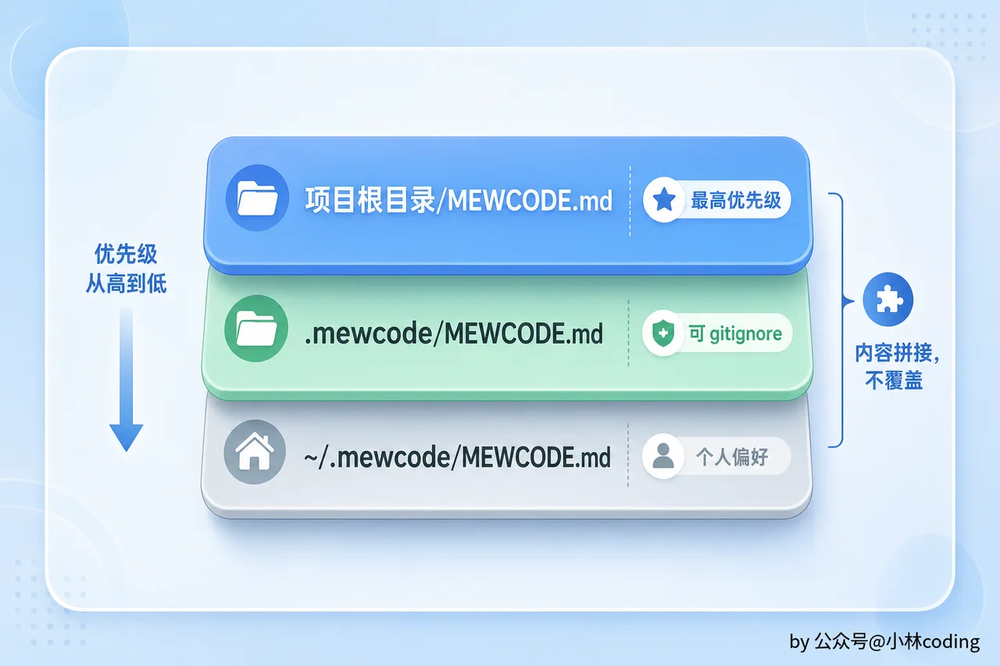

指令文件优先级栈

多个文件的内容会被拼接在一起，后加载的不会覆盖前面的，而是用分隔线连接。高优先级的内容排在前面。因为 LLM 对 prompt 前面的内容通常更为重视，排在前面意味着在有冲突时优先被遵循。

这个设计的好处是什么？你可以把个人偏好写在用户级文件里，比如「我偏好函数式风格」「回复用中文」。这些偏好在你参与的所有项目中都生效。然后在某个具体项目的项目级文件里写「这个项目用 OOP 风格」「commit message 用英文」。项目级的内容排在前面，当项目需求和个人偏好冲突时，项目说了算。

这跟 Git 的 `.gitconfig` 思路类似——都是分层管理、项目级排在用户级前面。但具体机制不一样： `.gitconfig` 是按 key 值覆盖（项目级的 `user.name` 直接替换用户级的同名 key），MEWCODE.md 是拼接排序（多个层级的内容全部保留，靠先后位置让 LLM 优先关注高优先级的部分）。理解到这一层就够了：层级和顺序的设计意图相同，但 LLM 不像 Git 那样"严格替换"，所以底下是拼接而不是覆盖。

为什么有两个项目级的位置？因为有些团队希望 Agent 的指令文件提交到 Git，让所有团队成员共享同一份 Agent 指令，那就放在项目根目录。而有些开发者的 Agent 指令包含个人特定的内容，比如本地的数据库密码，不想提交到 Git，就放在 `.mewcode/` 目录下，然后把这个目录加到 `.gitignore` 。

加载流程很直观：MewCode 启动时，按优先级顺序依次检查每个路径，文件存在就读取，不存在就跳过。所有找到的文件内容用 `---` 分隔线拼接成一段完整的指令文本，最终通过 system-reminder 注入到 messages 中。Agent 在处理用户的实际请求之前，就已经「读完了入职文档」。

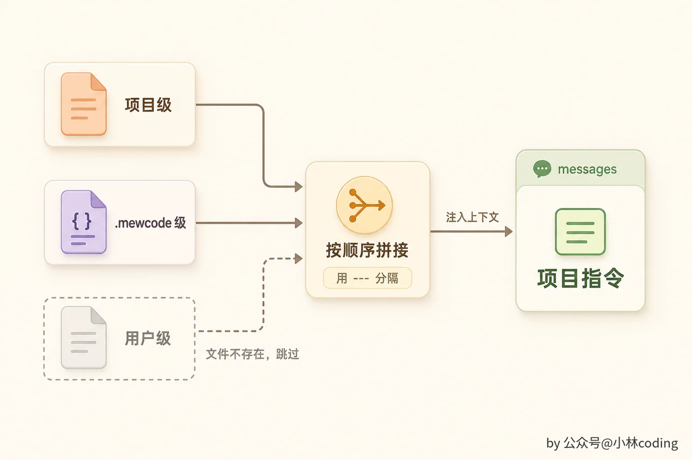

指令加载管线

### @include：大型项目的模块化指令

当项目变大之后，把所有指令塞在一个 MEWCODE.md 里会变得很臃肿。比如一个微服务项目，每个服务的编码规范可能不一样，API 网关模块和支付模块的注意事项也完全不同。

`@include` 指令解决这个问题。你可以在 MEWCODE.md 中引用其他文件的内容：

```Markdown
# 项目说明

@include ./docs/architecture.md
@include ./docs/coding-style.md
@include ./internal/handler/README.md
```

MewCode 在加载 MEWCODE.md 时，会把 `@include` 行替换为被引用文件的完整内容。这样你可以把不同模块的说明分散到各自的目录下，MEWCODE.md 只做一个「汇总入口」。

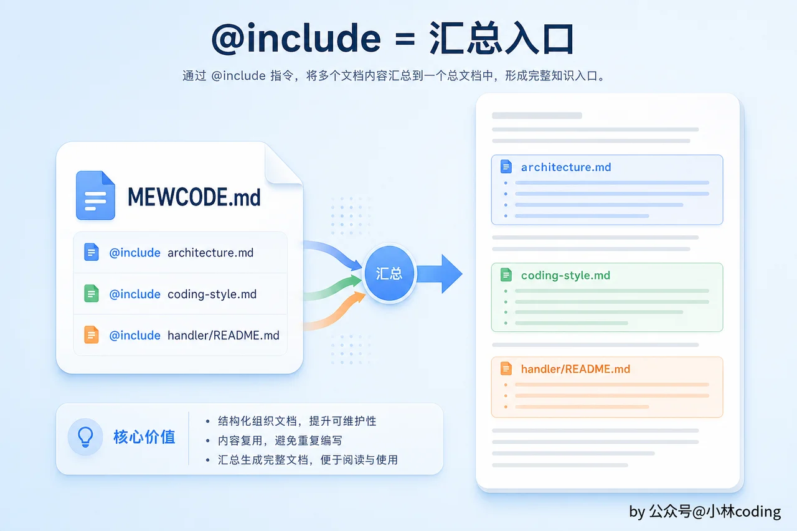

include 汇总入口

处理 `@include` 的核心逻辑是逐行扫描内容，遇到 `@include` 行就解析路径、读取文件、替换原行。如果被引用的文件里还有 `@include` ，递归处理：

```Plaintext
function ProcessIncludes(content, baseDir, depth):
    for each line in content.split("\n"):
        if line.startsWith("@include "):
            path = joinPath(baseDir, line.removePrefix("@include "))
            included = readFile(path)
            processed = ProcessIncludes(included, directoryOf(path), depth + 1)
            result.append(processed)
        else:
            result.append(line)
    return join(result, "\n")
```

但递归引入了两个安全风险。

第一个是无限递归。A 文件 include B，B 又 include A，就会死循环。所以用 `depth` 参数限制嵌套深度，最多 5 层，超过就停止：

```Plaintext
if depth >= 5:
    return content
```

但只看 depth 还不够——它能拦住"递归太深"，却拦不住"反复展开同一个文件"。比如 A include B、B include A，在 depth 用尽之前，A 和 B 已经各自被展开了好几次。所以实际还要维护一个 `visited` 集合，记下已经处理过的绝对路径，遇到重复路径直接跳过。两层防护互补： `visited` 防环路（精确去重）， `depth` 防深度（兜底）。

第二个是路径越界。如果有人在 `@include` 里写了 `../../etc/passwd` ，那就不是在加载项目说明了，是在读系统文件。所以 `@include` 路径必须在项目目录内，越界的直接拦截：

```Plaintext
if not isWithinProject(absPath):
    result.append("<!-- @include blocked: path outside project -->")
    continue
```

文件不存在时也不报错，只是插入一条 HTML 注释标记，然后继续处理后面的内容。

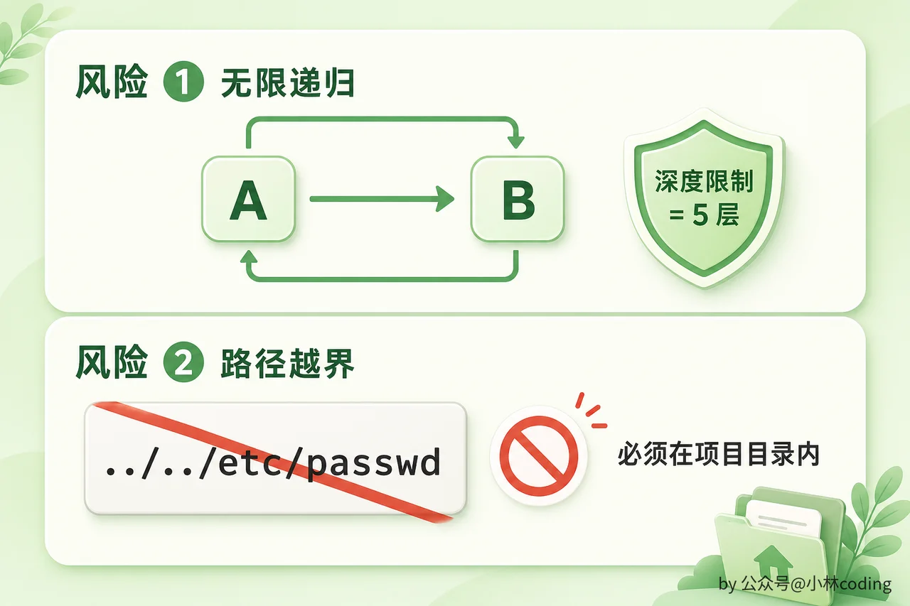

include 安全保护

---

## 会话持久化：让对话可以「存档读档」

项目指令文件解决了预先写好的项目知识。但还有一类长期记忆是动态产生的：你跟 Agent 的每次对话、每个操作、每个决策，需要在会话结束后持久化保存，以便后续恢复。

MewCode 的会话持久化使用 JSONL（JSON Lines）格式：每行一个 JSON 对象，代表一条消息。

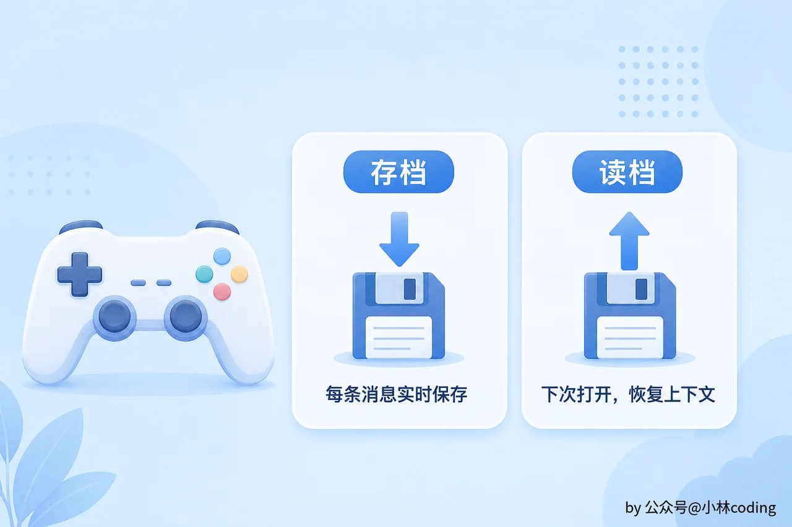

会话存档与读档

你可能会问：为什么是 JSONL？为什么不用 SQLite，或者普通的 JSON 文件？

这个选择背后有很实际的工程考量。

先说为什么不用数据库。SQLite 之类的嵌入式数据库确实功能强大，但它引入了额外的依赖。MewCode 是一个命令行工具，理想状态下编译出来一个二进制文件，丢到任何机器上就能跑，不依赖任何运行时。

如果引入数据库依赖，编译变得复杂，交叉编译变得痛苦，分发的简洁性就没了。而且对于会话记录的场景，关系查询能力完全用不上，杀鸡用牛刀了。

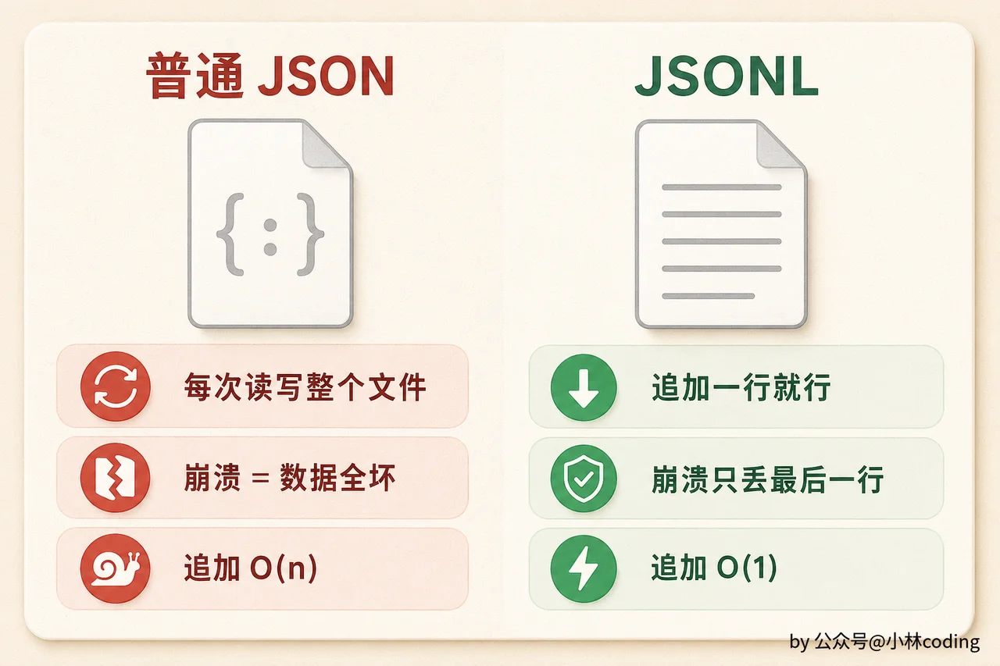

JSON 与 JSONL 对比

再说为什么不用普通 JSON。普通 JSON 是把整个数组序列化成一个文件。要追加一条消息，你得：读取整个文件，解析成数组，往数组里追加一个元素，再把整个数组序列化写回文件。当会话有几百条消息时，每追加一条都要读写整个文件，效率很低。更严重的问题是：如果程序在写文件的过程中崩溃了（比如被强制杀掉），文件可能只写了一半，变成一个不合法的 JSON，整个会话数据就全坏了。

JSONL 完美解决了这两个问题。

追加写入：每条新消息直接追加到文件末尾，一行搞定，不需要读取和重写整个文件。性能是 O(1) 而不是 O(n)。

崩溃安全：即使程序中途崩溃，已经写入的完整行不会受影响。最坏的情况是最后一行不完整，恢复时跳过那一行就好，前面的消息全部完好。

增量加载：恢复时逐行读取，遇到解析错误的行跳过继续，不会因为一行坏数据就丢掉整个会话。

这些特性天然适合 Agent 的工作模式：每产生一条消息就写一行，流式写入，实时持久化。

### 存储格式

每条 JSONL 记录包含三个字段：消息角色、内容、时间戳。

```Plaintext
{"role":"user","content":"帮我写一个 HTTP handler","ts":1736951405}
{"role":"assistant","content":[{"type":"text","text":"好的，让我看看..."},{"type":"tool_use","id":"t1","name":"ReadFile","input":{"path":"/project/main.go"}}],"ts":1736951407}
{"role":"tool_result","tool_use_id":"t1","content":"package main...","ts":1736951408}
{"role":"assistant","content":"我来创建...","ts":1736951415}
```

这三个字段足以完整重建一个会话。 `role` 字段标识消息角色（跟 Claude API 的消息格式对应）， `content` 可以是简单字符串也可以是 content block 数组（assistant 消息里可能同时包含文本和工具调用）， `ts` 是 Unix 时间戳，用整数比 ISO 格式更紧凑。

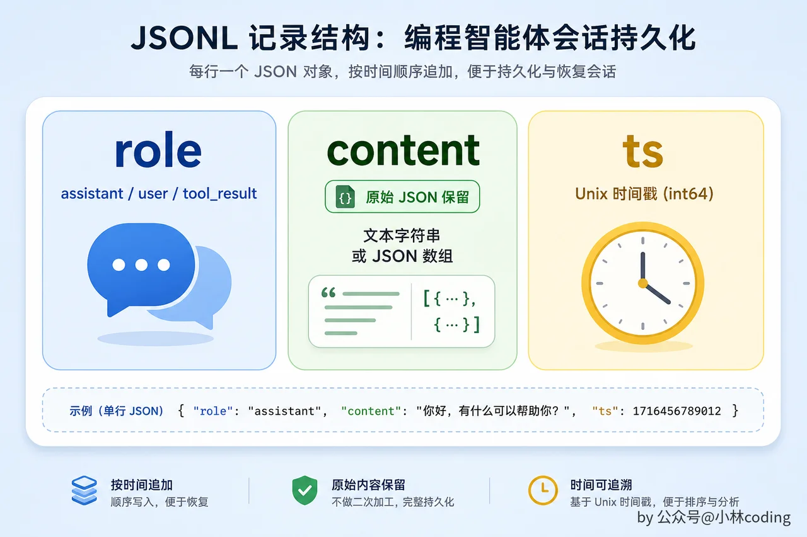

定义对应的数据类型：

```Plaintext
RecordType = "user" | "assistant" | "tool_result"

SessionRecord:
    role:       RecordType
    content:    RawJSON       // 保留原始 JSON，不做额外转换
    toolUseId:  string?       // 仅 tool_result 有
    ts:         int64         // Unix 时间戳
```

`content` 用原始 JSON 而不是字符串，是因为 assistant 消息的内容可能是一个 JSON 数组（content blocks），我们需要原样保存，不做额外转换。

### 会话文件的组织

会话文件放在项目的 `.mewcode/sessions/` 目录下：

```Plaintext
.mewcode/
  sessions/
    20250115-143000-a3f7.jsonl
    20250116-091500-b2c9.jsonl
```

会话 ID 格式是 `YYYYMMDD-HHMMSS-xxxx` ：前 15 字符的时间戳让你一眼看出创建时间，末尾 4 字符十六进制随机后缀避免同秒冲突。单进程下普通用户几乎用不到后缀，但 CI/CD 这种可能瞬时启动多个会话的场景能保证 ID 不撞车——同秒生成两个会话也会落到不同文件，不会出现多个进程往同一个 `.jsonl` 里交错写消息。

你可能会问：没有元信息文件， `/session list` 要怎么快速展示会话列表？答案是直接解析 JSONL。列表展示需要的信息就两个：会话创建时间（从文件名就能读出来）和最后活跃时间（读文件最后一行的 `ts` 字段）。JSONL 文件通常不大，逐行扫描也足够快，额外维护一个元信息文件带来的复杂度不值得。

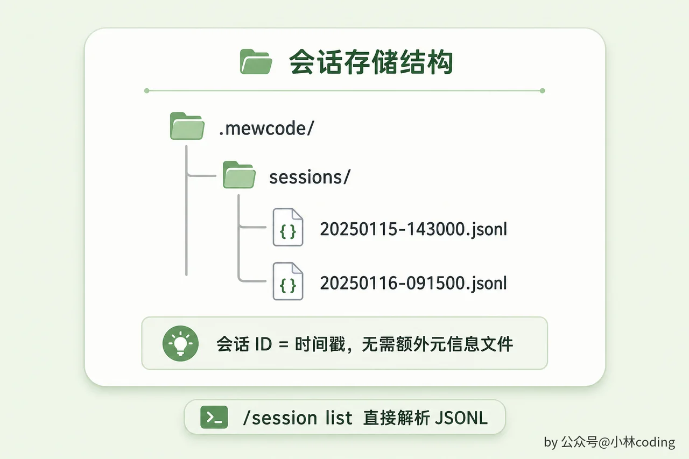

### 会话管理器

会话的创建、恢复、列表、删除，统一由 `SessionManager` 管理。它维护 `.mewcode/sessions/` 目录，提供所有会话操作的入口。

创建新会话时，生成一个唯一 ID，创建 `.jsonl` 文件：

```Plaintext
function SessionManager.Create():
    id = formatNow("YYYYMMDD-HHMMSS") + "-" + randomHex(4)
    file = openFile(sessionsDir + "/" + id + ".jsonl", CREATE | APPEND)
    session = Session { id: id, file: file, conv: newConversation() }
    return session
```

`Session` 对象是一个活跃的会话实例，持有打开的文件句柄。每次追加消息时同步写入 JSONL 文件：

```Plaintext
function Session.Append(message):
    record = SessionRecord.fromMessage(message)
    file.write(jsonSerialize(record) + "\n")
    conv.addMessage(message)
    meta.messageCount += 1
    meta.lastActive = now()
```

注意这里的写入顺序： **先写文件再更新内存** 。如果写文件成功但更新内存前程序崩溃，没关系，下次恢复时会从文件重建内存状态。如果反过来先更新内存再写文件，崩溃时内存中有但文件里没有的消息就永远丢失了。

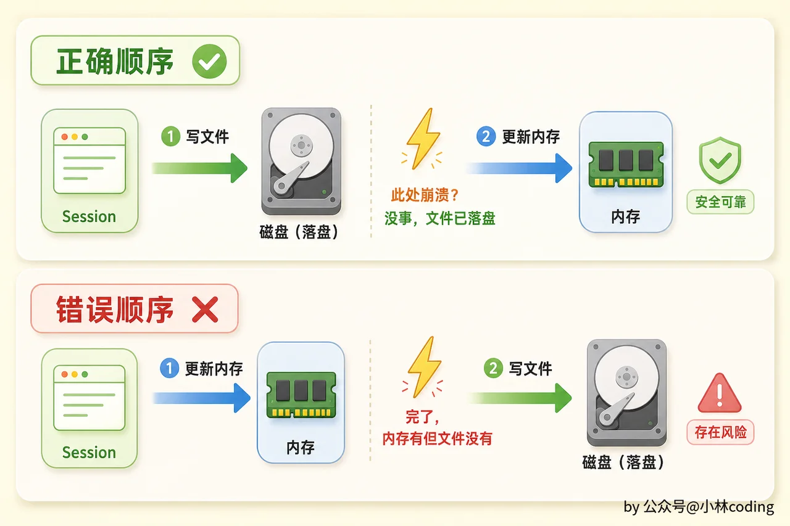

先写文件再更新内存

### 恢复会话：处理各种异常情况

恢复一个已有会话是整个会话系统中最复杂的部分，因为你要处理各种异常情况。整个流程分四步走。

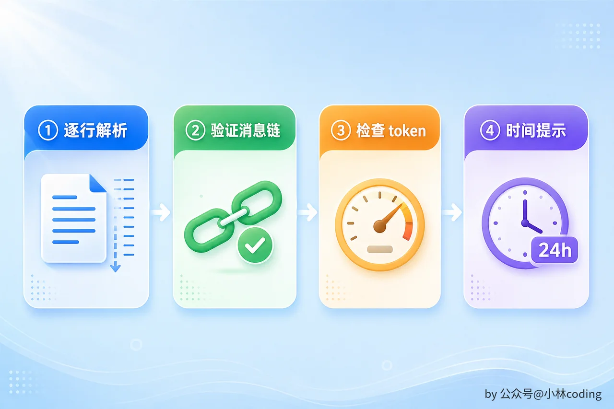

会话恢复四步走

第一步是 **逐行解析 JSONL** 。跟普通 JSON 的一次性解析不同，JSONL 可以逐行独立读取，遇到解析失败的行就跳过继续：

```Plaintext
messages = []
for each line in file:
    record = jsonParse(line)
    if record.error:
        log("line parse error, skipping")
        continue
    messages.append(record.toMessage())
```

如果某一行 JSON 解析失败，可能是崩溃时只写了半行。不要放弃整个会话，跳过这一行继续读后面的。这正是我们选 JSONL 而不是普通 JSON 的原因之一。

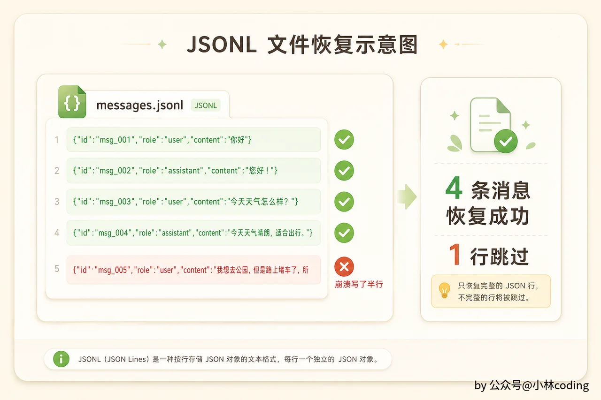

半行损坏恢复

第二步是 **验证消息链完整性** 。JSONL 文件可能因为崩溃而截断，比如有一条 assistant 消息包含了工具调用请求，但对应的 `tool_result` 还没来得及写入就崩溃了。模型看到一个工具调用但没有结果，会很困惑。

所以恢复时要追踪所有未完成的工具调用，截断到最后一个「所有工具调用都有结果」的位置：

```Plaintext
function ValidateMessageChain(messages):
    lastValid = 0
    pendingToolUses = {}
    for i, msg in messages:
        if msg.hasToolUse():
            for tu in msg.toolUses():
                pendingToolUses.add(tu.id)
        if msg.isToolResult():
            pendingToolUses.remove(msg.toolUseId)
        if pendingToolUses is empty:
            lastValid = i + 1
    return lastValid
```

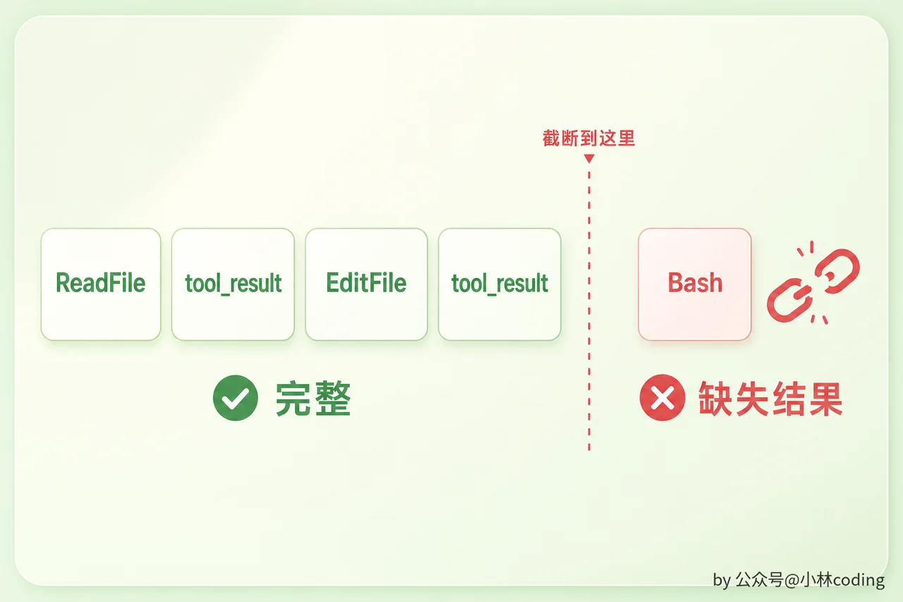

工具调用链校验

第三步是 **检查 token 量** 。如果恢复的会话很长，token 量可能已经超过压缩阈值。直接触发一次压缩再返回给用户，免得用户刚恢复会话就因为 token 超限报错。

第四步是 **插入时间跨度提示** 。如果距离上次活跃超过 24 小时，在对话中插入一条消息提醒 Agent：上次会话是什么时候，中间可能有代码变更，建议重新读取相关文件。这能有效避免 Agent 拿着过期的文件内容做决策。

### 过期会话清理

用久了之后， `.mewcode/sessions/` 目录下会堆积大量的旧会话文件。超过 30 天没有活跃的会话，基本不会再被恢复了，MewCode 会在启动时自动清理它们。会话列表则按最后活跃时间倒序排列，最近用过的排在最前面。

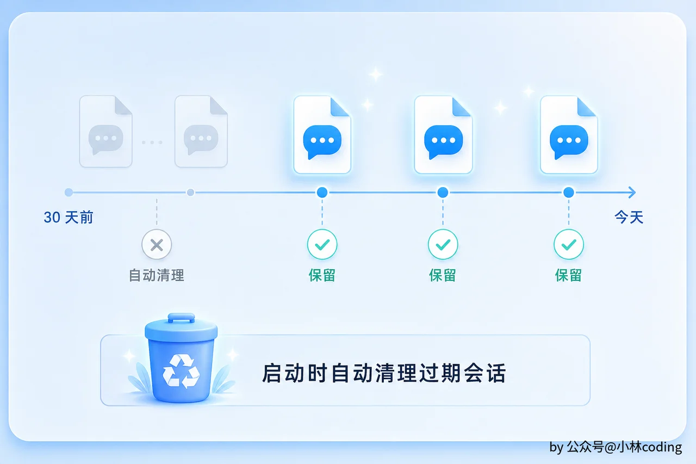

过期会话清理

---

## 自动记忆：让 Agent 自己「记笔记」

项目指令文件是你手动维护的长期记忆。但有些知识是在对话过程中冒出来的，你不太可能每次都去编辑 MEWCODE.md。

比如你在对话中随口说了一句「不要用 tab，用 4 个空格」。这是一个明确的偏好，Agent 应该记住。但你大概不会专门打开 MEWCODE.md 去加一行「缩进用 4 空格」。

再比如 Agent 写了一段代码，你纠正说「不对，这里应该用互斥锁而不是消息通道」。这是一个反馈，Agent 下次遇到类似场景时应该做出不同的选择。

自动记忆系统就是解决这个问题的：Agent 在对话过程中自动识别值得记住的信息，分类存储，在后续会话中自动加载。

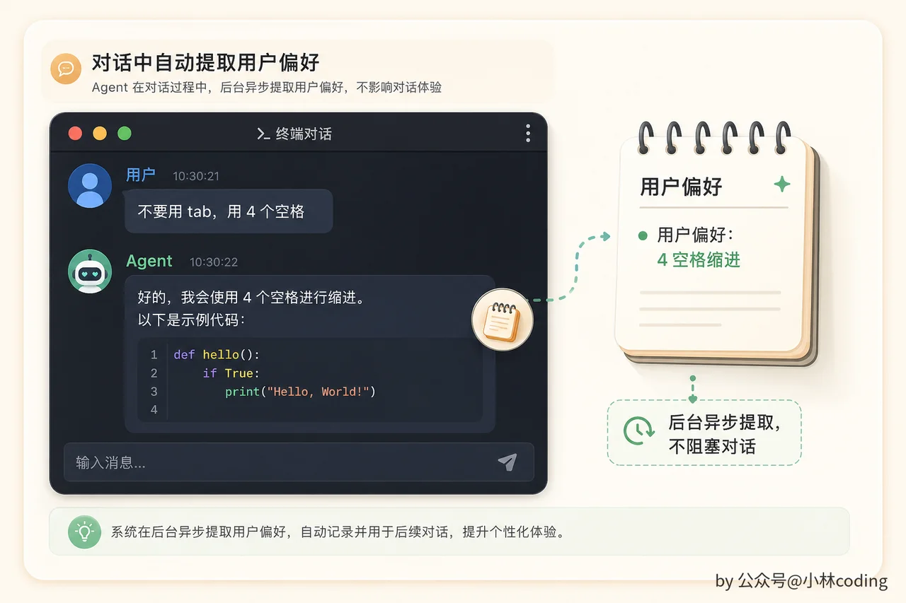

自动记忆记笔记

### 四类记忆

自动记忆按内容性质分成四个类别。这四类天然分成两组： **用户偏好** 和 **纠正反馈** 是关于"人"的，跟你走，所以存到用户级目录（ `~/.mewcode/memory/` ）； **项目知识** 和 **参考信息** 是关于"项目"的，跟项目走，所以存到项目级目录（ `<项目根>/.mewcode/memory/` ）。每个记忆文件 frontmatter 里的 `type` 字段决定它落在哪个目录——type 选好了，目录也就确定了。

第一类是「用户偏好」（user）。用户的个人编码习惯和风格要求，比如「我喜欢简洁的代码风格」「不要用 tab」「回复尽量用中文」。这类信息不依赖具体项目——你换到另一个仓库，「不要用 tab」依然成立——所以存在用户级目录 `~/.mewcode/memory/` 下，让所有项目都能复用。

第二类是「纠正反馈」（feedback）。用户明确指出 Agent 的输出有问题并给出正确做法，比如「这个函数名不好，改成 ProcessOrder」「这里应该用互斥锁不是消息通道」。这类记忆是关于"用户怎么纠错"的——同一个人在不同项目里大概率会做出类似的纠正——所以同样存到用户级目录 `~/.mewcode/memory/` 。

第三类是「项目知识」（project）。关于当前项目的具体技术信息，比如「部署脚本在 scripts/ 目录」「用 GitHub Actions 做 CI」「数据库是 PostgreSQL 15」。这类信息换个项目就完全不适用了，所以存在项目级目录 `<项目根>/.mewcode/memory/` 下，可以选择提交到 Git 跟团队共享，也可以加到 `.gitignore` 个人保留。

第四类是「参考信息」（reference）。外部链接和资料，比如「API 文档在 https://docs.example.com」「设计文档在 Confluence 的某个页面」。这些链接通常是项目特定的——「我们这个项目的 API 文档」——所以也存到项目级目录 `<项目根>/.mewcode/memory/` ，团队成员需要时一起看得到。

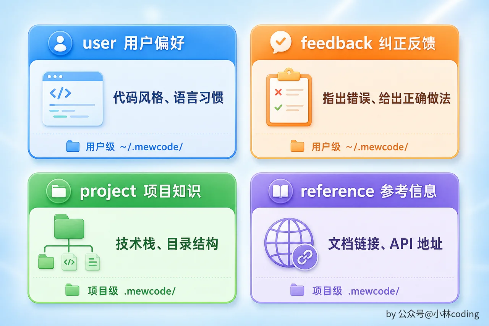

四类自动记忆

### 自动记忆存在哪：目录结构

既然 MEWCODE.md 已经是 Markdown，自动记忆也用同样的格式。但不是把所有记忆塞进一个文件，而是用一个 **目录** 来组织：每条记忆是一个独立的 `.md` 文件，再用一个 `MEMORY.md` 索引文件把它们串起来。

```Plaintext
.mewcode/memory/
  MEMORY.md            # 索引文件（注入到 messages）
  user-prefers-any.md   # 每条记忆一个文件
  feedback-testing.md
  project-deadline.md
```

为什么不直接写进 MEWCODE.md？因为 MEWCODE.md 是你手动维护的、提交到 Git 的、团队共享的。自动记忆是机器生成的、个人专属的，混在一起会污染你精心维护的指令文件。放在 `.mewcode/memory/` 目录下加到 `.gitignore` 就好。

为什么用目录而不是单文件？因为每条记忆可以独立增删改，不需要编辑一个大文件。删除一条记忆就是删一个文件，更新一条就是改一个文件，不会干扰其他记忆。

每个记忆文件有 YAML frontmatter 描述元信息：

```YAML
---
name: user-prefers-any
description: 用户偏好使用 any 而非 interface{}
type: feedback
---

用户明确要求使用 any 替代 interface{}。
**Why:** 现代 Go 语法更简洁
**How to apply:** 所有新写的泛型代码用 any
```

`MEMORY.md` 索引文件只存指针，每行一条，格式简洁：

```Markdown
- [偏好 any 语法](user-prefers-any.md) — 用户要求用 any 替代 interface{}
- [项目用 golang-migrate](project-migration-tool.md) — 数据库迁移工具选型
```

索引文件注入到 messages 时有上限：最多 200 行或 25KB，超了会截断并附加警告。这防止记忆太多时撑爆上下文。

为什么是 200 行 / 25KB？按平均约 125 字符一行的密度算，200 行 ≈ 25KB ≈ 2000-3000 tokens，正好占 200K 上下文窗口的 1-2%。每条记忆指针通常占 1-2 行，这个上限既能装下相当数量的记忆，又把长期记忆的固定开销控制在窗口的零头里，不会挤压工作记忆的空间。

### 提取与去重

Agent 不需要逐字逐句地检测记忆。合适的时机是 **每轮 Agent Loop 结束后** ，模型给出最终回复、不再调用工具的那个时刻。这时候在后台异步回顾本轮对话，看看有没有值得记住的东西。异步执行不阻塞用户的下一轮输入，用户可以立刻开始新的对话。

提取的过程通过一次独立的 LLM 调用完成。系统把 `MEMORY.md` 索引和所有现有记忆文件的摘要清单发给模型，连同最近一轮对话，让它分析对话、按四个类别决定是否需要创建新记忆、更新已有记忆、或删除过时记忆：

```Plaintext
memoryExtractionPrompt = """
下面是当前的记忆目录清单和最近一轮对话。
分析对话，提取值得长期记忆的信息。

操作：
- 创建新记忆文件（写 frontmatter + 正文，更新 MEMORY.md 索引）
- 更新已有记忆文件（如果信息有变化）
- 删除过时记忆文件（同时从 MEMORY.md 移除指针）

分类：user / feedback / project / reference
已有相同含义的记忆不要重复创建。
没有值得记忆的内容就什么都不做。
"""
```

因为模型拿到了所有现有记忆的清单，去重是天然的。「用 any 代替 interface{}」和「不要使用 interface{} 类型」说的是同一件事，LLM 能识别出来，不会重复创建。不需要我们自己实现相似度算法。

注意 prompt 里「没有值得记忆的内容就什么都不做」这句。大多数对话其实没什么值得长期记住的信息，比如「帮我加个函数」「好的做完了」。如果 Agent 对每轮对话都创建记忆文件，很快记忆目录就被垃圾信息淹没了。

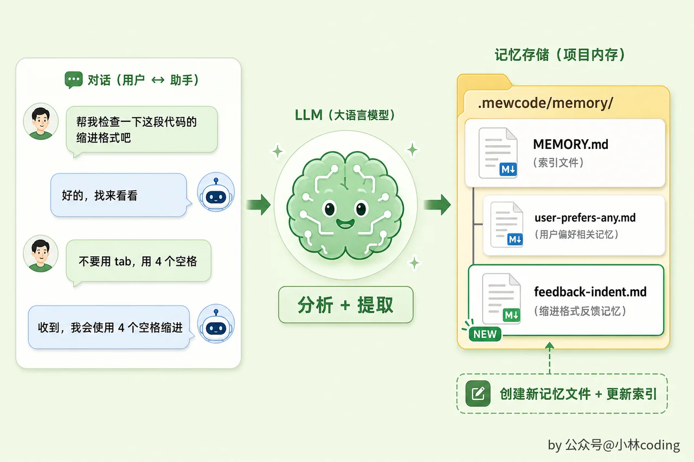

### 加载：跟 MEWCODE.md 走同一条管线

每次新会话启动时，MEMORY.md 索引文件跟 MEWCODE.md 走同一条加载管线：发现文件、读取内容、注入到 messages 上下文中。用户什么都不用做，Agent 自动就「想起来」了之前学到的东西。

最终发给 API 的请求结构看起来像这样：

```JSON
{
  "model": "claude-sonnet-4-6",
  "system": "你是 MewCode，一个终端 AI 编程助手。",
  "messages": [
    { "role": "user", "content": "## 项目指令\n...\n\n## 自动记忆\n- [偏好 any 语法](user-prefers-any.md) — ...\n- [项目用 golang-migrate](project-migration-tool.md) — ..." },
    { "role": "assistant", "content": "好的，我已了解项目背景。" },
    { "role": "user", "content": "帮我在 handler 里加一个用户注册接口" }
  ],
  "tools": [ ... ]
}
```

项目指令和自动记忆索引作为上下文注入 messages。Agent 在处理用户的实际请求之前，已经「读过」了所有长期记忆的索引。如果某条记忆的详细内容跟当前任务相关，Agent 可以用 ReadFile 去读对应的记忆文件。

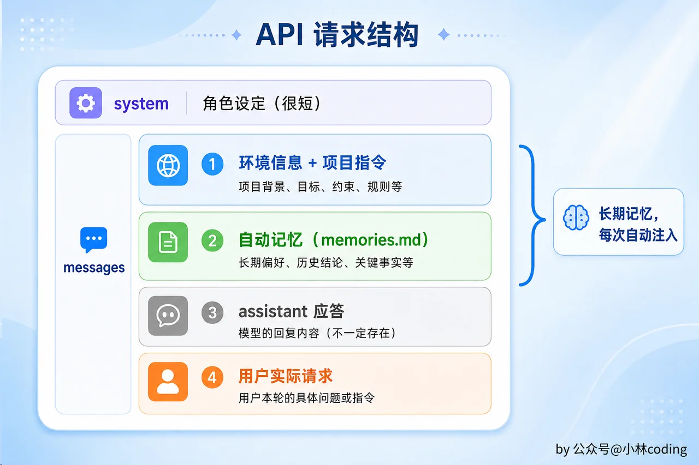

---

## 本章小结

记忆系统让 Agent 从「每次失忆」变成了「越用越懂你」。两层记忆各司其职：工作记忆（上下文窗口）管当前任务，长期记忆（会话持久化 + 指令文件 + 自动记忆）让项目知识、对话历史和用户偏好跨会话生效。

项目指令文件是最直观的长期记忆：一个 MEWCODE.md，Agent 每次启动都读一遍，相当于员工入职文档。多层优先级加上 `@include` 模块化，让指令体系既能统一管理又能灵活扩展。

会话持久化选用 JSONL 格式，追加写入 O(1)、崩溃安全、增量恢复，天然适合 Agent 的流式工作模式。恢复时的消息链验证和时间跨度提示，让中断后的体验尽可能平滑。

自动记忆让 Agent 自己「记笔记」，在每轮对话结束后异步提取值得长期记住的信息，写入独立的记忆文件并更新 `MEMORY.md` 索引。跟 MEWCODE.md 用同一套 Markdown 格式和加载管线，去重交给提取 LLM 判断，不需要额外的相似度算法。

记忆层至此告一段落。但你应该注意到了，MewCode 到现在为止还是个"被动响应"的工具——所有操作都得用自然语言描述，连「清空当前会话」「看一下当前状态」「列出历史会话」这种高频动作也不例外。下一章我们要给 MewCode 加上 Slash Command 内置命令框架，把 `/clear` 、 `/status` 、 `/session list` 这些一键直达的入口接进来，让交互层从"全靠对话"过渡到"对话 + 命令并用"。