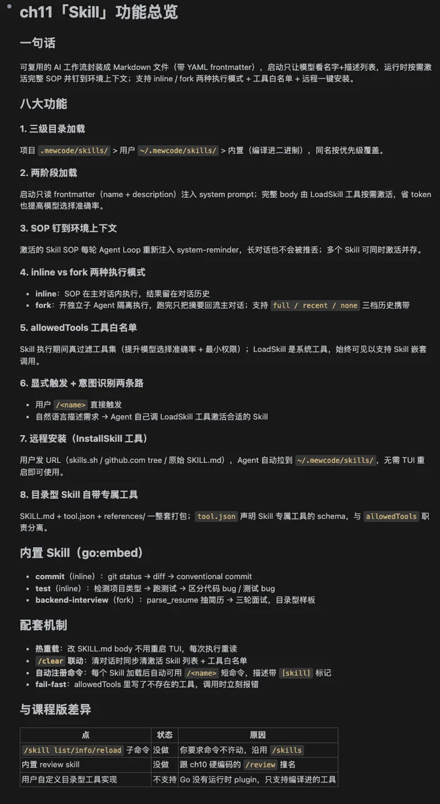
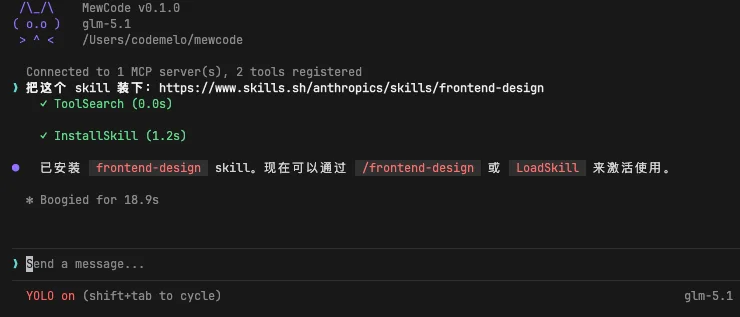
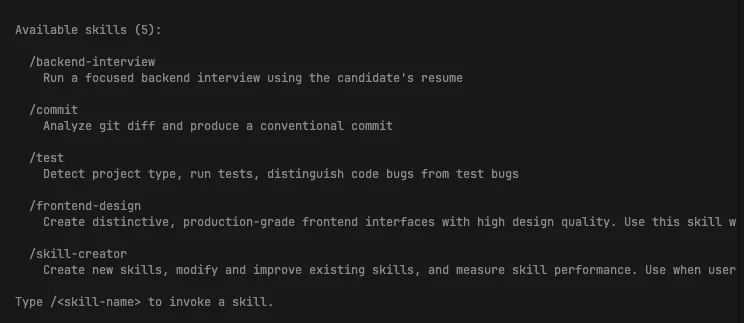
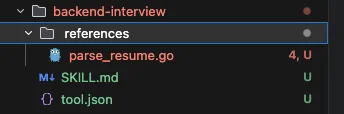
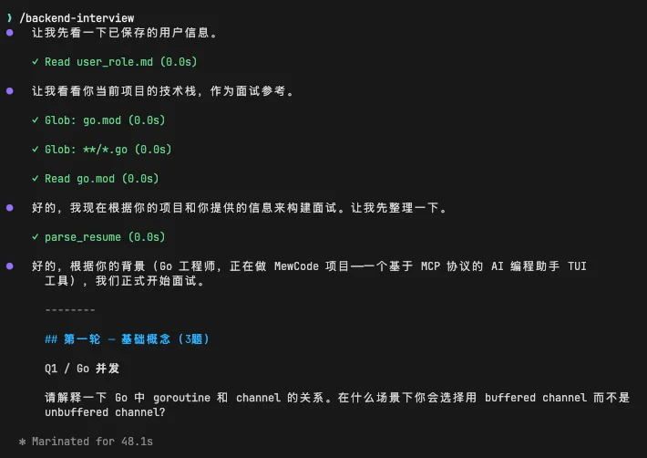
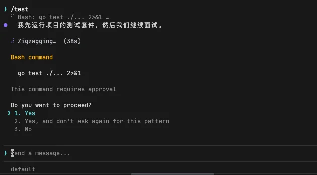
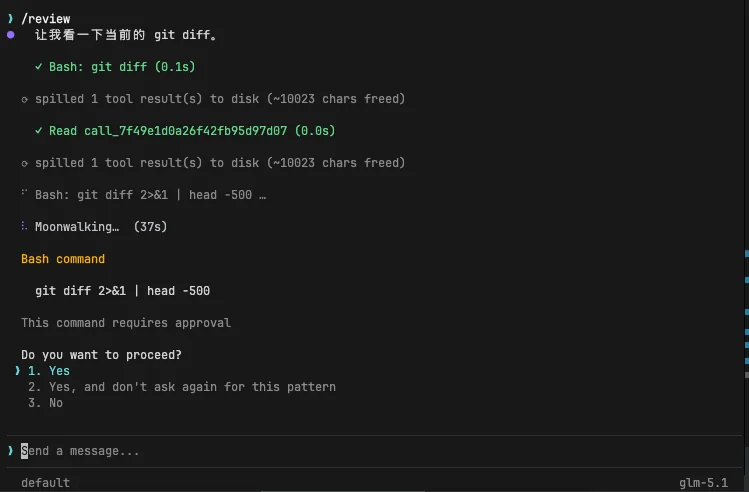
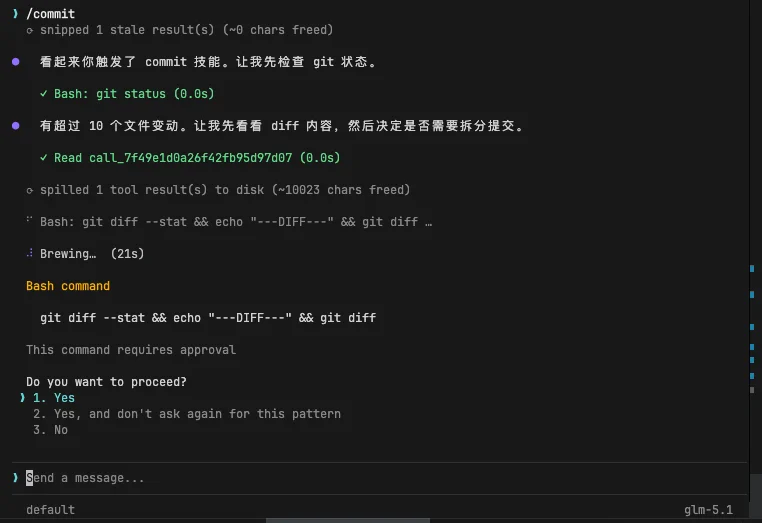
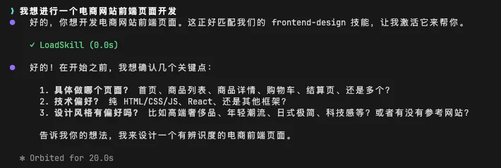

# 实战演练：Skill 系统

# 第11章：实战篇

## 本章需要做什么？

上一章我们给 MewCode 装上了 Slash Command 内置命令框架，用户可以通过 `/help` 、 `/clear` 、 `/compact` 这些命令快速操作， `/review` 则走 `prompt` 类型把预设 prompt 转发给 Agent 处理。

这一章要给 MewCode 实现 Skill 技能包系统。做完之后，可复用的 AI 操作变成独立的 Markdown 文件，随时可编辑，不需要编译。

两阶段加载让 Agent 平时只看到 Skill 的名字和描述，按需才加载完整指令和专属工具。用户既能用 `/commit` 显式调用，也能说「帮我提交一下」让 Agent 自己匹配。

具体要新增这些东西：

-   **Skill 定义与解析** ：YAML frontmatter 存元信息，Markdown body 存 prompt，解析器负责分离和校验

-   **Skill 加载器** ：三级搜索路径（项目级 > 用户级 > 内置级）、同名覆盖、热加载、自动注册为 Slash Command

-   **Skill 执行器** ：inline / fork 两种执行模式、 `$ARGUMENTS` 参数替换、 `allowedTools` 工具白名单过滤、fail-fast 依赖检查

-   **LoadSkill 内置工具** ：Agent 意图识别后按需加载完整 SOP 和专属工具，通过 ActivateSkill 钉到环境上下文

-   **两阶段加载** ：启动时只注入摘要到 messages，LoadSkill 调用后激活完整内容

-   **Agent 侧改动** ：activeSkills 列表、环境上下文每轮重建、系统工具豁免 allowedTools 过滤（支持 Skill 嵌套）

-   **三个内置 Skill** ：commit（inline）、review（fork）、test（inline）

-   **目录型 Skill 支持** ：SKILL.md + tool.json + references/ 自包含能力包

-   **/skill 管理命令** ：list / info / reload

这章 **不做** ：Skill 市场和分发、Skill 版本管理。

---

## Vibe Coding 实战

### 生成三份文档

把任务换成本章的内容：

```Markdown
# 我的初步想法
- 单个 Skill 用「YAML frontmatter + Markdown 正文」描述：frontmatter 放元信息（唯一名字、一句话说明、可见工具白名单、执行模式、所用模型、上下文携带策略），正文是发给模型的 SOP 指令
- Skill 存放分三级：项目目录 > 用户目录 > 内置（编译进二进制），同名按优先级覆盖；解析失败的单个文件跳过并记日志，不阻断整体加载
- 两阶段加载：启动时只把所有 Skill 的名字 + 一句说明注入到对话让 Agent 看到；当 Agent 判断要用某个 Skill 时，调一个内置工具把完整指令和专属工具加载进当前会话
- 激活后的完整指令不要塞进普通消息历史，要钉在「环境上下文」里，每轮 Agent Loop 重新构建时它都在最显眼位置；同时激活多个 Skill 时各自的指令并存
- 两种执行模式：一种共享当前对话上下文，执行结果留在主对话历史里；另一种开一条独立对话执行，跑完后把结果摘要回流到主对话；独立模式还能选「全量摘要 / 最近 N 条 / 完全清空」三档来决定要不要带历史进去
- Skill 可以声明可见工具白名单收窄当前能用的工具集，提升模型选择准确率同时落实最小权限；启动时如果白名单里出现不存在的工具就立刻报错（fail-fast）
- 加载 Skill 的那个内置工具属于系统级，不受白名单约束，方便 Skill 之间嵌套触发
- 支持「目录型 Skill」：除了入口 Markdown，还能在同一目录里带自己的工具 schema 和工具实现脚本，整套作为一个可分发的能力包
- Skill 加载完自动注册成 `/<名字>` 短命令出现在帮助里；执行时重新读源文件支持热更新；提供管理子命令查看已加载 Skill、看单个 Skill 详情、强制重新扫描
- 清空对话的命令要顺带把已激活的 Skill 列表也清掉，避免新对话里残留上一次激活的 SOP
- 内置 commit / review / test 三个 Skill 样板（覆盖共享和隔离两种模式）作为生产力工具兼参考模板

# 明确不做（留给后续章节)
- Skill 的市场与分发机制
- Skill 的版本管理
```

然后 AI 就会开始问你问题，进行需求澄清。

你根据理论篇学到的内容回答这些问题，反复循环对齐需求，最后生成三份文档。

### 正式开发

三份文档有了之后，施工图纸定好了，让 Claude Code 根据这三份文档开发


经过一段时间后，开发完成。



### 功能验证过程

来验收一下结果

先来试试让MewCode直接帮我们安装一个skill

> 把这个 skill 装下：https://www.skills.sh/anthropics/skills/frontend-design



然后输入

> /skill

我们可以看到我们有所有我们的目前拥有的skill



其中，backend- interview会携带新的自己的工具parseResume，那么我们就需要refernces和tool的json了



然后我们输入

> /backend-interview



可以看到，它能根据我们的用户画像，去解析简历，然后进行面试

再试试测试的skill，在ui输入

> /test



会根据SOP去测试

我们输入

> /review



然后我们输入

> /commit



会去走我们的commit skill

如果我们是想在Agent任务中自动通过意图识别加载对应的skill，也是可以的，以我们一开始安装的那个forntend-design为例子

> 我想进行一个电商网站前端页面开发



可以看到Agent会自动意图识别和加载对应的skill的文档，然后跟随步骤开发完成后，就有了我们的一个页面展示了


验收没问题，那么本章的主要任务就完成了。下一章，我们来实现Hook来增加更完整的任务管理和编排能力。

---

## 参考提示词和代码

如果你在澄清需求的过程中遇到困难，或者生成的三份文件效果不理想，可以直接使用下面的参考版本。

把下面三个文件保存到项目根目录，然后告诉你的 AI 编程助手（在 `[你的语言]` 处填入你使用的编程语言）：

> 提示词如果需要复制，移步到这里： [💡 提示词复制](https://my.feishu.cn/wiki/JM5Kw5TIGiIehqks1BYcYdpLnzd?fromScene=spaceOverview)