# Skill 系统

---

## 你是不是在反复输入同样的 prompt？

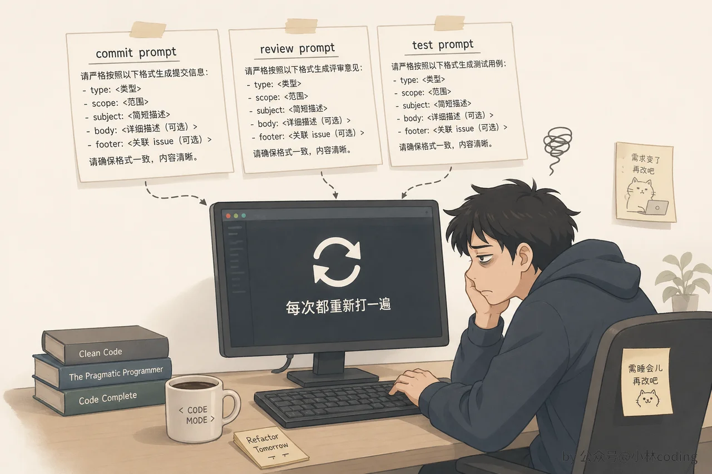

反复输入同样的 prompt

用了几天 MewCode，你大概会养成一些习惯。每次提交代码，你都会打一段类似的话：

```Plaintext
请分析当前 git diff，生成一个规范的 commit message。格式要求：
type(scope): description，type 从 feat/fix/docs/refactor/test 中选。
然后用 git add 和 git commit 执行提交。不要 add 敏感文件。
```

每次做代码审查，你又会打：

```Plaintext
请审查当前 git diff 的代码变更。重点关注：
1. 逻辑错误和边界条件
2. 安全漏洞
3. 性能问题
4. 代码风格一致性
按严重程度分级报告。
```

每次跑测试，你还会打一段更长的话，告诉 Agent 怎么检测项目类型、怎么分析失败原因、怎么区分代码 bug 和测试本身的问题。

这些 prompt 每次打都一样（或者几乎一样），但又必须打。因为不打的话 Agent 不知道你想要什么格式、什么标准。

还有一个更隐蔽的问题。回头看看 MewCode 的工具列表：内置工具有 5 个，接入 MCP 后可能变成 15 个、25 个。工具越多，模型的选择准确率越低。最常见的几种翻车场景包括：模型该用 Grep 搜索时选了 Bash 的 grep 命令，功能差不多但权限控制就绕过去了；20 个工具摆面前，模型分不清什么场景该用 Glob 什么场景该用 Grep，挑了个相近但错的；该先 `git diff` 看变更再 `git add` 暂存，顺序搞反了，结果完全不对。

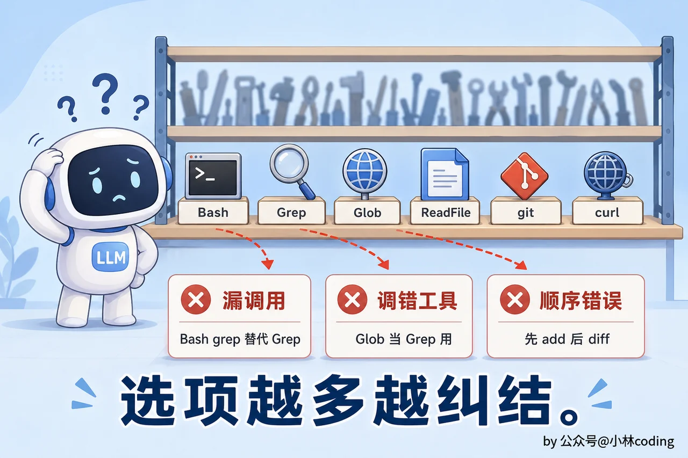

工具选择三类错误

这和人一样，3 个选项能快速决策，30 个选项就开始纠结了。

你可能想到了上一章的 Slash Command，特别是 `prompt` 类型。上一章实现的 `/review` 就是这种命令，把一段写死在 Handler 里的代码审查 prompt 转发给 Agent。同样的思路也能搞 `/commit` ：注册一个 `prompt` 类型的命令，Handler 里硬编码 commit 流程的 prompt 发给 Agent。

但问题是，Handler 是源代码，修改一个 prompt 就得重新编译。而且用户没法添加自己的命令。你总不能因为想调整 commit message 的格式，就去改源码然后重新构建一次吧？

所以我们面对的其实是两个问题：一是可复用的 AI 操作需要变成独立的、可编辑的、不需要编译的东西；二是需要一种机制让模型在执行特定任务时只看到相关的工具和指令，提高调用准确率。

Skill 系统同时解决这两个问题。

---

## Skill 是什么：写给 Agent 的 SOP

在聊 Skill 的技术实现之前，先理解它的本质。

你在公司里大概见过 SOP（Standard Operating Procedure），就是「标准操作流程」。新人入职，给他一份 SOP：「当你要部署时，按照 1、2、3 步骤来」。SOP 是写给人看的，人按照流程去执行。


写给 Agent 的 SOP

Skill 就是写给 Agent 的 SOP。

它告诉 Agent：「当用户要求做提交/审查/测试时，按照这个流程和标准来执行」。区别在于，SOP 给人看，人来执行；Skill 给 Agent 看，Agent 来执行。

但有一点很关键：人类可以「领会精神」，你写得模糊一点，有经验的人也能理解你的意思。Agent 不行，它只会「照字面做」。所以 Skill 里的指令需要比人类 SOP 更精确、更具体。你写「注意安全」，人知道要检查 SQL 注入和 XSS。你写「注意安全」给 Agent，它可能只会在回复里加一句「已注意安全问题」就完事了。

稍微补一句官方背景。在 Anthropic 的说法里，Skill 是「把专家经验、操作流程和最佳实践打包成可复用的能力」，强调三件事： **一致性** ——同一个 Skill 在 Claude.ai、Claude Code、API 上行为大体一致； **知识固化** ——团队踩过的坑、定下的规范不再靠口头传授； **跨平台复用** ——一份 SKILL.md 可以在不同 Claude 产品里共用。

不过 MewCode 的 Skill 用得稍微窄一点，主要是单 Agent 内的工作流编排和工具集隔离，不涉及跨平台同步。但底层思路是一脉相承的：把「重复 prompt + 工具子集」这件事从代码里搬出来，变成可编辑的 Markdown 资产。

---

## Skill vs Slash Command：什么时候用什么

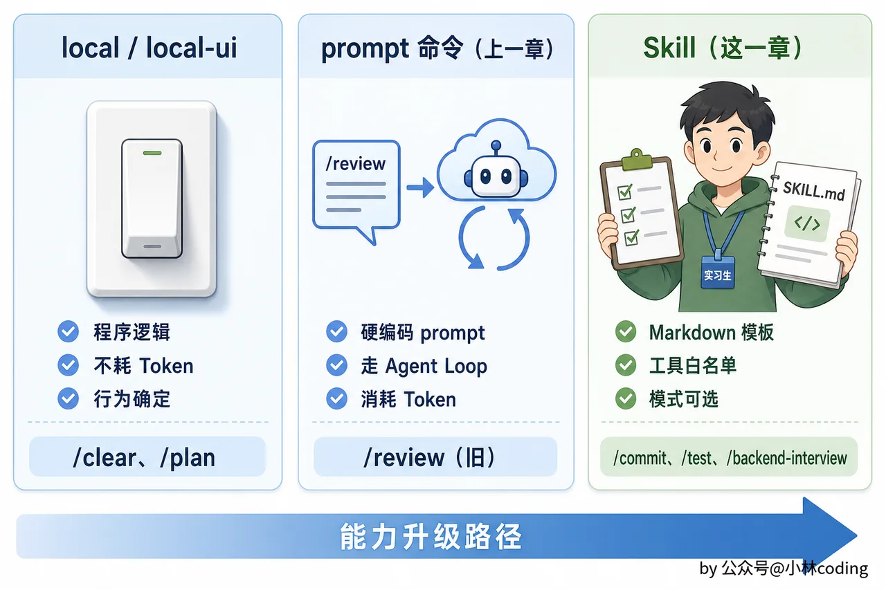

Slash Command 与 Skill 对比

在深入 Skill 系统之前，先把它和 Slash Command 的关系理清楚。

上一章把 Slash Command 拆成了三类： `local` 是纯本地操作不耗 token，比如 `/help` 、 `/clear` ； `local-ui` 改 UI 状态也在本地，比如 `/plan` ； `prompt` 类型则会把一段预设的 prompt 转发给 Agent 处理，会消耗 token， `/review` 就是它的代表。

Skill 的思路其实接续了 `prompt` Slash Command 这条线。两者的核心都是「把一段固定 prompt 模板交给 Agent 执行」，让用户少打几个字，也让 prompt 经过精心设计后质量更稳定。

但 `prompt` 类型还留着几个痛点没解决：prompt 硬编码在源码里，改一个字就要重新编译；只有开发者能加新命令；命令执行时拿到的工具范围跟普通对话一模一样，没法做工具级的隔离和保护。

最关键的是，它没法捎带任何资源。prompt 只是一段孤零零的字符串，没法带上自己专属的工具实现、参考文档或脚本。

Skill 就是来把这些痛点一并补齐的。它先把 prompt 从源码搬进独立的 Markdown 文件，任何用户都能新增和修改。

再往前走一步， **目录型 Skill** 把整套相关资产装进同一个文件夹： `SKILL.md` 装 SOP 流程， `tool.json` 装专属工具的 schema， `references/` 装工具实现代码、长文档、API 参考、辅助脚本等附属资源。

整个目录就是一个自包含的「能力包」，可以打包压缩、扔进 Git 仓库、发到 GitHub 给同事 clone。对方解压到自己的 `.mewcode/skills/` 下面立刻就能用，整套 SOP、工具、参考资料一个不丢。

加上 `allowedTools` 工具白名单、 `inline` / `fork` 执行模式、 `$ARGUMENTS` 参数等机制，Skill 把「带快捷方式的 prompt」演化成了一套完整、自包含、可分发的任务系统。

那应该怎么选？先看操作要不要 AI 参与。清屏、查 token 这种纯执行的，用 `local` 类 Slash Command 最快；切换 UI 模式的，用 `local-ui` 类。需要 AI 判断的稍微多想一步：复杂度低、不需要用户自定义、不需要工具隔离，可以用 `prompt` 类 Slash Command 快速搞定；只要超过这条线，就升级成 Skill。

`/clear` 是典型的 `local` 类 Slash Command，清屏就是清屏。 `/commit` 是典型的 Skill。分析 diff、生成 message、选择要 add 的文件都需要 AI 判断，而且每个团队的 commit 规范不一样，必须让用户能直接编辑配置。

你可以把 `local` 和 `local-ui` 类 Slash Command 想象成电灯开关，按下去灯就亮，确定性百分之百。Skill 则像是给一个实习生的任务清单，他会按你的指示去做，但具体执行过程中有自己的判断空间。 `prompt` 类 Slash Command 介于两者之间，相当于把任务清单贴在了开关旁边的告示板上，能用，但灵活度有限。

---

## Markdown 就是定义文件

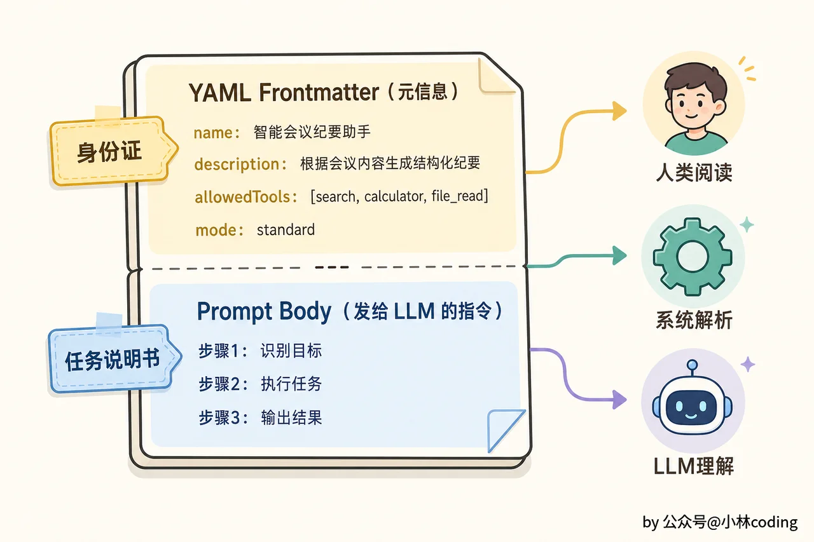

Skill 文件结构

Skill 的定义格式是 Markdown，因为它同时满足三个需求：人类可以直接阅读，系统可以通过 YAML frontmatter 解析结构化数据，LLM 可以直接理解 prompt body 中的指令。

一个完整的 Skill 文件长这样：

```Markdown
---
name: commit
description: 分析 git diff 并生成规范的 commit
allowedTools:
  - Bash
  - ReadFile
  - Grep
mode: inline
---

# 任务

你需要帮用户创建一个 git commit。

## 步骤

1. 运行 `git status` 查看当前变更状态
2. 运行 `git diff` 和 `git diff --staged` 查看具体变更内容
3. 分析变更，确定 commit 类型和范围：
   - feat: 新功能
   - fix: 修复 bug
   - docs: 文档变更
   - refactor: 重构
   - test: 测试
   - chore: 构建/工具变更
4. 生成 commit message，格式：`type(scope): description`
5. 用 `git add` 添加相关文件（不要添加 .env、credentials 等敏感文件）
6. 执行 `git commit -m "生成的 message"`
7. 如果用户提供了额外说明，纳入 commit message

## 注意事项

- 不要用 `git add -A`，逐个文件添加
- commit message 用英文
- description 不超过 72 个字符
- 如果变更太多，建议用户拆分成多个 commit

$ARGUMENTS
```

上半部分是 YAML frontmatter，即两个 `---` 之间的内容，定义了 Skill 的元信息。下半部分是 prompt body，就是实际发送给 LLM 的指令。

这意味着什么？你要调整 commit message 的格式规范，打开这个 `.md` 文件改几行文字就行了，不用碰源代码，不用重新编译。你想加一个新 Skill，创建一个 `.md` 文件就行了。

---

## Frontmatter 里的每个字段

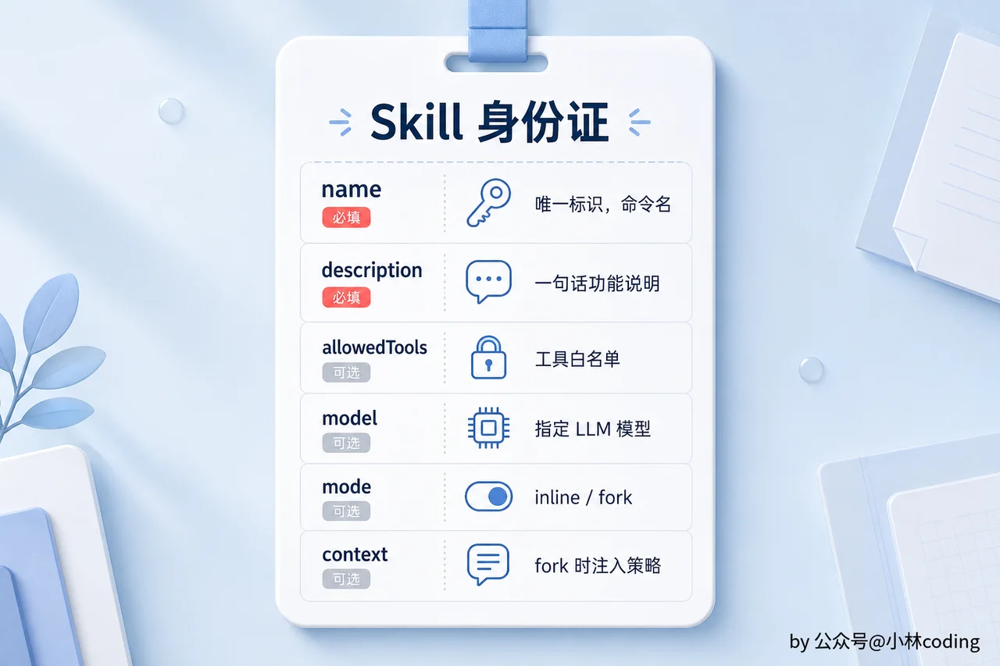

Skill Frontmatter 身份证

YAML frontmatter 是 Skill 的「身份证」，让我们逐个看看每个字段是干什么的。

`name` 是必填的，它是 Skill 的唯一标识符，同时也是调用它的命令名。 `name: commit` 意味着用户可以通过 `/commit` 来调用这个 Skill。命名规范是小写字母、数字和连字符。注意不能和内置 Slash Command 冲突，你不能定义一个 `name: help` 的 Skill，因为 `/help` 已经被内置命令占了。

`description` 也是必填的，一句话描述 Skill 的功能。它会出现在 `/help` 列表里，也用于自动匹配。

`allowedTools` 是推荐填的，它限制 Skill 执行期间可以使用的工具。为什么需要这个？我们后面单独讲安全性的时候会详细说。

`model` 是可选的，指定 Skill 使用的模型。有些任务简单（比如生成 commit message），可以用便宜一点的模型；有些任务复杂（比如代码审查），需要最强的模型。不指定就用默认模型。

`mode` 是可选的，控制 Skill 的执行模式： `inline` （默认）或 `fork` 。这个区别很重要，后面会专门讲。

`context` 也是可选的，只在 fork 模式下生效，决定把多少主对话的上下文带进 fork 会话。可以是 `full` （完整对话的摘要，默认）、 `recent` （最近 5 条消息）、 `none` （完全隔离）。inline 模式本身就共享对话历史，这个字段会被忽略。

---

## 三个地方找 Skill，谁优先级高

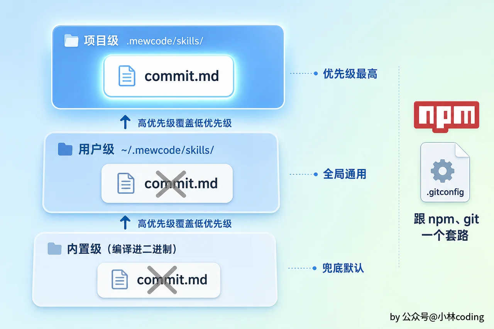

三层 Skill 搜索路径

Skill 文件可以放在三个位置，按优先级从高到低：

```Plaintext
1. 项目级：{projectDir}/.mewcode/skills/
2. 用户级：~/.mewcode/skills/
3. 内置级：程序自带的 Skill（编译进二进制）
```

这个设计你应该不陌生，跟 npm 的包搜索路径很像：先看项目本地，再看全局，最后看内置。也跟 Git 的 `.gitconfig` 一样：项目级配置覆盖全局配置。

实现起来不复杂。维护一个 `seen` 字典，按优先级从高到低扫描目录：每读到一个 Skill，先看名字在不在字典里，不在就收下并记录，已经在了就跳过。这样高优先级目录里的同名 Skill 自然就把低优先级版本盖住了。解析失败的文件记一条日志、跳过即可，不要让单个坏文件中断整个加载。

这种简单的覆盖策略意味着几件很实用的事情。

项目可以定义项目特有的 Skill，比如你的项目有自己的 deploy 流程，写一个 `deploy.md` 放在 `.mewcode/skills/` 下面就行。

用户可以定义个人通用的 Skill。你喜欢 commit message 用中文？写一个自己版本的 `commit.md` 放在 `~/.mewcode/skills/` 下面，它会覆盖内置的英文版。

项目级 Skill 可以提交到版本控制，整个团队共享。团队的最佳实践从口头传授变成了一个个可执行的 Skill 文件。新人入职，clone 仓库，Skill 就自动加载了。

内置 Skill 则通过语言提供的资源嵌入机制编译进二进制，不依赖外部文件。

---

## inline vs fork：要不要共享上下文

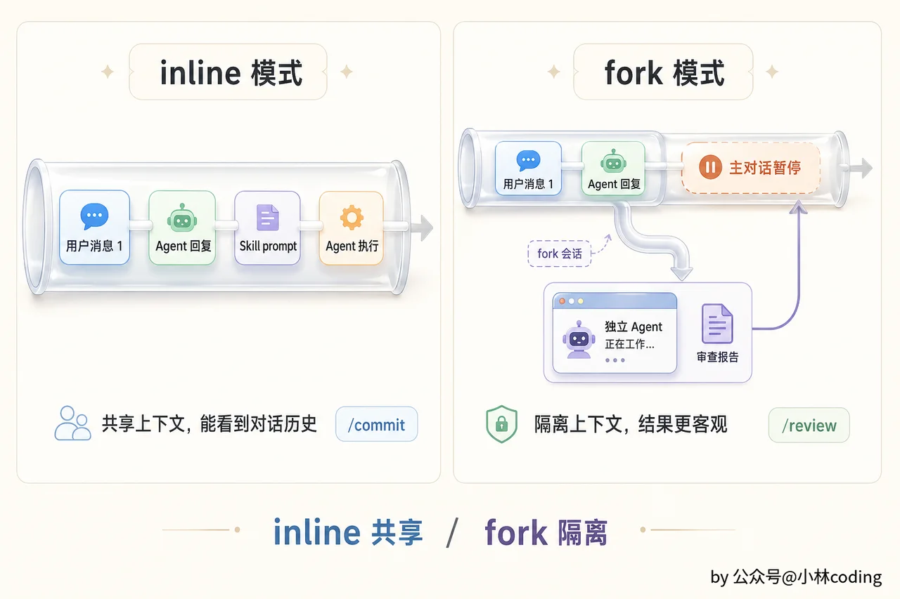

inline 与 fork 模式

Skill 有两种执行模式，这是理解 Skill 系统最重要的概念之一。

先说 `inline` 模式，它是默认模式。Skill 的 prompt 被注入到当前对话中，和正常的用户消息一样走 Agent Loop。Skill 可以看到之前的对话上下文，执行结果也会留在对话历史中。

```Plaintext
[用户消息 1]
[Agent 回复 1]
[用户消息 2]
[Agent 回复 2]
[用户: /commit]           <- Skill 触发
[系统注入 Skill prompt]   <- inline 注入
[Agent 执行 Skill]        <- 能看到消息 1-2 的上下文
[Skill 完成]
[用户消息 3]              <- 能看到 Skill 的执行结果
```

为什么 `/commit` 适合 inline？因为 Agent 可能在前面的对话中已经帮你做了一些代码修改，Skill 需要知道这些修改的上下文才能正确判断哪些文件该 commit。

再说 `fork` 模式。Skill 在一个独立的上下文中执行，不影响也不受当前对话影响。就像开了一个新的 Agent 会话，执行完后只把结果摘要返回到主对话。

```Plaintext
[主对话]                    [fork 会话]
用户消息 1                  
Agent 回复 1               
用户: /review               
  ────────────>           Skill prompt（独立上下文）
  （主对话暂停）              Agent 执行审查
                             读文件、分析代码...
                             生成审查报告
  <────────────           返回审查报告
Agent 显示审查报告
用户消息 3
```

为什么 `/review` 适合 fork？想想看，代码审查应该是客观的。如果 Agent 之前在对话里说了「我觉得这个实现挺好的」，在 inline 模式下这句话会影响审查结果，Agent 可能倾向于给出更正面的评价。fork 模式隔离了上下文，审查结果更客观。

在 frontmatter 中指定执行模式很简单：

```YAML
mode: inline  # 默认
mode: fork    # 独立上下文
```

fork 模式的实现其实很机械。先新建一个独立的 `Conversation` 跟主对话隔开，按 `skill.context` 决定要不要带上下文进去： `full` 把主对话压成一段摘要塞进去， `recent` 直接拷最近 5 条消息， `none` 什么都不塞。

然后把替换好 `$ARGUMENTS` 的 Skill prompt 作为首条用户消息加进去。再用 Skill 指定的 model 和过滤后的工具集创建一个临时 Agent，跑完 Agent Loop 拿到生成的文字内容，最后把这段结果作为一条 assistant 消息塞回主对话。

`skill.context` 这个字段是 fork 模式的灵魂。代码审查这种需要客观判断的场景用 `none` 最稳妥；面试模拟这种需要看到候选人简历摘要的场景用 `full` ；想要带一点背景但又不想被太多对话历史污染的场景用 `recent` 。Skill 作者根据任务性质自己挑。

---

## $ARGUMENTS：让 Skill 接受用户参数

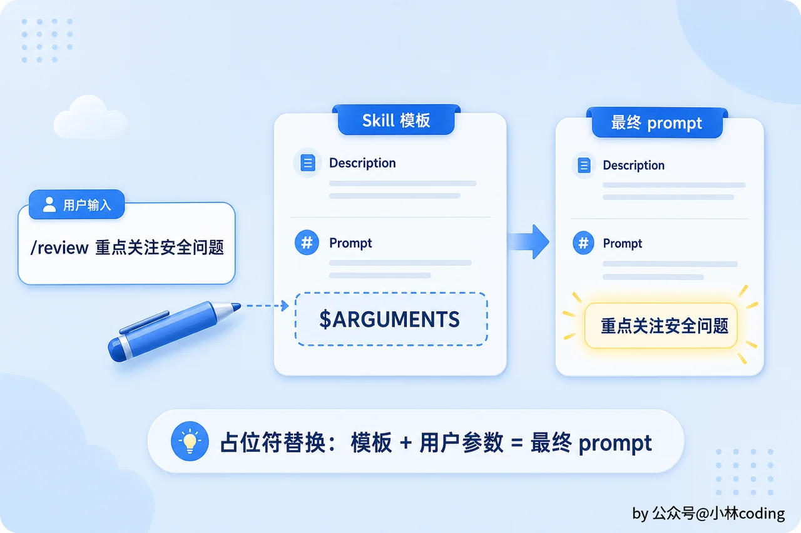

$ARGUMENTS 占位符替换

Skill 的 prompt body 中可以使用 `$ARGUMENTS` 占位符，它会被替换为用户调用 Skill 时传入的参数。

比如 review Skill 的 prompt body 里写了：

```Markdown
请审查以下代码变更。

$ARGUMENTS

如果没有指定审查范围，请审查 `git diff` 的所有变更。
```

用户输入 `/review 重点关注安全问题` ，实际发送给 LLM 的 prompt 就变成了：

```Plaintext
请审查以下代码变更。

重点关注安全问题

如果没有指定审查范围，请审查 `git diff` 的所有变更。
```

如果用户只输入 `/review` 不带参数， `$ARGUMENTS` 会被替换为空字符串。所以在 prompt 里你可以用「如果没有指定...」这样的兜底逻辑来处理无参数的情况。

实现就是一个字符串替换，把 prompt body 里的 `$ARGUMENTS` 全部换成传入的参数即可。

---

## 自动注册为命令：Skill 和 Slash Command 对用户透明

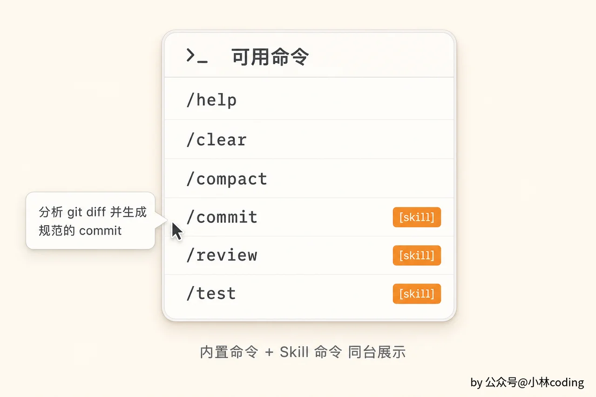

Skill 作为 Slash Command 出现在 /help

Skill 加载后会自动注册为 Slash Command。如果加载了一个 `name: commit` 的 Skill，用户就可以通过 `/commit` 来调用它。

注册过程其实就是复用上一章定义的 `PROMPT` 命令类型。遍历所有 Skill，给每个 Skill 在 Slash Command 注册中心新建一个 `PROMPT` 类型的命令，命令名取 frontmatter 里的 `name` ，描述沿用 `description` 并在末尾追加 `[skill]` 标记。

区别在于 handler。上一章 `/review` 那种 `PROMPT` 命令的 handler 是硬编码的 `handleReview` ，里面直接拼 prompt 字符串。Skill 注册的 handler 则是调用 Skill 执行器，让它去解析对应的 Markdown 文件、走完整的 Skill 流程。

这套注册逻辑里有两个坑值得拎出来说说。

第一个是 **闭包变量捕获** 。handler 是闭包，循环遍历 Skill 时如果直接在闭包里引用循环变量 `skill` ，在 Go 1.22 之前的版本和 JavaScript 等有 for-range 闭包陷阱的语言里，所有命令的 handler 最后都可能指向循环结束时的同一个 Skill。Go 1.22（2024-02 发布）已经修了这个坑，循环变量现在每轮迭代都是新的。即便如此，mewcode 的注册代码仍然写 `captured := name` 显式拷一份再用——这不是为了正确性（新版 Go 自己保证），而是为了告诉后来读代码的人「这里依赖 per-iteration 变量，别想当然」。JS 里同理， `const s = skill` 。不确定语言版本行为时，显式拷贝总没错。

第二个是 **热加载** 。每次执行 Skill 时都重新解析文件，确保拿到最新内容。你修改了 `commit.md` ，下次输入 `/commit` 就会用新的 prompt，不需要重启 MewCode。解析失败时回退到缓存版本，避免一处坏文件把整个命令搞挂。

注册完成后，Skill 和内置命令在用户看来没有区别。都是 `/xxx` 调用，都出现在 `/help` 列表中，都支持 Tab 补全。唯一的区别是 Skill 旁边会标注 `[skill]` ：

```Plaintext
可用命令：
  /help, /h, /?        显示帮助信息
  /compact, /c         压缩上下文
  /clear               清除对话历史
  ...
  /commit [skill]      分析 git diff 并生成规范的 commit
  /review [skill]      审查代码变更
  /test [skill]        运行测试并分析结果
```

除了 Skill 自动注册为命令，还有一个 `/skill` 管理命令用于查看和维护 Skill。 `/skill list` 列出所有已加载的 Skill 及来源， `/skill info <name>` 显示指定 Skill 的完整 frontmatter 和文件路径， `/skill reload` 重新扫描并加载所有 Skill 文件。开发和调试自定义 Skill 时会经常用到 reload。

---

## 意图识别：让 Agent 自己选 Skill

`/commit` 这种显式调用很直观，但有个限制：用户得记住有哪些 Skill、对应什么命令。如果用户说「帮我提交一下」或者「我想做个后端面试准备」，Agent 能不能自动识别意图，主动加载对应的 Skill？

这才是 Skill 更常见的使用方式。

### 两阶段加载

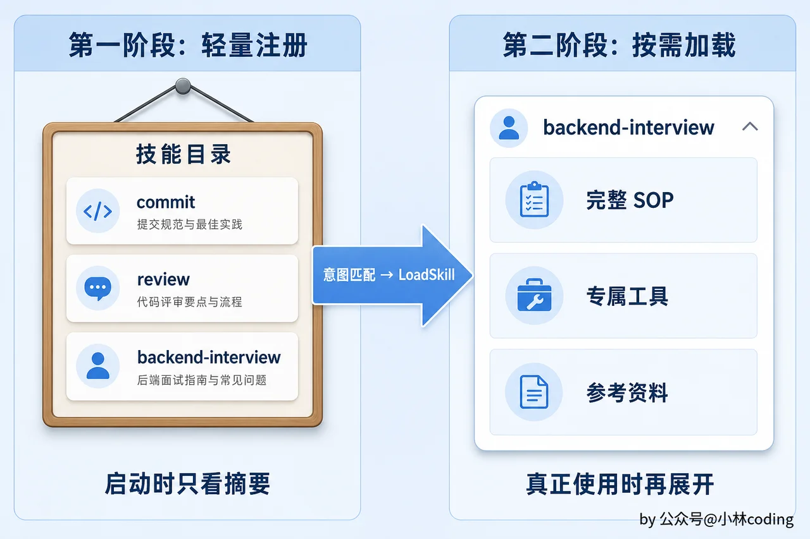

两阶段 Skill 加载

关键思路是把 Skill 的加载拆成两个阶段。

**第一阶段：轻量注册。** MewCode 启动时只加载每个 Skill 的 frontmatter（name、description），不加载完整的 prompt body 和专属工具。这些轻量信息作为系统提示的一段注入，告诉 Agent 有哪些 Skill 可用：

```Plaintext
你可以使用以下 Skill：

- commit：分析 git diff 并生成规范的 commit。
- review：审查代码变更。
- backend-interview：模拟后端技术面试，基于候选人简历生成针对性问题。

如果用户的请求匹配某个 Skill，请调用 LoadSkill 工具加载它。
```

**关于注入位置的取舍。** mewcode 把第一阶段的 Skill 清单放在 system prompt 里（就是上面那段），Claude Code 选了另一条路——每轮把这个清单当作一个 `<system-reminder>` 塞在 user 消息层。前者的好处是落在 prompt cache 的稳定前缀区，Skill 列表反正不常变，缓存收益大；后者的好处是 `/skill reload` 后下一轮立刻见效，但每轮要多带一段 token。两种都跑得通，权衡的是 cache 命中和 reload 即时性。

**第二阶段：按需加载。** 当 Agent 判断用户意图匹配某个 Skill 时，调用 `LoadSkill` 工具。这个工具做三件事：把 SKILL.md 的完整 prompt body **激活到 Agent 的环境上下文** ，加载 `tool.json` 里声明的专属工具并注册到当前会话，最后返回一句简短的确认信息。

这里有个细节值得停下来说说。LoadSkill 没有把 SKILL.md 当成一条普通用户消息塞进对话，而是通过 Agent 内部一个叫 `ActivateSkill` 的机制把它钉到「环境上下文」里。

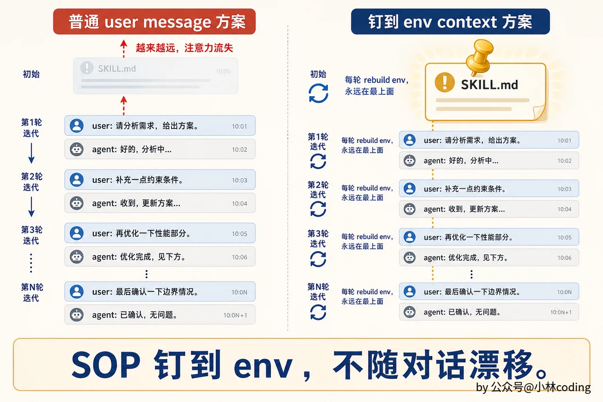

Skill 钉到 env context

为什么要这么搞？

普通用户消息会随着对话越来越往上推。隔几轮 Agent 就得往回翻才能看到 SOP，注意力越来越散。

激活到环境上下文就不一样：每次 Agent Loop 迭代的开头都会重新 build 一次 env context 作为首条 user message，已激活的 SKILL.md 永远在最显眼的位置。这套「每轮重新构建」的注入方式让持续生效的信息不会被对话冲走，Skill 的 SOP 现在也以同样的方式钉进去。

钉到 env context 还有一个意外好处： **嵌套调用时所有激活的 Skill 都能同时看到** 。Skill A 加载完跑到一半，Agent 又判断需要 Skill B，调一次 LoadSkill，B 的 SOP 也被钉进去。下一轮迭代时 env context 里 A 和 B 同时在场，两份 SOP 同时生效。这一点对后面要讲的 Skill 嵌套很关键。

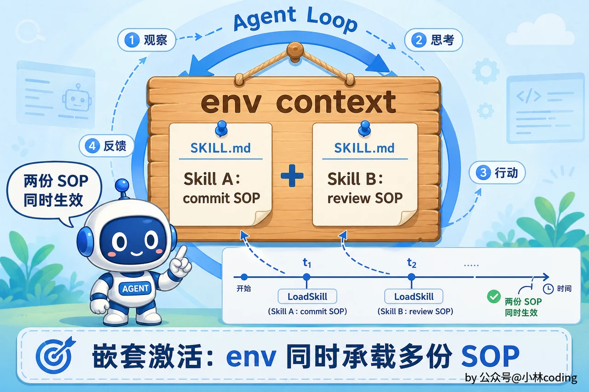

多个 Skill 同时钉在 env

实现上的伪代码精简成几行就够：

```Plaintext
function LoadSkill(name):
    skill = skillLoader.get(name)
    if skill == null:
        return error("unknown skill: " + name)

    // 把完整 SKILL.md 钉到 env context，下一轮迭代起持久可见
    activator.ActivateSkill(skill.name, skill.promptBody)

    // tool.json 里如果声明了主环境没有的新工具，注册进当前会话
    toolCount = registerSkillTools(skill)

    return "Skill " + skill.name + " activated. SOP pinned to env. " +
           toolCount + " specialized tools registered."
```

注意 `tool_result` 没有把 SKILL.md 原样吐回来。SOP 已经钉到 env 里了，Agent 下一轮迭代自然能看到，没必要在 tool\_result 里再重复一份占空间，更不应该靠 tool\_use 历史去维持 SOP 的可见性，那样上下文越长 SOP 越靠后，迟早会被推丢。

最后还有一个安全相关的细节：LoadSkill 标记为 **read-only** ，不会被权限系统拦截。逻辑很直白，它没有外部副作用，只改 Agent 自己的对话状态。如果让用户每次都点一下「允许加载 Skill」，既没意义又会打断流程。这跟之前讲的 ReadFile、Grep 之类的只读工具走同一条权限通道。

激活的 Skill 什么时候清掉？跟着 `/clear` 走。上一章实现的 `/clear` 命令负责清空对话历史、重建 session，现在它要同时调用 `Agent.ClearActiveSkills()` 把已激活 Skill 列表也一并清空。否则新对话开起来，env context 里还残留着上一轮激活的 SOP，会让模型在不该用的场景里照旧往那个方向使劲。激活的 Skill 跟着对话走，对话清了它们也就清了。

顺便讲一下两阶段加载在 token 上的实际开销。第一阶段的 Skill 名称列表落在 system prompt，命中 prompt cache 的稳定前缀区（参第 8 章 prompt cache 那节），就算 30 个 Skill 一起加载，每轮也只是几百 token 的 cache hit，开销很低。第二阶段不一样：激活的 SOP 每轮要重新作为 `<system-reminder>` 注入到 user 消息层，不享受稳定前缀的缓存，这部分按对话轮数累计。所以激活的 Skill 越多、对话越长，第二阶段的累计 token 就越明显。这也是为什么 `/clear` 同时清掉 ActiveSkills——避免上轮不再用的 SOP 继续吃 token。

这就是渐进式披露的完整实现。Agent 平时只看到 Skill 的名称和描述，选择压力很低。一旦确定要用某个 Skill，才加载完整 SOP 和专属工具，注意力集中在当前任务上。

### 目录型 Skill

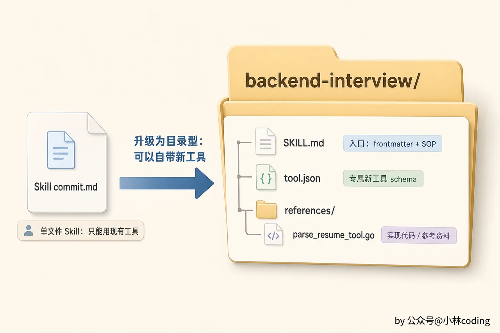

目录型 Skill 结构

回头看上面这套机制，有个细节需要补齐。前面介绍 Skill 时我们把它画成一个 Markdown 文件，但两阶段加载中的专属工具从哪来？ `tool.json` 放在哪？参考资料又该怎么组织？一个文件装不下这些东西。所以支持意图识别和专属工具的 Skill 演化成了一个目录：

```Plaintext
skills/
└── backend-interview/
    ├── SKILL.md               # 入口：frontmatter + SOP 流程
    ├── tool.json              # Skill 专属工具定义（function calling schema）
    └── references/            # 参考资料和工具实现
        └── parse_resume_tool.go
```

`SKILL.md` 是入口，角色和单文件 Skill 一致。 `tool.json` 用于声明这个 Skill 自己 **新增** 的工具，格式和标准 function calling schema 兼容。 `references/` 放置工具实现代码、长文档、API 参考等资源。

这里要把 `tool.json` 和 `allowedTools` 的分工讲清楚，它们是两套不同的东西。

`tool.json` 负责的是 **注册** ：往主环境里塞一个原本不存在的新工具，比如下面例子里的 `parse_resume` 。 `allowedTools` 负责的是 **可见性** ：这个 Skill 在执行时能看到哪些工具，可以是主环境里现成的 Bash、ReadFile，也可以包含自己刚通过 `tool.json` 注册进来的新工具。

两者职责完全不重叠。写 Skill 时不要把已经存在的内置工具再放进 `tool.json` 重复定义。

和单文件 Skill 的区别也就在这里。单文件 Skill 只能使用 MewCode 已有的内置工具和 MCP 工具，目录型 Skill 可以自带专属新工具。比如 `backend-interview` Skill 声明了一个 `parse_resume` 工具，负责解析 PDF/DOCX/Markdown 简历并抽取技术栈和项目经历等结构化信息。SKILL.md 里的 SOP 指导 Agent 先调用 `parse_resume` 获取结构化简历，再基于简历针对性出题，避免让模型自己啃原始格式。

目录型 Skill 还带来另一个常被低估的好处： **整套能力可打包移植** 。整个 `backend-interview/` 目录是一个自包含单元，SOP、工具 schema、工具实现代码、长文档参考、辅助脚本全在里面。

同事写好的 Skill 可以推到 GitHub 仓库或者打成 zip 分发，新人 clone 或解压下来扔进 `~/.mewcode/skills/` ，下次启动 MewCode 就能直接用 `/backend-interview` 调用。团队内部沉淀的最佳实践不再散落在各人的 prompt 收藏夹里，而是变成可被代码评审、可被打版本号、可在 CI 里自动校验的一份配置资产。

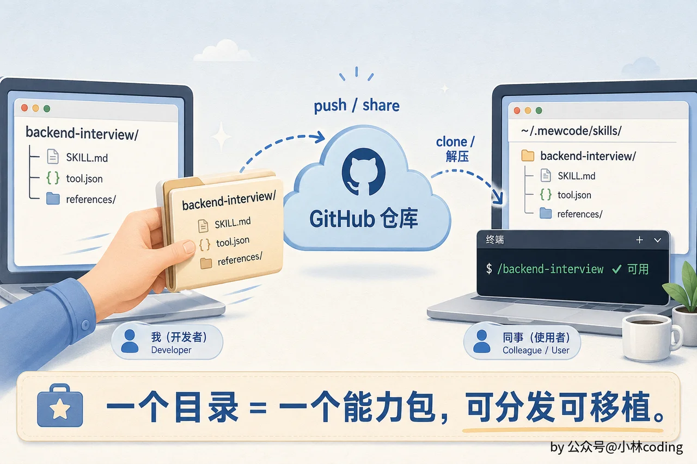

可分发的 Skill 能力包

### 完整流程

把显式命令和意图识别两种方式串起来看：

```Plaintext
1. 启动：扫描 Skill 目录，加载所有 Skill 的 frontmatter（轻量）
   ↓
2. 注入 messages：告诉 Agent 有哪些 Skill 可用（只有 name + description）
   ↓
3. 注册命令：同时注册为 Slash Command，支持 /commit 显式调用
   ↓
4. 用户输入：「帮我做个后端系统设计的面试准备」
   ↓
5. 意图识别：Agent 判断匹配 backend-interview Skill
   ↓
6. Agent 调用 LoadSkill("backend-interview")
   ↓
7. 把完整 SKILL.md 钉到首条 user message 的动态上下文 + 注册 parse_resume 专属工具
   ↓
8. Agent 按 SKILL.md 的 Workflow 执行，按需使用专属工具
```

两种触发方式并存：用户可以直接打 `/commit` 显式调用，也可以用自然语言描述需求让 Agent 自动匹配。无论哪种方式触发，后面的执行流程是一样的。

---

## allowedTools：渐进式披露与安全

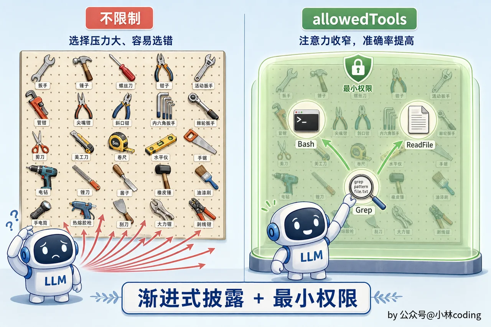

allowedTools 收窄工具注意力

你可能觉得奇怪：工具不是越多越好吗？为什么要限制 Skill 能用哪些工具？

先说准确率。开头提到过，工具太多模型会选错。当 commit Skill 的 `allowedTools` 只列了 Bash、ReadFile、Grep 三个工具，模型在执行时的选择范围从二十几个骤降到 3 个，选错的概率大幅降低。这就是 **渐进式披露** ：每个 Skill 只暴露完成任务所需的工具子集，模型的注意力集中在正确的选择上。

再说安全。想象一个场景：你从网上找到了一个第三方 Skill，下载到 `~/.mewcode/skills/` 目录下。你觉得它是帮你格式化代码的，但实际上它的 prompt 里藏了一段恶意内容，试图诱导 Agent 执行 `rm -rf /` 或者把你的 `.env` 文件内容发到外网。

如果 Skill 可以使用所有工具，这种攻击是完全可能成功的。但如果 Skill 通过 `allowedTools` 限制了只能用 `ReadFile` 和 `Grep` ，那无论 prompt 怎么写，Agent 都执行不了 Bash 命令，也没法修改文件。

这就是「最小权限原则」在 Skill 系统里的体现。每个 Skill 只拥有它完成任务所需的最少工具权限。

```YAML
# commit Skill 需要执行 git 命令，所以给它 Bash
allowedTools:
  - Bash
  - ReadFile
  - Grep

# 如果是一个纯分析性质的 Skill，不需要执行任何命令
allowedTools:
  - ReadFile
  - Grep
  - Glob
```

实现上其实就两步。先看 `allowedTools` 是不是空，空就不限制直接用全部工具，这是为了向后兼容，也方便开发者在信任环境下快速写 Skill。非空就新建一个过滤后的工具注册中心，把 `allowedTools` 里点名的工具从主 registry 里一个个登记进来，剩下的全部丢掉，把这个过滤后的注册中心交给 Agent Loop 用。

还有一个工程实践值得提： **fail-fast 依赖检查** 。Skill 执行的最开头先扫一遍 `allowedTools` ，确认每个名字都能在主 registry 里找到对应的工具。任何一个找不到就立刻报错返回，不要等 Agent 跑起来再失败。

为什么要这么严格？设想一下，你写了个 Skill 声明用 `Bash` ，但你换了个精简版 MewCode 二进制里 Bash 被关掉了，Skill 跑了两轮才发现工具不存在，已经烧掉一些 token，错误信息还埋在一堆中间步骤里。这种「依赖未声明」「依赖丢失」的错误越早暴露越好。

---

## Skill 能不能互相调用

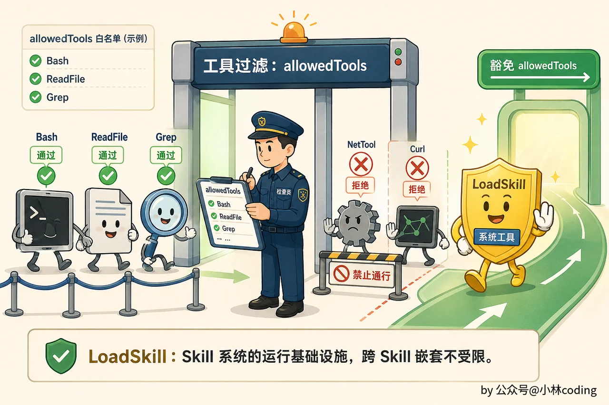

LoadSkill 绕过 allowedTools

前面把 `allowedTools` 讲成了严格的「可见工具白名单」，看完你可能会有一个疑问：Skill A 执行过程中，如果 Agent 判断这事得再走一次 Skill B（比如 commit 的流程中想顺便审查一下代码质量），它怎么触发 Skill B？

按前面的机制， `LoadSkill` 如果没被列进 Skill A 的 `allowedTools` ，Agent 压根看不到这个工具，嵌套就做不成。两种选择：

第一种， **默认禁止嵌套** ，Skill 是闭包，SOP 激活后独占到完成。优点是行为可预测，缺点是失去组合性。写一个大 Skill 想复用小 Skill 的能力，只能把小 Skill 的 prompt 复制过来，冗余且容易失同步。

第二种， **默认允许嵌套** ， `LoadSkill` 对所有 Skill 都可见，Skill 内部能无限制委托其他 Skill。优点是组合性强，缺点是 SOP 可能叠加冲突（两份指令同时给 Agent），嵌套过深还可能成本爆炸。

MewCode 采用第二种，做法是把 `LoadSkill` 标记为 **系统工具** ，工具过滤时不受 `allowedTools` 约束。实现上就是一个小集合：

```Plaintext
var systemToolNames = {"LoadSkill": true}

function filterToolDefs(defs, allowed):
    filtered = []
    for d in defs:
        if d.Name in allowed or d.Name in systemToolNames:
            filtered.append(d)
    return filtered
```

语义上 `allowedTools` 的定位也随之调整：它是 **业务工具白名单** ，约束 Skill 在完成任务时可以调用哪些领域工具。LoadSkill 之所以不在这个管辖范围，关键在于它 **影响的对象不同** 。

把工具分成两类看会更清楚。

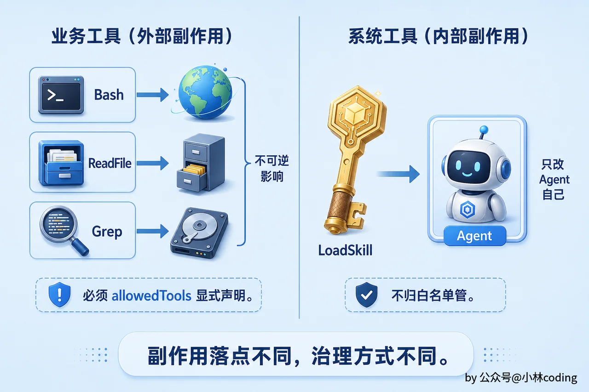

业务工具与系统工具的副作用

Bash、WriteFile 这些工具的作用对象是外部世界，执行命令、写文件都可能产生不可逆的影响——即便 99% 的 Skill 都要用 Bash，也应该每次显式声明。ReadFile、Grep 这类只读工具虽然没有副作用，也要走白名单：不是为了治理副作用，而是为了控制 Skill 能「看到」哪些信息，避免一个本该只看代码的 Skill 顺手把 `.env` 文件读出来回传。所以 allowedTools 同时承担两件事：管副作用 + 管信息可见性。

LoadSkill 则不同。它的作用对象是 Agent 自己。加载一个 Skill，就是把那个 Skill 的 SOP 和工具挂到当前会话里，副作用只在 Agent 内部循环，不产生外部影响。这种工具是 Skill 系统的运行基础设施，交给 Skill 作者逐个授权既多余也没意义。

允许嵌套之后有一个问题要提一下： **反复加载同一个 Skill** 。这里 MewCode 不做特殊防御，依赖模型自觉。当前主流模型都能识别「SOP 已经激活，不用再加载」，除非是能力非常落后的模型。

另一个问题是 **嵌套深度失控** ：Skill A → B → C → ... 无限下去。inline 嵌套会被 Agent 的 MaxIterations 自然封顶，而且现代大模型的智商一般不会这样。fork 嵌套跨越 Agent 边界，每次新建一个子 Agent，这里需要显式记录父子链路和深度，但主要是为了可观测性和调试，不为主动限制。具体的嵌套防御机制——Fork 不能再 Fork、后台 Agent 禁止 spawn——放在下一章 SubAgent 实现的「父子链路」那节展开。

除了「总是开放 LoadSkill」这条路线，其他可选的嵌套策略也值得了解。

一种是 **自然语言让渡** 。Skill A 跑完后在文本里建议「你接下来可以 /review」，让用户决定是否继续，框架不做任何自动化。一种是 **显式委托** 。Skill 的 frontmatter 声明 `canDelegateTo: [review]` ，只允许特定目标，相当于给嵌套关系加类型系统。还有一种是 **Pipeline** 。把串行关系抽出来放 frontmatter，框架负责按顺序调度。

这几种各有适用场景，MewCode 选择了最宽松的默认值，把权衡交给 Skill 作者在 SOP 里写清楚。

---

## 三个内置 Skill

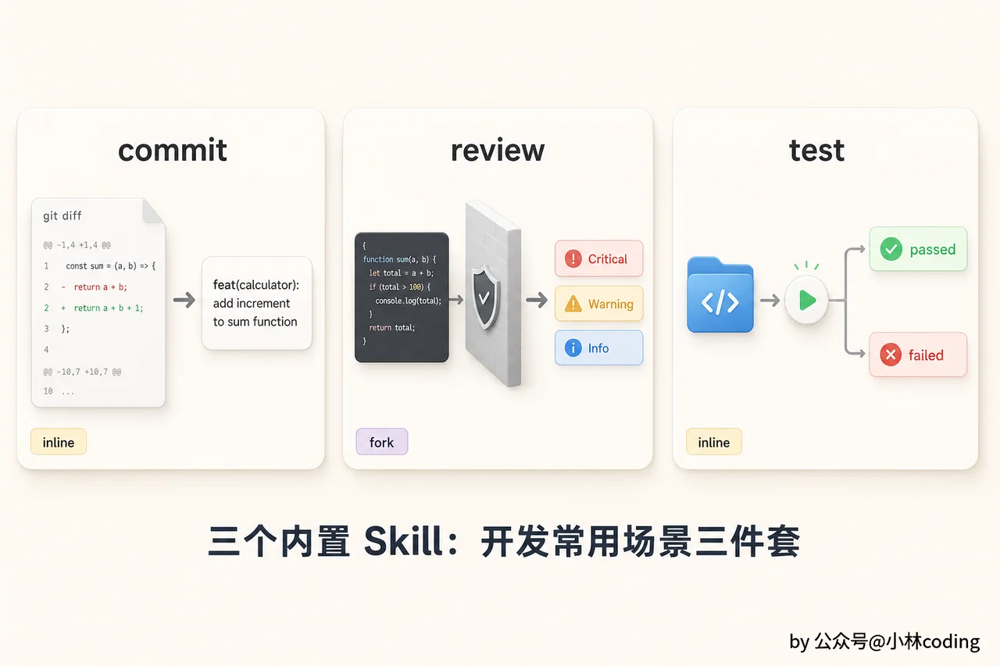

三个内置 Skill 总览

MewCode 内置三个 Skill，覆盖最常用的开发场景。它们既是用户能直接使用的生产力工具，也是写自定义 Skill 时的参考模板。下面分别看看每个 Skill 的设计思路。

### commit：分析 diff 并生成规范的提交

`commit` 用来把一堆变更打包成一个规范的 git commit。流程很机械：先 `git status` 看全局，再 `git diff` 和 `git diff --staged` 看细节，区分 staged 和 unstaged 变更，按内容生成 conventional commit 格式的 message，逐个 `git add` 而不是 `git add -A` ，最后 `git commit` 。如果变更覆盖了超过 10 个文件，会主动建议用户拆分。

为什么特意强调逐个 add？因为 `git add -A` 容易把不该提交的文件，像 `.env` 、调试用的临时脚本，一股脑带进来。逐文件添加给了 Skill 一个机会去判断每份改动该不该上车，跟你手动 commit 时的习惯一样。

模式上 commit 用 inline。前面的对话里 Agent 可能刚帮你做了几处代码修改，这些修改的语义是判断该 commit 哪些文件、写什么 message 的关键依据。fork 切断这条信息流就完全做不出准确判断了。

### review：在隔离上下文里做客观审查

`review` 负责代码审查。上一章我们把 `/review` 硬编码成了 `PROMPT` 类型的 Slash Command，这一章把它升级为 Skill。升级带来两个明显的好处：prompt 从源代码搬到了 Markdown 文件，调整审查维度不再需要重新编译；执行时改用 fork 模式隔离上下文，审查结果不受对话历史污染。

为什么 review 必须 fork？回想一下场景：你跟 Agent 一起写完一段代码，转头让它审查。inline 模式下 Agent 之前说过「这个实现挺好的」，这种自我认同会让它倾向于给自己的代码打高分。fork 直接把对话历史切掉，相当于换一个全新的审查视角进来，结果客观得多。

具体审查按五个维度展开：逻辑正确性、安全性、性能、代码风格、可维护性。报告按严重程度分级： `Critical` 必须修复、 `Warning` 建议修复、 `Info` 可以改进。代码质量好时也会给出正面反馈，避免它变成只会挑毛病的工具。

### test：跑测试并区分代码与测试本身的问题

`test` 负责运行测试并分析结果。流程分三步：先根据项目配置文件检测项目类型，决定用 `go test` 、 `pytest` 还是 `npm test` ；再跑这些命令；最后分析输出。

最关键的能力是 **区分两种失败** 。一种是代码本身有 bug 导致测试失败，要去改源码；另一种是测试自己写错了，要去改测试。这两种修复方向完全不同，分错了往错的方向使劲就一直绕弯。Agent 通过对比断言期望和实际行为、再翻一下相关代码上下文来做这个判断。

如果所有测试通过，它还会报告覆盖率并指出可能缺少的测试场景，比如边界值、错误路径。全绿不等于测试充分，这一步是把「看起来没问题」和「真的没问题」区分开。

模式上 test 用 inline。你跑测试通常是为了验证刚刚讨论或修改的代码，前面对话里 Agent 做的改动能帮 Skill 在分析失败时直接定位到相关位置，不必重新摸索整个项目。

三个 Skill 的 Markdown 定义文件都通过资源嵌入机制编译进二进制，跟 MewCode 一起分发。

---

## Skill 在工具生态中的位置

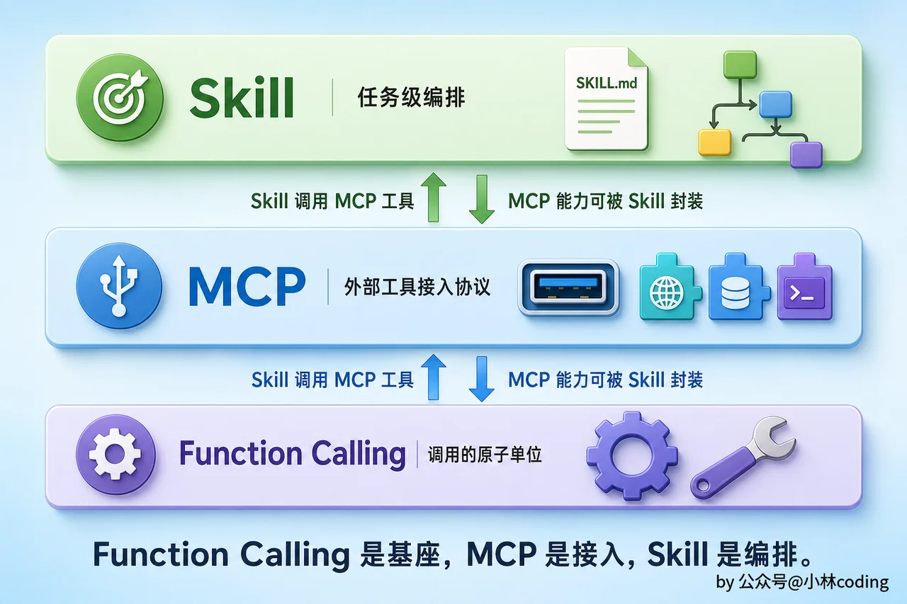

Skill 在工具生态中的位置

到这一章为止，MewCode 围绕工具建立了多层体系。

最底层是 Function Calling，就是前面实现的 Tool 接口，工具调用的原子单位，每次调用做一件具体的事情。MCP 在此之上提供了开放的工具接入协议，让第三方工具标准化接入。Skill 则在更高层面组织这些工具，把一组相关的工具调用编排成任务级工作流，配上 SOP 指令和上下文控制。

三者是互补关系。Function Calling 负责调用，MCP 负责接入，Skill 负责编排。

一个 Skill 可以调用 MCP 工具，比如 commit Skill 调用 GitHub MCP Server 来创建 PR；反过来，MCP Server 的能力也可以通过 Skill 封装成面向用户的任务流程。当工具太多导致模型调不准时，Skill 通过两阶段加载、 `allowedTools` 和 SOP 把范围收窄；当需要接入外部能力时，MCP 提供标准化通道。它们以 Function Calling 为基座，构成了 Agent 工具协作的生态。

随着 Agent 的发展，这些范式之间会进一步交融。Skill 可以封装为 MCP Server 给外部使用，也可以在内部调用 MCP 工具。Skill 的复杂度增长后，可能出现 Skill 嵌套调用 Skill 的模式，或者通过后面的 SubAgent 和 Agent Team 来进一步分解任务。这些机制各自解决不同层面的问题，合在一起构成了 Agent 工具调用与协作的完整生态。

---

## 本章小结

Skill 系统解决了两个核心问题：让可复用的 AI 操作变成可编辑的 Markdown 文件，同时通过渐进式披露提高模型的工具调用准确率。两阶段加载让 Agent 平时只看到 Skill 的名称和描述，按需加载完整内容和专属工具。 `allowedTools` 在保障安全的同时把模型的注意力收窄到正确的工具上，inline 和 fork 两种执行模式覆盖了不同的上下文需求。

团队可以积累和共享 Skill，个人可以定制自己的工作流。随着 Skill 库的丰富，MewCode 的能力会持续增长。从开篇到现在，MewCode 已经从一个空壳项目长成了具备完整工具生态的 Coding Agent：对话、工具、自主循环、安全权限、开放工具生态、上下文管理、跨会话记忆、命令系统、可复用技能。下面几章还会加上 Hook、SubAgent、Worktree 这些让它真正在团队里跑起来的能力。