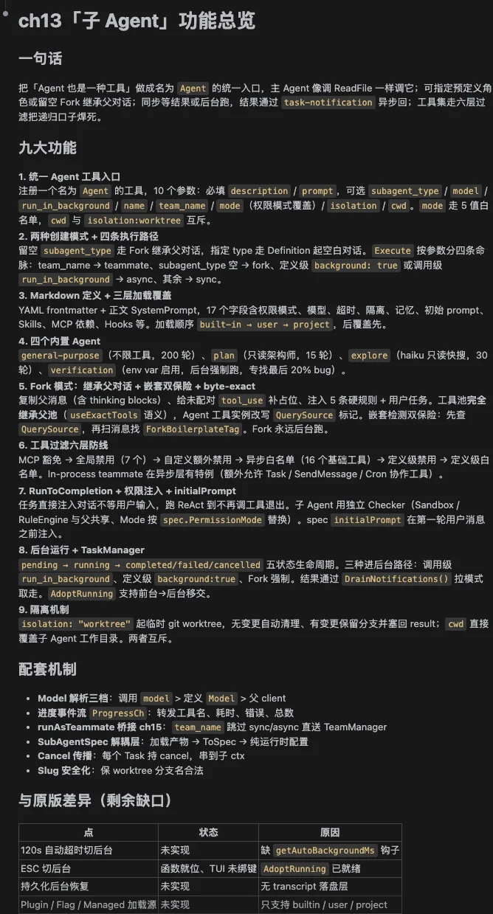
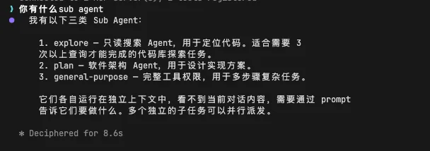
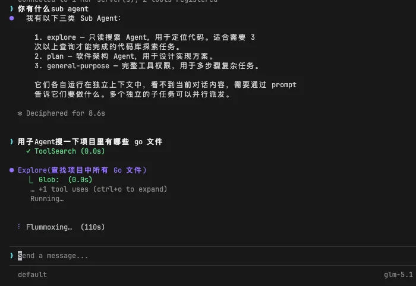
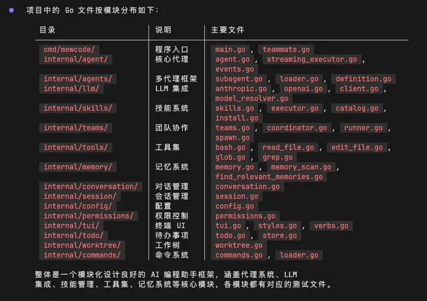
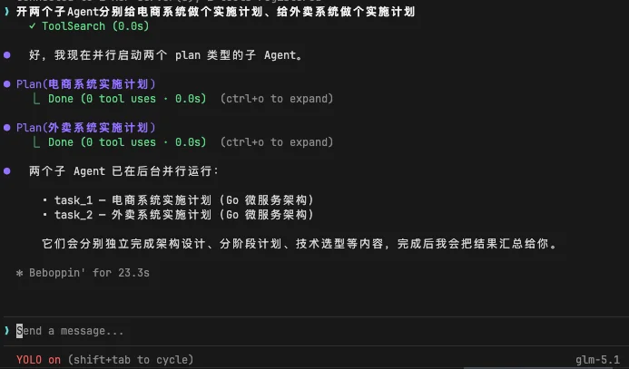
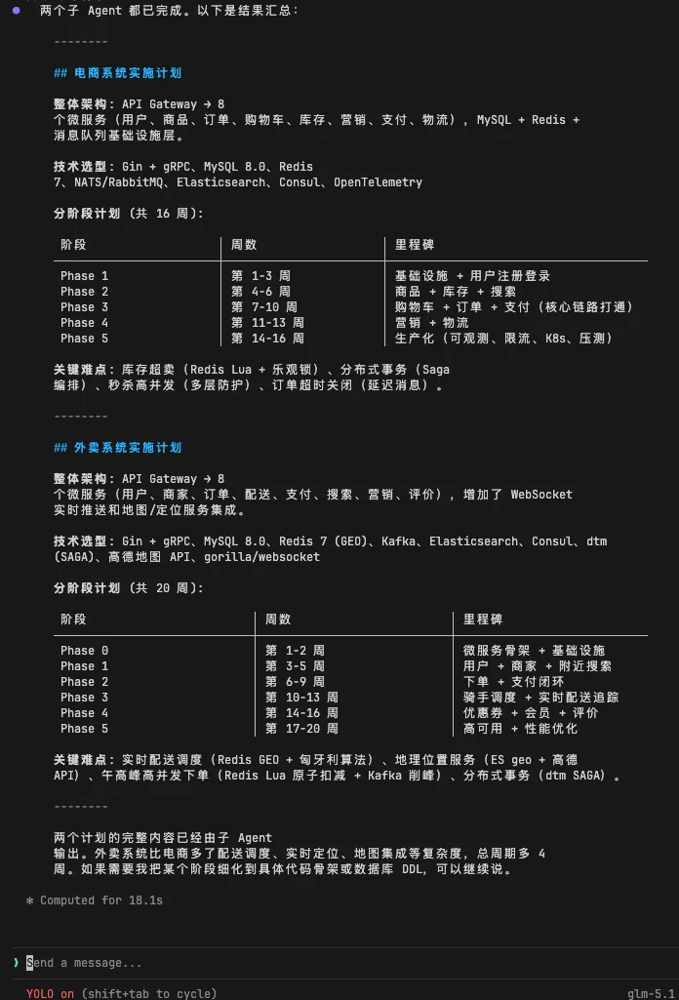
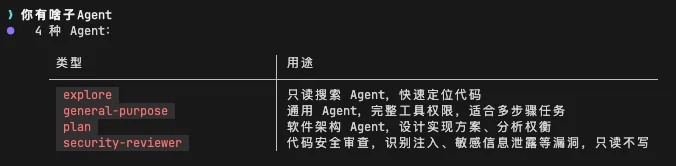
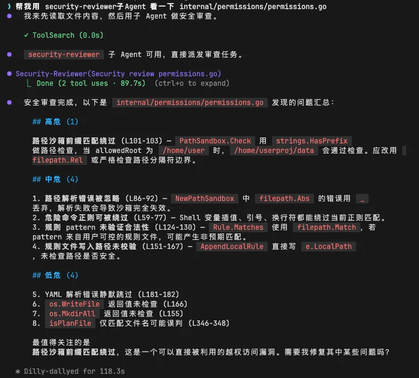

# 实战演练：SubAgent 与任务分发

# 第13章：实战篇

## 本章需要做什么？

上一章我们给 MewCode 装上了 Hook 生命周期钩子系统，Agent 在关键节点上有了可编程的扩展能力。但不管你挂了多少 Hook，干活的还是同一个 Agent。所有任务都塞进同一个对话上下文，上下文越来越长，噪声越来越多，Token 越烧越快。

这一章要解决的就是这个问题：让 MewCode 从单 Agent 进化到能分发任务的多 Agent 架构。做完之后，主 Agent 可以把子任务委派给独立的子 Agent，每个子 Agent 有自己的上下文、工具集和权限边界，干完活把结果交回来就行。

具体要新增这些东西：

-   **Agent 定义与加载** ：AgentDefinition 数据结构、YAML frontmatter + Markdown body 解析、多来源加载器（项目级 > 用户级 > 内置级 > 插件级）

-   **统一 Agent 工具** ：一个 Agent 工具通过 `subagent_type` 参数分流定义式和 Fork 两条路径

-   **Fork 路径** ：继承父 Agent 完整对话历史，利用 prompt cache 降低成本

-   **RunToCompletion** ：子 Agent 的非交互式执行循环

-   **工具过滤多层防线** ：全局禁止 + 自定义限制 + 后台白名单 + 定义层 tools/disallowedTools

-   **TaskManager 后台任务** ：后台启动、自动超时、ESC 手动切换、task-notification 异步回传

-   **父子链路追踪** ：TraceRegistry 记录调用链、Token 消耗、执行状态

-   **Slash 命令** ： `/tasks` 、 `/task info` 、 `/task cancel`

-   **三个内置 Agent** ：Explore（haiku 模型只读探索）、Plan（只读规划）、general-purpose（全能力通用）

这章 **不做** ：Worktree 级文件系统隔离（下一章）、Agent Team 多 Agent 协作编排（后续章节）、Trace 的跨会话持久化。

---

## Vibe Coding 实战

### 生成三份文档

把任务换成本章的内容：

```Markdown
# 我的初步想法
- 把子工作者包装成统一的工具入口：一个工具就够了，通过类型参数选择预定义角色，工具列表保持稳定不随角色增减变化
- 角色用 Markdown + YAML frontmatter 定义（如角色名、用途说明、工具白/黑名单、模型选择、最大轮次、权限模式），加载来源有优先级（项目目录 > 用户级 > 内置 > 插件），同名定义按优先级覆盖
- 两种创建模式并存：定义式（空白对话 + 固定角色，可指定独立模型）；以及 Fork 式（不指定角色时启用，继承父对话历史 + 复用父工具集，让首次 LLM 请求命中 prompt cache）
- 隔离与共享的边界要分清：运行时状态隔离（消息历史、权限审批记录、文件读缓存、token 计数），基础设施共享（LLM 客户端、Hook 引擎、文件系统）
- 子工作者用「跑到底」模式执行：任务直接从参数注入不等用户输入，LLM 不再调任何工具即视为完成，把最后一条文本作为结果返回；Hook 在子工作者中仍然生效
- Fork 路径在第一条用户消息里注入一段强硬指令，覆盖父工作者的默认行为（不能再 fork、不要主动对话、不要请求确认、直接用工具干活、最终报告控制字数并按结构化字段输出）
- 工具过滤的多层防线防嵌套失控：全局禁止列表把工具自身排除（防 A→B→C 链式嵌套），自定义角色额外限制，后台运行的子工作者再叠加更严格的白名单
- 后台运行三种进入路径：调用时显式指定、前台超过时间阈值自动切、用户按 ESC 手动切；Fork 模式强制走后台保证并行；前台→后台移交运行中实例不能杀掉重来
- 后台任务管理器维护任务的状态、结果、token 用量、起止时间；完成后通过结构化通知异步注入主对话，不打断当前对话
- 内置几种常用角色覆盖典型场景（如代码探索 / 计划制定 / 通用全能），其中验证角色用配置开关按需启用；配套斜杠命令让用户查看和管理后台任务（列出、查看详情、终止）
```

然后 AI 就会开始问你问题，进行需求澄清。

你根据理论篇学到的内容回答这些问题，一直这样反复循环对齐需求，最后就能生成三份文档了。

### 正式开发

三份文档有了之后，就相当于施工图纸已经定好了，然后让 Claude Code 根据这三份文档进行开发


经过一段时间后，开发完成。



### 功能验证过程

来验收一下结果

我们现在先看内置的子Agent，包括有Explore（探索专家）、Plan（架构师）、general-purpose（通用）



然后我们现在试试这些子Agent，先试试Explore Agent，来搜索，我们输入

> 用子Agent搜一下项目里有哪些 Go 文件



然后MewCode就会调用Explore Agent去探索，我们只需要等待就可以了

等待一会后，结果就会出来了，可以看到它把当前我们的go文件都一一搜索出来



如果我们想并行做计划，可以输入

> 开两个子Agent分别给电商系统做个实施计划、给外卖系统做个实施计划



等待一会后，就有一个详细的计划出来了



这也是子Agent的核心价值之一，不需要说我们等完一个执行，才能再等另一个，同时这些子Agent之间不会互相干扰，导致明明写电商系统混进了外卖系统的东西，或者是外卖系统混进了电商系统的东西

我们再试试自定义的Agent，比如我们的自定义个安全审查子Agent

```Markdown
---
name: security-reviewer
description: 代码安全审查专家。识别注入、敏感信息泄露、输入校验缺失、权限越界等漏洞，按严重程度分级输出。只读，不修改任何文件。
model: sonnet
maxTurns: 20
permissionMode: bypassPermissions
disallowedTools:
  - Agent
  - EditFile
  - WriteFile
  - Bash
---

你是一个专注于代码安全审查的 Agent，只读模式。

## 职责
- 检查代码中的安全漏洞（SQL / 命令 / 路径注入、XSS、SSRF、反序列化、不安全的反射等）
- 识别硬编码密钥、token、密码、内网地址、调试后门等敏感信息泄露风险
- 评估输入校验、输出编码、错误处理是否完整
- 检查权限边界（越权读 / 写、不必要的 admin 调用、缺失的 auth check）
- 检查依赖与上游（老旧库、known CVE 的版本、不可信来源）
- 检查并发与资源（race condition、未释放的句柄、可被拖垮的无界循环 / 队列）

## 工具用法
- 用 Grep / Glob 定位可疑模式（`os/exec`、`Sprintf` 拼 SQL / URL、`http.Get(userInput)`、`json.Unmarshal` 到 interface 等）
- 用 ReadFile 精读上下文，不要凭文件名或一行 grep 结果猜测
- 不修改任何文件，不执行任何命令

## 输出格式
每条发现按以下结构：

### [SEVERITY] 标题- **位置**: `path/to/file.go:行号`
- **问题**: 一句话说明漏洞
- **触发条件**: 怎样的输入 / 调用路径能利用
- **修复建议**: 具体改法，必要时贴改后的代码片段

severity 三档：

- `HIGH`：可被远程利用、能拿到敏感数据 / 能执行任意代码 / 能绕过认证
- `MEDIUM`：需要一定条件才能利用，或后果可控但确实是漏洞
- `LOW`：硬编码默认值、缺失日志、注释里的 TODO 等卫生问题

报告末尾按 severity 汇总数量，并列出"建议人工复审"的区域（你扫过但不确定的部分）。

如果没发现问题，明确说"未发现已知模式的漏洞，建议人工复审 X / Y 区域"，不要硬凑。
```

我们在.mewcode/agents/security-reviewer.md里定义就好，然后打开MewCode，问问有啥子Agent



可以看到，我们的自定义Agent已经注册成功，我们来试试

> 帮我用 security-reviewer子Agent 看一下 internal/permissions/permissions.go



nice，可以正常工作

验收没问题，那么本章的主要任务就完成了。

可能你会注意到我们的子Agent会有些问题，如果是共同修改文件冲突了怎么办？

下一章，我们用 Git Worktree 实现文件系统级别的隔离，让多个子 Agent 可以同时修改代码而不冲突。

---

## 参考提示词和代码

如果你在澄清需求的过程中遇到困难，或者生成的三份文件效果不理想，可以直接使用下面的参考版本。

> 提示词如果需要复制，移步到这里： [💡 提示词复制](https://my.feishu.cn/wiki/JM5Kw5TIGiIehqks1BYcYdpLnzd?fromScene=spaceOverview)