# SubAgent 与任务分发

---

## 当一个 Agent 扛不住的时候

到目前为止，MewCode 的 Agent 是一个「全能选手」。用户说什么它就做什么，所有任务都在同一个对话上下文里执行。一路走来，它已经能读文件、写代码、执行命令、记住你的偏好、在安全边界内工作，甚至还能通过 Hook 自动化一些流程。看上去挺完美的。

但用着用着，你会撞上一个根本性的问题。

想象这个场景：你让 Agent 帮你重构一个模块。Agent 先读了 20 个文件了解代码结构，然后修改了 5 个文件，过程中产生了大量的工具调用和中间结果。一切顺利。

然后你随口说了一句：「顺便帮我写一下这个函数的单元测试。」

问题来了。Agent 的上下文里堆满了重构过程中的中间信息：读取的文件内容、修改的 diff、编译错误、修复过程。这些信息对写测试来说全是噪声。Agent 要在一大堆无关信息中翻找写测试需要的上下文。Token 消耗飙升，响应质量下降。

这个问题有个名字，叫「上下文污染」。

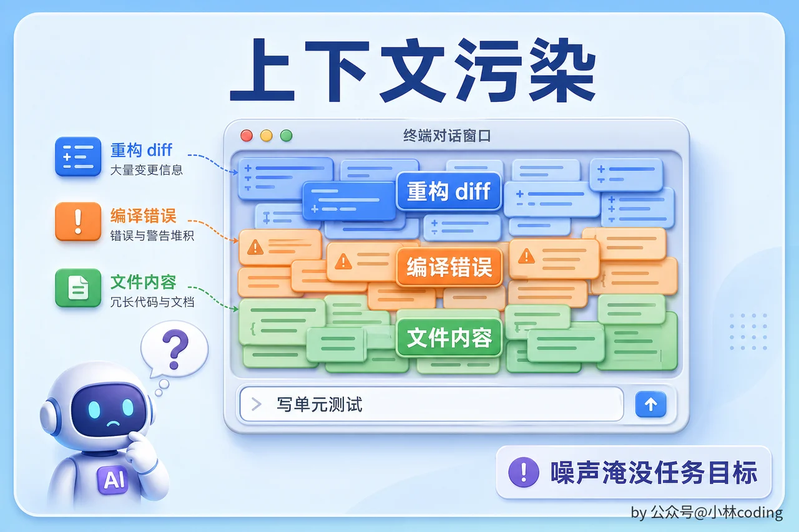

上下文污染终端噪声

更糟糕的情况是这样的：你让 Agent 同时做两件毫不相干的事。「一边帮我查一下这个 bug，一边帮我更新一下 README。」这两个任务的上下文完全不同，但它们被塞进了同一个对话窗口。查 bug 读取的堆栈信息干扰了 README 的写作，README 的格式讨论又干扰了 bug 分析。

就好像让一个人同时接两个电话。理论上可以，实际上两边都听不清。

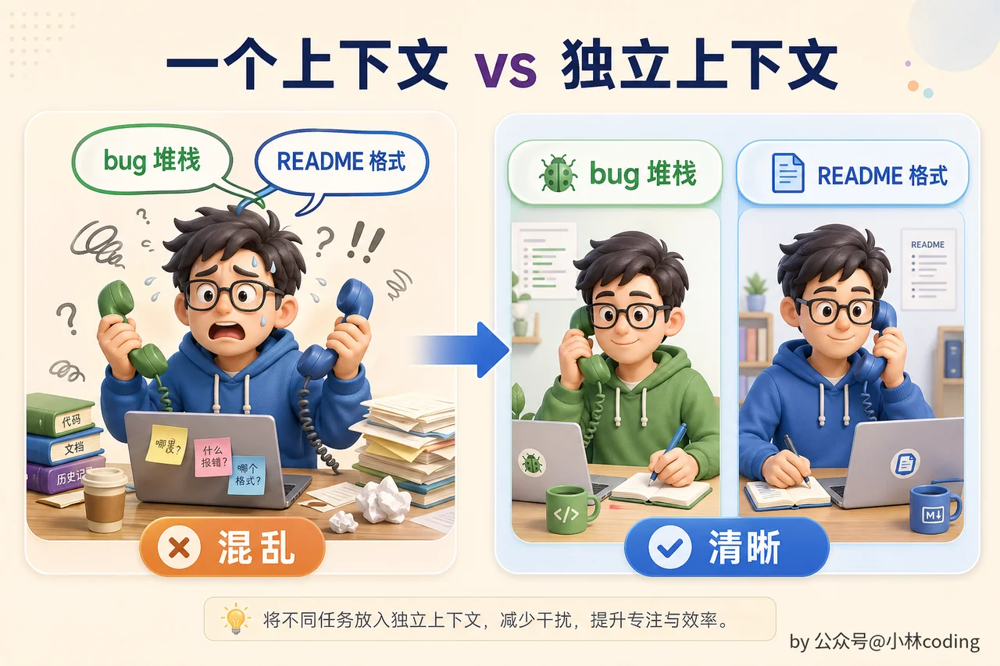

一个上下文 vs 独立上下文

怎么解决？思路其实很简单：既然一个 Agent 的上下文被污染了，那就创建一个新的 Agent，给它一个干净的上下文，让它专门去做那件事。做完了把结果拿回来就行。

---

## 一个关键洞察：Agent 也是一种工具

在开始设计之前，我想先聊一个决定了整个 SubAgent 架构走向的洞察。

回顾一下前面定义的 Tool 接口。用伪代码来说，它长这样：

```Plaintext
interface Tool:
    name() -> string
    description() -> string
    parameters() -> ParameterSchema
    execute(context, params) -> (string, error)
```

你仔细看看这个接口。它描述的是什么？一个有名字、有描述、接受参数、返回结果的可执行单元。

现在想想一个 Agent。它是什么？也是一个有名字、有描述、接受一个任务（参数）、返回一个结果的可执行单元。

发现了吗？Agent 和 Tool 的抽象是同构的。

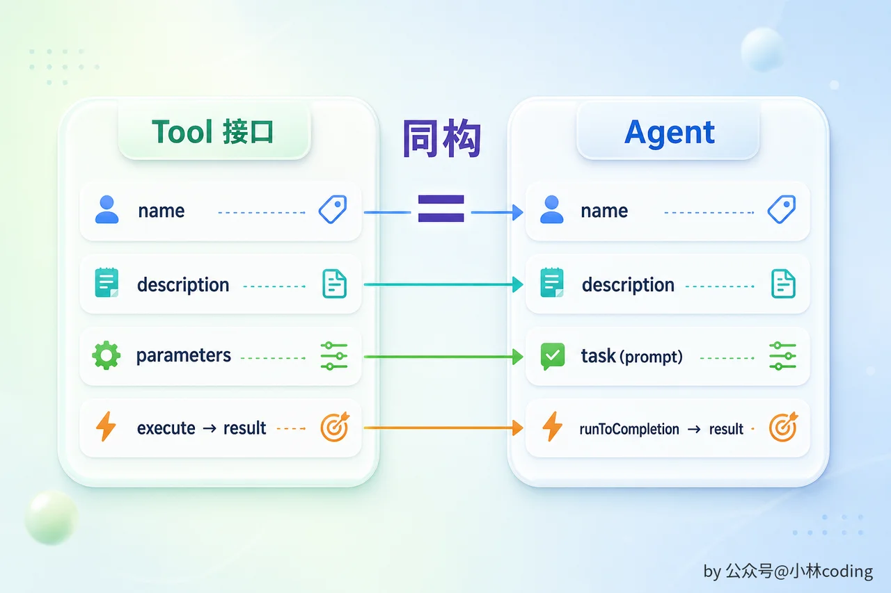

Tool 接口与 Agent 同构

这意味着我们可以把 Agent 包装成一个 Tool，注册到 ToolRegistry 里。主 Agent 在推理的时候，如果判断某个子任务应该交给一个专门的 Agent 来做，它就调用这个 Agent 工具，就像调用 Bash 或 ReadFile 一样自然。

具体的设计是：注册 **一个** Agent 工具，通过参数选择不同的 Agent 类型。先看参数部分：

```Plaintext
class AgentTool implements Tool:
    function name():
        return "Agent"

    function parameters():
        return {
            prompt:            {type: string, required: true},
            description:       {type: string, required: true},
            subagent_type:     {type: string, optional: true},
            model:             {type: string, optional: true},
            run_in_background: {type: bool,   optional: true},
            name:              {type: string, optional: true},
            isolation:         {type: string, optional: true},
        }
```

`prompt` 和 `description` 是必填的，其他全是可选的。 `subagent_type` 用来指定预定义的 Agent 类型，比如 `Explore` 或 `Plan` ，留空时走 Fork 路径，后面会讲。 `model` 可以在调用时覆盖定义文件里的模型。 `run_in_background` 决定同步还是异步执行。 `name` 给 Agent 命名，以便后续通过 SendMessage 发消息给它。 `isolation` 启用文件系统隔离。

把这些选项放在调用侧，主 Agent 就可以根据任务的具体情况灵活选择。

再看执行逻辑：

```Plaintext
    function execute(context, params):
        definition = agentRegistry.resolve(params.subagent_type)
        subAgent = createAgent(context, definition, params)
        result = subAgent.runToCompletion(context, params.prompt)
        return result
```

为什么是一个统一的 Agent 工具，而不是给每个 Agent 类型注册一个 `agent_explore` 、 `agent_plan` ？因为 Agent 类型可以动态加载。用户在项目目录里新建一个定义文件，下次调用就能用。如果每个类型都注册一个独立工具，工具列表会随着定义文件的增减而变化，系统提示也要跟着重新渲染。统一成一个 Agent 工具，通过 `subagent_type` 参数选择类型，工具列表始终稳定。

主 Agent 完全不需要知道调用子 Agent 和调用普通工具有什么区别。在它看来，Agent 和 ReadFile 都是工具，调用方式一模一样。子 Agent 在独立的上下文中完成任务，返回结果给主 Agent。主 Agent 的上下文不会被子任务的中间过程污染。

顺便说一句横向定位。Coding Agent 之外的多 Agent 框架（CrewAI、AutoGen）大多走的是平等协作或群聊路线，多个 Agent 之间互发消息商量怎么做。MewCode 的 SubAgent 不一样——它是主从分发：主 Agent 是唯一调度者，子 Agent 收到任务、做完、把结果回报。两种范式各有适用场景，coding 场景里主从分发更稳定，因为主 Agent 一直掌握全局状态，不容易陷入多 Agent 互相等待的循环。

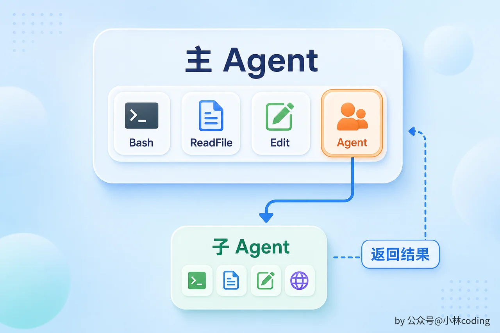

Agent 工具委派子 Agent

---

## 两种创建模式：你要专家还是助手

SubAgent 有两种创建方式，适用于完全不同的场景。搞清楚什么时候用哪种，是用好 SubAgent 的关键。

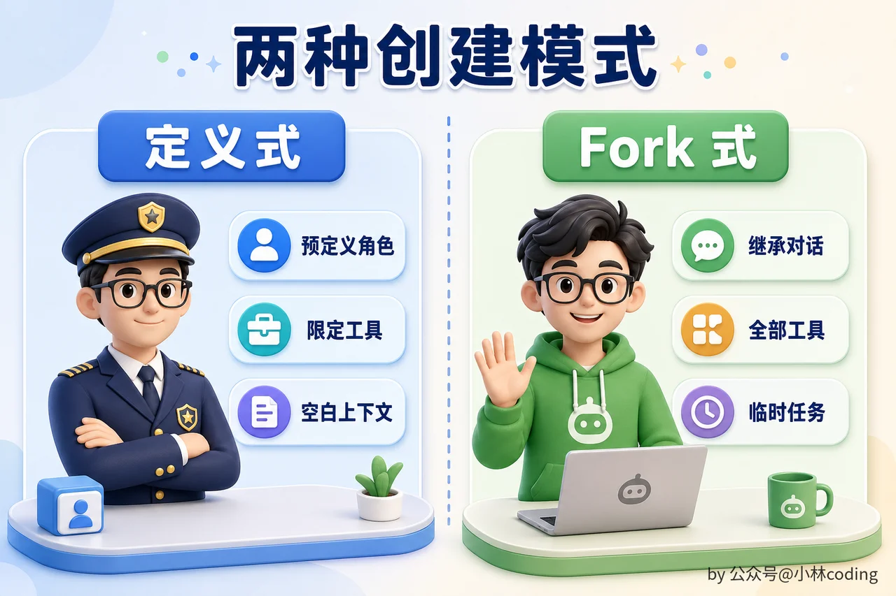

定义式与 Fork 式对比

### 定义式：预定义的专家

第一种叫「定义式」，英文叫 Definition-based。你预先定义好一个 SubAgent 的角色、能力和行为规范。它是谁，能做什么，不能做什么，全部白纸黑字写清楚。

举个例子，你可以定义一个专门做代码安全审查的 SubAgent：

```YAML
# .mewcode/agents/security-reviewer.md
---
name: security-reviewer
description: 专注于代码安全审查的子 Agent
disallowedTools:
  - Agent
  - Edit
  - Write
  - Bash
  - NotebookEdit
maxTurns: 20
---

你是一个专注于代码安全审查的 Agent。

## 职责
- 检查代码中的安全漏洞
- 识别敏感信息泄露风险
- 评估输入验证和输出编码

## 规则
- 只读取代码，不修改任何文件
- 按严重程度分级报告
- 给出具体的修复建议
```

注意看它的 `disallowedTools` ：排除了 Agent、Edit、Write、Bash、NotebookEdit。这意味着这个 SubAgent 不能写文件、不能执行命令、不能再 spawn 子 Agent。它是一个只读的专家。

为什么要这么限制？因为安全审查这件事，本来就不应该修改代码。限制了工具集，一方面减少了出错的可能，另一方面也让你可以放心地自动批准它的工具调用，不需要每次都弹窗确认。

这就像公司里的安全审计员。他可以查看任何代码和文档，但不能修改任何东西。权限和角色匹配，才能各司其职。

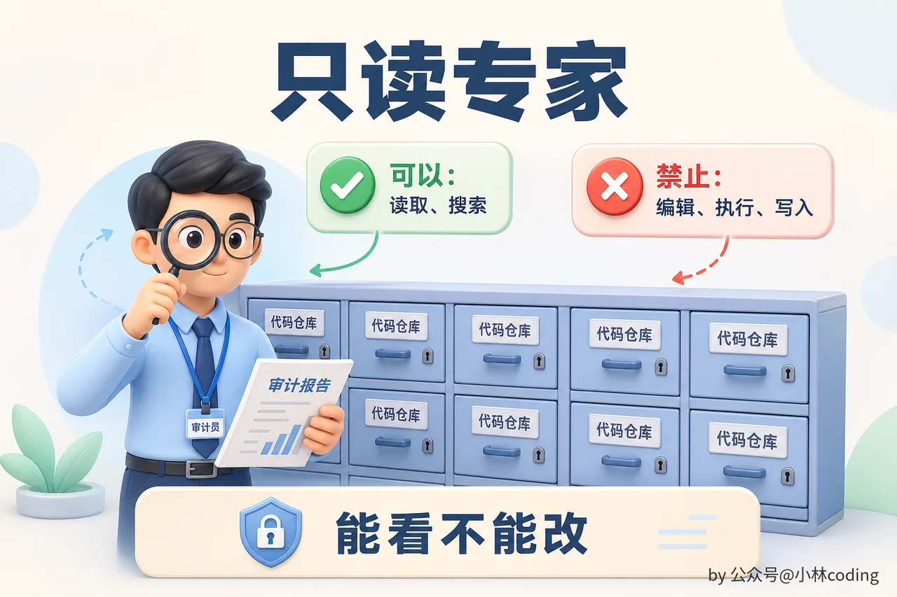

只读专家能力边界

### Fork 式：继承上下文的临时助手

第二种叫「Fork 式」，英文叫 Fork-based。当调用 Agent 工具时不指定 `subagent_type` ，就会走 Fork 路径。Fork 和定义式有几个根本区别，最直接的一个是： **Fork 子 Agent 继承父 Agent 的完整对话历史** 。

```Plaintext
function fork(parentAgent, task):
    forkedMessages = buildForkedMessages(parentAgent.conversation)
    child = new Agent(
        llm:          parentAgent.llm,
        tools:        parentAgent.tools,
        hooks:        parentAgent.hooks,
        systemPrompt: parentAgent.renderedSystemPrompt,
        conversation: forkedMessages,            // 继承父 Agent 的对话历史
        permissions:  new PermissionTracker(),   // 独立权限追踪
        fileCache:    cloneFileStateCache(),     // 独立文件缓存
    )
    return child
```

和定义式一样，权限追踪和文件缓存是隔离的。但关键区别在于 `conversation` ：Fork 拿到的是父 Agent 的完整对话，定义式拿到的是空白对话。

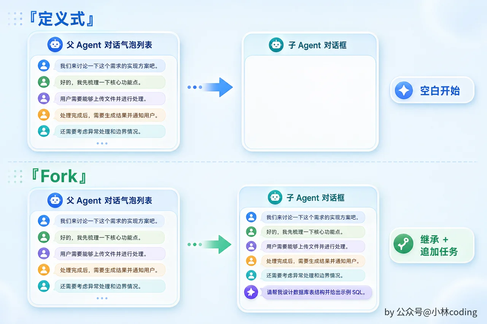

定义式与 Fork 的对话历史差异

为什么 Fork 要继承对话历史，而不是从空白开始？有两个原因。

第一个是实际用途。Fork 的典型场景是：你和 Agent 聊了一阵子，它理解了你的需求和当前的代码状态，然后你说「顺便帮我把这个也做了」。Fork 出来的子 Agent 继承了之前的对话，所以它知道你们在聊什么，不需要你把背景再说一遍。

第二个是成本优化。LLM API 有 prompt cache 机制：如果两次请求的前缀完全相同，第二次请求可以命中缓存，大幅降低输入 token 的计费。Fork 子 Agent 使用和父 Agent 相同的系统提示和对话前缀。这意味着 Fork 子 Agent 的第一次 API 调用几乎可以 100% 命中缓存，不需要重新处理之前所有的对话内容。

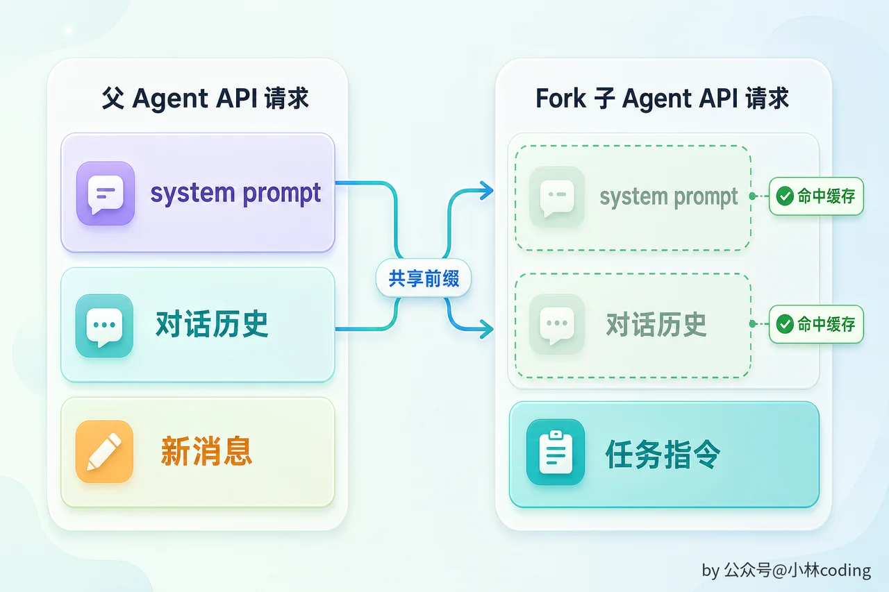

Fork 命中 prompt cache

`buildForkedMessages` 做三件事：把父 Agent 的完整对话复制过来，把最后一条 assistant 消息中未完成的 `tool_use` blocks 包装成 placeholder `tool_results` 保持消息格式合法，最后在末尾追加子 Agent 的任务指令作为 user 消息。

注意，有一个限制：Fork 子 Agent 不能再调 Agent 工具——无论是想再 Fork 还是想 spawn 定义式都不行。Fork 子 Agent 的工具集保留了 Agent 工具（继承自父 Agent），但调用时会被 QuerySource 检测拦截：检测到 caller 是 Fork 路径产生的子 Agent，直接报错；如果对话压缩把这个信号弄丢了，还有 Fork boilerplate 标记 `FORK_BOILERPLATE_TAG` 扫描作为兜底。这是为了防止 Fork 链条无限延伸导致上下文爆炸。

Fork 子 Agent 的行为靠一段叫 **Fork Boilerplate** 的指令来约束。这段指令被注入到子 Agent 收到的第一条消息中，用 `<fork_boilerplate>` 标签包裹，核心规则包括：

```Plaintext
<fork_boilerplate>
你是一个 Fork 出来的工作进程。你不是主 Agent。
规则（不可协商）：
1. 不能再 Fork。
2. 不要对话、不要提问、不要请求确认。
3. 直接使用工具：读文件、搜索代码、做修改。
4. 严格限制在你被分配的任务范围内。
5. 最终报告控制在 500 字以内，以「Scope:」开头。
</fork_boilerplate>
```

规则 1 从根源上防止递归 Fork。规则 2 让子 Agent 不要试图和用户对话，直接干活。规则 5 强制输出结构化结果，方便父 Agent 解析。完整版还会定义 `Scope` 、 `Result` 、 `Key files` 、 `Files changed` 、 `Issues` 等输出格式字段。

为什么需要这么强硬的指令？因为 Fork 子 Agent 继承了父 Agent 的系统提示，那个提示里可能写着「你可以创建子 Agent」「你应该和用户确认」这些默认行为。Fork Boilerplate 的作用是覆盖掉这些默认行为，把 Fork 子 Agent 的角色从「交互式助手」强制切换成「执行型工人」。

还有一个容易忽视但很重要的执行语义： **Fork 子 Agent 始终以后台方式运行** 。Fork 路径无条件走后台，采用统一的 `<task-notification>` （后台任务完成后注入对话的通知消息，后面会详细讲）交互模型。主 Agent 发起 Fork 后立刻拿回控制权继续工作，子 Agent 的结果通过 task-notification 异步回传。

为什么要强制后台？两个原因。第一，Fork 子 Agent 继承了父 Agent 的完整上下文，对话前缀很长，首次 API 请求本身就不快。如果前台同步等待，父 Agent 会被阻塞，用户体验很差。第二，Fork 的核心场景是「主 Agent 把多个子任务分发出去」。统一走后台，多个 Fork 就能并行执行，而不是一个一个串行等结果。

注意「强制后台」 **只影响 Fork 路径** 。指定了 `subagent_type` 的定义式子 Agent 默认仍然前台同步执行，除非定义里写了 `background: true` （比如内置的 Verification Agent）或调用时传 `run_in_background: true` 。这意味着你可以同步等 Explore 的搜索结果（它会前台跑完），但 Fork 出去的工作进程总是异步的——结果通过 `<task-notification>` 回传，主 Agent 不阻塞。

### 什么时候用哪种

选择 `subagent_type` 还是留空（Fork）的依据很简单。

如果任务是固定角色、固定职责的，比如安全审查、代码探索、制定计划，指定 `subagent_type` 。因为你可以精确控制它的能力边界，限制它只用需要的工具，还可以给它一个更小更快的模型。

如果任务是临时性的，和主 Agent 正在做的事情高度相关，需要共享之前的对话上下文，留空走 Fork。它什么都能做，而且知道你们之前在聊什么。

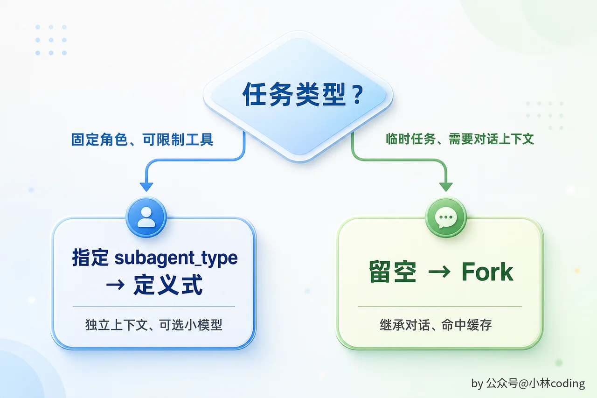

SubAgent 创建模式决策树

---

## 上下文隔离：到底隔离什么，共享什么？

子 Agent 有了，但一个问题马上浮出水面：子 Agent 和主 Agent 之间的边界在哪里？如果什么都不共享，子 Agent 就要从零开始，连 LLM 客户端都要重新创建，太浪费了。如果什么都共享，那跟在主 Agent 里直接干有什么区别？

所以关键在于分清楚两类东西：运行时状态要隔离，基础设施可以共享。

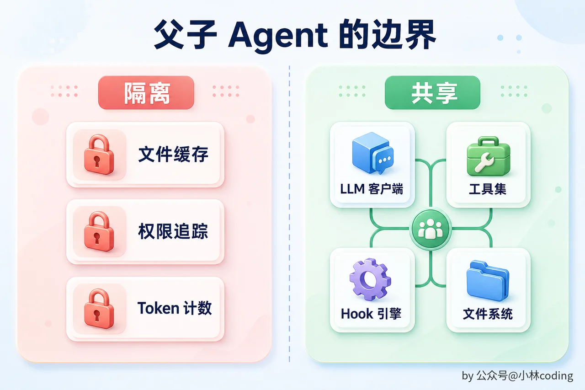

父子 Agent 的隔离与共享边界

运行时状态为什么要隔离？因为每个 Agent 的工作场景不同。文件缓存就是一个典型例子，主 Agent 读过的文件缓存和子 Agent 无关，尤其是后面引入 Worktree 之后，子 Agent 可能工作在完全不同的目录中，共享缓存会导致读到错误的内容。权限追踪也是一样，主 Agent 批准了某个工具，不意味着子 Agent 也自动获得批准，每个 Agent 应该有独立的权限审批记录。Token 用量也是分开统计的，方便你看每个 Agent 各自消耗了多少；不过 LLM API 的全局账单仍然属于同一个 session。

消息数组的处理取决于创建模式。定义式子 Agent 从一个干净的对话开始，只有任务指令。Fork 式子 Agent 继承父 Agent 的完整对话历史，上一节已经解释了原因。

基础设施为什么可以共享？因为它们本身是无状态的，或者说状态共享反而是正确的行为。LLM 客户端用的是同一个 API Key 和连接池，没必要重新创建，除非在调用时通过 `model` 参数指定了不同的模型，那才会创建一个新的。工具集本身也是无状态的，共享不会有问题，除非 Agent 定义限制了工具集。Hook 引擎更是应该共享，你在项目里定义了写代码文件后自动格式化的 Hook，不管是主 Agent 写的还是子 Agent 写的，都应该自动执行。

文件系统也是共享的。子 Agent 和主 Agent 操作同一个文件系统，子 Agent 写的文件主 Agent 可以看到。如果需要文件系统级别的隔离，在调用时传 `isolation: "worktree"` ，下一章会展开。

把定义式路径的创建规则用伪代码表达出来：

```Plaintext
function createFromDefinition(parent, definition, params):
    child = new Agent(
        llm:          selectLLM(parent, params, definition),
        tools:        resolveAgentTools(parent.tools, definition),
        hooks:        parent.hooks,            // 共享
        conversation: new Conversation(),      // 空的对话
        permissions:  new PermissionTracker(), // 隔离
        fileCache:    cloneFileStateCache(),   // 隔离
    )
    return child
```

`selectLLM` 优先用调用时传入的 `params.model` ，其次用 Agent 定义里的 `definition.model` ，都没指定就复用父 Agent 的 LLM 客户端。

`resolveAgentTools` 是工具过滤逻辑，根据 Agent 定义的白名单和黑名单从父 Agent 的工具集中筛选，后面有专门一节展开。

`hooks` 直接取父 Agent 的，Hook 引擎共享。 `conversation` 是空的，这就是定义式和 Fork 的核心区别：定义式从零开始，不带任何历史包袱。 `permissions` 和 `fileCache` 各自独立创建，互不干扰。

顺便提一句成本。多 Agent 听上去会更费 token——多次 API 调用、多份 prompt overhead。但实际算下来通常反而省。子 Agent 上下文比主 Agent 短得多（只装一个任务的相关信息），用的模型也常常是更小更便宜的 haiku 而不是 sonnet/opus，单次调用成本低；Fork 路径还能命中 prompt cache，对话前缀几乎不需要重新付费。综合下来，把任务分发出去通常比主 Agent 自己背着一身上下文做更便宜。

---

## Agent 定义也是 Markdown

到这里你可能注意到了，定义式 SubAgent 的配置文件长得很眼熟。YAML frontmatter 定义元信息，Markdown body 写系统提示。

没错，它和 Skill 系统里的定义 **结构相同，但字段不同** 。

结构上都是 YAML frontmatter + Markdown body，解析逻辑可以复用。但字段有关键区别：Skill 用 `allowedTools` 白名单（「你只能用这几个工具」），Agent 用 `tools` 白名单 + `disallowedTools` 黑名单（「排除这几个危险工具，其余都能用」）。为什么不统一？因为使用场景不同。Skill 执行一个具体任务，范围窄，白名单更安全，少给一个工具也不影响功能。Agent 扮演一个角色，能力接近全集，逐个列出几十个允许的工具不现实，排除少数危险工具用黑名单更方便。

字段差异只是表象。更关键的是 body 用途不同：Skill 的 body 是每轮注入对话的活跃指令——告诉主 Agent「现在要做这件事，按这套流程走」，每轮 reminder 重新注入直到 Skill 退出；Agent 的 body 是子 Agent 启动时的系统提示——决定这个新 Agent 是谁、能做什么、按什么风格干活，注入一次后伴随子 Agent 整个生命周期。一个面向当前对话上下文，一个面向新 Agent 的身份。

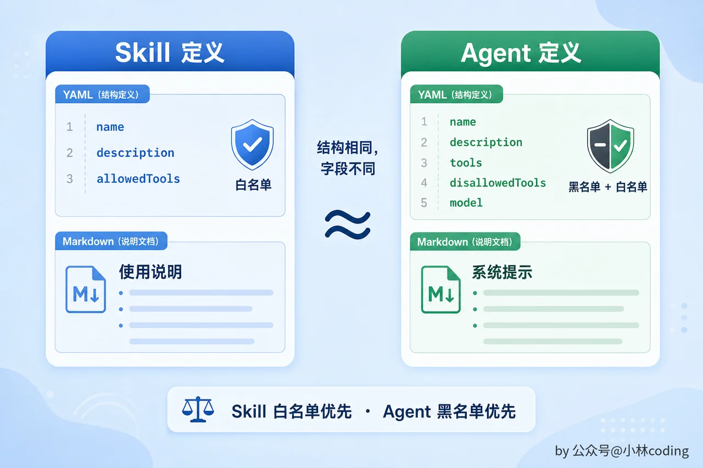

在前面的简版基础上，完整定义还可以加几个字段：

```YAML
# 在 security-reviewer 的 frontmatter 里追加：
model: haiku             # 用更小更快的模型
permissionMode: dontAsk  # 工具调用不弹审批窗口
```

`model` 让这个 Agent 用 haiku 这种更小的模型——做安全审查不需要顶配推理。 `permissionMode: dontAsk` 让它的工具调用自动批准、不弹审批窗口；前面 `disallowedTools` 已经排除了写操作，所以自动批准是安全的。

`disallowedTools` 是工具黑名单，列出这个 Agent 不能用的工具。和 `tools` 白名单相比，黑名单的好处是：你不需要列出所有允许的工具，只需要排除危险的那几个。两个字段可以组合使用：白名单先确定可用范围，黑名单再从中排除。注意 Agent 的白名单字段叫 `tools` ，不叫 `allowedTools` ，跟 Skill 的字段名不同。

Agent 定义的元信息结构长这样。注意 YAML frontmatter 里写的是 `name` 和 `description` ，加载后映射成内部的 `agentType` 和 `whenToUse` ：

```Plaintext
AgentDefinition:
    agentType: string           // frontmatter 的 name
    whenToUse: string           // frontmatter 的 description
    tools: string[]             // 工具白名单
    disallowedTools: string[]   // 工具黑名单
    model: string               // inherit / sonnet / opus / haiku
    maxTurns: int               // 最大循环次数
    permissionMode: string      // default / acceptEdits / dontAsk ...
    systemPrompt: string        // Markdown body
    filePath: string            // 定义文件路径
    source: string              // project / user / builtin / plugin
```

这里只列了核心字段。 `agentType` 、 `whenToUse` 、 `tools` / `disallowedTools` 、 `model` 、 `maxTurns` 用得最频繁。

除此之外还有一批扩展字段： `skills` 和 `mcpServers` 允许 Agent 携带自己的能力扩展。 `hooks` 让 Agent 有独立的生命周期钩子。 `memory` 、 `isolation` 、 `background` 、 `initialPrompt` 等字段在特定场景下使用。

Agent 定义文件支持多来源加载，优先级从高到低：

```Plaintext
1. 项目级：{projectDir}/.mewcode/agents/   ← 优先级最高
2. 用户级：~/.mewcode/agents/
3. 内置级：程序编译嵌入
4. 插件级：通过插件系统加载              ← 优先级最低
```

前三个来源容易理解。第四个「插件级」是什么？MewCode 支持插件机制，第三方可以把自己的 Agent 定义打包成插件分发。比如一个代码质量插件可以带一个 `lint-reviewer` Agent 定义，用户安装插件后就能直接用 `subagent_type="lint-reviewer"` 调用它。插件级优先级最低，是为了防止第三方插件覆盖用户的自定义定义或系统内置定义。

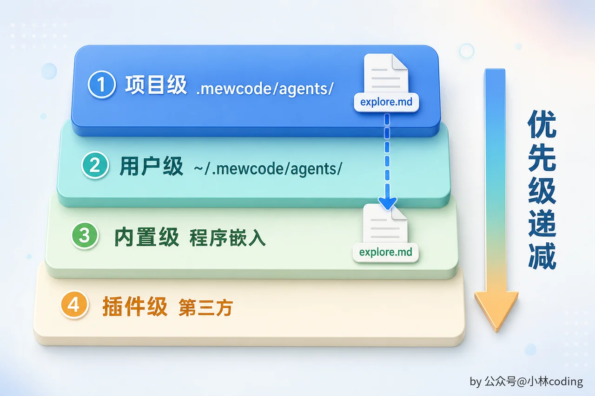

Agent 定义来源优先级

项目级的定义可以覆盖同名的内置定义。比如你觉得内置的 Explore Agent 不够好，可以在项目的 `.mewcode/agents/explore.md` 里写一个更适合你项目的版本。同理，用户级可以覆盖内置级和插件级，但不能覆盖项目级。这个优先级链保证了「离使用场景越近的定义越有话语权」。

---

## RunToCompletion：子 Agent 怎么执行

主 Agent 的运行方式你已经很熟悉了：等待用户输入，执行，等待下一轮输入，再执行。这是「交互式」的。

子 Agent 不一样。它没有用户在屏幕前等着输入。它拿到一个任务，从头到尾执行完，返回结果。这是「非交互式」的。

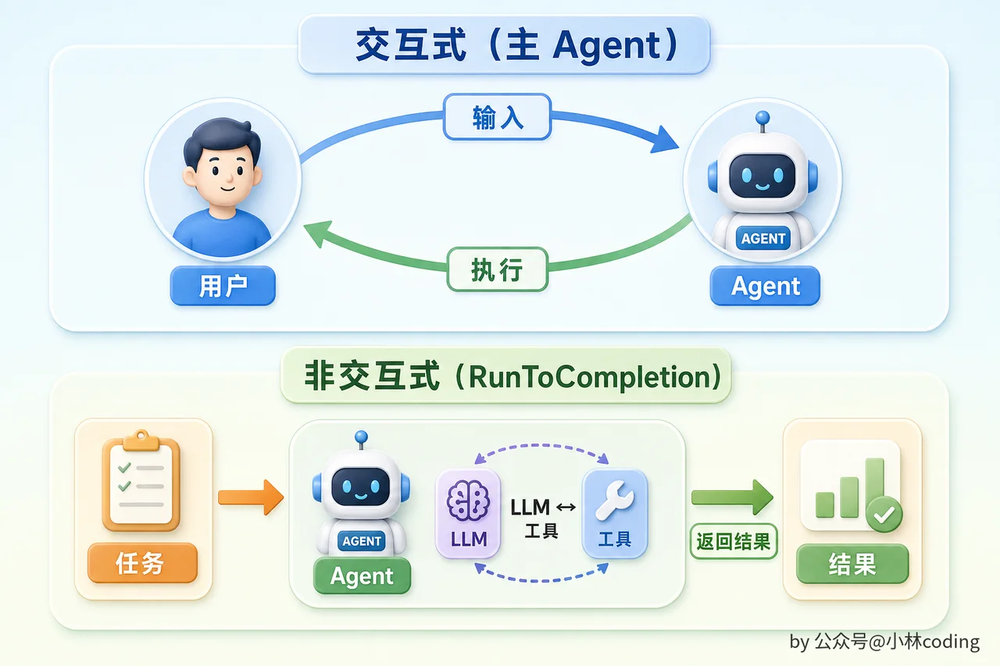

交互式主 Agent 与 RunToCompletion

我们需要给 Agent 加一个新方法来支持这种模式。这段逻辑其实和主 Agent 的 ReAct Loop 几乎一样，区别就两点：

```Plaintext
function runToCompletion(agent, context, task) -> string:
    agent.conversation.addUserMessage(task)   // 任务直接注入，不等用户输入
    lastText = ""

    for i in range(agent.config.maxTurns):
        response = agent.llm.send(context, agent.buildMessages())
        agent.conversation.addAssistantMessage(response)
        if response.text != "":
            lastText = response.text
        if response.toolCalls is empty:
            break                             // 纯文本 → 任务完成
        executeToolCalls(agent, context, response.toolCalls)

    return lastText
```

第一，它不等待用户输入，任务直接从参数传入。第二，当 LLM 不再调用工具的时候，循环就结束了，把最后的文本作为结果返回。工具调用的过程和主循环完全一样：pre\_tool\_use Hook → 执行工具 → post\_tool\_use Hook，Hook 在子 Agent 中仍然生效。

有个细节值得注意：RunToCompletion 里的工具调用权限由 Agent 定义的 `permissionMode` 决定。如果设为 `dontAsk` ，所有工具调用自动批准，不弹审批窗口。这在 `disallowedTools` 已经排除了危险工具的情况下是安全的：如果你定义了一个排除了 Write 和 Bash 的子 Agent，它根本调不了这些工具，自然不需要审批。能力边界由 `disallowedTools` 锁死，权限模式由 `permissionMode` 控制，两者配合实现全自动运行。

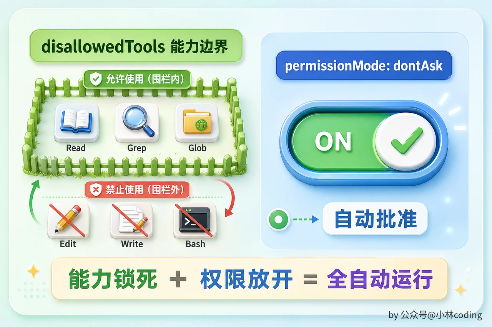

能力边界与 dontAsk

---

## 父子链路：看清嵌套里发生了什么

有个问题在 Skill 系统章节里埋过伏笔：fork 嵌套会跨越 Agent 边界。主 Agent 调子 Agent A，A 再调子 Agent B，B 再调 C……这条链可能很长。当时说了这部分留给 SubAgent 章节，那么现在就展开说说。

嵌套需要限制吗？答案是需要，但方式是通过工具过滤来隐式限制，而不是用一个硬编码的深度阈值。

具体来说，系统在两个层面做了硬限制。第一，Fork 不能再 Fork。如果子 Agent 的对话历史里已经包含了 Fork 标记，再次 Fork 会直接报错。这防止了 Fork 链条无限延伸导致上下文爆炸。第二，后台 Agent 不能再 spawn Agent。系统有一个硬编码的后台工具白名单 `ASYNC_AGENT_ALLOWED_TOOLS` ，后面「工具过滤的多层防线」一节会展开。这个白名单里不包含 Agent 工具本身，从根源上切断了后台嵌套的可能性。

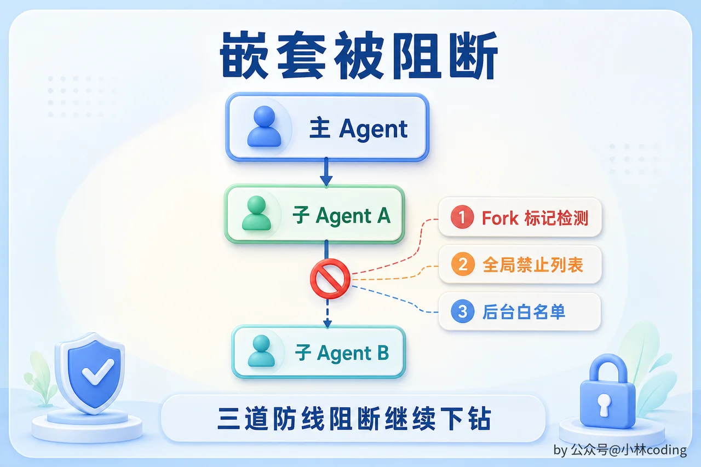

嵌套 SubAgent 阻断机制

注意，这两条限制都是在能力层面做约束，不是靠一个硬编码的深度数字来卡。具体怎么实现，定义式和 Fork 走的是不同路径。定义式子 Agent 在工具列表层就被 `ALL_AGENT_DISALLOWED_TOOLS` 过滤掉了 Agent 工具，工具集里根本看不到它，自然调不了。Fork 路径不走这个过滤——Fork 子 Agent 的工具集保留了 Agent 工具（ `cloneRegistryForFork` 复制全部工具），但调用时会被 QuerySource 检测拦截；如果对话压缩把这个信号弄丢了，还有 Fork boilerplate 标记扫描作为兜底。再叠加后台 Agent 白名单同样不含 Agent 工具，三条路径加起来，所有嵌套路径都被堵住。

再绕回到 Skill fork。Skill 的 fork 模式跟这里的 SubAgent 在本质上是一回事——都新建独立 Conversation、独立 Agent Loop、独立工具过滤集。mewcode 的实现也确实复用了同一套底座：Skill 通过 `SkillForkHost.RunSubAgent` 接口委托给主程序创建 Agent 和 Conversation，跟 SubAgent 工具走相同的 `agent.New + agent.Run` 路径。差别只在外层包装——SubAgent 工具暴露给模型用，参数里有完整的任务管理、权限模式、隔离级别；Skill fork 内嵌在 Skill 执行流里，参数走 SKILL.md frontmatter，不直接给模型选。所以本节讲的嵌套限制（Fork 不能再 Fork、后台 Agent 禁止 spawn）同样适用于 Skill fork 触发的嵌套，最终都落到同一段 Agent 构造逻辑里。

---

## 后台运行模式

有些子任务不需要实时交互。比如代码审查、跑完整测试、安全扫描。这些任务可能要跑几分钟，你不想干等着。

Agent 工具支持三种方式进入后台。

**方式一：调用时指定。** 主 Agent 在调用 Agent 工具时传 `run_in_background: true` ，子 Agent 直接以后台任务启动，主 Agent 立刻收到一个 `async_launched` 状态和 agent ID，可以继续和你对话。

**方式二：自动超时。** 前台运行的子 Agent 如果超过 120 秒还没完成，系统自动把它切到后台。这个超时值由 `getAutoBackgroundMs()` 控制。

**方式三：手动切换。** 用户按 ESC 键，把当前前台运行的子 Agent 切到后台。

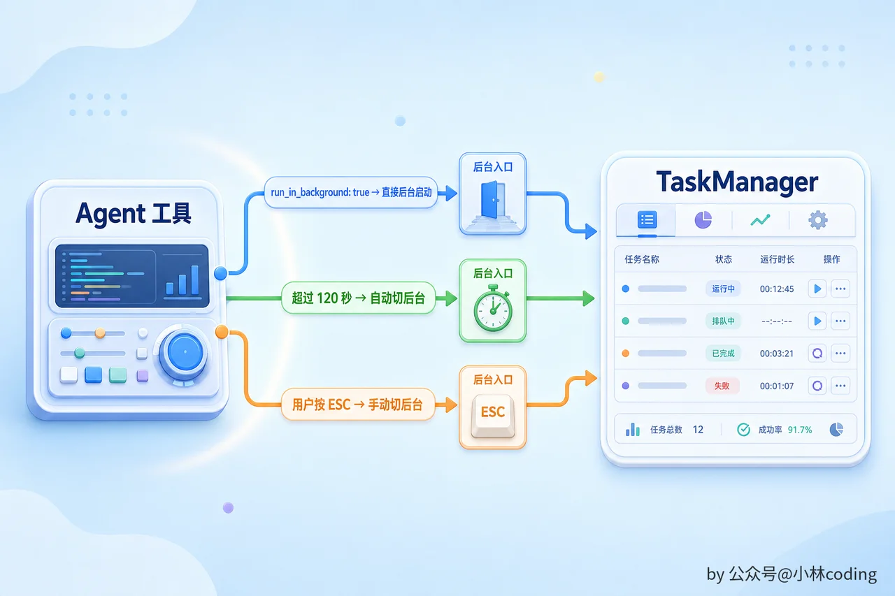

后台 Agent 的三种进入路径

除了这三种显式触发，还有一种隐式机制： **走 Fork 路径的子 Agent 无条件后台运行** 。前面 Fork 小节已经解释过，Fork 模式下不存在前台子 Agent，所有结果都通过 `<task-notification>` 异步回传。这也解释了为什么 Fork Boilerplate 里要写「不要和用户对话」：子 Agent 根本不在前台，对话没有意义。

不管通过哪种方式进入后台，最终都进入同一个后台任务生命周期：

```Plaintext
BackgroundTask:
    id: string
    subAgent: Agent
    task: string
    status: "running" | "completed" | "failed"
    result: string
    startTime: timestamp
    endTime: timestamp
    cancel: CancelFunction
    progress: ProgressTracker   // 工具调用次数、token 消耗、最近活动
```

TaskManager 负责管理所有后台任务的生命周期。 `launch` 方法是核心入口：

```Plaintext
function launch(context, agent, task) -> taskID:
    taskID = generateID()
    bg = new BackgroundTask(id: taskID, status: "running")
    tasks[taskID] = bg

    runAsync:
        try:
            bg.result = agent.runToCompletion(context, task)
            bg.status = "completed"
        catch panic as p:
            bg.status = "failed"
        finally:
            notifyChannel.send(taskID)
    return taskID
```

生成唯一 ID，创建 BackgroundTask 对象，然后在一个后台协程里调用 `runToCompletion` 。注意异常保护：即使子 Agent 崩溃了，状态会变成 `failed` ，不会影响主程序。

完成后呢？taskID 被推进 `notifyChannel` ，主 Agent 的消息循环监听这个 Channel，收到通知后向对话中注入一条 `<task-notification>` 消息，不打断当前对话。

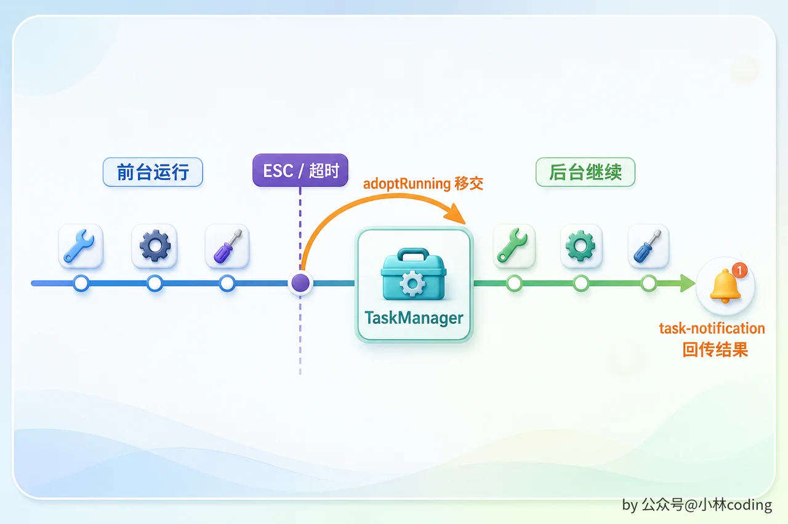

adoptRunning 前后台移交时间线

还有一个关键方法： `adoptRunning` 。它是前台→后台切换的桥梁。前台 Agent 已经跑了一半了，你不能杀掉重来。 `adoptRunning` 把运行中的 Agent 实例、它的事件流、取消函数、以及已经收集到的部分结果全部移交给 TaskManager，在后台继续消费事件流直到完成。

后台 Agent 有一个重要的安全限制： **它的工具白名单是固定的** 。后台 Agent 只能使用文件读写、搜索、Bash、Web 等基础工具，不能使用 Agent 工具（不能再 spawn 子 Agent），也不能使用 Task 相关工具。这个限制在 `ASYNC_AGENT_ALLOWED_TOOLS` 里硬编码，不受 Agent 定义文件的配置影响。

```Plaintext
ASYNC_AGENT_ALLOWED_TOOLS = [
    Read, Edit, Write,           // 文件读写
    Glob, Grep,                  // 文件搜索
    Bash,                        // 命令执行
    WebSearch, WebFetch,         // 网络访问
    Skill,                       // Skill 调用
    NotebookEdit,                // Notebook 编辑
    EnterWorktree, ExitWorktree, // Worktree 切换
    ToolSearch,                  // 延迟加载工具的 schema 查询
    TodoWrite,                   // 待办事项写入
    SyntheticOutput,             // 向用户输出文本（不经过 LLM）
]

// 注意：没有 Agent、Task*、SendMessage
```

mewcode 没有给用户的后台任务管理 slash command。后台任务通过 4 个内置工具暴露给 Agent： `TaskList` （列出当前任务）、 `TaskGet` （取某个任务的状态/结果）、 `TaskCreate` （创建新任务，主要给 Hook 用）、 `TaskUpdate` （更新任务状态）。

你想知道某个后台任务跑得怎么样了，直接问主 Agent 就行——它会自己用 `TaskList` 或 `TaskGet` 去查，再用自然语言告诉你。这是个有意思的设计选择：与其给用户造一堆 slash command 学习，不如让自然语言加 Agent 自己用工具去做。

---

## 工具过滤的多层防线

子 Agent 拿到的工具集应该和主 Agent 一模一样吗？显然不行。如果子 Agent 能用所有工具，包括 Agent 工具本身，那 A 可以 spawn B，B 可以 spawn C，无限嵌套下去。如果后台 Agent 也能随意调用任何工具，一个失控的后台任务可能造成不可预期的后果。

所以工具过滤需要多层叠加，每层防不同的风险：

```Plaintext
第 1 层：全局禁止列表 ALL_AGENT_DISALLOWED_TOOLS
         → 所有子 Agent 都不能用的工具：Agent、AskUserQuestion、TaskStop 等
第 2 层：自定义 Agent 额外禁止 CUSTOM_AGENT_DISALLOWED_TOOLS
         → 用户或项目定义的 Agent 有额外限制
第 3 层：后台 Agent 白名单 ASYNC_AGENT_ALLOWED_TOOLS
         → 后台运行的 Agent 只能用基础工具
第 4 层：Agent 定义的 tools + disallowedTools
         → 白名单确定范围，黑名单从中排除
```

全局层防递归失控：子 Agent 不能再 spawn Agent，防嵌套爆炸；也不能问用户问题，防阻塞循环。后台层防资源失控：后台 Agent 的工具集进一步收窄到基础读写。定义层是业务层面的能力约束。每层都很简单，组合起来覆盖了所有风险场景。

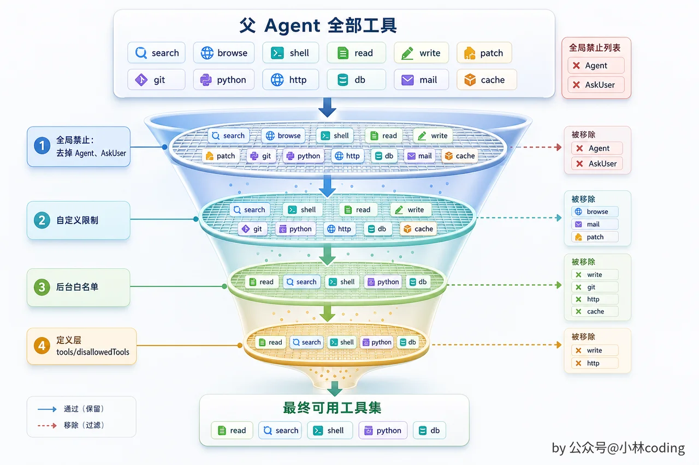

SubAgent 工具过滤层

过滤的执行顺序是：先用全局禁止列表过滤，再看是否是自定义 Agent 需要额外过滤，接着应用 Agent 定义的 `disallowedTools` 黑名单排除，最后如果定义了 `tools` 白名单就取交集。四层依次过滤，最终得到子 Agent 实际可用的工具集。

---

## 内置 Agent 类型

MewCode 内置了几种预定义的 Agent，覆盖最常见的使用场景。你可以直接用，也可以在项目中覆盖它们的定义。

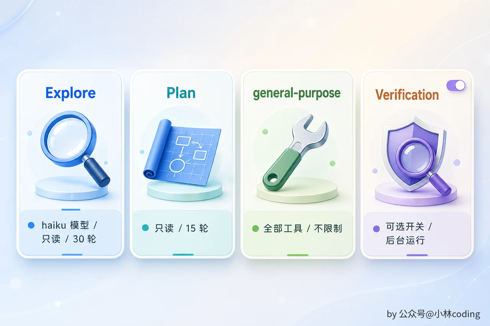

内置 Agent 角色卡片

第一个是 Explore，代码探索 Agent。它只有读取和搜索能力，不能修改文件。你让它去了解一个项目的结构、查找某个功能的实现、理清调用链，它很擅长。

```YAML
name: Explore
disallowedTools: [EditFile, WriteFile]
model: haiku
maxTurns: 30
---

你是一个文件搜索专家。这是一个只读探索任务。

严禁：创建文件、修改文件、删除文件、执行任何改变系统状态的命令。

你的工具使用策略：
- 用 Glob 做文件模式匹配
- 用 Grep 搜索文件内容
- 用 Read 读取已知路径的文件
- Bash 只用于只读操作（ls、git log、git diff、find、cat）
- 尽可能并行发起多个工具调用以提高效率

高效完成搜索请求，清晰报告发现。
```

注意两个设计选择。第一，它用的是 `disallowedTools` 黑名单。这样当系统新增了一个只读工具，比如新的搜索工具，Explore 自动就能用，不需要手动去白名单里加。代价是新增工具默认可见——如果未来加进一个有写副作用的工具（比如 DeployTool），Explore 也会自动获得。Explore 用黑名单之所以安全，是因为它的 `disallowedTools` 已经把写操作类（EditFile、WriteFile）排除了，新增工具如果属于写类别就自动被覆盖；属于全新类别的话需要 review 一次。第二， **它的模型是 haiku** 。Explore 做的是搜索和阅读，不需要最强的推理能力，用更小更快的模型足够了，还能省下可观的 token 成本。

第二个是 Plan，计划 Agent。它和第 8 章的 Plan 权限模式名字相近但是两回事，下面会展开。它分析需求、制定执行计划，但不直接执行。主 Agent 拿到计划后逐步执行。

```YAML
name: Plan
disallowedTools: [Agent, Edit, Write, NotebookEdit]
maxTurns: 15
---

你是一个软件架构师和规划专家。这是一个只读规划任务。

严禁：创建文件、修改文件、删除文件、执行任何改变系统状态的命令。

你的工作流程：
1. 理解需求，明确设计视角
2. 用搜索工具充分探索代码库：找到现有模式和约定，理解当前架构，识别可参考的类似功能
3. 设计方案：制定实现路径，考虑取舍和架构决策
4. 输出计划：提供分步实现策略，标明依赖和顺序，预判潜在挑战

回复末尾必须列出 3-5 个对实现最关键的文件路径。
```

这里要先澄清一个容易混淆的点。mewcode 里有两个跟「规划」相关的东西。第 8 章讲的 **Plan 权限模式** ，是主 Agent 自身切到只读规划状态——通过 `/plan` 命令或 Shift+Tab 触发，主 Agent 自己换一套工具集干活，不创建任何子 Agent。这里讲的 **Plan Agent** 不一样，是一个独立的只读 SubAgent，有自己的对话上下文。两者用途互补：临时切到规划状态用 Plan 模式，需要长链分析且不想污染主上下文用 Plan Agent。

为什么要单独做一个 Plan Agent？因为上下文隔离。Plan 权限模式虽然限制了工具，但规划过程产生的分析信息还是会留在主 Agent 上下文里。Plan Agent 在独立上下文里规划，完成后只把最终的计划文本返回给主 Agent，中间的分析过程完全隔离。

第三个是 general-purpose，通用子 Agent。它拥有全部工具，用于需要完整能力但独立上下文的场景。

```YAML
name: general-purpose
disallowedTools: []
---

你是 MewCode 的 Agent。根据用户的消息，使用可用工具完成任务。
把任务做完，不要过度设计，但也不要做一半就停。

完成后用简洁的报告回复：做了什么、关键发现。
调用方会把结果转述给用户，所以只需要包含要点。

搜索策略：不确定位置时广泛搜索，确定路径时直接读取。
优先编辑现有文件，不要主动创建文档文件。
```

第四个比较特殊：Verification，验证 Agent。它需要通过配置开关来启用。在 MewCode 的配置文件里加一行 `enableVerificationAgent: true` 就能开启，不加则不会出现在内置 Agent 列表中。

```YAML
name: Verification
model: inherit
background: true
disallowedTools: [Agent, Edit, Write, NotebookEdit]
---

你是一个验证专家。你的目标是尝试打破实现，找到隐藏的 bug。

你有两个已知的失败模式。第一，验证回避：面对检查时，你找理由不去运行它，
你读代码、描述你会测什么、写下「PASS」然后继续。第二，被前 80% 迷惑：
你看到漂亮的 UI 或通过的测试套件就倾向于放行，没注意到一半按钮没功能、
状态刷新后消失、或者后端遇到错误输入就崩溃。前 80% 是容易的部分。
你的全部价值在于找到最后 20%。

严禁：修改项目中的任何文件。可以在临时目录写测试脚本，用完清理。

必须步骤：读项目配置了解构建/测试命令 → 跑构建 → 跑测试套件 →
跑 lint/类型检查 → 检查回归。然后根据变更类型做针对性验证。

每项检查必须包含：实际执行的命令、观察到的输出、PASS 或 FAIL 判定。
读代码不算验证，必须运行它。

最终输出：VERDICT: PASS / VERDICT: FAIL / VERDICT: PARTIAL
```

Verification Agent 的设计目标是「找到最后 20% 的 bug」。它的系统提示引导它用怀疑的眼光审视代码改动：不仅检查是否实现了需求，还检查边界条件、错误处理、并发安全这些容易被忽略的角落。

为什么不直接内置？因为 Verification 的价值高度依赖使用场景。在快速迭代的开发阶段，每次改动都跑一遍验证 Agent 会显著拖慢节奏。做成可配置的开关，让这个能力可以按需开启：在 CI 流程中开启做门禁检查，在日常开发中关闭保持速度。

这展示了一个设计模式： **有些能力不应该默认暴露** 。Agent 类型可以和配置开关结合，让系统的能力边界动态可调。

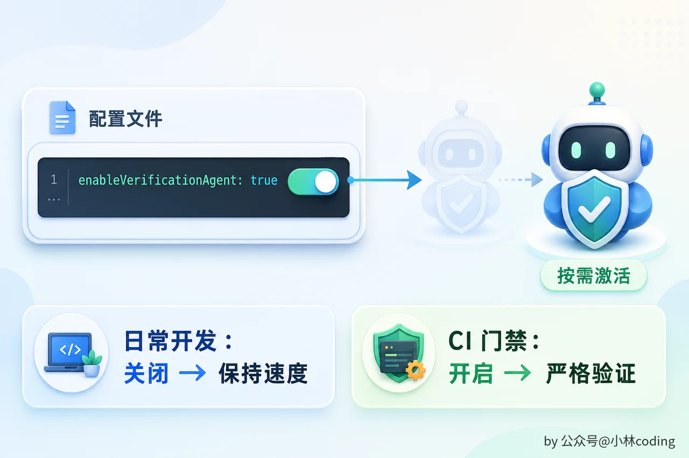

Verification Agent 开关

使用内置 Agent 的方式是在调用 Agent 工具时指定 `subagent_type` 。主 Agent 在推理的时候，如果判断某个子任务适合交给专门的 Agent，它就会选择合适的 `subagent_type` 。如果不指定 `subagent_type` ，走 Fork 路径。整个过程对用户是透明的。

---

## 本章小结

这一章做了一件架构层面意义重大的事：让 MewCode 从单 Agent 进化到了可分发任务。

核心设计是一个统一的 Agent 工具，通过 `subagent_type` 参数选择预定义的 Agent 类型，留空时走 Fork 路径继承父 Agent 的上下文。两种模式各有适用场景：定义式用于固定角色和能力约束，Fork 式用于临时任务和缓存优化。

上下文隔离是 SubAgent 的存在理由，但隔离的粒度取决于创建模式。定义式子 Agent 从空白对话开始，Fork 子 Agent 继承父 Agent 的完整对话历史。两者都隔离文件缓存和权限追踪，共享 LLM 客户端、Hook 引擎和文件系统。

工具过滤需要多层叠加才够用。全局禁止列表、自定义 Agent 限制、后台 Agent 白名单、Agent 定义的 `tools` / `disallowedTools` ，四层覆盖不同风险。特别是全局层把 Agent 工具排除，从根源上防止子 Agent 无限嵌套。

但文件系统还是共享的。如果多个子 Agent 同时修改文件，还是会冲突。下一章我们用 Git Worktree 来解决这个问题。