# 实战演练：Agent Teams

# 第15章：实战篇

## 本章需要做什么？

上一章我们给 MewCode 装上了 Worktree，让每个子 Agent 拥有独立的文件系统，彻底消除了并行修改的冲突。但那套模型还是「星型」的：主 Agent 在中心，子 Agent 在周围，所有通信都要经过主 Agent，而且主Agent还得自己下场干活，一旦任务复杂，可能就力不从心

这一章要给 MewCode 装上 Agent Team 机制。Lead 还可以开启 Coordinator Mode 专注调度，从而应对更复杂的任务

具体要新增这些东西：

-   **AgentTeam 核心结构** ：团队数据模型、队员花名册、团队配置持久化

-   **三种执行后端** ：tmux pane、iTerm2 pane（独立进程隔离）、in-process（同进程轻量运行）+ 自动检测

-   **协调工具集** ：复用已有 Task 工具 + 新增 SendMessage，注入到队员工具池

-   **Mailbox 消息系统** ：按 agentID 分文件存储，tmux 后端额外 send-keys 唤醒

-   **团队生命周期管理** ：TeamCreate / TeamDelete 顶层工具，队员 spawn、收敛合并、清理

-   **队员空闲与续写** ：磁盘 transcript 持久化，Lead 可通过 SendMessage 恢复已停止的队员

-   **Coordinator Mode** ：双锁激活、工具集收窄、四阶段工作流提示词注入

这章 **不做** ：跨机器的分布式 Agent Team、队员之间的实时流式通信。

---

## Vibe Coding 实战

### 生成三份文档

把任务换成本章的内容：

```Markdown
# 我的初步想法
- 抽象出一个长期存在的"小组"对象，承载名称、负责人、成员花名册和持久化位置；成员级别记录角色、工作目录、运行后端、是否需要审批等元信息
- 提供多种成员运行后端：可在独立终端窗格里跑一个完整 CLI 实例（强隔离），也可在同进程里以协程方式轻量运行；运行位置按环境优先级自动选择，不静默降级
- 给小组成员发放一组协作工具——共享任务的创建/查看/列举/更新（带可选依赖字段）以及点对点消息发送；主入口和普通子 Agent 看不到这些工具
- 点对点消息走"名称注册表 + 邮箱文件"两段式：通过名称解析到目标实例 ID，写入对应邮箱；独立进程后端额外唤醒目标窗格；支持广播、纯文本带摘要、以及若干结构化协议消息（生命周期、审批回复）
- 把发起方设计成 Lead：它负责把用户目标拆成任务并写入共享清单（含先后依赖），派生成员，全部完成后通过 git 合并各人的工作目录、解决能搞定的冲突、搞不定就回滚上报
- 成员完成自然停止后标记为空闲并通知 Lead；Lead 之后通过发消息即可从磁盘恢复其上下文继续指派新工作，而不是重头再 spawn
- 单独提供一种"纯调度"开关（双重锁定才生效）：开启后剥夺发起方的代码读写与 shell 工具，只留派人/终止/发消息/输出结果，并注入多阶段工作流指引，把理解与综合留在发起方手里
```

然后 AI 就会开始问你问题，进行需求澄清。

你根据理论篇学到的内容回答这些问题，一直这样反复循环对齐需求，最后就能生成三份文档了。

### 正式开发

三份文档有了之后，就相当于施工图纸已经定好了，然后让 Claude Code 根据这三份文档进行开发


经过一段时间后，开发完成。

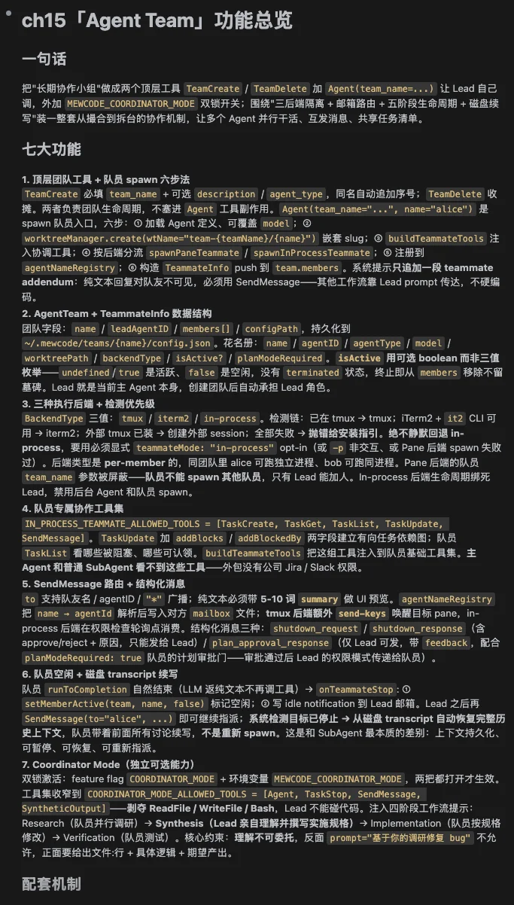

### 功能验证过程

来验收一下结果：

启动MewCode，输入：

> 帮我创建一个团队 demo，派一个队员 alice，让它读 README.md 并总结主要章节

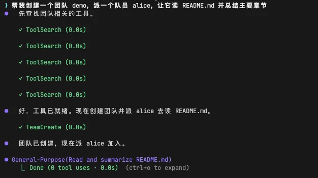

然后主Agent，会去进行队伍的创建，创建后，会去开始启动队员，我们能在.mewcode/teams这里有一个叫read-demo的一个队伍信息

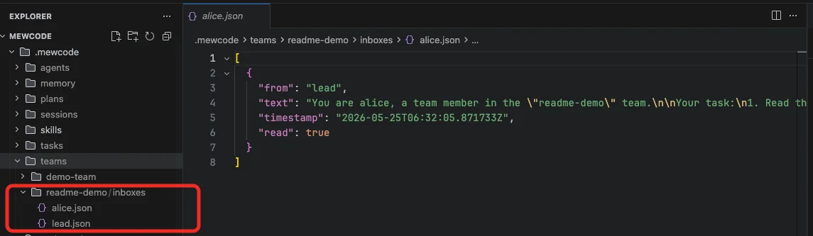

里面分别是我们的lead和我们的alice，然后过一段时间后，alice就会完成任务，传达给lead，然后lead会汇总这个结果

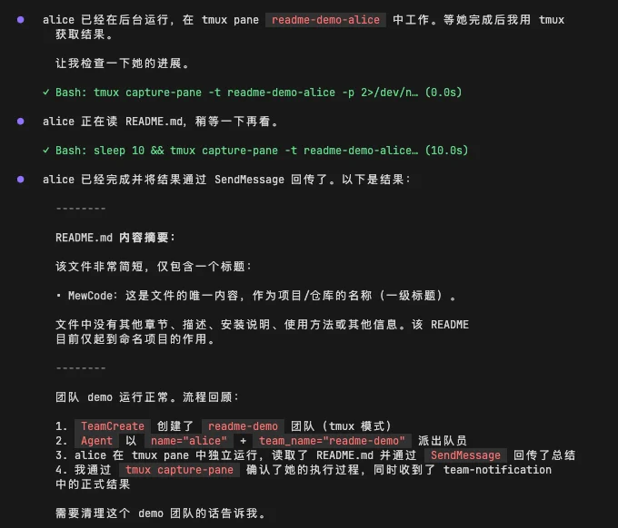

然后我们测测队员之间的worktree的隔离，我们先搞个测试文件，内容如下

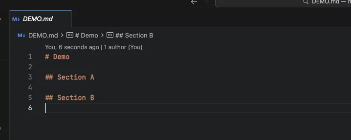

然后，我们输入

> 开个团队 demo，派 alice 和 bob 同时改 DEMO.md，alice 改 Section A，bob 改 Section B

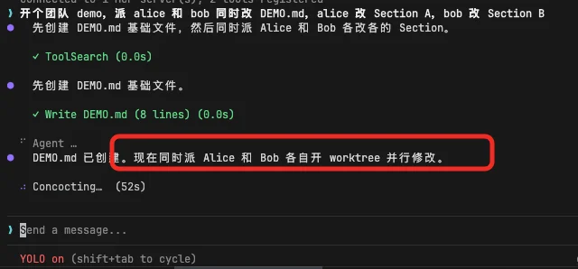

可以看到，lead会知道需要开worktree去并行修改，我们也能在.mewcode/worktrees看到它们的worktree

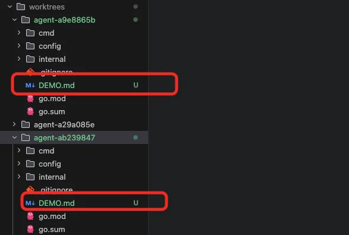

等两个队员完成后，会让lead去审阅和合并

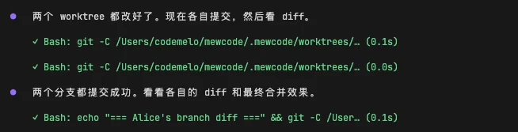

我们可以看看目前的Demo.md的内容

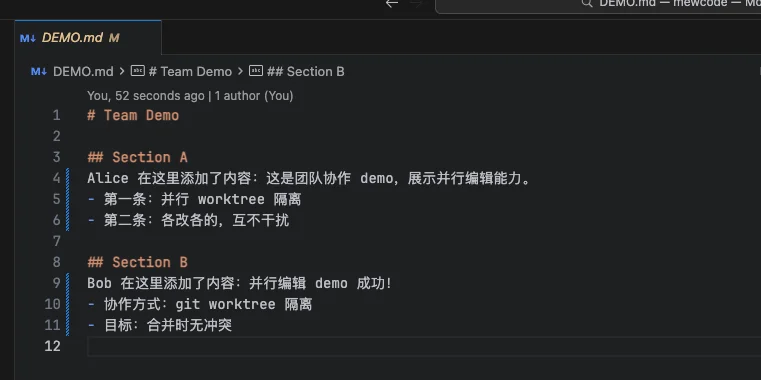

并行修改是成功的，无冲突，然后完成后会清除team和汇总

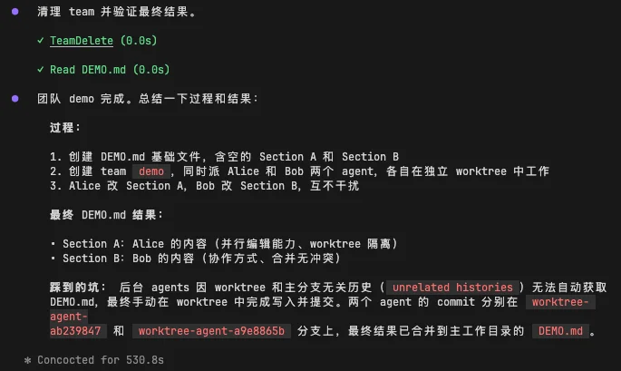

这就是我们的coordinatoe模式的team的样子，lead就是lead，专注于决策，不会下一线干活，下属去干活，然后向上汇报，就像我们的公司协作分工结构一样

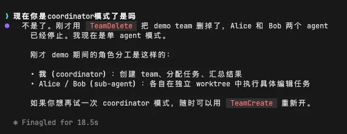

到这里，MewCode 的核心能力已经全部搭建完毕。

恭喜你！从终端原型，到工具系统、Agent 循环、权限管理、上下文压缩、Hook 系统、SubAgent、Worktree，再到现在的 Agent Team，你亲手完成了一个完整的 Coding Agent！

---

## 参考提示词和代码

如果你在澄清需求的过程中遇到困难，或者生成的三份文件效果不理想，可以直接使用下面的参考版本。

把下面三个文件保存到项目根目录，然后告诉你的 AI 编程助手：

> 提示词如果需要复制，移步到这里： [💡 提示词复制](https://my.feishu.cn/wiki/JM5Kw5TIGiIehqks1BYcYdpLnzd?fromScene=spaceOverview)