# Agent Teams

---

## SubAgent 够用了吗？

前两章我们给 MewCode 装上了两个重要能力。SubAgent 章节让主 Agent 可以把任务委派给子 Agent，在独立上下文中执行。Worktree 章节让每个子 Agent 拥有独立的文件系统，彻底消除并行修改的冲突。

这套组合在很多场景下工作得很好。你说「帮我做个安全审查」，主 Agent 派一个 `Explore` 去扫描代码，拿到结果，汇报给你。整个过程是线性的：派出去，等结果，拿回来。

但有些场景不是这样的。

想象你正在做一个大规模重构。涉及四个模块，每个模块的改动量都不小。你让主 Agent 开始工作，它派了一个子 Agent 去改模块 A。改完了，返回结果。主 Agent 再派一个子 Agent 去改模块 B。改完了，又回来。然后 C，然后 D。

四个模块串行改完，花了 20 分钟。

但仔细想想，模块 A 和模块 B 的改动互不依赖。C 依赖 A 的结果，D 依赖 B 的结果。如果 A 和 B 能同时开工，C 在 A 完成后立刻开始，D 在 B 完成后立刻开始，总时间可以缩短将近一半。

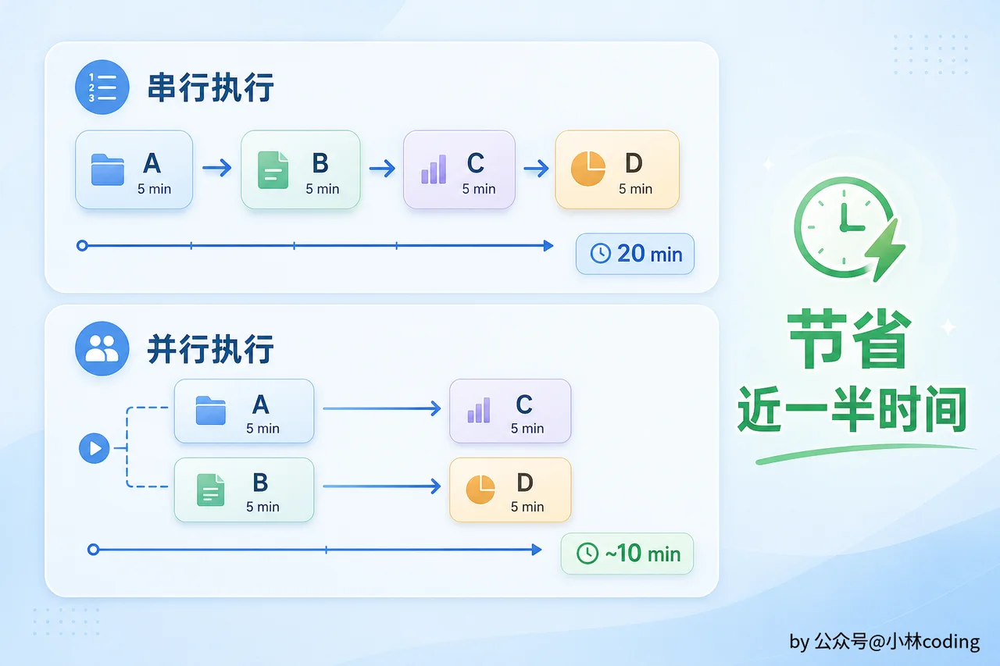

串行执行 vs 并行团队执行

更复杂的场景：你让 Agent 帮你调查一个诡异的 bug。一个 Agent 在查日志，另一个在读代码，第三个在检查配置文件。查日志的 Agent 发现了一条可疑记录，它需要告诉读代码的 Agent：「你去看一下 `handler.go` 的第 47 行，那里有个条件判断可能是问题根源。」

在 SubAgent 模型里，这种 Agent 之间的横向通信做不到。每个子 Agent 只能和主 Agent 通信，把结果返回去，子 Agent 之间是看不见彼此的。所有信息必须经过主 Agent 中转，主 Agent 成了瓶颈。

这就像一个团队里所有人只能跟经理汇报，同事之间不能直接说话。小团队可以这样运作，但任务一复杂、人一多，经理就成了信息中转站，效率直线下降。

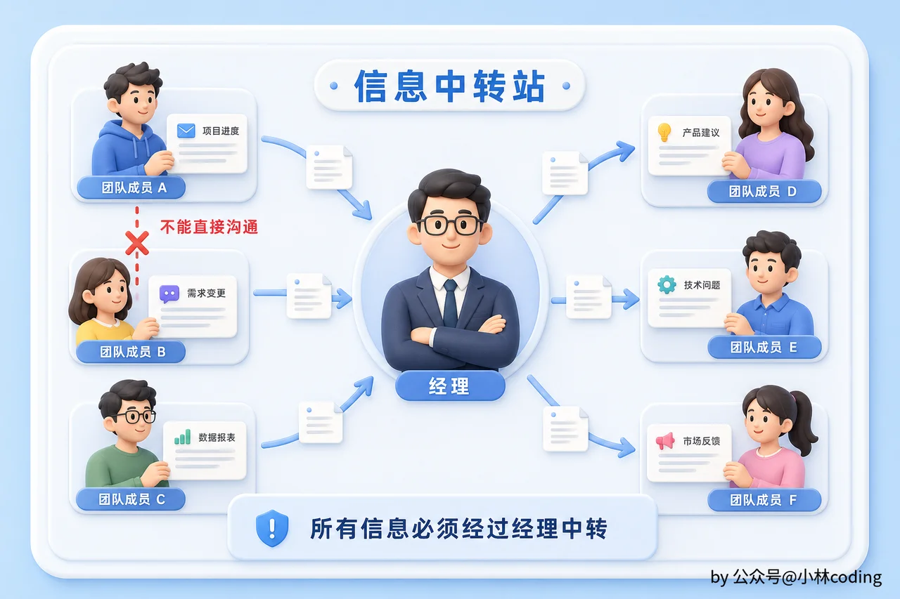

经理瓶颈：队员之间不能直接沟通

我们需要的是一种新模式：多个 Agent 组成一个团队，能并行工作，能直接交流，能自主协调谁做什么。

---

## 从 SubAgent 到 Agent Team：关键区别

先把这两种模式的区别说清楚。

SubAgent 是「星型」拓扑。主 Agent 在中心，子 Agent 在周围。所有通信都经过主 Agent。子 Agent 完成任务后，结果回到主 Agent 的上下文里。子 Agent 之间没有任何通道。

Agent Team 接近「网状」结构，每个队员有自己的上下文窗口，可以直接给其他队员发消息，不必绕回 Lead 中转。不过这里要先说清楚一个细节，所谓「直接发消息」并不是网络层面的实时直连，底层走的是共享文件邮箱加 500ms 轮询，消息会在收件人下一轮 Agent Loop 开头被读到。换句话说，队员之间可以直接寻址，但通信本质上是异步的。共享任务列表加这套异步邮箱，就是 Team 的协调底座。

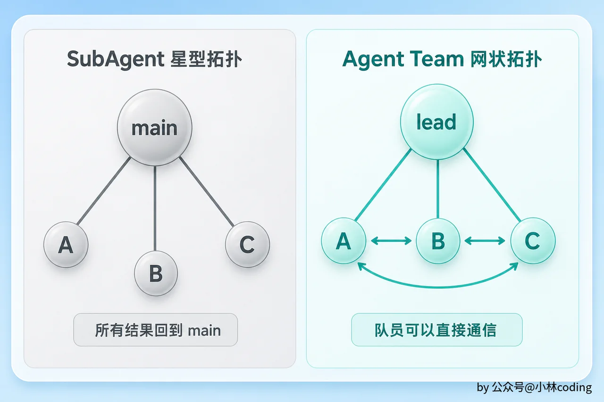

SubAgent 星型 vs Team 网状拓扑

两种模式各有适用场景。SubAgent 适合明确的、一次性的子任务。「帮我查一下这个函数的调用方」「帮我写一下这个测试」。任务边界清晰，不需要中间交流，做完拿结果就行。

Agent Team 适合需要协作的、持续性的工作。「重构这四个模块」「从三个角度分析这个 bug」「同时做 UX 评审和架构评审」。任务之间有依赖或需要信息共享，Agent 之间需要直接沟通。

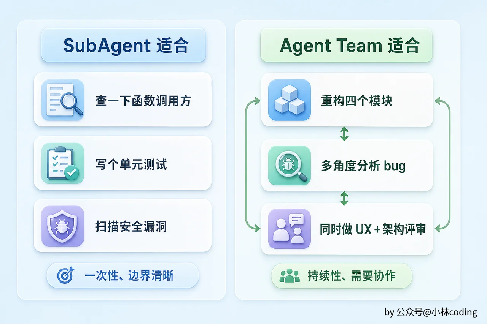

SubAgent 与 Team 的适用场景

---

讲到这里你可能想：业界已经有 AutoGen、CrewAI、LangGraph 这些多 Agent 框架，MewCode 的 Team 模型和它们什么关系？大方向上是「去中心化协调」和「中心化编排」的差别。AutoGen 的 GroupChat 由一个调度者按规则决定谁说话，CrewAI 用一个 Crew 对象编排任务流转，LangGraph 干脆把多 Agent 协作直接写成状态机。这几条路线都把「谁在什么时候做什么」的决策权集中在框架里。MewCode 走的是另一条路，协调能力以工具的形式注入到每个队员的工具集，谁做什么由 LLM 自己看共享任务列表和消息判断。框架不裁判，只提供基础设施。代价是行为可预测性弱一些；收益是新增协作模式只需要加工具，不用动调度器。这一点在后面讲协调机制和 Coordinator Mode 时会反复看到。

---

## Team 的核心结构

想想你组建一个项目小组需要什么。得有个组名，得知道谁是负责人，得有个花名册记录每个人的角色和状态。Agent Team 的数据结构就是这三样东西的直接映射：

```Plaintext
AgentTeam:
    name: string                          // 团队名称
    leadAgentID: string                   // 谁是负责人
    members: []TeammateInfo               // 花名册
    configPath: string                    // 持久化位置
```

花名册里每个队员长这样：

```Plaintext
TeammateInfo:
    name: string                    // 队员名称，由 lead 分配
    agentID: string                 // 对应的 Agent 实例 ID
    agentType: string               // 使用的 Agent 定义
    model: string                   // 模型，可覆盖
    worktreePath: string            // 所在的 Worktree 路径
    backendType: "tmux" | "iterm2" | "in-process"  // 执行后端
    isActive: bool?                 // 活跃状态
    planModeRequired: bool          // 是否需要 Lead 审批
```

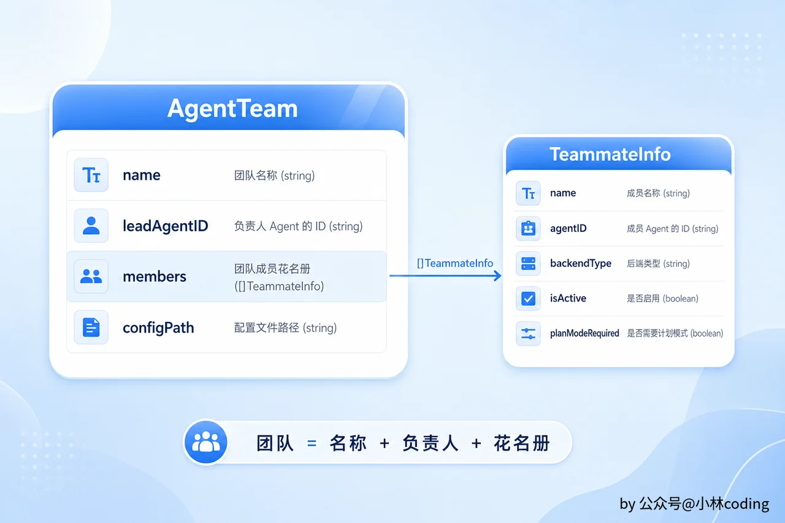

AgentTeam 与 TeammateInfo 数据结构

我们重点看这几个字段。

`backendType` 决定队员在哪里运行。 `"tmux"` 和 `"iterm2"` 意味着队员在独立的终端 pane 里作为单独进程运行，和 Lead 完全隔离。 `"in-process"` 意味着队员和 Lead 跑在同一个进程内，更轻量但隔离性弱。三种后端的细节在后面「三种执行后端」一节展开。

这里要注意的是， `backendType` 是 member 级别的。同一个团队里，队员 alice 可以跑在独立进程中，队员 bob 可以跑在主进程内。后端选择是每个队员独立决定的。

你可能觉得 `isActive` 应该是一个 `"active" | "idle" | "terminated"` 三值枚举？实际上它只是一个可选 boolean。 `undefined` 或 `true` 表示活跃， `false` 表示空闲。没有 `"terminated"` 状态，队员终止后直接从 members 列表移除，不留墓碑。

列表里有的就是活的或暂停的，没有的就是不存在的，清理逻辑因此变得很简洁。

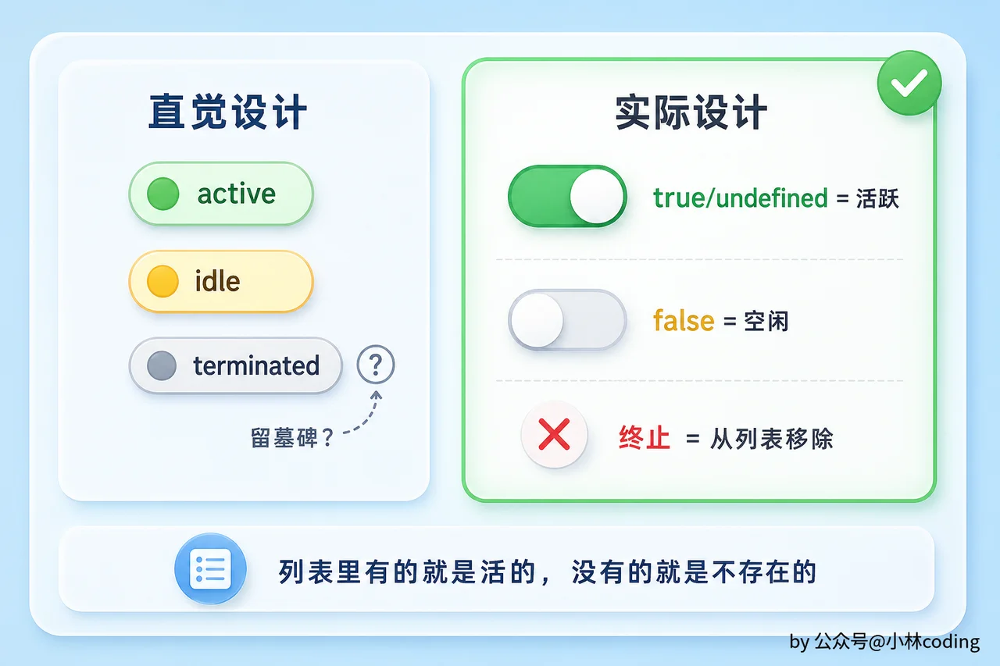

isActive 布尔值 vs terminated 状态

`worktreePath` 是 Worktree 章节的延续。每个队员工作在自己的 Git Worktree 里，文件系统完全隔离。

`planModeRequired` 让 Lead 可以给特定队员加一道审批门槛：这个队员在执行任何修改操作前，必须先提交计划给 Lead 审批通过才能动手。适合风险较高的修改任务。

Team Lead 就是当前主 Agent 本身，它在创建团队后自动承担 Lead 的角色。当你对 MewCode 说「创建一个团队来做这件事」，主 Agent 就变成了 Team Lead。它负责创建团队、派生队员、分解任务、协调进度。

队员是真正干活的。每个队员是一个独立的 Agent 实例，有自己的上下文窗口和工作环境。队员可以是定义式的，从预定义的 Agent 角色创建；也可以是 Fork 式的，直接继承 Lead 的配置。

团队配置持久化到 `~/.mewcode/teams/{name}/config.json` ，每个团队一个目录。

SubAgent 章节的 Agent 工具用一个统一的 Tool 接口实现了子 Agent 的创建和运行。到了团队模式，复杂度上升了一个台阶。团队本身有创建、运行、清理的生命周期，队员的 spawn 需要关联到特定团队，Lead 还需要在团队存续期间进入特殊的协调模式。

如果把这些逻辑全塞进 Agent 工具的参数分支里，这个工具的职责就太重了。

所以团队模式引入了 **独立的顶层工具** 。 `TeamCreate` 负责创建团队， `Agent` 工具的 `team_name` 参数负责往已有团队里 spawn 队员。两者配合，职责清晰：

```Plaintext
// 第一步：创建团队，用 TeamCreate 工具
TeamCreate(team_name="refactor-auth", description="重构认证模块")

// 第二步：spawn 队员
Agent(subagent_type="worker", name="alice", prompt="重构数据层")
Agent(subagent_type="worker", name="bob", prompt="重构服务层")
```

`TeamCreate` 的参数包括 `team_name` 必填， `description` 和 `agent_type` 可选。如果同名团队已存在，系统自动在名称后追加序号避免冲突。

`TeamCreate` 做的事情不多：检测执行后端、创建 team.json 配置文件、初始化共享任务列表、把 Lead 注册进团队。但它作为一个独立工具存在，是因为团队的创建是一个有明确边界的操作，它会改变 Lead 的运行模式，不应该作为 Agent 工具的副作用偷偷发生。

对应的还有一个 `TeamDelete` 工具，负责团队的清理和销毁。

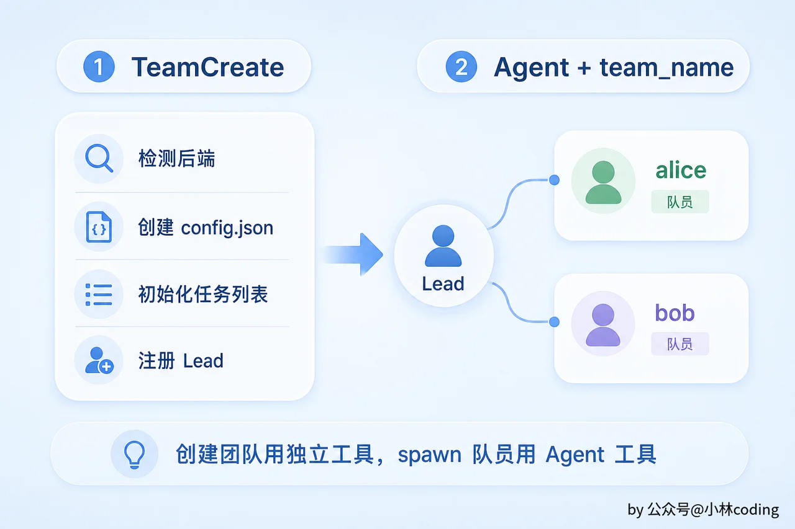

TeamCreate 创建团队与 spawn 队员流程

---

## 三种执行后端

在聊协调机制之前，先要解决一个更基础的问题：队员在哪里运行？

MewCode 支持三种执行后端，对应 `BackendType` 的三个取值： `tmux` 、 `iterm2` 、 `in-process` 。系统按优先级自动检测选择。Tmux 和 iTerm2 是 Pane 后端，每个队员在独立进程中运行。In-process 是进程内后端，所有队员共享同一个进程。

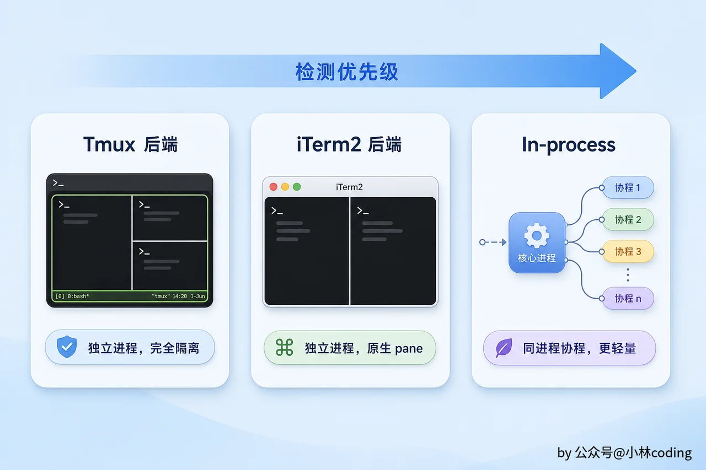

三种队员后端概览

### Tmux 后端

如果当前环境有 tmux，每个队员在独立的 tmux pane 中运行。每个 pane 里是一个完整的 MewCode CLI 实例，拥有自己的进程、内存空间和配置。

```Plaintext
function spawnTmuxTeammate(team, name, config):
    // 1. 创建新的 tmux pane
    paneID = tmux.splitWindow(team.name + "-" + name)

    // 2. 在 pane 中启动 MewCode CLI
    tmux.sendKeys(paneID, buildCLICommand(config))

    // 3. 队员之间通过 mailbox 文件通信
```

Tmux 后端的好处是完全隔离。每个队员是独立进程，一个崩溃不影响其他，生命周期不依赖 Lead。因为是独立的 CLI 实例，Pane 队员拥有 Agent 工具，可以自己 spawn 子 Agent，同步或后台都行。

但有一个硬限制：所有队员的 `team_name` 参数被屏蔽， **队员不能 spawn 其他队员** 。只有 Lead 在 Coordinator Mode 下才能往团队里加人，防止队员自行扩张团队导致混乱。

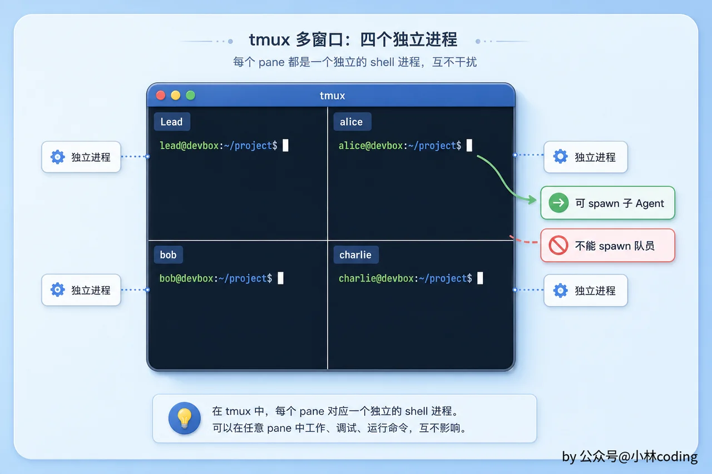

Tmux Pane 团队进程隔离

### iTerm2 后端

macOS 用户如果在 iTerm2 中运行且安装了 `it2` CLI 工具，系统会用 iTerm2 原生 pane 作为后端。和 Tmux 一样，每个队员在独立的 iTerm2 split pane 中运行完整 CLI 实例，拥有自己的进程和内存空间。

隔离特性与 Tmux 后端一致：独立进程、拥有完整工具集、生命周期不依赖 Lead。区别只在于底层的终端多路复用实现。如果用户在 iTerm2 中但没有安装 `it2` ，系统会先尝试回退到 tmux，都不行才提示安装 `it2` 。

### In-process 后端

如果当前环境既不在 tmux 里也不在 iTerm2 里，并且本地也没装 tmux，那 MewCode 就会自动落到 in-process 后端。队员在同一个进程内运行，通过 `startInProcessTeammate()` 启动，共享进程但拥有独立的工具池和消息邮箱。

```Plaintext
function startInProcessTeammate(team, name, config):
    // 1. 创建自定义工具池
    tools = buildTeammateTools(baseTools, team)

    // 2. 在同进程的新协程中启动 Agent
    agent = createAgent(config, tools)
    runAsync:
        agent.runToCompletion(context, initialPrompt)
```

In-process 后端更轻量，启动快，不依赖外部工具。但限制也更多。队员的生命周期绑定在 Lead 身上，Lead 退出，所有 in-process 队员一起退出。Agent 工具虽然可用，但只能 spawn 同步子 Agent，后台 Agent 和队员 spawn 都被禁止。

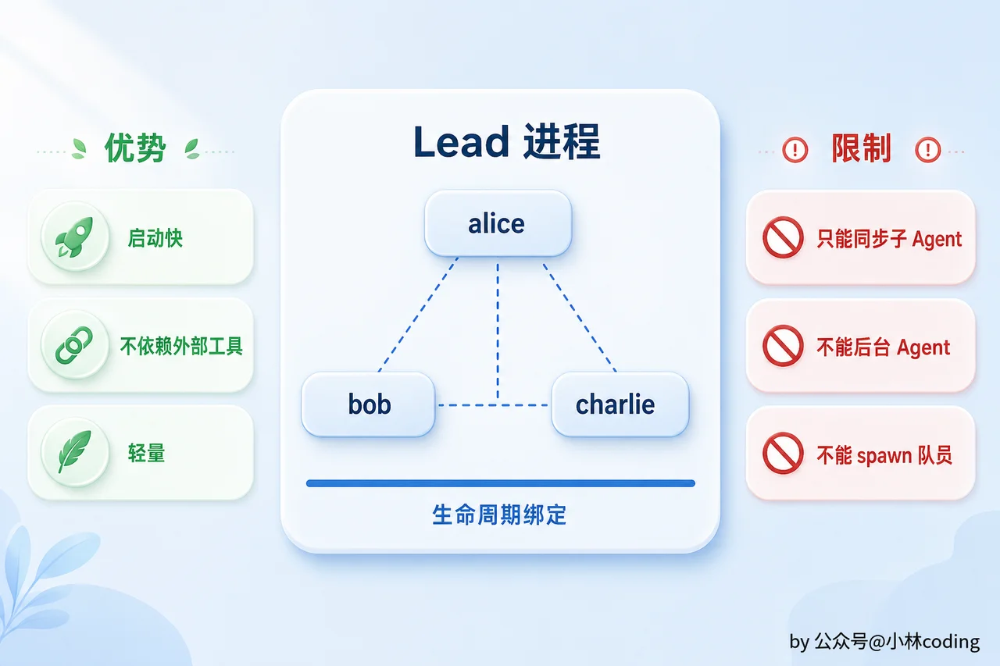

In-process 队员生命周期绑定

那系统具体怎么选后端？检测逻辑只看四件事，按优先级走。先看是否已经在 tmux 里，如果是就直接用 tmux，哪怕是从 iTerm2 里开的 tmux 也一样。不在 tmux 里就看是不是在 iTerm2 里，是的话用 iTerm2 原生 pane。不在 iTerm2 就看本地有没有装 tmux 二进制，装了就拉一个外部 tmux session。三个 Pane 选项都不满足，最后落到 in-process。

换句话说 in-process 是兜底选项，只要环境支持 Pane 后端，系统就会优先用 Pane，没有 Pane 才会静默退到 in-process。这里没有专门的「非交互模式」分支，也没有「Pane spawn 失败再切 in-process」的运行时回退分支，所有选择都在 spawn 开始之前由 `detectBackend` 一次性决定。如果你看到 in-process 后端被启用而又不希望这样，处理办法只有一个：在 Pane 工具链层面把 tmux 装上，或者把当前会话切到 iTerm2 里再开。

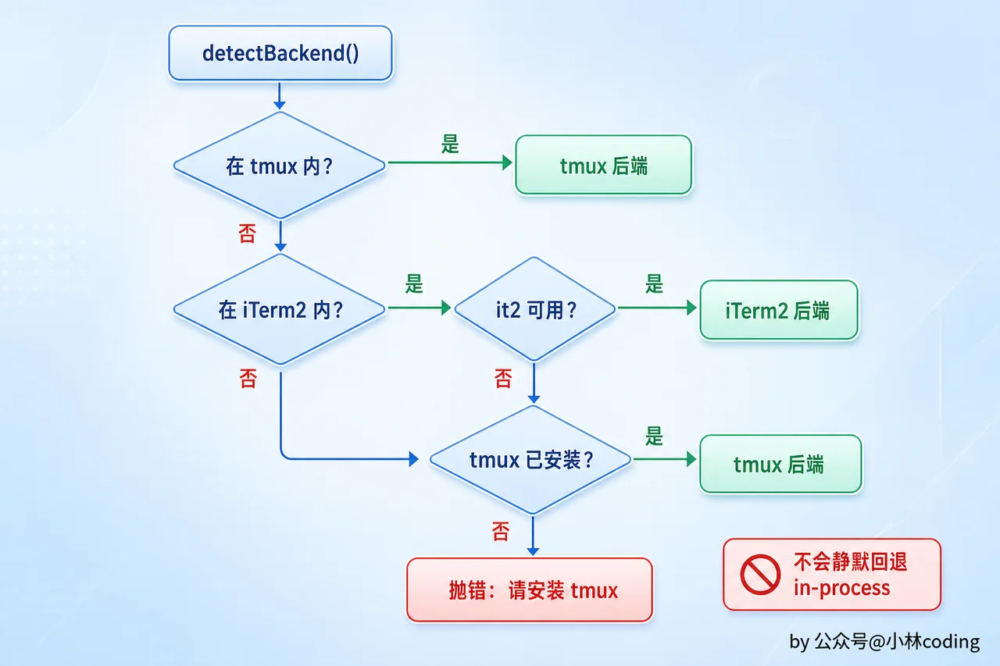

后端检测优先级流程

---

## 协调机制：共享工具取代共享文件

多个 Agent 并行工作，最大的挑战是协调。谁做什么？做到哪了？需要传什么信息？

SubAgent 章节的子 Agent 通过 TaskManager 管理后台任务。Agent Team 在此基础上给队员额外注入了一组协调工具。这些工具让队员之间可以创建任务、同步进度、直接发消息。

之前的子 Agent 只有「干活」的工具，ReadFile、WriteFile、Bash 这些。它是个埋头干活的人，干完了把结果交回去就行。

团队模式下的队员不一样。除了干活的工具，它们额外获得一组「协作」工具：

```Plaintext
IN_PROCESS_TEAMMATE_ALLOWED_TOOLS = [
    TaskCreate,     // 创建新任务
    TaskGet,        // 查看任务详情
    TaskList,       // 列出所有任务
    TaskUpdate,     // 更新任务状态，含 addBlocks/addBlockedBy 依赖字段
    SendMessage,    // 给其他队员发消息
]
```

打个比方。SubAgent 像外包，你把需求发过去，它交付成果，中间不用沟通。队员像正式团队成员，它能看看板、认领任务、在群里 @同事、甚至自己拆子任务。

这些工具是队员专属的。主 Agent 和普通 SubAgent 看不到它们，就像外包人员没有公司内部的 Jira 和 Slack 权限一样。

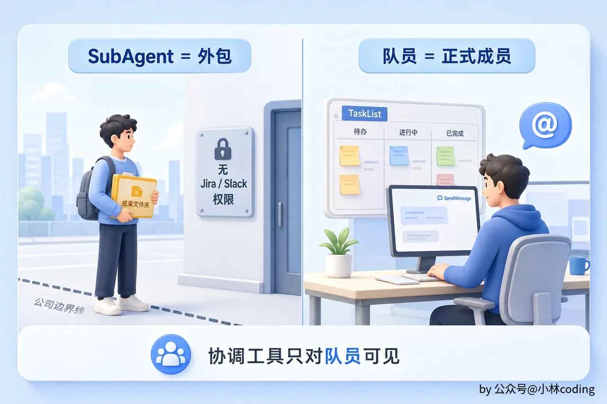

外包工具 vs 队员协作工具

其中 TaskCreate / TaskGet / TaskList / TaskUpdate 是共享任务工具，它们提供团队级任务管理能力（创建、查看、列举、更新），并支持 `addBlocks/addBlockedBy` 依赖字段，后面「分解」一节会讲。真正的新成员是 **SendMessage** ，它让队员之间有了直接通信的能力。

### SendMessage：队员之间的直接通信

alice 在改模块 A 的时候发现一个接口签名变了，bob 正在改模块 B 里调用这个接口的地方。如果 alice 不吱声，bob 就会基于旧的接口写代码，等合并的时候才发现编译不过。

SendMessage 让队员之间可以直接发消息：

```Plaintext
SendMessage(to="bob",
    summary="接口签名变更通知",
    message="接口 Authenticate() 的签名改了，多了一个 ctx 参数")
```

注意 `summary` 字段：发送纯文本消息时，必须提供一个 5-10 词的摘要。这个摘要会作为 UI 中的消息预览显示，让 Lead 和其他队员能快速扫描消息列表而不需要展开每一条。

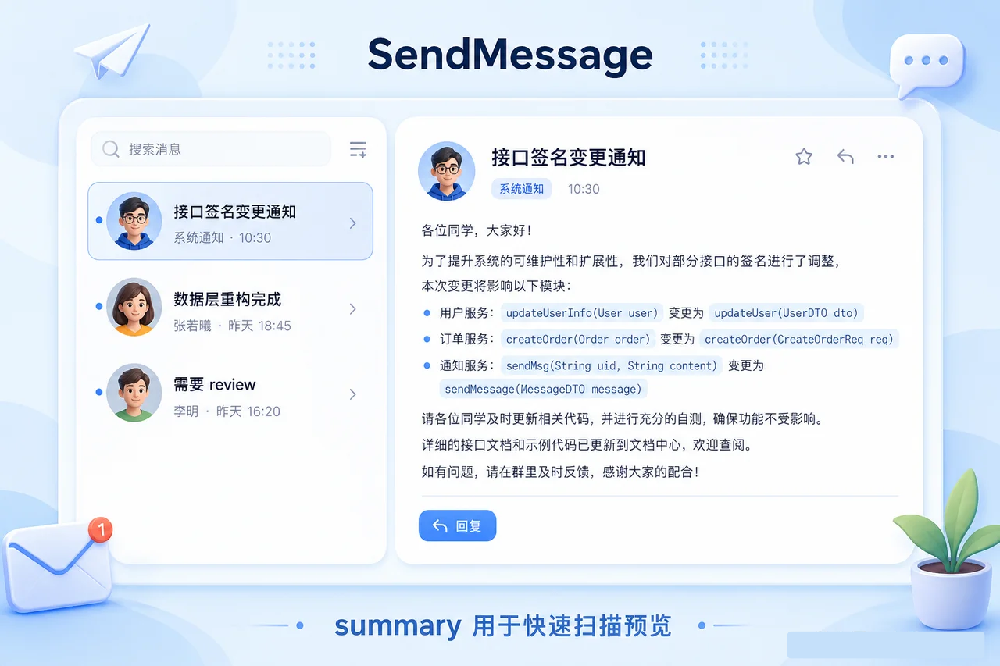

SendMessage 摘要预览 UI

`to` 参数支持两种寻址方式：

-   **队友名称或 Agent ID** ： `to="bob"` 或 `to="agent-a1b"` ，效果一样。名称会通过 agentNameRegistry 解析成 ID，两者路由到同一个地方。用名称是为了可读，用 ID 是因为 `<task-notification>` 返回的就是 ID，续写时直接拿来用。如果目标 Agent 已停止，系统会自动从磁盘恢复它

-   **"\*" 广播** ：发送给所有队友，适合通知全团队的变更

除了纯文本消息，SendMessage 还支持结构化消息类型：

-   **shutdown\_request** ：请求某个队员优雅退出，目标队员可以回复 `shutdown_response` 表示同意或拒绝

-   **shutdown\_response** ：对 shutdown 请求的回复，包含 approve 或 reject 和原因，只能发给 Lead

-   **plan\_approval\_response** ：Plan 模式审批回复，包含 approve 或 reject 和 feedback，只有 Lead 可以发

这种协议化的通信避免了队员之间靠「理解自然语言」来协调生命周期和权限审批的模糊性。

#### Plan 审批工作流

结构化消息中的 `plan_approval_response` 需要具体说下。Lead 可以给某些队员设置 `planModeRequired: true` ，这意味着这些队员在执行任何修改操作前，必须先提交一份计划给 Lead 审批。

流程是这样的：队员分析任务，生成执行计划，计划通过 mailbox 发送给 Lead。Lead 审阅后，通过 `plan_approval_response` 回复审批结果。通过的话直接放行，驳回的话可以附带反馈，比如 `feedback: "不要改 handler 层，只改 service 层"` 。

审批通过后，Lead 的权限模式会传递给队员。比如 Lead 在 default 模式下，审批后队员也会切换到 default 模式开始执行。

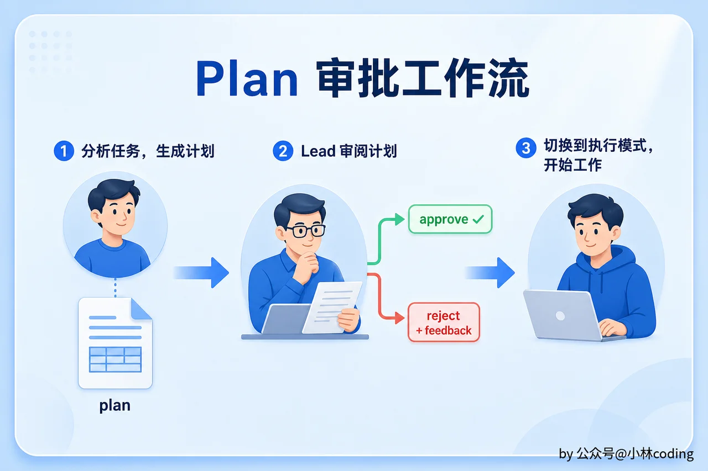

计划审批工作流

消息路由的关键是 **Agent 名称注册表** agentNameRegistry。Agent 工具有一个 `name` 参数，当它非空时，系统会把 `name → agentId` 的映射注册到这张表里。队员在创建时都带了 name，所以自动完成了注册。SendMessage 通过名称查到 agentID，然后把消息投递到目标队员。

投递方式取决于后端。Tmux 后端写入共享 mailbox 文件，同时通过 tmux send-keys 唤醒目标 pane。In-process 后端只写入 mailbox，目标队员在每轮 Agent Loop 开头会先把未读消息读出来注入成 system reminder，下一次调用 LLM 时就能看到。

路由流程也很直观。如果 `to` 是 `"*"` 就广播给所有队友。否则通过 agentNameRegistry 把名称解析成 agentID，解析不到就报错。拿到 agentID 后，根据目标队员的后端类型选择投递方式：

```Plaintext
agentID = agentNameRegistry.resolve(to)
msg = new MailboxMessage(from, to, content)
mailbox.write(agentID, msg)
if isTmuxTeammate(agentID):
    tmux.sendKeys(agentID, "")  // 额外唤醒 pane
```

那并发写 mailbox 会不会撞车？后端工程师看到这个文件邮箱方案，第一反应通常是问这个。MewCode 的处理是给每个收件箱单独配一个 lock file，写之前先用 `O_CREATE | O_EXCL` 抢锁，抢不到就按 5 到 100 毫秒随机抖动重试，最多重试 10 次再放弃，避免雪崩；超过 10 秒还没释放的锁会被认作 stale 直接清掉，防止某个崩溃的进程留下死锁。拿到锁后整文件读出来，改完整文件写回去，不做追加，写入走 `os.WriteFile` 的原子替换。in-process 和 Pane 后端共用同一套机制，所以哪怕队员都跑在同一进程内，goroutine 之间的并发也由文件锁串起来，不需要额外的内存锁。

什么时候该用 SendMessage，什么时候该用 TaskCreate？ 想想你在公司里的场景。「帮我检查一下配置文件」你会开一个工单，因为你要追踪它做没做。「我改了接口签名，你注意一下」你会在群里说一声，因为它就是一个 FYI，不需要追踪状态。前者是任务，后者是消息。

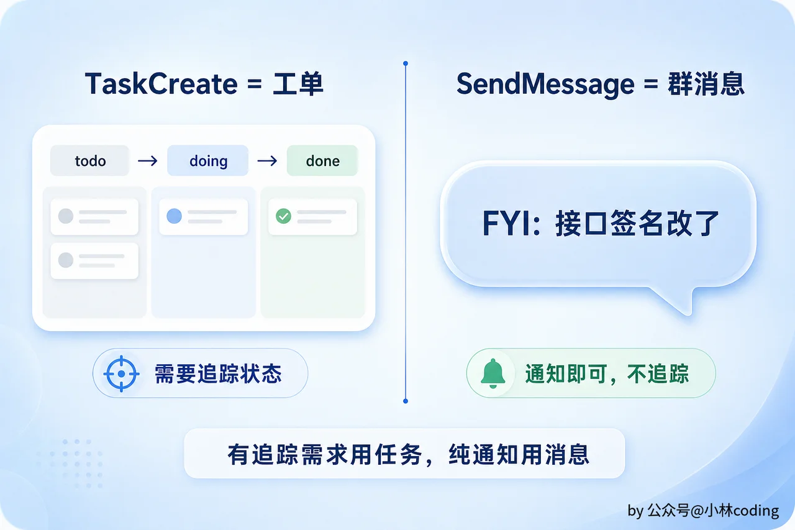

TaskCreate vs SendMessage 使用场景

---

## 团队的生命周期

现在我们用一个具体的场景来串起整个过程。假设你对 MewCode 说：「帮我重构认证模块，数据层和服务层要分开改，改完跑一遍测试。」MewCode 判断这个任务值得组个团队来做。那么它就会开始做这五件事。

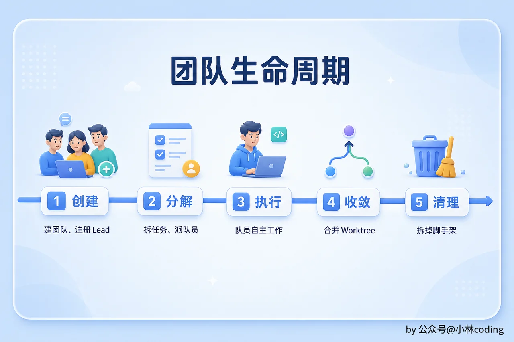

团队生命周期五阶段时间线

### 创建：先把摊子支起来

第一步是建团队。创建 team.json 配置文件，检测执行后端，把 Lead 自己注册进去。

```Plaintext
function createTeam(lead, name) -> AgentTeam:
    team = new AgentTeam(
        name: name,
        leadAgentID: lead.id,
        members: [],
        configPath: "~/.mewcode/teams/" + sanitize(name) + "/config.json",
    )

    writeJSON(team.configPath, team)
    return team
```

### 分解：Lead 把活掰开了排好

团队建好了，Lead 开始拆任务。这一步是 Lead 作为 LLM 自己推理出来的：分析用户的目标，判断哪些事可以并行、哪些有先后依赖，然后把任务写进共享列表。

拿重构认证模块的例子来说，Lead 会用 `TaskCreate` 创建四个任务：重构数据层、重构服务层、更新测试、更新 API。然后用 `TaskUpdate` 的 `addBlockedBy` 字段标记依赖关系，让「更新测试」等「数据层」完成，让「更新 API」等「服务层」完成。最后 spawn 两个队员 alice 和 bob 分头干活。

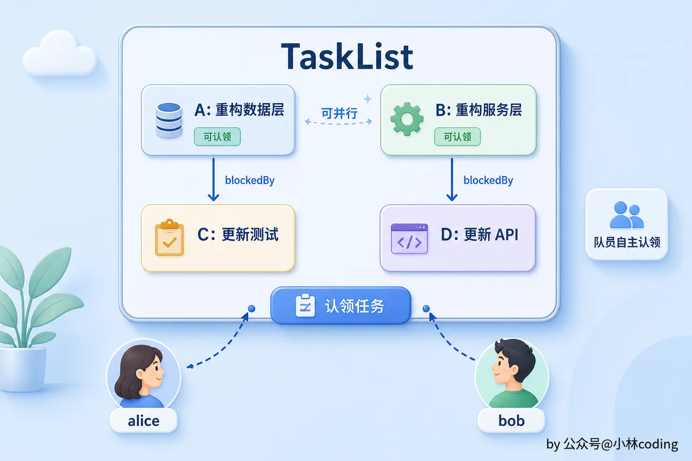

共享任务列表与依赖关系图

任务 A 和 B 没有依赖，可以同时开工。任务 C 要等 A 完成才能开始，D 要等 B。这里的依赖关系可以通过两种方式表达。

第一种是 **系统级依赖** 。 `TaskUpdate` 提供了 `addBlocks` 和 `addBlockedBy` 两个字段，可以建立结构化的任务依赖图：

```Plaintext
// 标记 T2 被 T1 阻塞：T1 完成前 T2 不应该开始
TaskUpdate(taskID="2", addBlockedBy=["1"])

// 反过来：标记 T1 阻塞了 T2
TaskUpdate(taskID="1", addBlocks=["2"])
```

这两个字段接受任务 ID 数组，系统会在任务之间建立有向依赖关系。队员通过 `TaskList` 可以看到每个任务的依赖状态，知道哪些任务被阻塞、哪些可以认领。

第二种是 **文本约定** 。对于简单场景，Lead 也可以直接把依赖关系写在任务描述里，比如写一句「需要在 T1 完成后再开始」，队员通过阅读描述自主判断顺序。这就像 GitHub Issues 里用文字标注 `blocked by #42` ，系统不强制阻止，但约定让协作者知道先后顺序。

实践中两种方式经常混用：核心依赖用 `addBlocks/addBlockedBy` 建立系统级约束，补充说明用描述文本传达意图。

接着 Lead 派生队员。每个队员在创建时自动获得一个 Worktree，有自己独立的工作目录。派生方式取决于后端。

队员的创建也分两种模式，和 SubAgent 章节一样。指定 `agentType` 走定义式路径，队员从空白上下文开始，适合职责明确的角色。留空走 Fork 路径，队员继承 Lead 的完整对话历史，知道用户的需求背景和前面的讨论内容。

需要注意的是，Fork 路径受 `FORK_SUBAGENT` feature flag 控制。只有当该 flag 启用时，省略 `agentType` 才会触发 fork；否则系统会使用默认的 general-purpose agent。

把上面说的串起来，队员的 spawn 流程分六步。

第一步，加载 Agent 定义，如果指定了 model 就覆盖默认值。第二步，创建 Worktree，命名规则是 `team-{teamName}/{name}` ，嵌套 slug。

```Plaintext
wtName = "team-" + team.name + "/" + name
wt = worktreeManager.create(context, wtName, "HEAD")
```

第三步，调用 `buildTeammateTools` 把协调工具注入到基础工具集里。第四步，按后端分流，tmux 和 iterm2 走 `spawnPaneTeammate` ，in-process 走 `spawnInProcessTeammate` 。注意后端类型可以是 per-member 的，同一个团队里不同队员可以用不同后端。

第五步，把队员名称注册到 agentNameRegistry，这样 SendMessage 才能通过名称找到它。第六步，构造 `TeammateInfo` 注册到 `team.members` 。

让一个子 Agent 变成团队成员，需要做两件事：往工具集里注入协调工具，上面已经讲了；以及往系统提示里追加一段团队通信的补充说明。

你可能会想，这段附录要不要把团队成员列表、协调工具用法、工作流程全写进去？实际上不用。工具列表本身就是自描述的，LLM 看到 TaskList、SendMessage 这些工具自然知道怎么用。附录只需要解决一个问题： **告诉队员，你的纯文本回复对队友不可见，想通信必须用 SendMessage。**

下面是附录的原文，核心就三条规则：用 `SendMessage` + `to: "<name>"` 给指定队友发消息；用 `to: "*"` 广播给全团队，要谨慎使用；纯文本回复对队友不可见，必须用 SendMessage。

```Plaintext
IMPORTANT: You are running as an agent in a team.
Just writing a response in text is not visible to others
on your team - you MUST use the SendMessage tool.
The user interacts primarily with the team lead.
Your work is coordinated through the task system
and teammate messaging.
```

就这么短。队员的具体工作流程由 Lead 通过 prompt 和任务描述来传达，不需要硬编码在系统提示里。

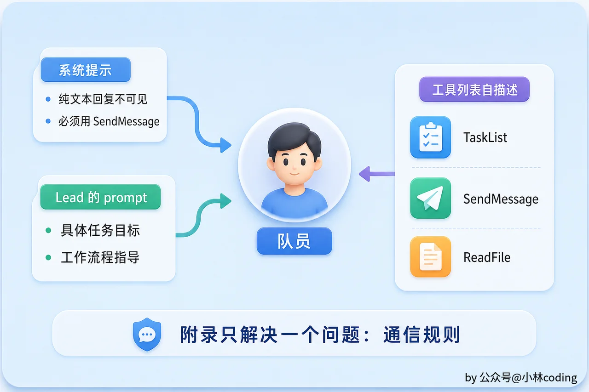

队员附加指令 vs Lead 系统提示

### 执行：队员自己跑

队员派出去之后，每个队员就是一个普通的 Agent 实例，在自己的 Agent Loop 里自主决定做什么。它的工具集里有 `TaskCreate` 、 `TaskList` 、 `TaskUpdate` 、 `SendMessage` 这些协调工具，加上 `ReadFile` 、 `WriteFile` 、 `Bash` 这些干活的工具。

它可能先调 `TaskList` 看看有什么任务可做，然后用 `ReadFile` 、 `WriteFile` 干活，中间穿插通过 mailbox 轮询收到的消息，最后调 `TaskUpdate` 更新任务状态。整个过程由 LLM 的推理驱动，和主 Agent 处理用户请求的方式完全一样。

队员收到 Lead 通过 Agent 工具传入的 prompt 后，就进入自己的 Agent Loop 开始工作。系统不会额外注入固定的调度指令，具体做什么、先做哪个任务，全靠队员自己通过 LLM 推理判断。LLM 自己判断什么时候该查消息、什么时候该认领任务、什么时候该给队友通气。协调工具和 `ReadFile` 、 `Bash` 一样，只是工具列表里的选项，Agent Loop 不做任何特殊处理。

这里有两个重点要说明下。

第一，任务的状态管理依赖 LLM 的判断。 `TaskList` 展示的任务带有状态标记，LLM 能看到哪些已完成、哪些还在进行。系统提示引导队员按合理的顺序推进工作。

第二，我们没有直接把任务 assign 给队员，而是让队员自己从列表里选。这比 Lead 强制分配更灵活。队员基于自己的上下文做选择，比如队员 alice 刚读完数据层的代码，自然会倾向于数据层相关的任务。

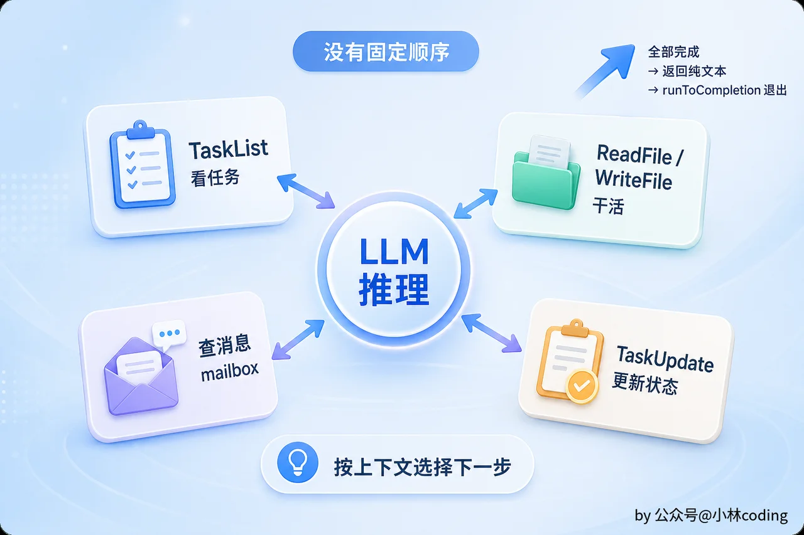

队员自主选择任务循环

### 收敛：把大家的成果拢到一起

所有任务标记为 `completed` 之后，到了 Lead 重新登场的时刻。每个队员在自己的 Worktree 里改了一堆代码，现在要把这些修改合并回主分支。

收敛是由 LLM 推理驱动的，Lead 通过 Bash 工具执行 git 命令，通过 ReadFile 检查冲突文件，通过自己的判断决定合并顺序和冲突解决策略。

整个过程大致如下：

```Plaintext
// Lead 通过 Bash 工具执行这些 git 操作：

// 1. 依次合并每个队员的 Worktree 分支
git merge worktree-team-refactor-auth+alice --no-ff \
    -m "merge: alice"

// 2. 如果有冲突，Lead 读取冲突文件并尝试解决
git add -A
git commit -m "merge(alice): resolve conflict"

// 3. 搞不定的冲突，回滚并告诉用户
git merge --abort
// → 向用户报告：alice 的修改和 bob 的有逻辑冲突，需要你来决定
```

为什么不做成自动化？因为合并冲突的解决本质上是语义理解，需要知道两边改动的意图。这恰好是 LLM 擅长的事情。

大部分机械性冲突，比如两边在文件不同位置加了新代码，Lead 能自己搞定。只有涉及逻辑矛盾、Lead 判断自己没把握选对的时候，才会暂停合并，把冲突的上下文报告给用户，让用户来做最终决定。

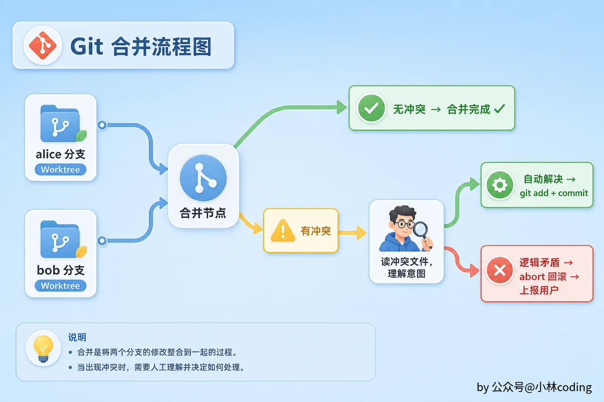

Worktree 收敛阶段冲突解决

### 清理：拆掉脚手架

活干完了，收拾工地。终止队员、删除 Worktree、清理任务文件和团队目录。整个过程不留痕迹，就像这个团队从来没存在过一样。唯一留下的是合并到主分支的代码和 Git 历史。

```Plaintext
function cleanup(team):
    // 1. 确认所有队员已空闲，否则拒绝清理
    for teammate in team.members:
        if teammate.isActive != false:
            return error("队员 " + teammate.name + " 仍在活跃中")

    // 2. 清理 Worktree
    for teammate in team.members:
        worktreeManager.remove(context, teammate.worktreePath)

    // 3. 清理团队目录
    cleanupTeamDirectories(team.name)
```

---

## 队员空闲与续写

上面的生命周期描述了一个完整的从创建到清理的流程。但实际工作中，事情不总是一条直线走到底的。队员完成任务后，Lead 可能发现还需要补一个测试，或者用户临时改了需求。这时候重新 spawn 一个新队员太浪费了，新队员没有之前的上下文，得从头了解情况。

所以 Agent Team 设计了一套空闲与续写机制，让队员可以停下来、再被唤醒继续工作。

队员的 `runToCompletion` 结束时，也就是 LLM 返回纯文本、不再调用任何工具的时候，意味着这个队员认为自己的工作全部做完了。系统通过两步通知 Lead：

```Plaintext
function onTeammateStop(team, teammateName):
    // 1. 在 team config 中标记队员为空闲
    setMemberActive(team.name, teammateName, isActive=false)

    // 2. 向 Lead 的收件箱发送 idle notification
    mailbox.write(team.leadAgentID, idleNotification)
```

前面讲数据结构时提到过， `isActive` 标记为 `false` 就是空闲。Lead 查看团队配置文件就能知道哪些队员已经停下来了，以便判断是否需要追加新任务或者启动收敛。

更关键的是续写机制。队员空闲后，甚至被 `TaskStop` 终止后，Lead 都可以通过 `SendMessage` 向它发送新指令。系统会自动检测目标队员的状态，如果已停止，SendMessage 会从磁盘上的对话记录恢复它，让它带着完整的历史上下文继续工作：

```Plaintext
// 队员 alice 已经完成任务停下来了
// Lead 发现还需要一个集成测试

SendMessage(to="alice",
    message="还需要一个集成测试，请在 test/ 目录下补充端到端测试")

// 系统检测到 alice 已停止 → 自动从磁盘 transcript 恢复
// alice 带着之前的完整上下文继续工作
```

这个设计让队员的生命周期变得灵活：它们可以暂停、恢复、重新指派，是持续性的工作者。和普通 SubAgent 相比，SubAgent 完成后上下文就丢弃了，但团队队员的上下文被持久化到磁盘，随时可以续写。

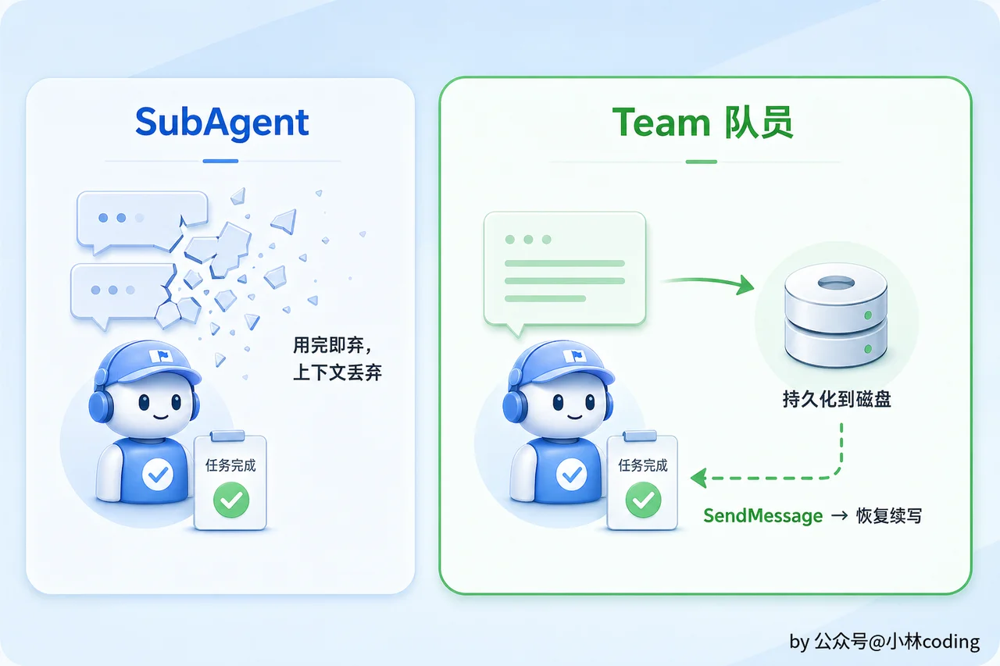

空闲队员上下文持久化与恢复

---

## 任务分解策略

Lead 如何把用户的目标分解成任务，直接决定了团队的执行效率。分解得太粗，一个任务里的工作量太大，并行度上不去。分解得太细，任务之间的依赖太多，队员大部分时间在等。

为了应对这些问题，我这里推荐几个实用的原则。

**按文件边界分任务。** 两个任务如果修改同一个文件，合并时大概率冲突。尽量让每个任务操作不同的文件集。如果实在避不开同一个文件，把修改同一个文件的任务放在有依赖关系的链上，强制它们串行。

**控制每个队员的任务数。** 经验上每个队员排 2 到 4 个任务比较合适。再少队员很快做完就空闲，再多任务列表看起来吓人，LLM 选任务时反而容易纠结。

**依赖关系要明确。** Lead 在拆任务时，如果任务 C 依赖任务 A 的输出，应该用 `addBlockedBy` 建立系统级依赖，同时在任务描述里写清楚原因，比如「需要在 T1 完成后再开始，因为要用到抽取后的接口」。不要指望队员「应该知道」先做 A 再做 C，LLM 不一定能推断出隐含的顺序。

**留一个验证任务。** 所有修改任务完成后，加一个验证任务：编译、跑测试、检查 lint。这个任务依赖所有修改任务，确保只有在所有修改都完成后才执行。

---

## 冲突预防

多个队员并行修改代码，合并冲突是最大的风险。Agent Team 在三个层面预防冲突。

第一层：Worktree 隔离。每个队员在自己的 Worktree 里工作，工作过程中不会互相干扰。

第二层：任务拆分。Lead 在分解任务时尽量按文件边界切分，让不同队员修改不同的文件。

第三层：LLM 驱动的智能合并。收敛阶段 Lead 用 Bash 执行 git merge，如果遇到冲突就用 ReadFile 检查冲突标记，自己判断怎么解决。Lead 像人类开发者一样操作 git，只是更快。大部分机械性冲突 Lead 能自己搞定，涉及逻辑矛盾的冲突才回滚上报用户。

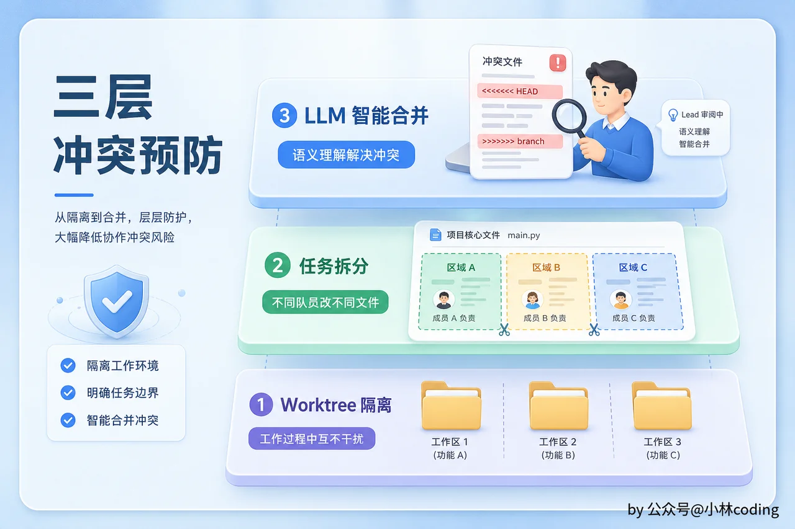

三层冲突预防机制

---

## Coordinator Mode：让 Lead 专注调度

到目前为止，Agent Team 的机制已经讲完了：团队结构、执行后端、协调工具、生命周期。但你可能注意到一个问题：Lead 在派完队员之后，自己还保留着所有工具。它可以一边协调队员，一边自己用 ReadFile 看代码、用 Bash 跑命令。

小团队这样没问题。但当任务复杂、队员数量上来之后，Lead 一心二用会出问题。

它自己改代码会占用主仓库的 Worktree，和队员的修改产生冲突。它的上下文窗口已经被任务列表、队员状态、消息记录占用了不少空间，再往里塞代码内容只会互相干扰。

Coordinator Mode 就是为这个场景设计的。它是一个 **独立于 Agent Team 的可选能力** ，用来给 Lead 加一道纪律约束：进入后，Lead 被剥夺所有代码操作工具，只能专注调度。

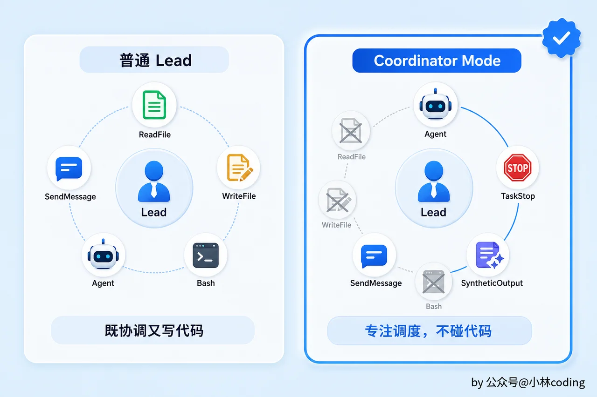

Coordinator 模式工具限制

我们建议在复杂的多 Agent 任务中把 Agent Team 和 Coordinator Mode 组合使用。下面展开看看它是怎么工作的。

### 激活条件

Coordinator Mode 有两把锁，两把都打开才能进入：

```Plaintext
function isCoordinatorMode() -> bool:
    if not feature('COORDINATOR_MODE'):
        return false
    return isEnvTruthy(process.env.MEWCODE_COORDINATOR_MODE)
```

第一把锁是 `COORDINATOR_MODE` feature flag，在 MewCode 里通过配置文件控制，决定是否开放这个能力。第二把锁是 `MEWCODE_COORDINATOR_MODE` 环境变量，由用户自己设置，相当于主动说我要用团队模式。两把锁的设计意图不同：feature flag 让开发者可以按需开关，环境变量让用户显式 opt-in，避免在不知情的情况下改变 Lead 的行为模式。

### 工具集收窄

进入 Coordinator Mode 后，Lead 的工具集被收窄到调度和读类操作两组。允许的有 spawn 和管理队员的 `Agent` 、团队管理的 `TeamCreate / TeamDelete` 、任务管理的 `TaskCreate / TaskGet / TaskList / TaskUpdate` 、消息相关的 `SendMessage` ，以及读类操作 `ReadFile / Glob / Grep / Bash` ：

```Plaintext
COORDINATOR_MODE_ALLOWED_TOOLS = [
    Agent, SendMessage,
    TaskCreate, TaskGet, TaskList, TaskUpdate,
    TeamCreate, TeamDelete,
    ReadFile, Glob, Grep, Bash,
]
```

注意写类工具 `WriteFile` 、 `EditFile` 不在里面，Lead 在 Coordinator Mode 下不直接改代码。但读类工具和 Bash 都保留了。Bash 是因为收敛阶段 Lead 要跑 `git merge` ，没它合不了分支； `ReadFile / Glob / Grep` 是因为 Synthesis 阶段 Lead 得消化队员的研究结果，写实施规格，没读类工具就没法工作。可以这样理解 Coordinator Mode：剥夺 Lead 自己动手写代码的权力，但保留它读代码、跑 git、协调队员的能力。

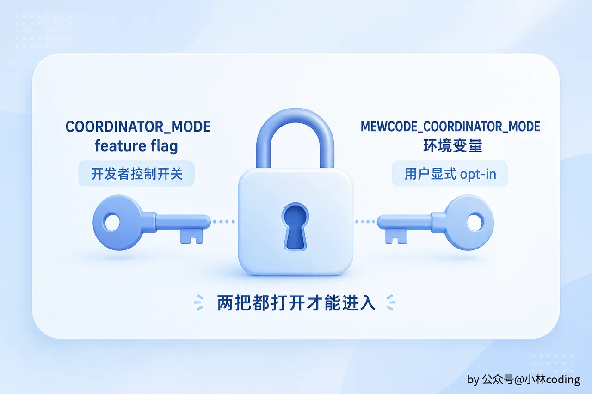

Coordinator 模式双重锁定

### 四阶段工作流

Coordinator Mode 不只是收窄工具集，系统还会注入一套 coordinator 系统提示词，把大部分任务分解成四个阶段：

|     |     |     |
| --- | --- | --- |
| 阶段  | 执行者 | 目的  |
| Research | 队员，可并行 | 调查代码库、定位文件、理解问题 |
| Synthesis | **Lead** coordinator | 阅读调查结果，理解问题，撰写实施规格 |
| Implementation | 队员  | 按规格修改代码、提交 |
| Verification | 队员  | 测试改动是否正确 |

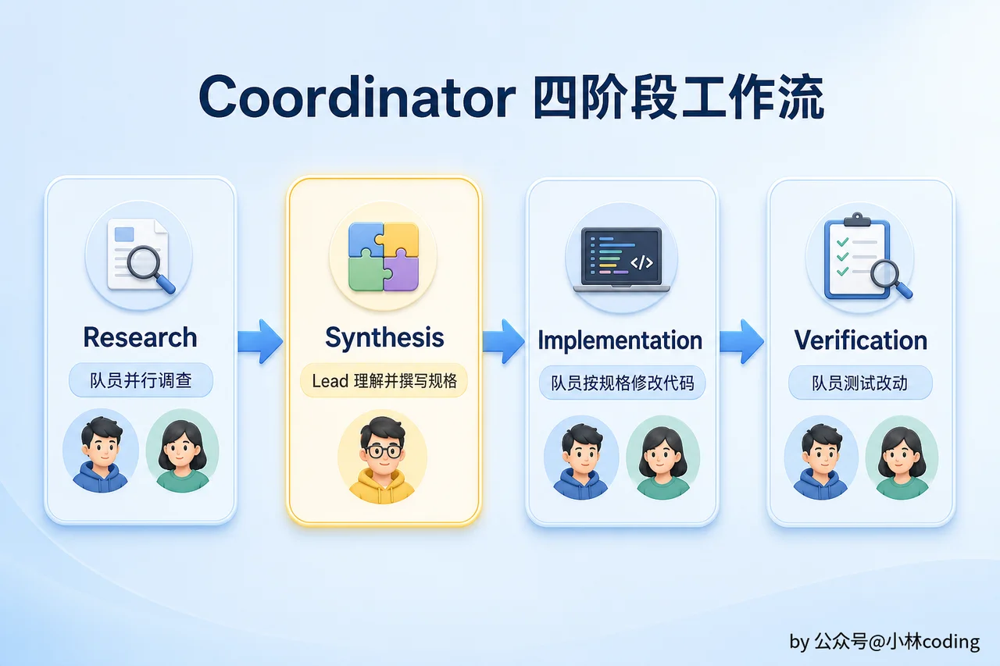

Coordinator 四阶段工作流

四个阶段里最关键的是第二个： **Synthesis** 。这是 Lead 作为 coordinator 最核心的职责，理解队员的研究结果，然后写出具体的实施规格交给下一批队员执行。系统提示词明确要求 Lead 不能把理解能力委托出去：

```Plaintext
// 反面模式：把理解委托给队员
Agent(prompt="基于你的调研结果，修复认证 bug")

// 正确模式：Lead 自己理解后给出具体指令
Agent(prompt="修复 src/auth/validate.ts:42 的空指针。
    Session 类型的 user 字段在 session 过期但 token 仍在缓存时为 undefined。
    在访问 user.id 之前加空值检查，如果为 null，返回 401 'Session expired'。
    提交并报告 commit hash。")
```

### 结果投递与续写循环

队员完成工作后，Lead 怎么知道结果？SubAgent 章节讲后台任务时提到过 `<task-notification>` 通知机制，当时只讲了原理。这里补充一下它的完整 XML 格式，在 Coordinator 工作流里会频繁看到这个结构：

```XML
<task-notification>
<task-id>{agentId}</task-id>
<status>completed|failed|killed</status>
<summary>Agent "Investigate auth bug" completed</summary>
<result>{队员的最终文本回复}</result>
<usage>
  <total_tokens>N</total_tokens>
  <tool_uses>N</tool_uses>
  <duration_ms>N</duration_ms>
</usage>
</task-notification>
```

Lead 看到这个通知后，可以通过 `SendMessage(to="{agentId}", message="...")` 续写这个队员，让它继续做后续工作。这种 spawn → 收结果 → synthesis → 续写 的循环是 coordinator 的核心工作模式。

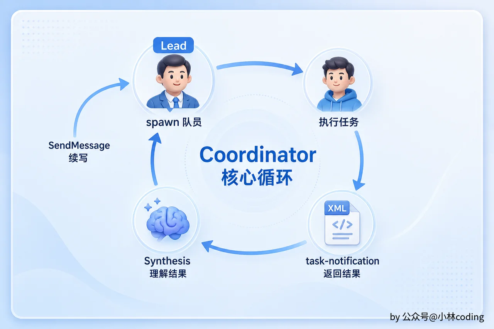

Coordinator 核心循环

---

## 本章小结

这一章把 MewCode 从一个 Agent 带几个临时工升级到了一个协作团队。

SubAgent 是一次性的，交代任务，等结果，用完就扔。Agent Team 是持续性的，队员们通过共享的 Task 工具和 SendMessage 协调工作，自主推进任务。在复杂场景下，Lead 还可以开启 Coordinator Mode，主动放弃写代码的权力，专注调度和判断。

三种执行后端覆盖了不同的环境。Tmux 和 iTerm2 后端让每个队员运行在独立进程中，完全隔离。In-process 后端在同进程内运行，更轻量。系统自动检测环境选择后端，上层的协调逻辑完全一致。

往后退一步看，这一章其实给出了一个非常具体的设计选择： **协调机制是工具，不是基础设施** 。AutoGen、CrewAI 那条路是给多 Agent 协作搭一个调度器，谁说话、谁等待、谁汇总都由框架决定；MewCode 走的是反方向，把 TaskCreate、SendMessage、TaskUpdate 这些协调能力做成工具放进队员的工具集，让 LLM 自己拿主意。它没有引入消息队列，也没有引入 RPC，只是用文件邮箱和共享任务列表把队员粘起来。代价是行为不像状态机那么可预测，收益是想新增协作方式只需要加一个工具，调度器不存在，也就不需要改。这是一种把 Agent 当成有判断力的协作者、而不是流水线上某个工位的设计思路。

回顾一下从 SubAgent 到 Agent Team 的演进路线：SubAgent 解决了上下文隔离，Worktree 解决了文件隔离，Agent Team 解决了多 Agent 协调。三层能力叠加，MewCode 的引擎层就具备了从单 Agent 到多 Agent 团队协作的完整光谱。下一章我们会跳出引擎层，回到产品层面，看看 MewCode 整体的形状到这里长成了什么样，还有哪些坑没填。