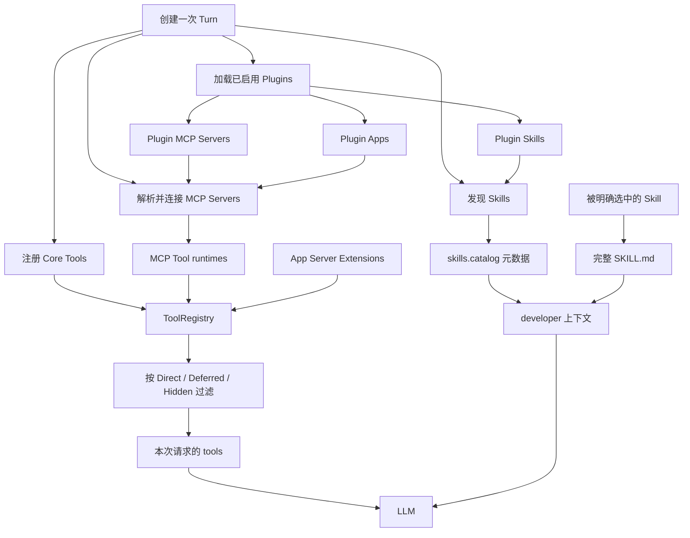

# Codex Harness 源码学习地图

这里用于按能力拆解 Codex harness 的实现，而不是按 Rust crate 名称机械罗列源码。

本文档基于 OpenAI `codex` 公开仓库提交：`633ab19`。

> 本专题是基于公开资料与源码映射形成的分析理解，并非 OpenAI 官方架构文档。源码链接固定到上述提交，便于复核；上游实现变化后，文档结论需要重新验证。

## 目录

| 主题 | 要回答的问题 | 入口 |
| --- | --- | --- |
| Context | 基础指令、WorldState、Extensions、Memory、历史与 Tools 如何形成一次模型请求 | [context/](context/) |
| Session | Thread、Rollout JSONL、Runtime History、Context 注入与模型可见性的关系 | [session/](session/) |
| 端到端请求 | 从用户消息开始，跟踪 Skills、Tools、Extensions、Session 和 Tool Results 如何汇合及回写 | [context/request-lifecycle.md](context/request-lifecycle.md) |
| Compact | `/compact` 命令、自动压缩、本地/远程实现、History 替换与恢复 | [compact/](compact/) |
| Prompt | 基础指令、动态上下文最终如何发送给模型 | [prompt/](prompt/) |
| Tools | 工具从哪里来、如何注册、如何进入 `Prompt.tools`、如何执行 | [tools/](tools/) |
| MCP | Codex 如何连接 MCP Server、发现 MCP Tool、执行调用 | [mcps/](mcps/) |
| Skills | Skill 如何发现、形成 catalog、按需载入完整正文 | [skills/](skills/) |
| Plugins | Plugin 如何把 Skills、MCP Servers、Apps、Hooks 打包并接入 Codex | [plugins/](plugins/) |

## 四种扩展对象不要混在一起

| 对象 | 本质 | 进入模型上下文的主要形式 |
| --- | --- | --- |
| Tool | 模型可以发起的结构化调用接口 | Tool schema，通常放在请求的 `tools` 字段 |
| MCP | Codex 与外部能力服务通信的协议 | MCP Server 发现出的 Tool schema，转换后进入 ToolRegistry |
| Skill | 教模型怎样完成一类工作的指令与资源包 | 先暴露 catalog 元数据，选中后再载入完整 `SKILL.md` |
| Plugin | Skills、MCP Servers、Apps、Hooks 的安装与分发容器 | Plugin 自身通常不直接成为一个 Tool；其子能力分别接入 |

## 总体调用关系

## 当前源码静态盘点

这些数字表示源码中可出现的能力，不代表每一轮都会全部发送给模型。

| 类别 | 静态结果 |
| --- | --- |
| Core Tool 标识并集 | 31 |
| 全部 Extension 与 hosted model tool 后的 Tool 标识并集 | 待完整重盘；原“34”遗漏了 Memory 等 Extension tools |
| 产品内嵌系统 Skills | 6 |
| 仓库维护 Skills | 11 |
| 仓库中的 `SKILL.md` 总数 | 17 |
| 默认用户配置的外部 MCP Servers | 0，可动态增加 |
| 内置 Apps MCP Server | 最多 1 个：`codex_apps` |
| Codex 入站 MCP Server | 1 个程序，对外暴露 2 个 tools |
| 仓库内实际 Plugin manifest | 0 |

## 文档约定

- `README.md` 讲架构、执行流程和源码入口。
- `source-excerpts.md` 保存当前提交的关键源码片段，方便连续阅读。
- 源码片段只是学习快照；判断真实行为时，以文中固定上游提交的源码链接为准。
- 文档中的上游源码链接固定到调研提交；更新基准提交后，应重新核对链接、行号和片段。

## 官方概念边界

OpenAI 官方将 Plugin 描述为用 Skills、MCP Servers 和可选 UI 扩展 ChatGPT 与 Codex 的打包方式。本文档不照搬产品介绍，而是继续追到公开的 Rust 实现。

- [OpenAI Developers](https://developers.openai.com/)
