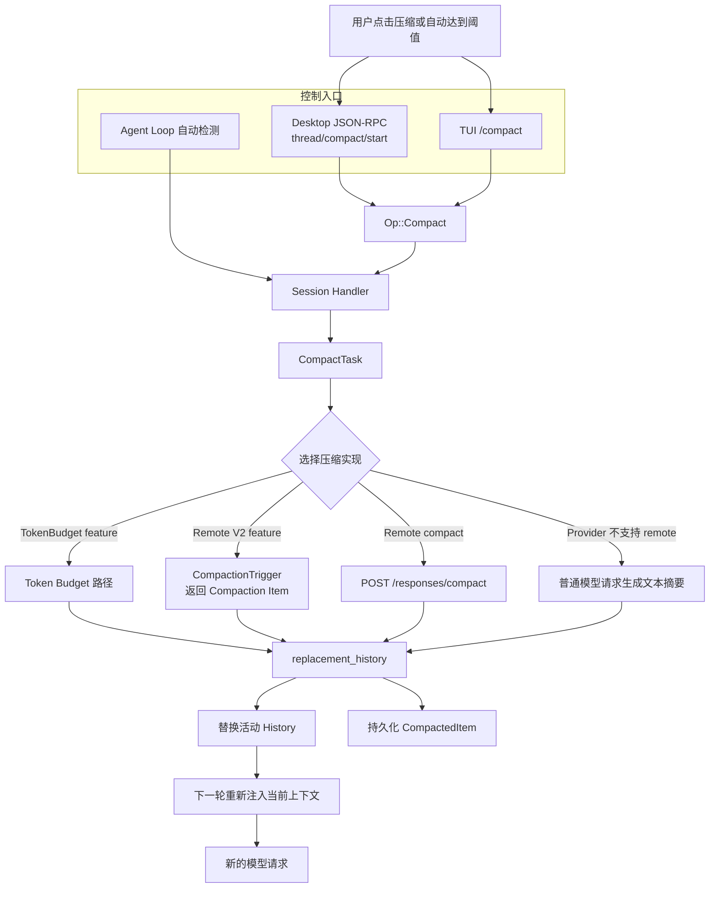

# Compact：Codex 的上下文压缩机制

本文档基于 OpenAI `codex` 公开仓库提交：`633ab19`。

这个目录单独拆解 Codex 的 Compaction。它要回答的不是“怎样把一段文本缩短”，而是下面这些 Runtime 问题：

1. 用户点击“压缩”以后，请求怎样从 UI 进入 `codex-core`；
2. 手动压缩和自动压缩有什么区别；
3. Codex 为什么同时存在本地摘要、`/responses/compact` 和 Compaction V2；
4. 压缩前后的活动 History 分别是什么；
5. System instructions、Tools、Skills 和 WorldState 会不会被一起压缩；
6. 旧对话是否删除，以及 Session 恢复时怎样找到压缩后的上下文。

## 1. 先给结论

Compaction 是对**模型活动上下文**建立一个更小的检查点，不等于：

- 删除聊天记录；
- 清空 Thread；
- 写入长期 Memory；
- 把所有 Prompt、Tool schema 和历史文本压成一个 Markdown；
- 普通的字符串截断。

一次压缩同时涉及三层状态：

```text
用户可见聊天记录
    不一定因为压缩而消失

Rollout 持久化记录
    保留旧事件，并追加 CompactedItem 检查点

模型活动 History
    被替换为较小的 replacement_history
```

下一次请求仍然遵守 Codex 的三通道结构：

```text
Prompt
├── base_instructions：当前基础指令
├── input：压缩后的 History + 当前动态上下文 + 本轮消息
└── tools：当前这一步重新构建的 Tool schemas
```

所以“压缩 History”不等于“以后不再有 System instructions 或 Tools”。这些稳定或实时变化的部分会由 Runtime 重新装配。

## 2. 总体架构



## 3. 学习路线

建议按下面的顺序阅读：

1. [从“压缩”命令到 `Op::Compact`](command-entry.md)
2. [三类主要压缩实现](implementations.md)
3. [自动触发、History 替换、持久化与恢复](automatic-trigger-and-storage.md)
4. [关键源码摘录](source-excerpts.md)

如果还没有区分 UI Thread、Rollout JSONL 与模型活动 History，先阅读 [Session 文档](../session/)。

## 4. Compact 与相关概念的边界

| 概念 | 解决的问题 | 主要保存位置 | 是否直接改变下一轮 History |
| --- | --- | --- | --- |
| Compaction | 当前 Thread 太长 | `CompactedItem.replacement_history` | 是 |
| Memory | 保存跨任务有价值的信息 | Memory 文件和 Memory extension | 否，通过后续 Context 注入生效 |
| Rollout | 记录运行过程并支持恢复 | 本地或远程 Rollout store | 不直接等于模型输入 |
| Truncation | 单个过大消息或工具结果超限 | 请求预处理后的 item | 只修改对应 item |
| Prompt caching | 减少重复前缀的计算成本 | API/Provider cache | 不减少语义上的 History |

## 5. Compact 对 Tools、Skills 和动态上下文的影响

### Tools

Tool schemas 不依赖压缩摘要保存。每个 Step 的 `ToolRouter` 会根据当前 Core Tools、MCP Tools、Extensions 和暴露策略重新产生 `Prompt.tools`。

过去的 Tool Call 和 Tool Result 属于 History。压缩后它们可能不再逐项保留，只留下对继续任务有用的结论。

### Skills

Skills catalog 会按当前环境重新注入。某一轮选中 Skill 的完整 `SKILL.md` 属于该轮动态 Context，不保证在压缩后逐字留下：

- 关键约束可能被写进摘要或 opaque compaction item；
- 后续再次命中该 Skill 时，Runtime 可以重新读取完整正文；
- 如果没有重新命中，也没有被压缩结果保留，模型就不应被认为仍持有完整 Skill 原文。

### System、Developer instructions 与 WorldState

手动压缩和 Turn 开始前的自动压缩会清除旧 reference context。下一次普通 Turn 会重新注入完整 initial context。

Turn 中途压缩不能等到下一轮才恢复环境，因此 Core 会把当前 canonical initial context 插入 replacement history，并维持新的 WorldState baseline。

### Memory

Memory 不是压缩摘要。启用 Memory extension 时，Memory summary 会按当前配置重新贡献 Context；它不依赖 `CompactedItem.message` 充当长期存储。

## 6. 官方 API 边界

OpenAI Responses API 提供 `POST /responses/compact`。官方返回结构是历史中的用户消息，后接一个 opaque、加密的 compaction item；该 item 用于后续继续请求，不应该由客户端解析其内部内容：

- [Compact a response](https://developers.openai.com/api/reference/java/resources/responses/methods/compact)

Codex 仓库还保留本地摘要和新的 Compaction V2 分支，因此不能把整个 Codex Compact 简化成一次 `/responses/compact` HTTP 调用。
