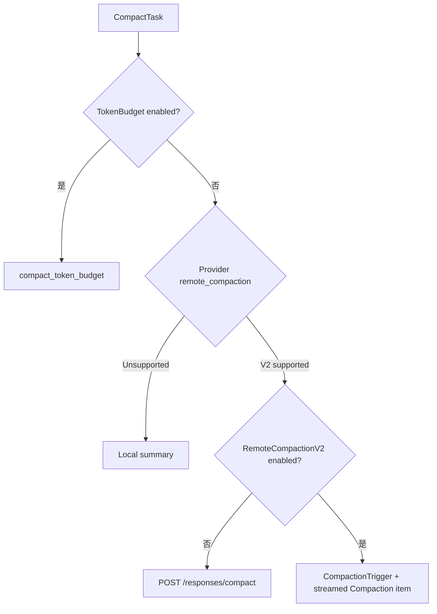

# Compact 的三类主要实现

本文档基于 OpenAI `codex` 公开仓库提交：`633ab19`。

## 1. 策略选择入口

`CompactTask` 位于：

- [`core/src/tasks/compact.rs`](https://github.com/openai/codex/blob/633ab199cfd724aa78013c006b27a2b3d049fc3b/codex-rs/core/src/tasks/compact.rs)

删除埋点和错误处理后的主干如下：

```rust
if ctx.config.features.enabled(Feature::TokenBudget) {
    compact_token_budget::run_manual_compact_task(session, ctx).await?;
    return Ok(None);
}

match ctx.provider.capabilities().remote_compaction {
    RemoteCompactionSupport::V2
        if ctx.config.features.enabled(Feature::RemoteCompactionV2) =>
    {
        compact_remote_v2::run_remote_compact_task(session, ctx).await
    }
    RemoteCompactionSupport::V2 => {
        compact_remote::run_remote_compact_task(session, ctx).await
    }
    RemoteCompactionSupport::Unsupported => {
        compact::run_compact_task(session, ctx, summary_prompt).await
    }
}
```

这里要注意命名：

- `RemoteCompactionSupport::V2` 表示 Provider 具备远程压缩能力；
- `Feature::RemoteCompactionV2` 决定使用新的 CompactionTrigger 流程还是旧的 `/responses/compact` 流程；
- Provider 不支持远程压缩时，回退到 Codex 自己组织的文本摘要流程；
- `TokenBudget` 是另一条专用实验路径，优先级最高。



## 2. 本地摘要式压缩

这里的“本地”指压缩流程由 Codex Core 自己编排，不是指完全不调用模型。

入口：

- [`core/src/compact.rs`](https://github.com/openai/codex/blob/633ab199cfd724aa78013c006b27a2b3d049fc3b/codex-rs/core/src/compact.rs)

### 2.1 压缩提示词

默认提示词位于：

- [`prompts/templates/compact/prompt.md`](https://github.com/openai/codex/blob/633ab199cfd724aa78013c006b27a2b3d049fc3b/codex-rs/prompts/templates/compact/prompt.md)

它要求模型生成一份交接摘要，重点包括：

- 当前进展与关键决定；
- 重要上下文、约束和用户偏好；
- 尚未完成的工作和下一步；
- 继续工作需要的数据、示例和引用。

配置中的 `compact_prompt` 可以覆盖默认提示词。

### 2.2 怎样产生摘要

Core 首先复制当前 History，然后把压缩提示词作为合成的 UserInput 追加到副本：

```rust
let mut history = sess.clone_history().await;
history.record_items(&[initial_input_for_turn.into()], truncation_policy);
```

接着构建一个特殊 Prompt：

```rust
let prompt = Prompt {
    input: history.for_prompt(...),
    base_instructions: sess.get_prompt_base_instructions().await,
    ..Default::default()
};
```

因为使用 `Default::default()`，这条本地摘要请求的 `Prompt.tools` 为空。压缩模型的任务只是生成摘要，不应该在压缩过程中继续调用业务 Tool。

Core 消费模型输出，最后取得本次压缩 Turn 的最后一条 Assistant Message：

```rust
let summary_suffix =
    get_last_assistant_message_from_turn(history_snapshot.raw_items())
        .unwrap_or_default();

let summary_text = format!("{SUMMARY_PREFIX}\n{summary_suffix}");
```

### 2.3 怎样构建新的 History

本地实现不是只留下一个摘要。它会：

1. 收集旧 History 中的真实用户消息；
2. 排除以前的 Compaction Summary；
3. 从最新消息向前选择，最多保留约 20,000 tokens；
4. 如果边界消息过大，则截断该消息；
5. 最后追加新的 Compaction Summary。

常量为：

```rust
const COMPACT_USER_MESSAGE_MAX_TOKENS: usize = 20_000;
```

因此本地压缩后的活动 History 可以抽象为：

```text
最近的真实 User Message
最近的真实 User Message
...
SUMMARY_PREFIX + 交接摘要
```

过去的 Assistant Messages、Tool Calls、Tool Results 和 Reasoning 不会逐项进入这份 replacement history。重要内容必须由摘要表达。

## 3. `/responses/compact` 远程压缩

远程旧路径位于：

- [`core/src/compact_remote.rs`](https://github.com/openai/codex/blob/633ab199cfd724aa78013c006b27a2b3d049fc3b/codex-rs/core/src/compact_remote.rs)
- [`core/src/compact_remote_request.rs`](https://github.com/openai/codex/blob/633ab199cfd724aa78013c006b27a2b3d049fc3b/codex-rs/core/src/compact_remote_request.rs)
- [`core/src/client.rs`](https://github.com/openai/codex/blob/633ab199cfd724aa78013c006b27a2b3d049fc3b/codex-rs/core/src/client.rs)

客户端常量：

```rust
const RESPONSES_COMPACT_ENDPOINT: &str = "/responses/compact";
```

与本地摘要不同，这条请求会带上当时 Step 的模型可见 ToolSpecs：

```rust
let prompt = Prompt {
    input: history.for_prompt(...),
    tools: tool_router.model_visible_specs(),
    parallel_tool_calls: true,
    base_instructions,
    // ...
};
```

这只能证明远程 Compact payload 包含当时的 Tool schemas，不表示压缩过程中一定会执行 Tool。服务端怎样在压缩内部利用这些 schemas，不由当前客户端源码进一步规定。

官方 API 返回一个 compacted response，其 output 是用户消息加一个 opaque、加密的 compaction item：

- [Compact a response](https://developers.openai.com/api/reference/java/resources/responses/methods/compact)

Codex 收到远程结果以后还会本地清洗：

- 丢弃远程结果中的 developer messages，防止旧指令重复或过期；
- 丢弃不是真实 User Message 或 HookPrompt 的 user-role 包装消息；
- 保留真实用户消息、Assistant/Agent Message 和 Compaction Item；
- 丢弃 Tool Call、Tool Result、Reasoning、Web Search Call 等中间运行项。

过滤函数为：

```rust
should_keep_compacted_history_item(...)
```

这一步说明：远程服务返回什么，与 Codex 最终安装成活动 History 的内容，不一定完全相同。

## 4. Compaction V2

V2 主体位于：

- [`core/src/compact_remote_v2.rs`](https://github.com/openai/codex/blob/633ab199cfd724aa78013c006b27a2b3d049fc3b/codex-rs/core/src/compact_remote_v2.rs)
- [`core/src/compact_remote_v2_attempt.rs`](https://github.com/openai/codex/blob/633ab199cfd724aa78013c006b27a2b3d049fc3b/codex-rs/core/src/compact_remote_v2_attempt.rs)

### 4.1 使用协议项触发

V2 不把自然语言摘要指令追加为 User Message，而是在输入末尾追加：

```rust
input.push(ResponseItem::CompactionTrigger {});
```

然后通过普通 Responses stream 等待模型产生：

```rust
ResponseItem::Compaction { ... }
```

Core 校验一次响应中必须恰好有一个 Compaction Item：

```rust
if compaction_count != 1 {
    return Err(CodexErr::Fatal(...));
}
```

### 4.2 V2 的 replacement history

V2 不只是保留一个 opaque item。客户端会先从原 Prompt 中选取允许保留的近期消息，再追加模型产生的 Compaction Item。

当前保留预算：

```rust
pub(crate) const RETAINED_MESSAGE_TOKEN_BUDGET: usize = 64_000;
```

大致结构是：

```text
近期允许保留的 User/System/Client-authored Developer/Agent messages
Compaction Item
```

保留算法从最新消息向旧消息计算预算；边界文本可能被截断。图片是否计入预算由 `CompactionImageBudget` feature 控制。

V2 会过滤掉：

- 子 Agent 的进度广播；
- 子 Agent completion 包装消息；
- 超过单条上限的 Agent Message；
- Tool Calls 和 Tool Results 等不属于 retained message 范围的项目。

### 4.3 为什么是 opaque item

Opaque compaction item 是模型生成的续写状态，不是为人类阅读或编辑准备的 Markdown 摘要。调用方应该把它原样放入后续请求，不解析、不依赖其内部格式。

这与本地摘要的主要区别是：

- 本地摘要可以直接读取；
- opaque item 的内部表达可以由模型和服务端演进；
- Runtime 只需要知道怎样保存并在下一次请求中传回。

## 5. 三种主要路径对比

| 维度 | 本地摘要 | `/responses/compact` | Compaction V2 |
| --- | --- | --- | --- |
| 触发模型的方式 | 合成 User Message | 专用 HTTP endpoint | `CompactionTrigger` 协议项 |
| 压缩结果 | 可读文本摘要 | Provider compacted history | Compaction Item |
| ToolSpecs | 本地请求为空 | 带当前 ToolSpecs | 带当前 ToolSpecs |
| 客户端保留消息预算 | User messages 最多约 20K | 以服务端返回并经本地过滤为准 | retained messages 最多约 64K |
| 是否 opaque | 否 | 是，官方 compaction item | 是 |
| 最终动作 | 替换活动 History | 替换活动 History | 替换活动 History |

## 6. 压缩前后结构示例

### 压缩前

```text
developer: 初始上下文
user: 需求 A
assistant: 分析 A
assistant -> tool: exec_command
tool -> assistant: 一大段输出
assistant: 完成 A
user: 需求 B
assistant -> tool: read files
tool -> assistant: 更多输出
assistant: 当前进展
```

### 本地摘要压缩后

```text
user: 需求 A
user: 需求 B
user/context: Another language model ... summary
```

### V2 压缩后

```text
近期允许保留的 messages
response.compaction: encrypted_content
```

### 下一次普通 Turn

```text
instructions: 当前基础指令
input:
  - 当前重新注入的 initial context 或 WorldState
  - replacement history
  - 当前用户消息
tools:
  - 当前 ToolRouter 产生的 ToolSpecs
```

下一步阅读：[自动触发、History 替换、持久化与恢复](automatic-trigger-and-storage.md)。
