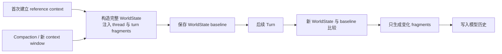

# Context：Codex 如何组装一次模型请求

本文档基于 OpenAI `codex` 公开仓库提交：`633ab19`。

## 先给结论

Codex 的完整 Context 不是一份巨大的系统提示词 Markdown，而是三条通道汇合后的结构化请求：

```text
Model Request
├── instructions：模型基础行为指令
├── input：历史消息、developer/user 上下文、本轮输入、Tool Results
└── tools：本轮允许模型调用的 Tool schemas
```

OpenAI Responses API 也把 `instructions`、`input` 和 `tools` 定义为独立请求字段：

- [Create a model response](https://developers.openai.com/api/reference/cli/resources/responses/methods/create)

## 完整装配图

```mermaid
flowchart TD
    Turn[开始一次 Turn]

    subgraph Persistent[持久状态]
        History[Conversation History<br/>用户 / 助手 / Tool Call / Tool Result]
        Compact[Compaction Summary]
        Rollout[Rollout / WorldState baseline]
        ThreadState[Thread / Session state]
        MemoryFiles[Local Memory Store<br/>memory_summary.md / MEMORY.md / rollout_summaries]
    end

    subgraph Base[基础指令]
        ModelInstructions[Model base instructions]
        Personality[Personality instructions]
        CustomBase[config.base_instructions]
    end

    subgraph CoreWorldState[Core WorldState]
        AgentMd[AGENTS.md]
        Permissions[Permissions / Sandbox / Approval]
        Environment[cwd / OS / 日期 / Environments]
        Collaboration[Collaboration / Multi-Agent mode]
        AppsPlugins[Apps / Plugins usage instructions]
        DeferredTools[Deferred Tool namespaces]
        Managed[Managed developer instructions]
        Budget[Token budget / Context-window guidance]
    end

    subgraph ExtensionContext[Extension Context Contributors]
        MemoriesExt[Memories extension]
        SkillsExt[Skills extension]
        HistoryNotesExt[History Notes extension]
        GitExt[Git Attribution extension]
        OtherContextExt[其他 ContextContributor]

        MemoriesExt --> MemoryGate{MemoryTool feature<br/>并且 use_memories?}
        MemoryGate -->|是| Summary[读取 memory_summary.md]
        Summary --> Truncate[截断到最多 2500 tokens]
        Truncate --> MemoryFragment[memories.instructions<br/>DeveloperPolicy]

        SkillsExt --> SkillCatalog[skills.catalog<br/>developer fragment]
        SkillsExt --> SelectedSkill[选中 Skill 完整正文<br/>user fragment]
        HistoryNotesExt --> ThreadHint[notes.thread_hint<br/>ContextWindow slot]
        ThreadHint --> ContextWindowHints[context-window hints]
        GitExt --> GitState[Git attribution<br/>WorldState section]
    end

    subgraph OtherInput[其他动态输入]
        RecommendedPlugins[Recommended Plugin instructions]
        HookFragments[Hook prompt fragments]
        ClientDeveloper[Client developer messages]
        CurrentUser[本轮用户消息]
    end

    subgraph ToolsPipeline[Tool 通道]
        CoreTools[Core Tools]
        McpTools[MCP Tools]
        ExtensionTools[Extension Tools<br/>Memory / Skills / Goal / Notes / Web / Image]
        DynamicTools[Dynamic Tools]
        HostedTools[Hosted Model Tools]

        CoreTools --> Registry[ToolRegistry]
        McpTools --> Registry
        ExtensionTools --> Registry
        DynamicTools --> Registry
        Registry --> Exposure[Direct / Deferred / CodeMode / Hidden]
        Exposure --> VisibleTools[本轮可见 ToolSpecs]
    end

    Turn --> Base
    Turn --> CoreWorldState
    Turn --> ExtensionContext
    Turn --> OtherInput
    Turn --> ToolsPipeline

    ModelInstructions --> Instructions[Request.instructions]
    Personality --> Instructions
    CustomBase --> Instructions

    AgentMd --> WorldRender[WorldState full 或 diff]
    Permissions --> WorldRender
    Environment --> WorldRender
    Collaboration --> WorldRender
    AppsPlugins --> WorldRender
    DeferredTools --> WorldRender
    Managed --> WorldRender
    Budget --> WorldRender
    ContextWindowHints --> Budget
    GitState --> WorldRender
    SkillCatalog --> WorldRender

    WorldRender --> DeveloperMessages[Developer messages]
    MemoryFragment --> DeveloperMessages
    OtherContextExt --> DeveloperMessages
    HookFragments --> DeveloperMessages
    ClientDeveloper --> DeveloperMessages

    SelectedSkill --> ContextualUser[Contextual user messages]
    RecommendedPlugins --> ContextualUser

    History --> Input[Request.input]
    Compact --> Input
    DeveloperMessages --> Input
    ContextualUser --> Input
    CurrentUser --> Input

    VisibleTools --> Tools[Request.tools]
    HostedTools --> Tools

    Instructions --> Request[Responses API request]
    Input --> Request
    Tools --> Request
    Request --> LLM[LLM]

    LLM -->|普通输出| Answer[Assistant response]
    LLM -->|Tool call| Router[ToolRouter]
    Router --> Executor[Core / MCP / Extension executor]
    Executor --> ToolResult[Tool result]
    ToolResult --> History
    History --> Next[下一次模型调用]
```



## Context 的五个主要来源

### 1. 基础 Instructions

来自模型 metadata 或 `config.base_instructions`，主要决定 Agent 的基本行为。它最终进入请求顶层的 `instructions`，不要和所有 developer messages 混称为“系统提示词文件”。

### 2. Core WorldState

`build_world_state_for_step` 构造当前 step 的状态，包括：

- 模型与 Personality
- AGENTS.md
- 权限、审批和 sandbox
- Collaboration mode
- 当前环境、工作目录和日期
- Apps/Plugins 使用说明
- Deferred Tool namespaces
- Token budget、上下文窗口提示
- Managed developer instructions

WorldState 同时保存 baseline：第一次注入完整状态，后续只发送变化的 section。

### 3. Extension Context Contributors

App Server 的 extension 可以实现 `ContextContributor`，在三个层级贡献上下文：

| 方法 | 作用范围 |
| --- | --- |
| `contribute_thread_context` | Thread 稳定上下文，例如 Memory summary |
| `contribute_turn_context` | 本轮动态上下文 |
| `contribute_world_state` | 可形成 full/diff 的 WorldState section |

当前已确认的 Context extensions 包括 Memories、Skills、History Notes 和 Git Attribution。

### 4. Conversation History 与当前输入

历史不只是聊天文本，还包含 Tool Call、Tool Result、Compaction Summary 和之前注入的上下文消息。当前用户消息加入以后，一起成为请求 `input`。

### 5. ToolSpecs

Core、MCP、Extensions、Dynamic 和 Hosted tools 走独立工具通道。Tool schema 进入请求 `tools` 字段，不需要再抄进 developer message。

## PromptSlot 决定 Extension 文本放哪里

Extension 的 `PromptFragment` 带有 slot：

| PromptSlot | 当前用途 |
| --- | --- |
| `DeveloperPolicy` | 形成 developer policy 内容，Memory 使用这一类 |
| `DeveloperCapabilities` | 形成 developer capability 内容 |
| `ContextWindow` | 先汇总为 context-window hint；当前代码在启用 Token Budget context 时将其携带进去，History Notes thread hint 使用这一类 |

最终 `PromptFragment` 会变成带 `ContentItemKind` 标记的模型可见文本，便于追踪来源和更新。

## 完整注入和增量更新

Codex 不会每个 Turn 都重新发送全部动态上下文：



发生 Compaction 或开启新的 context window 时，会重新建立完整 initial context 和 baseline。

## 继续阅读

1. [端到端请求与 Agent Loop 深读](request-lifecycle.md)：从用户消息开始，串起 Skills、Tools、Extensions、Session、Tool Results 与下一次模型采样。
2. [Session 加载、注入、History 与模型可见性](../session/)
3. [Memory 如何进入 Context](memory.md)
4. [Compact 如何压缩和替换活动 History](../compact/)
5. [关键源码摘录](source-excerpts.md)
6. [Prompt 文档](../prompt/)
7. [Tools 文档](../tools/)
8. [Skills 文档](../skills/)
9. [MCP 文档](../mcps/)
