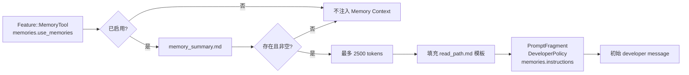
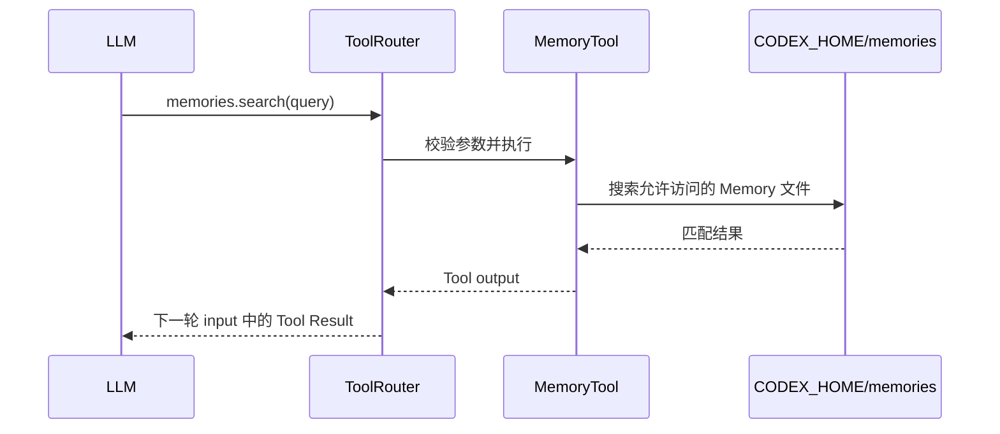

# Memory：如何进入 Context

## 结论

Memory 确实会进入上下文，但不是把整个 memory 目录全部塞给模型。

它采用两级渐进披露：

```text
第一级：memory_summary.md
        -> 最多 2500 tokens
        -> developer policy fragment

第二级：MEMORY.md / rollout_summaries / memory skills
        -> 通过 memories.search / memories.read 等工具按需读取
        -> Tool Result 进入下一轮 input
```

## Memory 的启用条件

Memory context 只有在下面条件成立时启用：

```rust
config.features.enabled(Feature::MemoryTool)
    && config.memories.use_memories
```

此外还必须存在非空的：

```text
$CODEX_HOME/memories/memory_summary.md
```

如果文件不存在、读取失败或内容为空，Memory extension 不贡献 prompt fragment。

本地 Codex Memory 默认关闭，可通过 `config.toml` 和每个 chat 的 `/memories` 控制。官方说明见：

- [Codex Memories](https://learn.chatgpt.com/es-419/docs/customization/memories)

## 第一级：直接注入 Summary



真正注入的不只是 summary 字符串，还包括 `read_path.md` 中的 Memory 使用规则、目录说明、检索顺序和引用要求。

## 第二级：专用 Memory Tools

当 `memories.dedicated_tools` 同时开启时，extension 注册四个 namespace tools：

| Tool | 用途 |
| --- | --- |
| `memories.add_ad_hoc_note` | 用户明确要求记住、忘记或更新某件事时追加 note |
| `memories.list` | 列出可访问的 memory 文件 |
| `memories.read` | 按相对路径和行数读取文件 |
| `memories.search` | 在 memory 文件中搜索内容 |



Memory 根目录被授予读取能力，但不会因此自动扩大普通 workspace 写权限。`add_ad_hoc_note` 通过受控 backend 写入指定的 ad-hoc notes 位置。

## Memory Context 的消息位置

Memory extension 使用：

```rust
PromptFragment::developer_policy(
    instructions,
    ContentItemKind("memories.instructions".to_string()),
)
```

因此它进入 `input` 中的 developer message，而不是顶层基础 `instructions`：

```json
{
  "instructions": "模型基础行为指令",
  "input": [
    {
      "role": "developer",
      "content_kind": "memories.instructions",
      "content": "Memory 规则 + memory_summary.md"
    },
    {
      "role": "user",
      "content": "本轮用户消息"
    }
  ],
  "tools": [
    {
      "namespace": "memories",
      "functions": ["add_ad_hoc_note", "list", "read", "search"]
    }
  ]
}
```

这只是帮助理解的简化 JSON，不是完整 wire payload。

## Memory 生成是另一条链路

读取 Memory 和生成 Memory 是两套独立流程：


`memories.generate_memories` 控制当前 chat 能否成为未来 Memory 的输入；`memories.use_memories` 控制当前 chat 能否读取已有 Memory。两者不能混为一个开关。

生成过程是后台任务，还会考虑：

- Thread 是否足够长并已经空闲。
- 剩余请求额度是否高于阈值。
- 是否允许包含使用过 MCP、Web Search 或 Tool Search 的外部上下文 Thread。
- Secret 清理和生成资格检查。

## 与其他上下文机制的区别

| 机制 | 主要作用 | 是否应作为强制规则来源 |
| --- | --- | --- |
| `AGENTS.md` | 团队与仓库持久规则 | 是 |
| Memory | 跨 Thread 恢复有用背景和经验 | 否，只是辅助背景 |
| Skill | 可复用工作流程和专业指令 | 选中时适用 |
| Conversation History | 当前 Thread 的连续状态 | 当前 Thread 内适用 |
| Compaction Summary | 压缩过长的当前 Thread 历史 | 当前 Thread 内适用 |

官方文档也强调：必须长期遵循的团队规则应保存在 `AGENTS.md` 或仓库文档中，不应只依赖 Memory。

## 源码入口

1. [`ext/memories/src/extension.rs`](https://github.com/openai/codex/blob/633ab199cfd724aa78013c006b27a2b3d049fc3b/codex-rs/ext/memories/src/extension.rs)：启用条件、ContextContributor、ToolContributor。
2. [`ext/memories/src/prompts.rs`](https://github.com/openai/codex/blob/633ab199cfd724aa78013c006b27a2b3d049fc3b/codex-rs/ext/memories/src/prompts.rs)：读取和截断 summary。
3. [`ext/memories/templates/memories/read_path.md`](https://github.com/openai/codex/blob/633ab199cfd724aa78013c006b27a2b3d049fc3b/codex-rs/ext/memories/templates/memories/read_path.md)：实际注入模板。
4. [`ext/memories/src/tools/`](https://github.com/openai/codex/tree/633ab199cfd724aa78013c006b27a2b3d049fc3b/codex-rs/ext/memories/src/tools/)：四个 Memory tools。
5. [`memories/write/`](https://github.com/openai/codex/tree/633ab199cfd724aa78013c006b27a2b3d049fc3b/codex-rs/memories/write/)：后台提取与合并流程。
