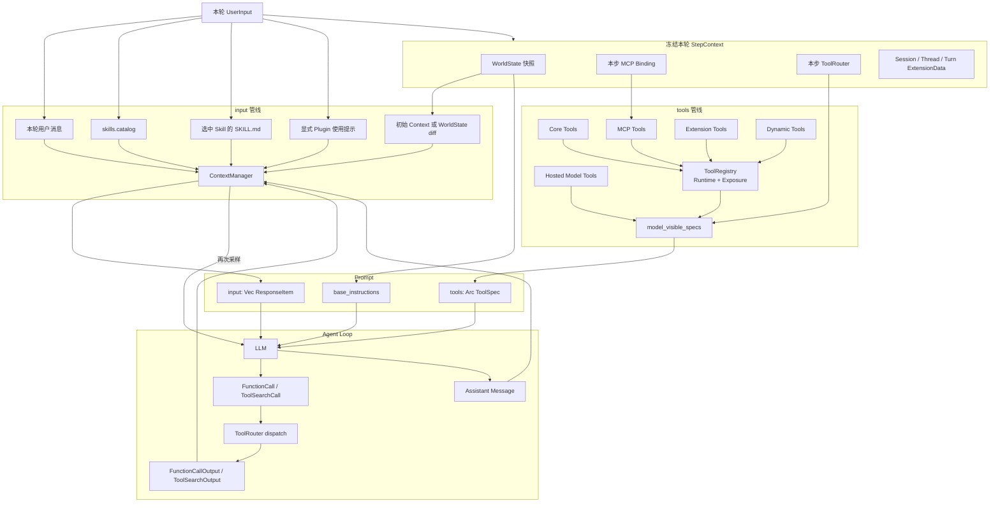
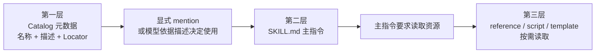
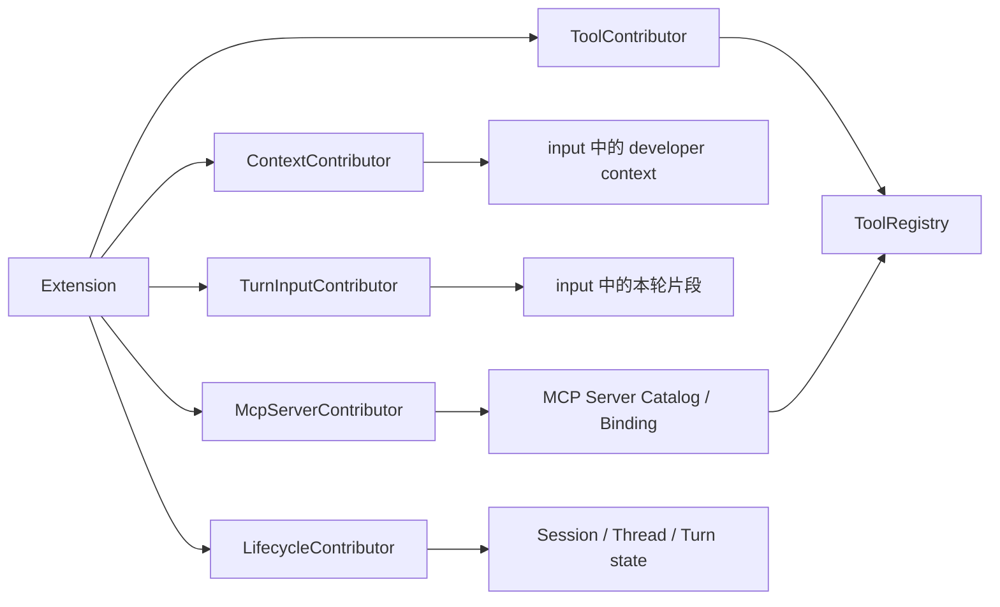
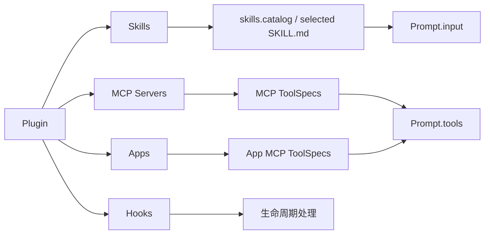

# 从用户消息到模型请求：Skills、Tools、Extensions 与 Session 的完整装配链

本文档基于 OpenAI `codex` 公开仓库提交：`633ab19`。

本文不再只列出“上下文包含什么”，而是沿着真实源码回答下面几个问题：

1. Skills 如何渐进式进入上下文；
2. Tools 的 schema 如何进入模型请求，执行代码又保存在什么地方；
3. Extension 和 Plugin 分别怎样贡献提示词、工具与 MCP Server；
4. Session 如何保存用户消息、模型输出、Tool Call 和 Tool Result；
5. 一次工具调用完成以后，文本、图片和音频结果如何交还给模型；
6. 下一次模型采样为什么能够接着上一次工具调用继续推理。

文中的代码会删掉日志、错误处理和不影响主线的分支。它们是“结构忠实的源码摘录”，不是可以脱离仓库直接编译的示例。判断最新行为时仍以 `codex/` 下源码为准。

## 1. 先修正“全部拼成系统提示词”的理解

Codex Core 内部一次逻辑请求使用三个独立字段：

```rust
pub struct Prompt {
    /// 对话、上下文片段、模型输出、Tool Call 与 Tool Result。
    pub input: Vec<ResponseItem>,

    /// 本轮允许模型直接看到的 Tool schema。
    pub(crate) tools: Arc<[ToolSpec]>,

    /// 模型基础行为指令。
    pub base_instructions: BaseInstructions,

    pub(crate) parallel_tool_calls: bool,
    pub output_schema: Option<Value>,
}
```

源码：[`core/src/client_common.rs`](https://github.com/openai/codex/blob/633ab199cfd724aa78013c006b27a2b3d049fc3b/codex-rs/core/src/client_common.rs)

因此最基础的映射是：

```text
Prompt.base_instructions  -> Responses API instructions
Prompt.input              -> Responses API input[]
Prompt.tools              -> Responses API tools[]
```

这三部分都会占用模型可处理的上下文，但它们不是先在 Codex 中拼成同一篇 Markdown。OpenAI Responses API 本身也把 `instructions`、`input` 和 `tools` 定义成独立字段：

- [Create a model response](https://developers.openai.com/api/reference/cli/resources/responses/methods/create)

`Responses Lite` 是一个需要单独说明的分支：Core 会把基础 instructions 和工具声明转换成请求开头的 developer 项目，例如 `AdditionalTools`。但在 Core 的逻辑层，它们仍然来自同一个 `Prompt.base_instructions` 与 `Prompt.tools`，不是 Skill 或历史消息临时拼出的文本。

## 2. 端到端总图



这里最重要的约束是：一次采样使用同一份 `StepContext`。上下文描述、MCP 绑定、模型可见 ToolSpecs 和之后的工具执行都依据这个 step，避免出现“提示词说工具存在，但真正调用时已经换成另一套工具”的不一致。

## 3. 一轮请求的真实执行顺序

主循环入口是 [`core/src/session/turn.rs`](https://github.com/openai/codex/blob/633ab199cfd724aa78013c006b27a2b3d049fc3b/codex-rs/core/src/session/turn.rs) 中的 `run_turn`。

删除旁支后的结构如下：

```rust
pub(crate) async fn run_turn(
    sess: Arc<Session>,
    turn_context: Arc<TurnContext>,
    input: Vec<TurnInput>,
    cancellation_token: CancellationToken,
) -> CodexResult<Option<String>> {
    // 1. 从本轮输入识别显式 Skill、Plugin、mcp:// mention 等依赖。
    let user_input = turn_user_input(&input);
    let (required_servers, mentioned_plugins) =
        required_mcp_servers_for_input(&sess, &turn_context, &user_input).await;

    // 2. 固定本轮环境、MCP Binding、ToolRouter、WorldState 依赖。
    let first_step_context = sess
        .capture_step_context_with_required_mcp_servers(
            turn_context.clone(),
            &cancellation_token,
            &required_servers,
        )
        .await?;

    // 3. 第一次发送完整上下文；后续只记录 WorldState diff。
    let mut world_state = sess
        .record_context_updates_and_set_reference_context_item(
            first_step_context.as_ref(),
        )
        .await?;

    // 4. 计算本轮 Skill / Plugin / Extension 注入项目。
    let (injection_items, enabled_connectors) = build_skills_and_plugins(
        &sess,
        first_step_context.as_ref(),
        &user_input,
        &mentioned_plugins,
        &cancellation_token,
    )
    .await?;

    // 5. 经过 hooks 后，把真正接受的用户输入写进 History。
    run_hooks_and_record_inputs(
        &sess,
        &turn_context,
        &input,
        PersistContext::TurnStart,
    )
    .await;

    // 6. 把刚才计算的 Skill / Plugin / Extension 片段写进 History。
    for item in injection_items {
        sess.record_conversation_items(&turn_context, &[item]).await;
    }

    loop {
        // 7. 同一 Turn 内，工具执行可能改变世界状态，因此采样前检查 diff。
        world_state = sess
            .record_step_world_state_if_changed(
                &world_state,
                first_step_context.as_ref(),
            )
            .await?;

        // 8. 规范化并复制当前 History，得到 Prompt.input。
        let request_input = sess
            .clone_history()
            .await
            .for_prompt(&first_step_context.settings.model_info.input_modalities);

        // 9. 发给模型；如果产生工具调用，结果写回 History 后继续 loop。
        run_sampling_request(
            sess.clone(),
            first_step_context.clone(),
            request_input,
            cancellation_token.child_token(),
        )
        .await?;
    }
}
```

这段顺序揭示了一个容易从架构图中看错的细节：Skill/Plugin 片段会先被计算出来，但当前实现是先记录本轮用户输入，再记录本轮显式 Skill/Plugin 注入。因此不要把示意图中的树形列表当作固定的消息数组顺序。

## 4. Skills 的渐进式披露不是只有两层

完整过程至少有三层：



### 4.1 第一层：Catalog 只告诉模型“有哪些 Skill”

目录片段的数据结构是：

```rust
pub(crate) struct AvailableSkillsInstructions {
    prompt_kind: SkillPromptKind,
    skill_root_lines: Vec<String>,
    skill_lines: Vec<String>,
}

impl ContextualUserFragment for AvailableSkillsInstructions {
    fn role(&self) -> &'static str {
        "developer"
    }

    fn content_kind(&self) -> ContentItemKind {
        ContentItemKind("skills.catalog".to_string())
    }
}
```

源码：[`ext/skills/src/fragments.rs`](https://github.com/openai/codex/blob/633ab199cfd724aa78013c006b27a2b3d049fc3b/codex-rs/ext/skills/src/fragments.rs)

渲染后大致是：

```markdown
## Skills

### Skill roots

- r1 = `/path/to/skills`

### Available skills

- openai-docs: Codex 与 OpenAI 文档说明。（file: r1/openai-docs/SKILL.md）
- imagegen: 生成或编辑位图。（file: r1/imagegen/SKILL.md）
```

这里没有两个 Skill 的完整正文。`skills.catalog` 只是 `ContentItemKind`，方便 Runtime 标注和识别这段内容的来源；它不是模型可调用的工具名。

Catalog 还有独立的 metadata budget。`render_catalog` 会根据模型上下文窗口与 `skill_max_context_tokens` 控制目录体积，必要时缩短描述或省略条目，而不是让目录无限增长。

### 4.2 第二层：只读取选中的 Skill 主指令

Skills extension 的每轮入口是 `TurnInputContributor::contribute`：

```rust
let mut catalog = executor_catalog;
catalog.extend(self.list_skills(query, &thread_state).await);

let selected_entries =
    collect_explicit_skill_mentions(&input.user_input, &catalog);

if config.include_instructions && !host_catalog_in_world_state {
    let rendered = render_catalog(..., &catalog, ...);
    if let Some(fragment) = rendered.fragment {
        fragments.push(Box::new(fragment));
    }
}

for entry in &selected_entries {
    let read_result = self
        .read_main_prompt(entry, host_snapshot.clone(), mcp_resources.clone(), &thread_state)
        .await?;

    let (contents, truncated) =
        truncate_main_prompt_contents(read_result.contents.as_str());

    fragments.push(Box::new(SkillInstructions {
        name: entry.name.clone(),
        path: entry.rendered_path().to_string(),
        contents,
        resource_access: resource_access_for(entry),
    }));
}
```

源码：[`ext/skills/src/extension.rs`](https://github.com/openai/codex/blob/633ab199cfd724aa78013c006b27a2b3d049fc3b/codex-rs/ext/skills/src/extension.rs)

显式选择函数会识别：

```rust
UserInput::Skill { name, path }
UserInput::Mention { name, path } if path_is_skill(path)
UserInput::Text { text, .. } // 从文本提取 Skill 名称和 skill:// 路径
```

源码：[`ext/skills/src/selection.rs`](https://github.com/openai/codex/blob/633ab199cfd724aa78013c006b27a2b3d049fc3b/codex-rs/ext/skills/src/selection.rs)

被选中后的正文片段是：

```rust
impl ContextualUserFragment for SkillInstructions {
    fn role(&self) -> &'static str {
        "user"
    }

    fn content_kind(&self) -> ContentItemKind {
        ContentItemKind("skills.selected_skill_instructions".to_string())
    }

    fn markers(&self) -> (&'static str, &'static str) {
        ("<skill>", "</skill>")
    }
}
```

它形成的消息正文类似：

```xml
<skill>
  <name>openai-docs</name>
  <path>/path/to/openai-docs/SKILL.md</path>
  SKILL.md 的主指令正文
</skill>
```

注意两点：

1. 它进入 `Prompt.input`，不是 `Prompt.tools`；
2. 在当前实现中它是带来源标记的 `role=user` 上下文片段，不是基础 `instructions`。

### 4.3 “显式选择”和“模型根据描述选择”是两件事

Rust 的 `collect_explicit_skill_mentions` 负责处理明确的名称、结构化 mention 和路径。它不是一个通用语义路由器。

当用户没有说出 Skill 名称，但任务符合某个描述时，模型先看到 Catalog 及 Skill 使用规则，再决定是否读取和遵循那个 Skill。代码中存在 `shadow_selection` 实验逻辑，用来记录或比较选择行为；不要据此推断 Core 会在所有情况下自动把语义相关的完整 Skill 正文提前注入。

当前代码还保留了 Host Skill 的专用加载路径：`HostSkillsSnapshot::load_skill_prompts`。Skills extension 会记录 `InjectedHostSkillPrompts`，Core 再据此去重，避免同一个 Host Skill 被扩展路径和兼容路径重复注入。

### 4.4 第三层：Skill 引用的资源按需读取

一个 `SKILL.md` 可以继续指向：

```text
references/*.md
scripts/*
templates/*
assets/*
```

主 `SKILL.md` 被加载不等于这些文件也全部自动进入上下文。模型需要根据主指令按需读取。

对于本机文件型 Skill，资源通常通过本机文件工具读取。对于 Executor 或 Orchestrator 等资源型 Skill，Skills extension 可以贡献命名空间工具：

```text
skills.list
skills.read
```

一次资源读取的参数大致是：

```json
{
  "package": "package-id",
  "resource": "references/api.md",
  "cursor": null
}
```

返回：

```json
{
  "resource": "references/api.md",
  "contents": "本页资源正文",
  "skill_root": "可选根定位符",
  "next_cursor": null
}
```

`cursor` 允许大资源分页读取。这就是第三层渐进式披露：只有完成任务真正需要的引用文件才成为 Tool Result，并随下一次采样进入历史。

## 5. Tools 的完整链路：来源、注册、暴露、序列化

Tool 必须同时存在两个面：

```text
ToolSpec    -> 给模型看：名称、说明、参数 schema
Runtime     -> Core 保留：权限检查、真正执行、返回结果
```

模型不会看到 Rust handler、MCP client、认证令牌或沙箱对象。

### 5.1 五种来源在 ToolRegistry 汇合

入口是 [`core/src/tools/spec_plan.rs`](https://github.com/openai/codex/blob/633ab199cfd724aa78013c006b27a2b3d049fc3b/codex-rs/core/src/tools/spec_plan.rs) 的 `build_tool_router`：

```rust
let mut registry = ToolRegistry::default();

add_core_tool_sources(&context, &mut registry);

session.services.mcp_handler_cache.append_mcp_tools(
    mcp,
    &mut registry,
);

append_extension_tool_executors(
    session,
    step_store,
    &mut registry,
);

append_dynamic_tool_runtimes(
    &turn_context.dynamic_tools,
    &mut registry,
);

let hosted_specs = hosted_model_tool_specs(...);

finalize_tool_router(
    turn_context,
    model_info,
    registry,
    hosted_specs,
    tool_search_handler_cache,
)
```

对应来源是：

| 来源 | ToolSpec 从哪里来 | 谁执行 |
| --- | --- | --- |
| Core Tool | Codex Core 编译进来的 handler | 本机 Core Runtime |
| MCP Tool | MCP Server 的 `tools/list` | MCP Server |
| Extension Tool | `ToolContributor` | Extension 的 executor |
| Dynamic Tool | 本轮 `TurnContext.dynamic_tools` | 动态 handler |
| Hosted Tool | 模型/provider 能力配置 | 模型服务端 |

Hosted Tool 可以直接追加到最终 `model_visible_specs`，不一定存在本地执行 Runtime。

### 5.2 一个普通 ToolSpec 发给模型时长什么样

源码类型：

```rust
pub struct ResponsesApiTool {
    pub name: String,
    pub description: String,
    pub strict: bool,
    pub defer_loading: Option<bool>,
    pub parameters: JsonSchema,
    pub output_schema: Option<Value>,
}
```

源码：[`tools/src/responses_api.rs`](https://github.com/openai/codex/blob/633ab199cfd724aa78013c006b27a2b3d049fc3b/codex-rs/tools/src/responses_api.rs)

序列化后类似：

```json
{
  "type": "function",
  "name": "exec_command",
  "description": "Runs a command in a PTY...",
  "strict": false,
  "parameters": {
    "type": "object",
    "properties": {
      "cmd": { "type": "string" },
      "workdir": { "type": "string" },
      "yield_time_ms": { "type": "integer" }
    },
    "required": ["cmd"]
  }
}
```

### 5.3 Registry 中有工具，不代表模型本轮能直接看到

每个注册项还有 `ToolExposure`：

```text
Direct
DirectModelOnly
Deferred
DeferredModelOnly
CodeModeOnly
Hidden
```

`finalize_tool_router` 只将 Direct 类工具放进 `model_visible_specs`：

```rust
for tool in registry.entries() {
    let exposure = tool.exposure;
    if !exposure.is_direct() {
        continue;
    }

    let spec = tool.runtime.spec();
    specs.push(spec_for_model_request(
        turn_context,
        model_info,
        exposure,
        &tool.runtime.tool_name(),
        code_mode_tool_names,
        spec,
    ));
}

specs.extend(hosted_specs);
merge_into_namespaces(specs)
```

所以三个数字不能混为一谈：

```text
ToolRegistry 注册数量
!= 模型本轮可直接调用的工具数量
!= request.tools 顶层数组元素数量
```

同一 namespace 下的多个工具还可能合并为一个顶层 `Namespace ToolSpec`。

### 5.4 Deferred Tool 如何避免大量 schema 撑爆上下文

Deferred 工具不在第一轮直接发送完整 schema。只要存在可搜索的 Deferred Tool，Core 会公开一个较小的 `tool_search`：

```text
初始请求
  tools[] 只包含 tool_search 和少量 Direct tools

模型调用 tool_search
  -> Core 搜索本地 Deferred Registry
  -> 返回匹配的 LoadableToolSpec
  -> ToolSearchOutput 写入 History

下一次采样
  -> 模型看到匹配工具的完整 schema
  -> 再发起真实工具调用
```

搜索结果的数据形状类似：

```json
{
  "type": "tool_search_output",
  "call_id": "search_1",
  "status": "completed",
  "execution": "client",
  "tools": [
    {
      "type": "function",
      "name": "matched_tool",
      "description": "完整说明",
      "parameters": {
        "type": "object",
        "properties": {}
      }
    }
  ]
}
```

若启用 `DeferredToolWorldState`，Core 还可能在 developer 上下文中加入轻量的 deferred namespace 目录。那只是告诉模型“哪些领域可搜索”，不是把全部参数 schema 再复制到文本上下文。

## 6. Extension 不是一种内容，而是注册能力的机制

Extension Registry 定义了多个彼此独立的插槽：

```rust
pub struct ExtensionRegistryBuilder<C: Sync> {
    registry: ExtensionRegistry<C>,
}

impl<C: Sync> ExtensionRegistryBuilder<C> {
    pub fn prompt_contributor(...);
    pub fn turn_input_contributor(...);
    pub fn tool_contributor(...);
    pub fn mcp_server_contributor(...);
    pub fn thread_lifecycle_contributor(...);
    pub fn turn_lifecycle_contributor(...);
    pub fn tool_lifecycle_contributor(...);
    pub fn config_contributor(...);
}
```

源码：[`ext/extension-api/src/registry.rs`](https://github.com/openai/codex/blob/633ab199cfd724aa78013c006b27a2b3d049fc3b/codex-rs/ext/extension-api/src/registry.rs)

因此 Extension 可以选择一条或多条管线：



### 6.1 ContextContributor 有三个作用域

```rust
pub trait ContextContributor: Send + Sync {
    fn contribute_thread_context(...) -> Vec<PromptFragment>;
    fn contribute_turn_context(...) -> Vec<PromptFragment>;
    fn contribute_world_state(...) -> Vec<WorldStateSectionContribution>;
}
```

源码：[`ext/extension-api/src/contributors.rs`](https://github.com/openai/codex/blob/633ab199cfd724aa78013c006b27a2b3d049fc3b/codex-rs/ext/extension-api/src/contributors.rs)

用途分别是：

| 方法 | 生命周期 | 典型用途 |
| --- | --- | --- |
| `contribute_thread_context` | Thread 稳定上下文 | Memory summary、长期能力说明 |
| `contribute_turn_context` | 当前 Turn | 与当前 turn store、模型窗口有关的内容 |
| `contribute_world_state` | 可以 full/diff 的状态 | 随环境或运行状态变化的扩展 section |

`PromptFragment` 还声明自己的插槽：

```rust
pub enum PromptSlot {
    DeveloperPolicy,
    DeveloperCapabilities,
    ContextWindow,
}
```

Session 会把 `DeveloperPolicy` 和 `DeveloperCapabilities` 放入 developer sections；`ContextWindow` 先汇总成 context-window hint，再由 Token Budget context 携带。

### 6.2 TurnInputContributor 根据本轮用户输入动态注入

Core 的统一收集点是：

```rust
async fn build_extension_turn_input_items(...) -> Vec<ResponseItem> {
    let contributors = sess
        .services
        .extensions
        .turn_input_contributors()
        .to_vec();

    for contributor in contributors {
        let fragments = contributor
            .contribute(
                input.clone(),
                extension_metrics.clone(),
                &session_extension_data,
                &thread_extension_data,
                &turn_extension_data,
            )
            .await?;

        items.extend(
            fragments
                .into_iter()
                .map(ContextualUserFragment::into_boxed_response_item),
        );
    }
}
```

源码：[`core/src/session/turn.rs`](https://github.com/openai/codex/blob/633ab199cfd724aa78013c006b27a2b3d049fc3b/codex-rs/core/src/session/turn.rs)

Skills extension 就同时注册了：

```rust
registry.thread_lifecycle_contributor(extension.clone());
registry.turn_lifecycle_contributor(Arc::new(SkillTelemetry));
registry.config_contributor(extension.clone());
registry.prompt_contributor(extension.clone());
registry.turn_input_contributor(extension.clone());
registry.skill_invocation_contributor(extension.clone());
registry.tool_contributor(extension);
```

这说明“Skills”不是一段静态文本：它同时参与线程状态、配置、上下文、每轮输入、调用统计和资源读取工具。

### 6.3 一个具体 Extension 可以同时贡献 Prompt 和 Tool

Memories extension 会同时注册：

```rust
registry.prompt_contributor(extension.clone());
registry.tool_contributor(extension);
```

启用后，它可以：

```text
读取 memory_summary.md
  -> 截断到最多 2500 tokens
  -> PromptFragment::developer_policy
  -> content_kind = memories.instructions
  -> Prompt.input

注册 memories.list / read / search / add_ad_hoc_note
  -> ToolRegistry
  -> 根据 ToolExposure 进入 Prompt.tools
```

同一个 Extension 的提示词和工具仍然走两条独立通道。

## 7. Plugin 是能力包，不是 Extension Tool 的同义词

一个 Plugin 可以携带：

```text
Plugin
|- Skills
|- MCP Servers
|- Apps / Connectors
|- Hooks
|- 展示与权限元数据
```

加载后分别分流：



当用户显式提到 Plugin 时，`build_plugin_injections` 还会构造一段 developer 提示，列出这个 Plugin 当前可用的 MCP Server、App 和 Skill 前缀：

```rust
build_plugin_injections(
    mentioned_plugins,
    mcp_tools,
    available_connectors,
)
```

这段内容使用：

```text
role = developer
content_kind = plugins.instructions
```

源码：

- [`core/src/plugins/injection.rs`](https://github.com/openai/codex/blob/633ab199cfd724aa78013c006b27a2b3d049fc3b/codex-rs/core/src/plugins/injection.rs)
- [`core/src/context/plugin_instructions.rs`](https://github.com/openai/codex/blob/633ab199cfd724aa78013c006b27a2b3d049fc3b/codex-rs/core/src/context/plugin_instructions.rs)

所以一个 Plugin 最终可能同时带来：

```text
Plugin 使用提示                 -> Prompt.input
Plugin Skill 目录与选中正文     -> Prompt.input
Plugin MCP/App Tool schemas     -> Prompt.tools
Plugin hooks                    -> Runtime 生命周期，不一定对模型可见
```

## 8. Session 历史不是字符串，而是 ResponseItem 序列

`ContextManager` 保存有序的结构化历史：

```rust
pub(crate) struct ContextManager {
    items: Arc<Vec<ResponseItemEnvelope>>,
    review_history: Option<TranscriptHistory>,
    history_version: u64,
    user_message_revision: u64,
    reference_context_item: Option<TurnContextItem>,
    world_state_baseline: Option<WorldStateSnapshot>,
}
```

源码：[`core/src/context_manager/history.rs`](https://github.com/openai/codex/blob/633ab199cfd724aa78013c006b27a2b3d049fc3b/codex-rs/core/src/context_manager/history.rs)

其中可以包含：

```text
Message                  用户、developer、assistant 消息
Reasoning                模型 reasoning 项目
FunctionCall             模型请求调用函数工具
FunctionCallOutput       本地/MCP 工具返回结果
CustomToolCall           自定义自由格式工具调用
CustomToolCallOutput     自定义工具结果
ToolSearchCall           搜索 Deferred Tool
ToolSearchOutput         搜索出的完整工具定义
LocalShellCall           服务端或兼容路径的 shell call
WebSearchCall            Hosted Web Search 记录
ImageGenerationCall      Hosted Image Generation 记录
Compaction               压缩后的会话状态
```

### 8.1 初始完整 Context 与后续 diff

第一次没有 reference baseline 时：

```text
build_initial_context_with_world_state
  -> 收集 developer instructions
  -> 收集 thread context contributors
  -> 收集 turn context contributors
  -> WorldState.render_full()
  -> 形成 developer / contextual user messages
  -> 写入 History
```

后续采样或 Turn：

```text
current WorldState.snapshot
  vs previous world_state_baseline
  -> render_diff / render_history_diff
  -> 只把变化片段写入 History
```

WorldState 当前包含的主要 section 有：

```text
ModelInstructionsState
PersonalityState
TokenBudgetContext
ContextWindowGuidanceState
RealtimeState
AgentsMdState
PermissionsState / CompactPermissionsState
CollaborationModeState
PersistentModeState
EnvironmentsState
AppsInstructionsState
PluginsInstructionsState
ToolsState
Extension WorldState sections
MultiAgent states
ManagedDeveloperInstructionsState
```

源码：[`core/src/session/world_state.rs`](https://github.com/openai/codex/blob/633ab199cfd724aa78013c006b27a2b3d049fc3b/codex-rs/core/src/session/world_state.rs)

发生 compaction 或开启新 context window 时，Core 会重建完整 initial context 和 baseline，而不是继续依赖已经被压缩掉的旧差异片段。

Compaction 的命令入口、实现分支、自动触发条件、History 替换和 Rollout 恢复已独立整理到 [`docs/compact/`](../compact/)。

### 8.2 History 发送前会做规范化

```rust
pub(crate) fn for_prompt(
    mut self,
    input_modalities: &[InputModality],
) -> Vec<ResponseItem> {
    self.normalize_history(input_modalities);
    Arc::unwrap_or_clone(self.items)
        .into_iter()
        .map(ResponseItemEnvelope::into_item)
        .collect()
}
```

规范化主要保证：

```text
每个 FunctionCall 有对应 FunctionCallOutput
每个普通 Tool Output 有可匹配的 Call
缺失结果的中断调用获得 synthetic "aborted" output
模型不支持图片时移除图片内容
模型不支持音频时移除音频内容
过大的函数结果按 truncation policy 截断
```

因此 Codex 不是每次把磁盘里的全部 rollout 或无限历史原样发送给模型。

## 9. Tool Call 与结果如何形成下一次模型输入

### 9.1 模型先返回结构化调用

```json
{
  "type": "function_call",
  "name": "exec_command",
  "call_id": "call_123",
  "arguments": "{\"cmd\":\"rg --files\"}"
}
```

`ToolRouter::build_tool_call` 将它转换成内部对象：

```rust
pub struct ToolCall {
    pub tool_name: ToolName,
    pub call_id: String,
    pub payload: ToolPayload,
    pub encrypted_function_args: Option<Vec<String>>,
}
```

源码：[`core/src/tools/router.rs`](https://github.com/openai/codex/blob/633ab199cfd724aa78013c006b27a2b3d049fc3b/codex-rs/core/src/tools/router.rs)

### 9.2 调用项目先被写入 History，再排队执行

[`core/src/stream_events_utils.rs`](https://github.com/openai/codex/blob/633ab199cfd724aa78013c006b27a2b3d049fc3b/codex-rs/core/src/stream_events_utils.rs) 中的 `handle_output_item_done`：

```rust
match ToolRouter::build_tool_call(item.clone()) {
    Ok(Some(call)) => {
        // 先保存模型发出的 FunctionCall。
        record_completed_response_item(sess, turn, &item).await;

        // 再执行对应 Runtime。
        let tool_future = tool_runtime
            .clone()
            .handle_tool_call(call, cancellation_token);

        output.needs_follow_up = true;
        output.tool_future = Some(Box::pin(tool_future));
    }
    // assistant message、reasoning 等走非工具分支。
    Ok(None) => { /* record response item */ }
    Err(FunctionCallError::RespondToModel(message)) => {
        // 参数无法解析等可恢复错误也转换成输出，让模型自行修正。
        record_error_output_for_model(message).await;
        output.needs_follow_up = true;
    }
}
```

`call_id` 是配对键：同一个调用与结果必须使用同一 `call_id`。

### 9.3 ToolRouter 查找冻结 Step 中的 Runtime

```text
ResponseItem::FunctionCall
  -> ToolRouter::build_tool_call
  -> ToolName(namespace, name)
  -> ToolRegistry 查找 runtime
  -> 并行/串行 gate
  -> pre-tool hooks / lifecycle
  -> Core、MCP、Extension 或 Dynamic executor
  -> ToolOutput
```

运行入口：

- [`core/src/tools/router.rs`](https://github.com/openai/codex/blob/633ab199cfd724aa78013c006b27a2b3d049fc3b/codex-rs/core/src/tools/router.rs)
- [`core/src/tools/parallel.rs`](https://github.com/openai/codex/blob/633ab199cfd724aa78013c006b27a2b3d049fc3b/codex-rs/core/src/tools/parallel.rs)
- [`core/src/tools/registry.rs`](https://github.com/openai/codex/blob/633ab199cfd724aa78013c006b27a2b3d049fc3b/codex-rs/core/src/tools/registry.rs)

### 9.4 普通文本结果

内部：

```rust
FunctionToolOutput::from_text(
    "README.md\nsrc/main.rs".to_string(),
    Some(true),
)
```

发送给模型：

```json
{
  "type": "function_call_output",
  "call_id": "call_123",
  "output": "README.md\nsrc/main.rs"
}
```

### 9.5 图片和音频结果

Codex 当前的函数结果内容类型是：

```rust
pub enum FunctionCallOutputContentItem {
    InputText {
        text: String,
    },
    InputImage {
        image_url: String,
        detail: Option<ImageDetail>,
    },
    InputAudio {
        audio_url: String,
    },
    EncryptedContent {
        encrypted_content: String,
    },
}
```

源码：[`protocol/src/models.rs`](https://github.com/openai/codex/blob/633ab199cfd724aa78013c006b27a2b3d049fc3b/codex-rs/protocol/src/models.rs)

多模态结果可以序列化为：

```json
{
  "type": "function_call_output",
  "call_id": "call_456",
  "output": [
    {
      "type": "input_text",
      "text": "工具返回了一张图片"
    },
    {
      "type": "input_image",
      "image_url": "data:image/png;base64,...",
      "detail": "high"
    }
  ]
}
```

`FunctionCallOutputPayload` 的 body 可以是一个普通字符串，也可以是结构化 content item 数组：

```rust
pub enum FunctionCallOutputBody {
    Text(String),
    ContentItems(Vec<FunctionCallOutputContentItem>),
}
```

模型不支持对应输入模态时，`ContextManager::normalize_history` 会在下一次请求前清理不支持的图片或音频部分。

### 9.6 MCP 结果怎样归一化

`McpToolOutput` 保留原始 `CallToolResult`，但给模型时会转换成统一的函数调用结果：

```rust
impl ToolOutput for McpToolOutput {
    fn to_response_item(
        &self,
        call_id: &str,
        _payload: &ToolPayload,
    ) -> ResponseInputItem {
        ResponseInputItem::FunctionCallOutput {
            call_id: call_id.to_string(),
            output: self.response_payload(),
        }
    }
}
```

`response_payload()` 还会：

```text
把 MCP text/image/audio 转成 FunctionCallOutputContentItem
插入 Wall time / Output 标头
按本轮 truncation policy 限制送入 History 的结果体积
必要时调整 original image detail
```

源码：[`core/src/tools/context.rs`](https://github.com/openai/codex/blob/633ab199cfd724aa78013c006b27a2b3d049fc3b/codex-rs/core/src/tools/context.rs)

所以模型侧通常看到统一的 `function_call_output`；Core 内部仍然知道它来自 MCP，并可运行 MCP 专用 lifecycle hooks。

### 9.7 结果写回 Session，触发下一次采样

```rust
pub(crate) struct AnyToolResult {
    call_id: String,
    payload: ToolPayload,
    result: Box<dyn ToolOutput>,
}

impl AnyToolResult {
    pub(crate) fn into_response(self) -> ResponseItemEnvelope {
        ResponseItemEnvelope {
            item: self
                .result
                .to_response_item(&self.call_id, &self.payload)
                .into(),
            metadata: /* truncation metadata */,
        }
    }
}
```

执行完成后：

```rust
sess.record_annotated_conversation_items(
    &turn_context,
    vec![tool_output_envelope],
).await;
```

下一次采样重新执行：

```rust
let input = sess
    .clone_history()
    .await
    .for_prompt(model_input_modalities);
```

此时模型看到的顺序类似：

```json
[
  {
    "type": "message",
    "role": "user",
    "content": [
      { "type": "input_text", "text": "列出项目文件" }
    ]
  },
  {
    "type": "function_call",
    "call_id": "call_123",
    "name": "exec_command",
    "arguments": "{\"cmd\":\"rg --files\"}"
  },
  {
    "type": "function_call_output",
    "call_id": "call_123",
    "output": "README.md\nsrc/main.rs"
  }
]
```

模型据此生成最终 assistant message，或者继续调用下一个工具。

## 10. 最终请求的完整示意

常规 Responses API 路径可以简化为：

```json
{
  "model": "当前模型",
  "instructions": "基础系统指令",
  "input": [
    {
      "type": "message",
      "role": "developer",
      "content": [
        {
          "type": "input_text",
          "text": "AGENTS.md、权限、环境、Skills Catalog、Memory 等"
        }
      ]
    },
    {
      "type": "message",
      "role": "user",
      "content": [
        {
          "type": "input_text",
          "text": "本轮用户消息"
        }
      ]
    },
    {
      "type": "message",
      "role": "user",
      "content": [
        {
          "type": "input_text",
          "text": "<skill>选中 Skill 的主指令</skill>"
        }
      ]
    },
    {
      "type": "function_call",
      "call_id": "call_123",
      "name": "某个工具",
      "arguments": "{}"
    },
    {
      "type": "function_call_output",
      "call_id": "call_123",
      "output": "工具结果"
    }
  ],
  "tools": [
    {
      "type": "function",
      "name": "exec_command",
      "description": "工具说明",
      "parameters": {
        "type": "object",
        "properties": {}
      }
    },
    {
      "type": "tool_search",
      "execution": "client",
      "description": "搜索 Deferred Tools",
      "parameters": {
        "type": "object",
        "properties": {}
      }
    }
  ],
  "parallel_tool_calls": true
}
```

这只是把多个可能时刻的项目放在一起展示，实际请求里是否存在 Skill 正文、FunctionCallOutput、Tool Search、Memory 或某个 ToolSpec，取决于当前 Turn、配置、Feature、模型能力、已连接 MCP Server 和历史状态。

## 11. 用五条规则检查是否真正理解

1. `skills.catalog` 是目录上下文，不是 Skill 正文，也不是 Tool。
2. 选中 Skill 的 `SKILL.md` 进入 `Prompt.input`；Skill 引用资源仍需继续按需读取。
3. ToolSpec 进入 `Prompt.tools`，Runtime 留在 Core；Registry 中存在不代表模型直接可见。
4. Extension 是注册机制，可以分别贡献 Context、Tool、MCP Server 和生命周期状态。
5. Tool Call 与 Tool Result 都写进 Session History；结果写回以后，Core 再次调用模型完成 Agent Loop。

## 12. 建议的源码阅读顺序

1. [`core/src/client_common.rs`](https://github.com/openai/codex/blob/633ab199cfd724aa78013c006b27a2b3d049fc3b/codex-rs/core/src/client_common.rs)：先确认 `Prompt` 的三个逻辑通道。
2. [`core/src/session/turn.rs`](https://github.com/openai/codex/blob/633ab199cfd724aa78013c006b27a2b3d049fc3b/codex-rs/core/src/session/turn.rs)：阅读 `run_turn`、`build_skills_and_plugins`、`build_prompt` 和 `run_sampling_request`。
3. [`core/src/context_manager/history.rs`](https://github.com/openai/codex/blob/633ab199cfd724aa78013c006b27a2b3d049fc3b/codex-rs/core/src/context_manager/history.rs)：理解 Session History 与 `for_prompt`。
4. [`core/src/session/world_state.rs`](https://github.com/openai/codex/blob/633ab199cfd724aa78013c006b27a2b3d049fc3b/codex-rs/core/src/session/world_state.rs)：理解 AGENTS、环境、权限、模式和增量状态。
5. [`ext/skills/src/extension.rs`](https://github.com/openai/codex/blob/633ab199cfd724aa78013c006b27a2b3d049fc3b/codex-rs/ext/skills/src/extension.rs)：追踪 Catalog、选择、正文读取与工具贡献。
6. [`ext/skills/src/fragments.rs`](https://github.com/openai/codex/blob/633ab199cfd724aa78013c006b27a2b3d049fc3b/codex-rs/ext/skills/src/fragments.rs)：确认 Skill Catalog 和正文的 role/content kind。
7. [`core/src/tools/spec_plan.rs`](https://github.com/openai/codex/blob/633ab199cfd724aa78013c006b27a2b3d049fc3b/codex-rs/core/src/tools/spec_plan.rs)：追踪五种工具来源与 Exposure。
8. [`core/src/tools/router.rs`](https://github.com/openai/codex/blob/633ab199cfd724aa78013c006b27a2b3d049fc3b/codex-rs/core/src/tools/router.rs)：理解模型 Tool Call 如何定位 Runtime。
9. [`core/src/tools/registry.rs`](https://github.com/openai/codex/blob/633ab199cfd724aa78013c006b27a2b3d049fc3b/codex-rs/core/src/tools/registry.rs)：理解执行、hooks 与 `AnyToolResult`。
10. [`core/src/stream_events_utils.rs`](https://github.com/openai/codex/blob/633ab199cfd724aa78013c006b27a2b3d049fc3b/codex-rs/core/src/stream_events_utils.rs)：理解模型输出、工具排队和结果回写。
11. [`core/src/client.rs`](https://github.com/openai/codex/blob/633ab199cfd724aa78013c006b27a2b3d049fc3b/codex-rs/core/src/client.rs)：最后查看 `Prompt` 怎样序列化为 Responses API 请求。
