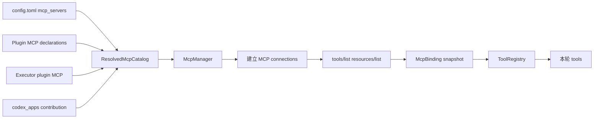
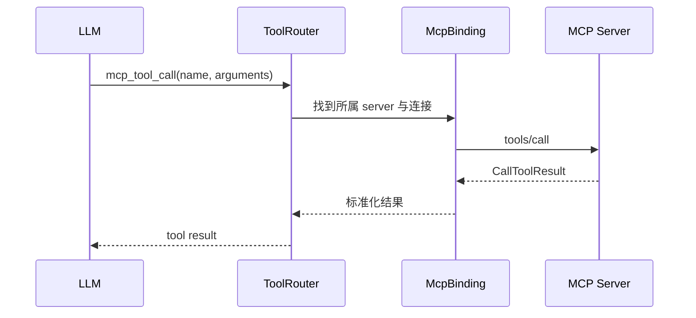

# MCP：源码实现与加载流程

## 先区分两个方向

Codex 同时扮演两种角色：

| 方向 | Codex 的角色 | 用途 |
| --- | --- | --- |
| 出站 | MCP Client | 连接外部 MCP Servers，获得 Tools、Resources、Templates |
| 入站 | MCP Server | 让其他 MCP Client 把 Codex 当成服务调用 |

这两个方向不能相加成一个含糊的“MCP 数量”。

## 出站：Codex Core 连接 MCP Server

配置入口是 `mcp_servers: HashMap<String, McpServerConfig>`。默认 map 可以为空，用户、Plugin、Executor 或 App Server 都能贡献服务器配置。

### 为什么要有 Catalog

不同来源可能贡献同名 MCP Server。Catalog 负责：

- 合并配置层、Plugin、Executor、Apps 的贡献。
- 应用 enable/disable 和 policy。
- 处理重名与覆盖关系。
- 得到当前 session/step 的确定快照。

因此 MCP Server 不是发现一个就直接把 Tool 塞进 Prompt，而是先解析成经过策略处理的 server catalog。

## MCP Tool 如何进入模型上下文

1. `McpManager` 建立连接。
2. 对服务器执行 MCP `tools/list`。
3. 形成当前 `McpBinding` 中的工具集合。
4. `append_mcp_tools` 把每个 MCP Tool 包装成 Tool runtime。
5. 应用 server 的 `omit_tools_from`、Direct/Deferred、Apps enable 等策略。
6. 可见 schema 进入本轮模型请求的 `tools` 字段。

MCP Server 本身不会作为一大段文字放进系统提示词；模型主要看到经过转换后的 MCP Tool schemas，以及按需开放的 MCP Resource 操作工具。

## MCP Tool 如何被调用

## MCP 能力从哪里获得

### 用户配置

在配置层声明一个或多个 `mcp_servers`。数量没有固定上限，因此源码默认只能记为 0 个外部 server。

### Plugin

Plugin manifest 可以内联 MCP 配置，也可以指向单独的 MCP 配置文件。Plugin 被选择和允许后，它贡献的 servers 才进入 catalog。

### Executor Plugin

运行环境可以提供自己的 Plugin；Codex 通过 executor plugin MCP contributor 发现其中声明的 servers。

### Codex Apps

开启 Apps feature 时，内置 extension 贡献 hosted Apps MCP Server，名称为 `codex_apps`；关闭时会向 catalog 提交 Remove。

## 入站：Codex 自己作为 MCP Server

[`codex-rs/mcp-server`](https://github.com/openai/codex/tree/633ab199cfd724aa78013c006b27a2b3d049fc3b/codex-rs/mcp-server/) 是另一条独立链路。它对外暴露两个 tools：

- `codex`
- `codex-reply`

它们分别用于启动一个 Codex 工作请求，以及继续已有 thread。这里的两个 tools 是给外部 MCP Client 看的，不是默认发送给 Codex 内部模型的工具。

## 当前源码数量结论

| 项目 | 数量 |
| --- | ---: |
| 默认用户配置的外部 MCP Servers | 0 |
| 内置 hosted Apps server | 最多 1：`codex_apps` |
| Plugin/Executor servers | 动态 |
| 入站 `codex mcp-server` 程序 | 1 |
| 入站程序对外 Tools | 2 |

## 推荐阅读顺序

1. [`config/src/config_toml.rs`](https://github.com/openai/codex/blob/633ab199cfd724aa78013c006b27a2b3d049fc3b/codex-rs/config/src/config_toml.rs)：用户 MCP 配置入口。
2. [`core/src/mcp.rs`](https://github.com/openai/codex/blob/633ab199cfd724aa78013c006b27a2b3d049fc3b/codex-rs/core/src/mcp.rs)：catalog 合并和运行时配置。
3. [`core/src/session/mcp_runtime.rs`](https://github.com/openai/codex/blob/633ab199cfd724aa78013c006b27a2b3d049fc3b/codex-rs/core/src/session/mcp_runtime.rs)：session/step 的 MCP 快照。
4. [`core/src/tools/spec_plan.rs`](https://github.com/openai/codex/blob/633ab199cfd724aa78013c006b27a2b3d049fc3b/codex-rs/core/src/tools/spec_plan.rs)：MCP tools 接入 ToolRegistry。
5. [`ext/mcp/src/lib.rs`](https://github.com/openai/codex/blob/633ab199cfd724aa78013c006b27a2b3d049fc3b/codex-rs/ext/mcp/src/lib.rs)：Apps 与 Executor Plugin 的 server 贡献。
6. [`mcp-server/src/message_processor.rs`](https://github.com/openai/codex/blob/633ab199cfd724aa78013c006b27a2b3d049fc3b/codex-rs/mcp-server/src/message_processor.rs)：Codex 作为入站 server。
7. [关键源码摘录](source-excerpts.md)。
8. [端到端请求与 Agent Loop 深读](../context/request-lifecycle.md)：查看 MCP Tool 如何归一化为 ToolSpec、执行并将多模态结果写回 Session。
