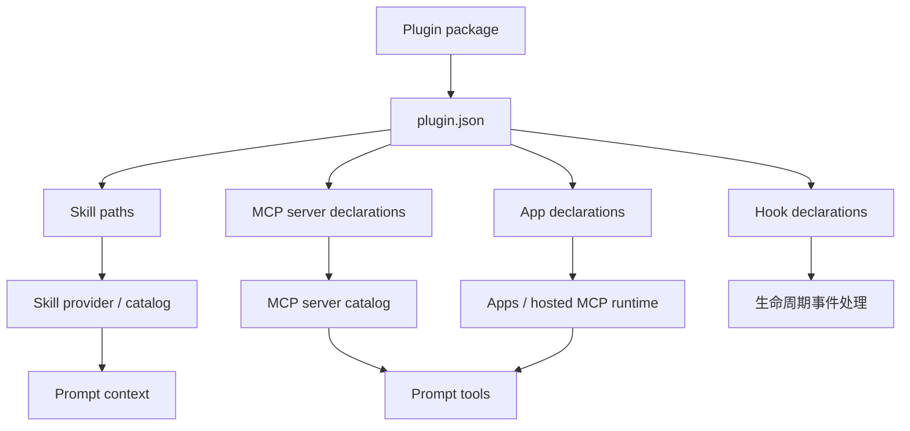
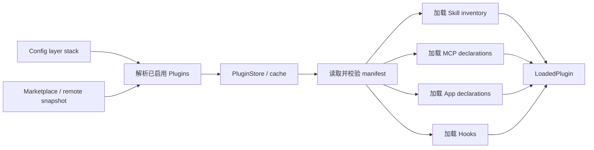

# Plugins：源码实现与能力接入

## Plugin 是什么

Plugin 是安装和分发能力的容器，不是另一种 Tool。

当前 Plugin manifest 模型允许声明：

- Skills
- MCP Servers
- Apps
- Hooks
- 面向模型或 UI 的展示信息

因此 Plugin 被加载以后，不是把整个 Plugin 作为一个巨大 schema 塞给模型，而是把子能力分流到各自系统。



## 当前源码里有多少 Plugin

在当前 `codex` checkout 中搜索：

```text
*/.codex-plugin/plugin.json
```

结果为 0。

这意味着：

- Codex 源码包含完整 Plugin framework。
- 源码仓库没有直接捆绑实际 Plugin package。
- 运行时 Plugin 来自 marketplace、远程推荐、本机安装或 executor environment。

`core-plugins` 这个 crate 是 Plugin 管理器，不等于“内置了一个 Plugin”。

## Plugin manifest 的核心结构

```text
PluginManifest
├── name / version / description / keywords
├── paths
│   ├── skills[]
│   ├── mcp_servers
│   ├── apps
│   └── hooks
└── interface
    ├── display_name
    ├── descriptions
    ├── capabilities
    ├── icons / screenshots
    └── default_prompt
```

Manifest 默认路径是：

```text
.codex-plugin/plugin.json
```

Loader 也包含兼容其他格式的迁移和解析逻辑，但阅读 Codex 原生 Plugin 时先从这个路径开始。

## Plugin 如何获得

### Marketplace 安装

`PluginsManager` 负责列 marketplace、解析 Plugin、安装、卸载、升级和读取详情。安装结果被物化到 Plugin store/cache，并写入有效配置。

### 远程推荐

远程 catalog 可以返回“推荐但未安装”的 Plugin。推荐项不是已安装 Plugin；只有用户明确请求并通过安装流程后，能力才会进入运行时。

### 本机或项目来源

配置层可以指向已存在的 Plugin source。Loader 仍会验证 manifest 和资源路径。

### Executor Plugin

远程或隔离执行环境可以提供 Plugin。其 Skill、MCP、Hook 等资源带有环境 authority，不应假装成本机普通路径。

## Plugin 如何被加载



加载失败时，`LoadedPlugin` 可以保留 error；不会因为目录存在就盲目信任所有内容。

## Plugin 子能力怎样进入模型上下文

### Plugin Skills

进入 Skill roots/snapshots，由 Skills extension 形成 `skills.catalog`。只有选中的 Skill 再加载完整正文。

### Plugin MCP Servers

进入 MCP server catalog。连接后通过 `tools/list` 发现 Tool，转换为 ToolSpec，再根据 Direct/Deferred 策略暴露。

### Plugin Apps

解析为 `AppDeclaration` 和 connector id，通过 Apps/MCP runtime 提供能力。

### Plugin Hooks

Hooks 响应生命周期事件，不自动成为模型 Tool，也不应该被计入 `Prompt.tools` 数量。

## 推荐 Plugin 与 `request_plugin_install`

当 Tool Suggest、Apps、Plugins feature 都启用，并且存在推荐候选时，Core 可以向模型暴露：

- `list_available_plugins_to_install`
- `request_plugin_install`

这两个是“发现/请求安装 Plugin”的 Core Tools，不是某个 Plugin 自己贡献的工具。

## 推荐阅读顺序

1. [`plugin/src/manifest.rs`](https://github.com/openai/codex/blob/633ab199cfd724aa78013c006b27a2b3d049fc3b/codex-rs/plugin/src/manifest.rs)：Plugin 数据模型。
2. [`core-plugins/src/lib.rs`](https://github.com/openai/codex/blob/633ab199cfd724aa78013c006b27a2b3d049fc3b/codex-rs/core-plugins/src/lib.rs)：Plugin framework 对外入口。
3. [`core-plugins/src/loader.rs`](https://github.com/openai/codex/blob/633ab199cfd724aa78013c006b27a2b3d049fc3b/codex-rs/core-plugins/src/loader.rs)：Plugin 加载和各类资源解析。
4. [`core-plugins/src/manager.rs`](https://github.com/openai/codex/blob/633ab199cfd724aa78013c006b27a2b3d049fc3b/codex-rs/core-plugins/src/manager.rs)：安装、卸载、marketplace、推荐项。
5. [`ext/mcp/src/executor_plugin.rs`](https://github.com/openai/codex/blob/633ab199cfd724aa78013c006b27a2b3d049fc3b/codex-rs/ext/mcp/src/executor_plugin.rs)：Executor Plugin 的 MCP 接入。
6. [`ext/skills/src/host_service.rs`](https://github.com/openai/codex/blob/633ab199cfd724aa78013c006b27a2b3d049fc3b/codex-rs/ext/skills/src/host_service.rs)：Plugin Skill snapshots 接入。
7. [关键源码摘录](source-excerpts.md)。
8. [端到端请求与 Agent Loop 深读](../context/request-lifecycle.md)：查看 Plugin 的 Skill、MCP、App 和提示片段如何分流到 `input` 与 `tools`。

## 官方概念说明

OpenAI 官方把 Plugin 定义为由 Skills、MCP Servers 和可选 UI 等能力组成的扩展包。这里的文档继续说明这些组成部分在 Codex Rust 源码里如何被分别加载。

- [OpenAI Developers](https://developers.openai.com/)
