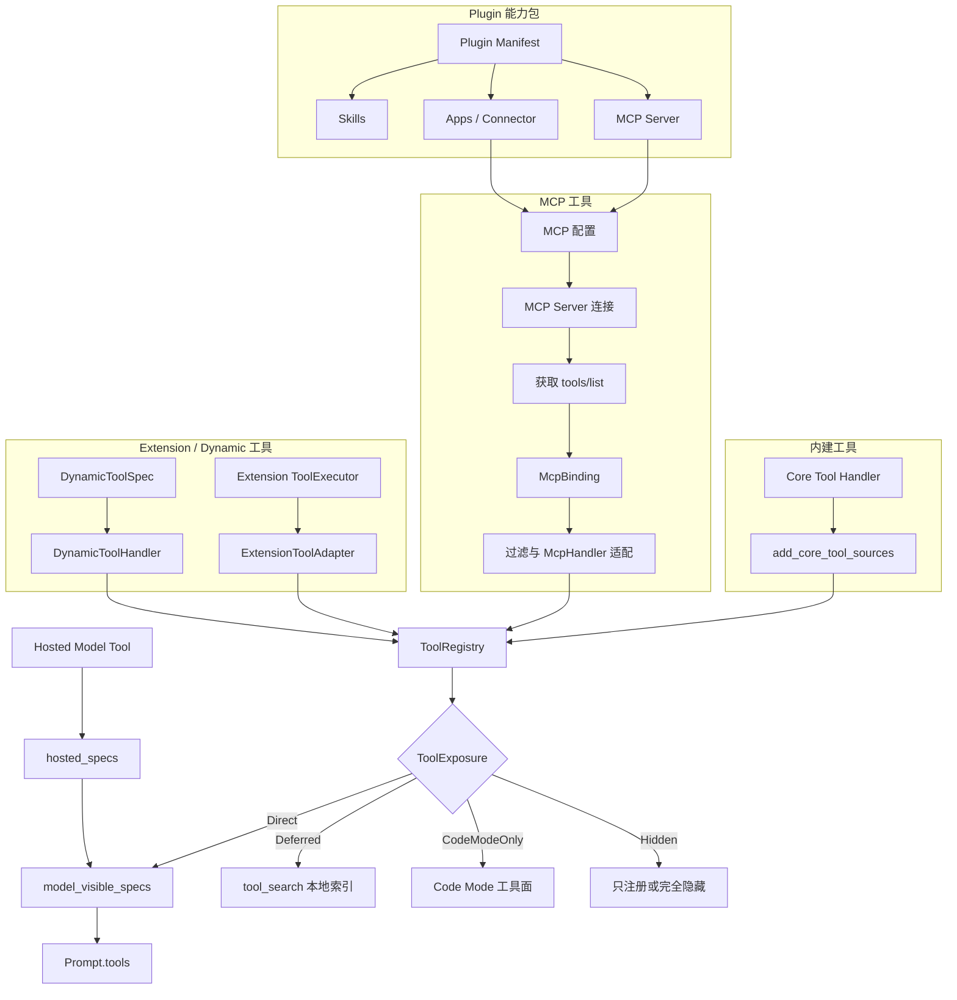

# Codex Tool 如何获得、注册并载入模型上下文

本文说明 `codex` 源码中工具从哪里来、Runtime 如何获得对应服务、不同来源如何进入统一调度层，以及哪些工具最终会被发送给模型。

> 当前结论：内建 Tool、MCP Tool、Extension/Dynamic Tool 和 Hosted Model Tool 的来源与执行方式不同。它们不能在来源层混为一谈；只有完成各自的发现、过滤和适配后，才会在 Core 的工具规划层汇合。Plugin 不是一种 Tool，而是可以携带 Skill、MCP Server 和 App/Connector 等能力的分发包。

## 1. 先区分五个概念

| 概念 | 是什么 | 是否直接等于 Tool |
| --- | --- | --- |
| 内建 Tool | Codex Core 自己实现的可调用能力。 | 是。 |
| MCP Tool | MCP Server 通过协议声明的可调用能力。 | 是，但需转换成 Codex 的 `ToolSpec`。 |
| Extension/Dynamic Tool | 扩展或当前线程直接提供的运行时工具。 | 是，但需适配进统一 Runtime 接口。 |
| Hosted Model Tool | 由模型服务端提供和执行的工具。 | 是，但不一定进入本地 `ToolRegistry`。 |
| Plugin | Skills、MCP Server、Apps 等能力的打包与分发单位。 | 不是。Plugin 中的具体能力走各自通道。 |

## 2. 总体架构



## 3. Runtime 在每个 Step 重新捕获工具环境

工具不是在线程启动时永久固定。Core 在每个采样步骤创建一个不可变的 `StepContext`，同时捕获 MCP 绑定和本步工具路由器。

入口位于 [`core/src/session/mod.rs`](https://github.com/openai/codex/blob/633ab199cfd724aa78013c006b27a2b3d049fc3b/codex-rs/core/src/session/mod.rs) 的 `capture_step_context_inner`：

```rust
let (mcp, prepared_recommendations) = tokio::join!(
    self.mcp_runtime_for_step(...),
    turn::prepare_tool_recommendations(...),
);

let tool_router = turn::built_tools(
    ...,
    &mcp,
    ...,
).await??;

Ok(Arc::new(StepContext {
    mcp,
    tool_router,
    ...
}))
```

这样做的目的，是让同一次模型采样使用一份固定的工具规划。对于 MCP 调用，执行前还会通过 Session 刷新并重新取得当前可用的 Binding，避免使用已经失效的服务连接。

## 4. 内建 Tool：从 Codex Core 自己获得

### 4.1 工具从哪里来

内建 Tool 的 Handler 编译在 Codex Core 中，不依赖 MCP Server。工具规划首先建立空的 `ToolRegistry`，然后加入本步允许使用的 Core 工具：

[`core/src/tools/spec_plan.rs`](https://github.com/openai/codex/blob/633ab199cfd724aa78013c006b27a2b3d049fc3b/codex-rs/core/src/tools/spec_plan.rs)

```rust
let mut registry = ToolRegistry::default();
add_core_tool_sources(&context, &mut registry);
```

`add_core_tool_sources` 会依据模型能力、Feature 开关、运行模式、环境和权限等条件注册相应 Handler。工具定义和真正的 Rust 执行器由同一个 `CoreToolRuntime` 提供。

### 4.2 如何进入模型上下文

内建工具注册后带有一个 `ToolExposure`。只有 `Direct` 或 `DirectModelOnly` 会在 `build_model_visible_specs` 中转成首轮可见的 `ToolSpec`。

### 4.3 如何执行

模型返回工具调用后，`ToolRouter` 根据标准化工具名从 `ToolRegistry` 取回对应 `CoreToolRuntime`，然后执行其 `handle`。模型只负责生成工具名和参数，不直接运行 Rust Handler。

## 5. MCP Tool：通过 MCP Server 获得

### 5.1 工具与服务从哪里来

MCP 的起点是配置中声明的 MCP Server。Core 为当前 Step 建立 MCP Runtime，连接相应 Server，并取得其工具目录。解析后的每项工具保存为 `ToolInfo`：

[`codex-mcp/src/tools.rs`](https://github.com/openai/codex/blob/633ab199cfd724aa78013c006b27a2b3d049fc3b/codex-rs/codex-mcp/src/tools.rs)

```rust
pub struct ToolInfo {
    pub server_name: String,
    pub callable_name: String,
    pub callable_namespace: String,
    pub namespace_description: Option<String>,
    pub tool: Tool,
    ...
}
```

当前 Step 的工具目录、连接、客户端和调用路由被一起冻结在 `McpBinding` 中：

[`codex-mcp/src/binding.rs`](https://github.com/openai/codex/blob/633ab199cfd724aa78013c006b27a2b3d049fc3b/codex-rs/codex-mcp/src/binding.rs)

```rust
pub struct McpBinding {
    connections: Arc<McpConnectionSet>,
    clients: Arc<McpBindingClients>,
    config: Arc<McpConfig>,
    tools: Vec<ToolInfo>,
    calls: HashMap<(String, String), PreparedMcpCall>,
}
```

这里有两个不同表面：

- `tools` 保存可用于模型工具规划的 MCP 元数据；
- `connections`、`clients` 和 `calls` 保存实际调用服务所需的连接与路由，不发送给模型。

### 5.2 如何注册进 Core

Core 在 [`core/src/mcp_tool_exposure.rs`](https://github.com/openai/codex/blob/633ab199cfd724aa78013c006b27a2b3d049fc3b/codex-rs/core/src/mcp_tool_exposure.rs) 中处理 MCP 工具：

```text
McpBinding.tools
  → 区分普通 MCP Tool 与 Apps Tool
  → 检查模型可见性和 App 策略
  → 创建 McpHandler
  → 分配 ToolExposure
  → 注册进 ToolRegistry
```

普通 MCP Tool 与 Apps Tool 的过滤路径不同：

```rust
let non_app_tools = filter_non_codex_apps_mcp_tools_only(all_mcp_tools);
let app_tools = apps_enabled
    .then(|| filter_codex_apps_mcp_tools(all_mcp_tools, config));
```

Apps Tool 还需要检查 Connector、配置层策略和工具 annotations。它虽然通过 MCP 进入 Runtime，但不能等同于普通 MCP Tool。

### 5.3 如何进入模型上下文

`McpHandler` 将 MCP 的工具名、namespace、描述和输入 schema 转成 Codex `ToolSpec`。如果当前模型支持工具搜索，MCP Tool 默认设为 `Deferred`；否则设为 `Direct`：

```rust
let exposure = if search_tool_enabled {
    ToolExposure::Deferred
} else {
    ToolExposure::Direct
};
```

因此大量 MCP Tool 通常不会全部进入首轮 `Prompt.tools`。

### 5.4 如何执行 MCP 服务调用

模型调用某个已经暴露的 MCP Tool 后：

```text
模型返回 namespace + tool name + arguments
  → ToolRouter 找到 McpHandler
  → Session.prepare_mcp_call 检查 MCP 状态是否需要刷新
  → mcp_runtime.current_binding_for_call 取得当前 Binding
  → McpBinding.prepare_call 定位 PreparedMcpCall
  → 使用绑定的 MCP client 调用真实 MCP Server
  → MCP 返回结果
  → Core 将结果写回会话上下文
```

对应代码位于 [`core/src/session/mcp_runtime.rs`](https://github.com/openai/codex/blob/633ab199cfd724aa78013c006b27a2b3d049fc3b/codex-rs/core/src/session/mcp_runtime.rs)：

```rust
pub(crate) async fn prepare_mcp_call(
    self: &Arc<Self>,
    server: &str,
    tool: &str,
) -> Option<PreparedMcpCall> {
    self.refresh_mcp_if_dirty().await;
    self.services
        .mcp_runtime
        .current_binding_for_call(server)
        .await?
        .prepare_call(server, tool)
}
```

`McpHandler` 在 [`core/src/tools/handlers/mcp.rs`](https://github.com/openai/codex/blob/633ab199cfd724aa78013c006b27a2b3d049fc3b/codex-rs/core/src/tools/handlers/mcp.rs) 中通过 `invocation.session.prepare_mcp_call(...)` 使用这条路径，而不是自己永久持有一个 MCP client。

模型看不到 MCP Server 的客户端、连接对象和认证细节。

## 6. Extension 与 Dynamic Tool：由运行时扩展获得

### 6.1 Extension Tool

线程扩展可以通过 `tools_for_step` 为当前 Step 提供 `ToolExecutor`。Core 使用 `ExtensionToolAdapter` 将扩展接口适配成 `CoreToolRuntime`，再注册到 `ToolRegistry`：

```text
Extension Contributor
  → tools_for_step
  → Extension ToolExecutor
  → ExtensionToolAdapter
  → ToolRegistry
```

对应入口是 [`append_extension_tool_executors`](https://github.com/openai/codex/blob/633ab199cfd724aa78013c006b27a2b3d049fc3b/codex-rs/core/src/tools/spec_plan.rs)。

### 6.2 Dynamic Tool

当前线程还可以携带 `DynamicToolSpec`。Core 使用 `DynamicToolHandler` 转换并注册：

```text
TurnContext.dynamic_tools
  → DynamicToolHandler
  → ToolRegistry
```

Dynamic Tool 自身可以设置 `defer_loading`：

```rust
exposure: if tool.defer_loading {
    ToolExposure::Deferred
} else {
    ToolExposure::Direct
}
```

### 6.3 如何进入上下文和执行

它们进入上下文的规则与其他 Registry Tool 相同：由 `ToolExposure` 决定是否进入首轮 `Prompt.tools`。实际调用则由 `ExtensionToolAdapter` 或 `DynamicToolHandler` 转发给扩展提供的执行器。

## 7. Hosted Model Tool：由模型服务提供

Hosted Model Tool 与前三类不同。它们由 `hosted_model_tool_specs` 根据模型服务能力和当前配置生成 `hosted_specs`。

这类工具可能不需要本地 `ToolRegistry` Handler，因为真正执行发生在模型服务端。`build_model_visible_specs` 最后会把它们直接并入模型可见工具列表：

```rust
specs.extend(hosted_specs);
```

因此它们同样进入 `Prompt.tools`，但执行责任不一定属于本地 Codex Runtime。

## 8. Plugin：能力包，不是工具通道

Plugin 应单独理解为：

```text
Plugin
├── Skills
├── MCP Server 配置
├── Apps / Connector
└── Manifest 与展示元数据
```

Plugin 本身不会直接作为一个 `ToolSpec` 发送给模型：

- Plugin 中的 Skill 走 Skill 目录和按需正文注入；
- Plugin 中的 MCP Server 走 MCP 连接、工具发现和 `McpHandler` 路径；
- Plugin 中的 App/Connector Tool 走带额外策略过滤的 Apps MCP 路径。

所以源码中出现 `agent_plugin` 时，表示某个 MCP Tool 具有 Plugin 来源信息，不表示 Core 存在一种与 MCP Tool 并列的“Plugin Tool 协议”。

## 9. 统一汇合点：ToolRegistry

来源不同的本地可执行工具最终注册为：

[`core/src/tools/registry.rs`](https://github.com/openai/codex/blob/633ab199cfd724aa78013c006b27a2b3d049fc3b/codex-rs/core/src/tools/registry.rs)

```rust
pub(crate) struct RegisteredTool {
    pub(crate) runtime: Arc<dyn CoreToolRuntime>,
    pub(crate) exposure: ToolExposure,
}
```

`ToolRegistry` 同时保存：

- 工具的真实 Runtime；
- 本 Step 的暴露方式；
- 标准化名称；
- 名称冲突和执行路由信息。

“统一注册”不等于“来源相同”。它只是让上层 Turn 循环能够用同一种方式规划和执行不同来源的工具。

## 10. ToolExposure：决定加载到哪里

定义位于 [`tools/src/tool_executor.rs`](https://github.com/openai/codex/blob/633ab199cfd724aa78013c006b27a2b3d049fc3b/codex-rs/tools/src/tool_executor.rs)：

| ToolExposure | 首轮进入 `Prompt.tools` | 可由 `tool_search` 找到 | 可供 Code Mode | 模型直接可见 |
| --- | --- | --- | --- | --- |
| `Direct` | 是 | 否 | 是 | 是 |
| `DirectModelOnly` | 是 | 否 | 否 | 是 |
| `Deferred` | 否 | 是 | 是 | 按需 |
| `DeferredModelOnly` | 否 | 是 | 否 | 按需 |
| `CodeModeOnly` | 否 | 否 | 是 | 否 |
| `Hidden` | 否 | 否 | 否 | 否 |

最终筛选发生在 [`build_model_visible_specs`](https://github.com/openai/codex/blob/633ab199cfd724aa78013c006b27a2b3d049fc3b/codex-rs/core/src/tools/spec_plan.rs)：

```rust
for tool in registry.entries() {
    let exposure = tool.exposure;
    if !exposure.is_direct() {
        continue;
    }

    specs.push(tool.runtime.spec());
}
```

因此：

```text
ToolRegistry 中已注册的所有工具
不等于
Prompt.tools 中首轮发送给模型的工具
```

## 11. Deferred Tool：如何避免大量 schema 撑爆上下文

当 Registry 中存在可搜索的 Deferred Tool，Core 只额外注册一个 `tool_search`：

```rust
if search_tool_enabled(...)
    && registry.entries().any(|tool| tool.exposure.is_deferred())
{
    append_tool_search_executor(...);
}
```

实现位于 [`core/src/tools/handlers/tool_search.rs`](https://github.com/openai/codex/blob/633ab199cfd724aa78013c006b27a2b3d049fc3b/codex-rs/core/src/tools/handlers/tool_search.rs)。它从 Deferred Tool 提取 `search_info`，建立本地 BM25 索引：

```text
Deferred Tool 的名称、描述、参数字段等搜索文本
  → 本地 BM25 索引
  → 模型调用 tool_search(query, limit)
  → 返回匹配的 LoadableToolSpec
  → 匹配工具在后续模型调用中可用
```

因此模型初始只需要看到 `tool_search` 的 schema，而不需要看到全部 Deferred Tool 的完整 schema。

## 12. Deferred Tool 的轻量目录

如果启用 `DeferredToolWorldState`，Core 还会把 Deferred Tool 按 namespace 汇总为一段开发者上下文：

```text
<tools>
Deferred tool namespaces:
- namespace：简短说明
</tools>
```

实现位于 [`core/src/context/world_state/tools.rs`](https://github.com/openai/codex/blob/633ab199cfd724aa78013c006b27a2b3d049fc3b/codex-rs/core/src/context/world_state/tools.rs)，内容类别为：

```rust
ContentItemKind("tools.deferred_namespaces".to_string())
```

这一段不是完整工具 schema，只是告诉模型有哪些可搜索的工具领域。源码限制：

- 每个 namespace 说明最多 250 个字符；
- 整个渲染片段最多 4 KiB；
- 放不下的 namespace 会被省略并显示省略数量。

## 13. 最终怎样进入模型请求

逻辑请求结构定义在 [`core/src/client_common.rs`](https://github.com/openai/codex/blob/633ab199cfd724aa78013c006b27a2b3d049fc3b/codex-rs/core/src/client_common.rs)：

```rust
pub struct Prompt {
    pub input: Vec<ResponseItem>,
    pub(crate) tools: Arc<[ToolSpec]>,
    pub base_instructions: BaseInstructions,
}
```

Turn 在 [`core/src/session/turn.rs`](https://github.com/openai/codex/blob/633ab199cfd724aa78013c006b27a2b3d049fc3b/codex-rs/core/src/session/turn.rs) 中构建它：

```rust
Prompt {
    input,
    tools: step_context.tool_router.model_visible_specs(),
    base_instructions,
    ...
}
```

标准 Responses 请求中：

```text
Prompt.base_instructions → instructions
Prompt.input             → input
Prompt.tools             → tools
```

模型能看到的工具信息主要包括：工具类型、namespace、名称、描述和参数 JSON Schema。模型看不到本地 Handler、MCP client、认证信息、沙箱实现和服务连接对象。

部分 `Responses Lite` 模型会把工具声明包装成 developer 角色的 `AdditionalTools` 输入项，但其逻辑来源仍是同一份 `Prompt.tools`。

## 14. 一次完整调用生命周期

```text
Step 开始
  → 获取当前模型、环境、权限和 Feature 配置
  → 建立本 Step 的 MCP Binding
  → 收集内建、MCP、Extension、Dynamic Tool
  → 生成 Hosted Model Tool specs
  → 注册本地 Runtime 到 ToolRegistry
  → 应用 ToolExposure 和安全/可见性策略
  → Direct Tool 进入 Prompt.tools
  → Deferred Tool 进入 tool_search 索引
  → 发送模型请求
  → 模型返回结构化工具调用
  → ToolRouter 定位对应 Runtime
  → 本地 Handler、MCP Server、扩展或模型服务端执行
  → 工具结果成为新的 ResponseItem
  → 下一次模型采样继续使用结果
```

## 15. 当前文档边界与后续补充点

本文已经建立工具来源、服务获取、注册、暴露和调用的主链路。后续继续阅读时，可以分别深化：

1. `add_core_tool_sources` 具体注册了哪些内建 Tool，以及每个 Feature 条件；
2. MCP Server 的配置解析、连接建立、缓存、重连和 `tools/list` 生命周期；
3. `tool_search` 返回的 `LoadableToolSpec` 如何在下一次采样请求中生效；
4. Apps/Connector 的认证、可访问性和破坏性操作策略；
5. Plugin Manifest 如何转化为 Skills、MCP Server 和 App 能力；
6. `ToolRouter` 如何解析模型响应并路由到对应 Runtime；
7. Code Mode 如何把部分工具转成嵌套调用面。

## 16. 推荐源码阅读顺序

1. [`tools/src/tool_executor.rs`](https://github.com/openai/codex/blob/633ab199cfd724aa78013c006b27a2b3d049fc3b/codex-rs/tools/src/tool_executor.rs)：统一工具接口与 `ToolExposure`。
2. [`core/src/tools/registry.rs`](https://github.com/openai/codex/blob/633ab199cfd724aa78013c006b27a2b3d049fc3b/codex-rs/core/src/tools/registry.rs)：Runtime 如何注册和查找。
3. [`core/src/tools/spec_plan.rs`](https://github.com/openai/codex/blob/633ab199cfd724aa78013c006b27a2b3d049fc3b/codex-rs/core/src/tools/spec_plan.rs)：不同来源如何汇合并生成模型可见 specs。
4. [`core/src/mcp_tool_exposure.rs`](https://github.com/openai/codex/blob/633ab199cfd724aa78013c006b27a2b3d049fc3b/codex-rs/core/src/mcp_tool_exposure.rs)：MCP/App Tool 如何过滤和暴露。
5. [`codex-mcp/src/binding.rs`](https://github.com/openai/codex/blob/633ab199cfd724aa78013c006b27a2b3d049fc3b/codex-rs/codex-mcp/src/binding.rs)：MCP 工具目录与真实调用连接如何绑定。
6. [`core/src/tools/handlers/tool_search.rs`](https://github.com/openai/codex/blob/633ab199cfd724aa78013c006b27a2b3d049fc3b/codex-rs/core/src/tools/handlers/tool_search.rs)：Deferred Tool 如何被搜索。
7. [`core/src/tools/router.rs`](https://github.com/openai/codex/blob/633ab199cfd724aa78013c006b27a2b3d049fc3b/codex-rs/core/src/tools/router.rs)：模型工具调用如何路由执行。
8. [`core/src/client.rs`](https://github.com/openai/codex/blob/633ab199cfd724aa78013c006b27a2b3d049fc3b/codex-rs/core/src/client.rs)：`Prompt.tools` 如何序列化为模型请求。

## 17. 官方接口边界

OpenAI Responses API 将 `instructions`、`input` 和 `tools` 定义为不同请求字段；`tools` 是模型本次生成时可以选择调用的结构化工具声明。Codex Core 在此接口之上增加了 Registry、Exposure、MCP Binding 和 Tool Search 等运行时管理机制。

- [OpenAI Responses API：Create a model response](https://developers.openai.com/api/reference/cli/resources/responses/methods/create)
