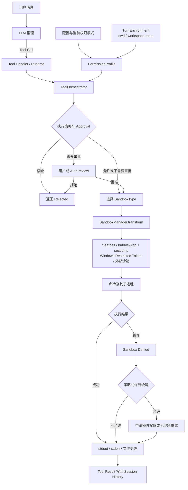
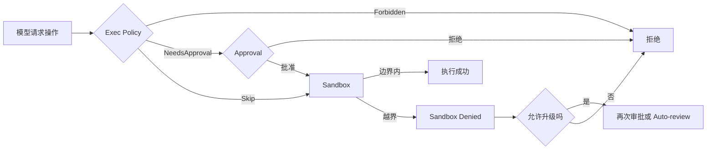

# Sandbox：Codex 如何限制 Agent 的实际执行能力

本文档基于 OpenAI `codex` 公开仓库提交：`633ab19`。

> 本文是基于公开资料与源码映射形成的学习笔记，并非 OpenAI 官方架构文档。源码链接固定到上述提交，便于复核；上游实现变化后，文档结论需要重新验证。

Sandbox 不是一段要求模型“谨慎操作”的提示词，也不等于每条命令执行前弹出的 Yes 按钮。它是 Codex Runtime 在工具真正执行时建立的、由操作系统强制实施的权限边界。

一句话定义：

> LLM 可以提出任意 Tool Call；Sandbox 决定这个 Tool Call 产生的进程最终能够读取什么、写入什么以及能否使用网络。

## 1. Sandbox 在整体架构中的位置

Sandbox 位于 Tool Execution，而不是 Prompt Assembly。



模型可能在上下文中看到当前权限说明，从而提前选择合适方案。但安全性不能依赖模型是否遵守这段说明：真正的限制发生在 Runtime 和操作系统层。

```text
Prompt 中的权限说明
    作用：帮助模型规划

PermissionProfile + OS Sandbox
    作用：强制限制实际行为
```

## 2. 不只是比较 `permission` 和 `cmd`

可以把执行分成两个阶段。

### 2.1 执行前：检查能不能启动

Codex 会结合命令、Exec Policy、Approval Policy 和工具自己的权限声明，得到类似以下结果：

```text
Skip          不需要审批
NeedsApproval 需要审批
Forbidden     禁止执行
```

这一阶段会分析命令，但无法只看外层字符串就知道全部行为。例如：

```bash
npm test
```

可能继续运行 `package.json` 脚本、依赖代码和多个子进程。因此一次执行前的文本判断不能代替 Sandbox。

### 2.2 执行中：检查实际做了什么

命令被放入根据 `PermissionProfile` 生成的环境后，文件读写、网络访问和子进程会持续受到边界限制：

```text
启动 npm test                         允许
读取当前项目 package.json             允许
写入项目中的测试缓存                  取决于文件策略
修改 ~/Documents                     拒绝
连接外部服务器                        取决于网络策略
npm 启动的 node 子进程                继承同一边界
```

因此更准确的关系是：

```text
执行前能否启动
    = Command + Exec Policy + Approval Policy

启动后实际能做什么
    = PermissionProfile + OS Sandbox

最终能力
    = 两者的交集
```

## 3. 四层概念不要混淆

### 3.1 `SandboxMode`：用户看到的预设

源码提供三个传统预设：

```rust
pub enum SandboxMode {
    ReadOnly,
    WorkspaceWrite,
    DangerFullAccess,
}
```

它只是配置入口，不是操作系统实现。

### 3.2 `PermissionProfile`：Runtime 使用的规范权限

`SandboxMode` 会进一步转换为：

```rust
pub enum PermissionProfile {
    Managed {
        file_system: ManagedFileSystemPermissions,
        network: NetworkSandboxPolicy,
    },
    Disabled,
    External {
        network: NetworkSandboxPolicy,
    },
}
```

- `Managed`：Codex 负责建立沙箱；
- `Disabled`：不添加 Codex 外层沙箱；
- `External`：文件系统隔离由外部执行器或容器负责。

### 3.3 文件与网络策略：具体允许什么

文件条目具有三种访问级别：

```text
Read   可以读，不可以写
Write  可以读，也可以写
Deny   不可以读，也不可以写
```

网络策略至少区分：

```text
Restricted  网络受限
Enabled     网络可用
```

### 3.4 `SandboxType`：平台怎样实施

```rust
pub enum SandboxType {
    None,
    MacosSeatbelt,
    LinuxSeccomp,
    WindowsRestrictedToken,
}
```

`SandboxMode` 回答“允许什么”，`SandboxType` 回答“在这台机器上怎样强制实现”。

## 4. 三个基础权限模式

下面描述的是基础策略。自定义 Permission Profile、额外 writable roots、网络配置、企业策略和单次额外权限都可以进一步改变结果。

| 模式 | 文件系统基础语义 | 网络默认值 | 是否添加 Codex 外层沙箱 |
| --- | --- | --- | --- |
| `read-only` | 根路径可读，没有普通写入授权 | `Restricted` | 是 |
| `workspace-write` | 根路径可读；Workspace roots 与临时目录可写 | `Restricted` | 是 |
| `danger-full-access` | 使用当前系统用户本身的权限 | `Enabled` | 否，转换为 `PermissionProfile::Disabled` |

### 4.1 `read-only` 为什么“都能读，所有写入都要 Yes”

内置只读文件策略的核心是：

```text
/ = Read
```

但没有普通 `Write` 条目。于是文件可以读取，写入则会失败、请求审批或由策略直接拒绝。

这正是下面这种体验的来源：

```text
读 README.md      直接进行
搜索源码           直接进行
修改 README.md     请求 Yes
创建文件           请求 Yes
运行会改文件的命令  请求 Yes
```

### 4.2 `workspace-write` 为什么有些文件可以直接写

基础策略近似为：

```text
/                         Read
<workspace roots>         Write
系统临时目录               Write
<workspace>/.git          Read
<workspace>/.agents       Read
<workspace>/.codex        Read
Network                   Restricted
```

所以普通项目文件可以直接修改，而工作区外、网络和受保护元数据仍然可能触发拒绝或审批。

### 4.3 父目录可写，为什么 `.git` 仍然只读

权限匹配允许更具体的子路径覆盖父路径：

```text
/project            Write
/project/.git       Read
```

`/project/src/main.rs` 只继承项目的 `Write`；`/project/.git/config` 同时匹配两条规则，其中 `.git` 更具体，因此结果是 `Read`。

```text
project                         Write
├── src                         Write
├── tests                       Write
├── README.md                   Write
├── .git                        Read
├── .agents                     Read
└── .codex                      Read
```

这些目录包含仓库控制数据、Agent 指令和 Codex 元数据。保护它们可以降低修改 Git 引用、安装 hook 或篡改运行指令等风险。

### 4.4 YOLO 为什么“什么都能写”

`--yolo` 是 `--dangerously-bypass-approvals-and-sandbox` 的别名，其典型组合是：

```text
sandbox_mode = danger-full-access
approval_policy = never
```

这表示 Codex 不再创建外层文件系统沙箱，也不请求批准。它并不会自动获得 root 权限，但工具可以使用启动 Codex 的系统用户所拥有的权限。

## 5. Sandbox、Approval 和 Exec Policy 的关系

| 机制 | 回答的问题 | 强制位置 |
| --- | --- | --- |
| Prompt 指令 | 模型应该怎样做 | 模型推理层，不是安全边界 |
| Exec Policy | 这类命令应允许、询问还是禁止 | Tool Runtime 执行前 |
| Approval Policy | 谁在什么情况下批准越界 | Orchestrator / 产品交互层 |
| Sandbox | 命令和子进程技术上最多能做什么 | Runtime + 操作系统 |

审批不是沙箱本身。一个 Yes 通常表示允许某次操作获得更高权限；Sandbox 则是在进程运行期间持续限制实际系统调用。



常见组合：

| 使用方式 | Sandbox | Approval | 体验 |
| --- | --- | --- | --- |
| 只读探索 | `read-only` | `on-request` 或 `untrusted` | 阅读方便，写入和部分命令经常询问 |
| 平衡的 Agent 模式 | `workspace-write` | `on-request` | 项目内普通工作自动进行，越界时询问 |
| 无交互只读 | `read-only` | `never` | 越界直接失败，不弹确认 |
| YOLO / Full Access | `danger-full-access` | `never` | 不设 Codex 外层边界，也不询问 |

如果一直使用“只读 + 每次写都人工 Yes”，用户确实容易退化为“确认工程师”。Sandbox 更合理的使用方式通常是预先授予一个有限的 Workspace 边界，让边界内操作自动进行，只审批真正的越界行为。

## 6. Sandbox 到底有什么用

### 6.1 限制错误的影响范围

假设脚本中有：

```bash
rm -rf "$BUILD_DIR"
```

变量错误可能让命令删除错误目录：

- Full Access 下，影响范围可能扩大到当前用户有权删除的位置；
- Workspace Write 下，写入破坏通常被限制在 writable roots；
- Read Only 下，删除会被阻止。

Sandbox 不保证 Agent 不犯错，而是限制错误的爆炸半径。

### 6.2 约束看起来无害的命令及其子进程

`npm test`、`cargo test`、`python setup.py`、`./build.sh` 的真实行为取决于项目脚本和依赖。审批者很难只看外层命令发现内部全部行为，而操作系统沙箱会继续限制它们启动的子进程。

### 6.3 减少确认疲劳

没有 Sandbox 时，只剩下两个极端：每一步人工批准，或者给 Agent 完整权限。Workspace Write 提供中间方案：当前项目内自主运行，工作区外和网络仍有边界。

## 7. 一次命令怎样变成沙箱命令

`ToolOrchestrator` 先从当前 `TurnEnvironment` 取得 `PermissionProfile`，综合工具自身权限、审批策略和网络要求，选择初次执行是否需要沙箱。

`SandboxManager` 随后完成两个工作：

1. 将基础权限与本次 `additional_permissions` 合并成有效权限；
2. 根据宿主操作系统，把原命令转换成相应平台的启动方式。

在 macOS 上，概念上类似：

```text
原命令
    npm test

实际启动
    /usr/bin/sandbox-exec -p <动态 Seatbelt Policy> -- npm test
```

动态 Policy 包含可读根、可写根、禁止读取路径、网络规则和允许的 Unix Socket。Linux 和 Windows 的具体形式不同，但目标相同。

如果第一次执行返回明确的 `SandboxErr::Denied`，`ToolOrchestrator` 会结合 Approval Policy、工具是否允许升级、是否存在不可丢弃的 deny-read 规则以及网络审批结果，决定直接返回失败还是请求授权后重试。

## 8. 不同操作系统的实现

| 平台 | 当前主要实现 | 关键源码 |
| --- | --- | --- |
| macOS | Seatbelt，调用系统 `/usr/bin/sandbox-exec` 并动态生成策略 | [`seatbelt.rs`](https://github.com/openai/codex/blob/633ab199cfd724aa78013c006b27a2b3d049fc3b/codex-rs/sandboxing/src/seatbelt.rs) |
| Linux / WSL2 | bubblewrap 构造文件系统视图和 namespace；seccomp 与 `no_new_privs` 限制系统调用/网络 | [`linux-sandbox/src/`](https://github.com/openai/codex/tree/633ab199cfd724aa78013c006b27a2b3d049fc3b/codex-rs/linux-sandbox/src/) |
| Windows | Restricted Token、ACL、桌面与网络相关限制 | [`windows-sandbox-rs/src/`](https://github.com/openai/codex/tree/633ab199cfd724aa78013c006b27a2b3d049fc3b/codex-rs/windows-sandbox-rs/src/) |
| 远程执行器 | 可以使用 `PermissionProfile::External`，由执行器实施文件系统边界 | [`models.rs`](https://github.com/openai/codex/blob/633ab199cfd724aa78013c006b27a2b3d049fc3b/codex-rs/protocol/src/models.rs) |

在 Linux 上，文件系统默认以只读视图挂载，再叠加明确的 writable roots；即使父路径可写，`.git`、`.agents` 和 `.codex` 等子路径仍保持只读。

## 9. Sandbox 是否约束所有 Tool、MCP 和 Plugin

不能把本机进程 Sandbox 理解为所有能力的统一安全层。

### 本地 Tool

Shell、测试、构建工具以及它们启动的子进程会受到平台 Sandbox。`apply_patch` 也通过 `ToolOrchestrator` 和文件系统权限上下文执行，不是只靠模型自觉。

### MCP / App Tool

远程 MCP Tool 可能直接向外部服务发送 API 请求，并不一定在本机启动受 Seatbelt 或 bubblewrap 控制的进程。它主要依赖：

- MCP Server 自身权限；
- OAuth 或服务账号权限；
- Tool annotations；
- Codex Approval；
- 组织管理策略和远端服务校验。

### Plugin

Plugin 是 Skills、MCP Servers、Apps 和 Hooks 的打包容器。Sandbox 约束的是 Plugin 最终触发的具体本地执行路径；Plugin 这个包本身不是一个统一的沙箱对象。

## 10. Sandbox 的局限

Sandbox 不是绝对安全保证：

1. Workspace Write 允许修改项目，错误操作仍可能破坏项目内文件；
2. 只读不等于不可见，内置策略和自定义 deny-read 规则需要分开理解；
3. 允许网络后会增加数据外传、恶意下载和依赖攻击风险；
4. MCP/App 的远程副作用需要单独的权限和审批机制；
5. Sandbox 实现依赖操作系统能力，平台后端存在差异；
6. 用户批准无沙箱执行后，本次命令的边界可能被扩大；
7. 它不能代替 Git、备份、Worktree、代码审查和最小权限原则。

所以 Sandbox 的目标不是“让 Agent 永远不会出错”，而是：

> 在无需逐条审批的情况下，让 Agent 在一个可控范围内自主工作，并限制错误、恶意脚本或依赖代码可能造成的影响范围。

## 11. 源码阅读路线

1. [`config_types.rs`](https://github.com/openai/codex/blob/633ab199cfd724aa78013c006b27a2b3d049fc3b/codex-rs/protocol/src/config_types.rs)：`SandboxMode`。
2. [`config_toml.rs`](https://github.com/openai/codex/blob/633ab199cfd724aa78013c006b27a2b3d049fc3b/codex-rs/config/src/config_toml.rs)：传统模式如何转换为 `PermissionProfile`。
3. [`models.rs`](https://github.com/openai/codex/blob/633ab199cfd724aa78013c006b27a2b3d049fc3b/codex-rs/protocol/src/models.rs)：`PermissionProfile` 与单次 `SandboxPermissions`。
4. [`permissions.rs`](https://github.com/openai/codex/blob/633ab199cfd724aa78013c006b27a2b3d049fc3b/codex-rs/protocol/src/permissions.rs)：文件和网络权限语义、Workspace Write 与受保护路径。
5. [`tools/orchestrator.rs`](https://github.com/openai/codex/blob/633ab199cfd724aa78013c006b27a2b3d049fc3b/codex-rs/core/src/tools/orchestrator.rs)：Approval、首次尝试、拒绝识别和升级重试。
6. [`tools/sandboxing.rs`](https://github.com/openai/codex/blob/633ab199cfd724aa78013c006b27a2b3d049fc3b/codex-rs/core/src/tools/sandboxing.rs)：Tool Runtime 与 Sandbox 的公共接口。
7. [`sandboxing/src/manager.rs`](https://github.com/openai/codex/blob/633ab199cfd724aa78013c006b27a2b3d049fc3b/codex-rs/sandboxing/src/manager.rs)：平台选择和命令转换。
8. [`sandboxing/src/seatbelt.rs`](https://github.com/openai/codex/blob/633ab199cfd724aa78013c006b27a2b3d049fc3b/codex-rs/sandboxing/src/seatbelt.rs)：macOS 策略生成。
9. [`linux-sandbox/src/`](https://github.com/openai/codex/tree/633ab199cfd724aa78013c006b27a2b3d049fc3b/codex-rs/linux-sandbox/src/)：Linux bubblewrap 与 seccomp。
10. [`windows-sandbox-rs/src/`](https://github.com/openai/codex/tree/633ab199cfd724aa78013c006b27a2b3d049fc3b/codex-rs/windows-sandbox-rs/src/)：Windows 实现。
11. [关键源码摘录](source-excerpts.md)：本提交下的学习快照。

## 12. 官方文档

- [OpenAI Docs：Sandbox](https://learn.chatgpt.com/docs/sandboxing)
- [OpenAI Docs：Agent approvals & security](https://learn.chatgpt.com/docs/agent-approvals-security)
- [OpenAI Docs：Permissions](https://learn.chatgpt.com/docs/permissions)
