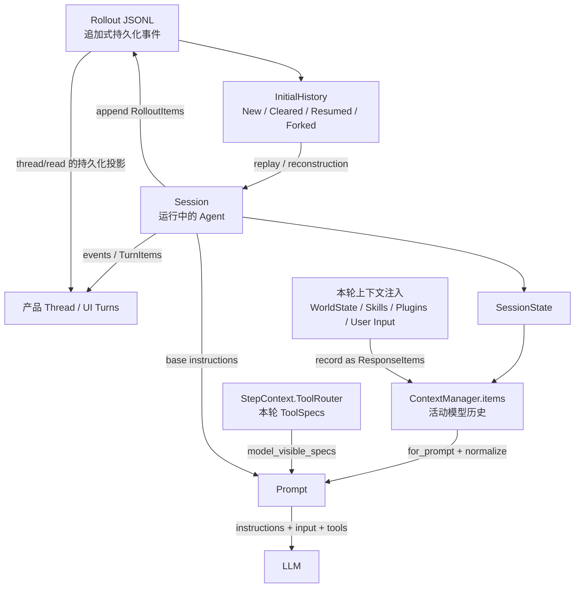
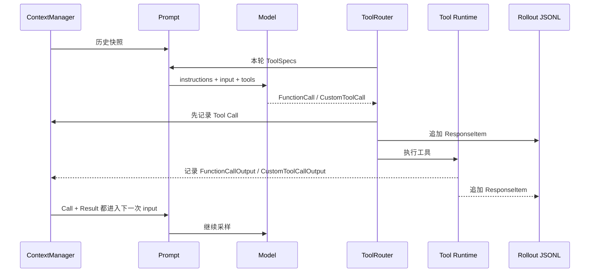

# Session：一条 Codex 会话到底是什么

本文档基于 OpenAI `codex` 公开仓库提交：`633ab19`。

## 先回答最关键的问题

Codex 中不存在一个“装着所有内容、原封不动发送给模型”的 Session 对象。

同一条会话至少有五种表示：

```text
产品 Thread / 对话界面
    用户看到的 Turn 与消息、工具卡片、状态

Rollout JSONL
    用来持久化和恢复的追加式事件日志

Session
    codex-core 中当前正在运行的 Agent 实例

SessionState.history / ContextManager
    当前仍然有效的模型活动历史

Prompt
    某一次模型调用真正发送的 instructions + input + tools
```

所以“Session 能看到哪些内容”必须先说明主语：

- JSONL 能记录什么；
- Runtime 当前保留什么；
- UI 展示什么；
- 下一次 LLM 请求实际收到什么。

这四者不是同一个集合。

## 五层架构



## Session Runtime 管什么

源码中的 `Session` 注释是“initialized model agent 的上下文”，并规定一个 Session 同时最多运行一个 task。它不仅保存消息，还协调：

- `thread_id` 与事件输出；
- `SessionState`；
- 当前 active turn 与排队的用户输入；
- MCP 刷新与连接生命周期；
- 各类 Extension services；
- Realtime conversation；
- fork、权限、环境与其他运行期资源。

`SessionState` 里与上下文最直接相关的是：

- `session_configuration`：基础指令、provider、默认 step settings、权限等；
- `history: ContextManager`：当前活动模型历史；
- `previous_turn_settings`：上一轮模型等设置；
- `additional_context`：追加上下文；
- `auto_compact_window`：压缩窗口状态；
- `reference_context_item` 和 WorldState baseline：通过 `ContextManager` 保存，用于增量注入；
- token usage、rate limits、connector selection 等运行状态。

Session 因此不是“聊天记录数组”，而是驱动整个 Agent Loop 的运行容器。

## 工具调用和工具结果会不会进入 Session

会，但要分两件事：

1. **工具定义**：某个工具的名字、描述、参数 schema 不放进 `history`。每个 Step 从 `ToolRouter` 取得本轮可见的 `ToolSpec`，放到 `Prompt.tools`。
2. **工具执行记录**：模型产生的 Tool Call 和 Runtime 返回的 Tool Result 都会作为 `ResponseItem` 记录进活动 History，并写入 Rollout；随后下一次采样把它们放进 `Prompt.input`。

基本循环是：



但这不表示模型永远能看到完整原始结果：

- 过大的工具结果在写入活动 History 时会被截断；
- 不支持的图片或音频会在 `for_prompt` 阶段剥离；
- Compaction 会用较小的 replacement history 替换活动历史；
- Rollout 仍可保留旧事件，但模型不会因此自动读取整份 JSONL；
- UI 还可能对特定客户端的 MCP payload 做展示层脱敏，这不改动模型恢复历史和持久化数据。

## 推荐阅读顺序

1. [加载、恢复与 Fork](loading-and-resume.md)
2. [Session 如何注入 Context](context-injection.md)
3. [History 与“谁能看到什么”](history-and-model-visibility.md)
4. [关键源码摘录](source-excerpts.md)
5. [Compact 如何替换活动 History](../compact/)

## 官方 API 对照

Responses API 同样把会话输入项和工具定义分开。`input` 可以包含消息、tool call、tool output、reasoning 等 item，而 `tools` 是独立字段：

- [Create a model response](https://developers.openai.com/api/reference/cli/resources/responses/methods/create)
- [Responses API reference](https://developers.openai.com/api/reference/cli/resources/beta/subresources/responses)
