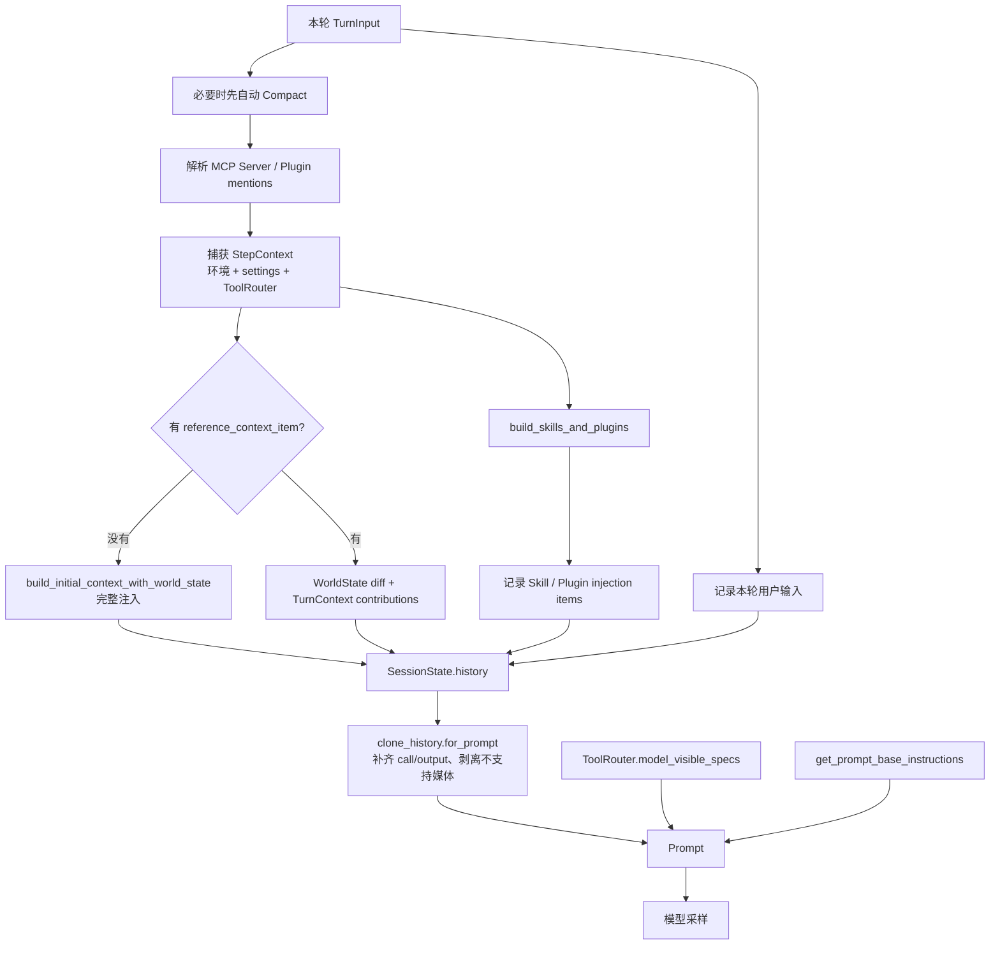

# Session 如何把 Context 注入模型请求

“Session 注入”不是把一份 session.json 作为系统提示词塞给模型。实际过程是：恢复活动 History，在 Turn 开始时记录动态 Context，再在每次采样时生成结构化 `Prompt`。

## 1. 一次 Turn 的主流程



## 2. 第一次注入：完整上下文

`record_context_updates_and_set_reference_context_item` 在没有 reference baseline 时调用 `build_initial_context_with_world_state`。这一步会形成一个或多个 developer/user `ResponseItem`，内容可能来自：

- developer instructions；
- AGENTS.md 与 managed instructions；
- cwd、环境、权限、sandbox、approval；
- collaboration / multi-agent mode；
- Apps 与 Plugins 使用规则；
- Skills catalog；
- Memory extension；
- Extension `ContextContributor`；
- token budget/context window 提示；
- 当前完整 WorldState；
- 推荐插件等 contextual user fragment。

这些渲染后的 items 通过 `record_conversation_items` 同时：

1. 写入 `ContextManager`；
2. 作为 `RolloutItem::ResponseItem` 持久化。

Runtime 还单独保存完整 `WorldStateItem` 和 `TurnContextItem`，供将来 diff 与恢复。这些 raw state records 不会因为存在于 JSONL 就直接作为文本送给模型。

## 3. 后续 Turn：只注入变化

Session 保存：

- `reference_context_item`：上一份持久化 Turn 配置 baseline；
- `world_state_baseline`：上次模型可见 WorldState snapshot。

后续 Step 比较新旧状态：

```text
TurnContext 改变
    -> 生成 model/personality/effort/realtime 等本轮贡献

WorldState 改变
    -> render_history_diff
    -> 合并为 contextual developer/user fragments

什么都没改变
    -> 不重复写模型可见文本
```

发生 Compaction、某些 rollback 或显式 reset 后 baseline 可能被清空，下一次 Turn 会退回完整注入。

## 4. Skills 与 Plugins 怎样进入 Session History

Skills 有两级：

- catalog：由 Skills context contributor 贡献到初始/更新上下文；
- 选中的完整 Skill 指令：`build_skills_and_plugins` 解析本轮输入后，作为 contextual user items 记录进 History。

Plugin 自身不是统一的一段文本：

- Plugin Skills 沿 Skills 路径进入；
- Plugin MCP servers 沿 MCP/ToolRouter 路径提供工具；
- Plugin usage policy 或推荐信息可作为上下文 fragment；
- Hooks 可在 Turn 生命周期中贡献或改变输入。

因此 Session 记录的是各子能力最终产生的 Context item 或工具调用，不是把整个 Plugin 目录注入模型。

## 5. Tools 不通过 History 注入

`Prompt` 的结构直接说明了边界：

```rust
pub struct Prompt {
    pub input: Vec<ResponseItem>,
    pub(crate) tools: Arc<[ToolSpec]>,
    pub base_instructions: BaseInstructions,
    // ...
}
```

构造时：

```rust
Prompt {
    input,
    tools: step_context.tool_router.model_visible_specs(),
    base_instructions,
    // ...
}
```

所以：

```text
过去发生的 Tool Call / Result -> Prompt.input
本轮允许调用的 Tool schema   -> Prompt.tools
```

MCP Tool 也遵守这个边界：MCP server 发现的能力先转换为 ToolSpec，进入本轮 ToolRouter；真正执行后的 call/result 才进入 History。

## 6. 对话历史怎样进入 Prompt.input

每次采样前：

```rust
let sampling_request_input = sess
    .clone_history()
    .await
    .for_prompt(&step_context.settings.model_info.input_modalities);
```

`for_prompt` 不是简单 clone。它会：

1. 确保 Function/Custom Tool Call 有对应 output；
2. 删除没有对应 call 的孤立 output，已标记的外部 tool event 除外；
3. 模型不支持图片时剥离图片；
4. 模型不支持音频时剥离音频。

最后 `build_prompt` 把三条通道汇合：

```text
base instructions
+ normalized active history
+ current visible ToolSpecs
= one model request
```

## 7. Tool Result 如何回注并触发继续采样

模型返回工具调用后，Core 先记录 call，再异步执行。工具 future 完成后，`drain_in_flight` 把返回 envelope 写入 History。不同来源的结果最终转换成模型协议 item：

- 普通/MCP tool result -> `FunctionCallOutput`；
- freeform/custom tool result -> `CustomToolCallOutput`；
- deferred tool search -> `ToolSearchOutput`。

Agent Loop 看到 `needs_follow_up = true` 后继续循环，重新从 History 构建下一次 `Prompt.input`。因此模型能根据刚才的工具结果继续推理。

## 8. 与 Responses API 的对应关系

官方 Responses API 的输入 item 可以包含消息、工具调用、工具输出和 reasoning items；`tools` 则描述模型本次可以使用的工具。Codex 的本地 `Prompt` 正是在维护这个边界：

- [Create a model response](https://developers.openai.com/api/reference/cli/resources/responses/methods/create)
- [Responses API reference](https://developers.openai.com/api/reference/cli/resources/beta/subresources/responses)
