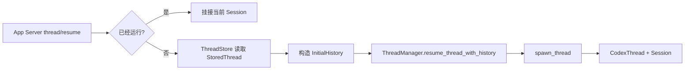
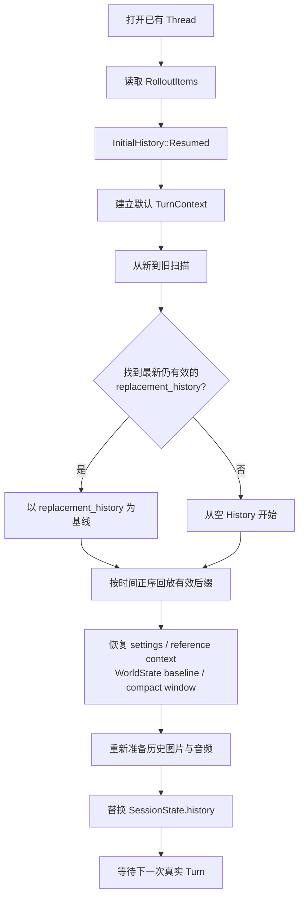

# Session 的加载、恢复与 Fork

本文讨论的是 `codex-core` 如何把持久化会话恢复成可继续运行的 Agent，而不是 UI 怎样绘制聊天列表。

## 1. 从产品入口到 Core

Desktop/App Server 的冷恢复入口是 `thread/resume`。它先判断 Thread 是否已经在运行：

- 已经运行：重新挂接 listener 并返回当前 Thread 投影，不重建第二个 Session；
- 没有运行：从 `ThreadStore` 按 thread ID 或 rollout path 读取 `StoredThread`；
- paginated history：调用 `load_latest_model_context` 读取当前模型上下文；
- 普通 file-backed history：读取包含 history 的 StoredThread，再转换为 `InitialHistory`；
- 客户端直接提供 `history`：把这些 `ResponseItem` 包成 `InitialHistory::Forked`，因为它不是对原持久化 Thread 的正常续接。

随后 App Server 调用 `ThreadManager::resume_thread_with_history`。`ThreadManager` 恢复 session/thread source 和 multi-agent metadata，最后通过 `spawn_thread` 建立新的运行中 `CodexThread`/`Session`。



## 2. 加载入口的数据形态

历史入口统一成 `InitialHistory`：

```rust
pub enum InitialHistory {
    New,
    Cleared,
    Resumed(ResumedHistory),
    Forked(Vec<RolloutItem>),
}
```

四种状态的意义：

| 状态 | 含义 | 初始活动 History |
| --- | --- | --- |
| `New` | 新 Thread | 空；首次真实 Turn 再注入完整上下文 |
| `Cleared` | 清空后重新开始 | 空；首次真实 Turn 再注入完整上下文 |
| `Resumed` | 恢复已有 Thread | 从 Rollout 重建 |
| `Forked` | 从另一 Thread 派生 | 从继承的 Rollout items 重建，并建立新持久化边界 |

`ResumedHistory` 保存 `conversation_id`、已经读取的 `RolloutItem` 列表，以及可选的 rollout path。

## 3. Rollout JSONL 是事件日志，不是 Prompt 快照

本地普通 Rollout 文件通常位于：

```text
~/.codex/sessions/YYYY/MM/DD/
└── rollout-YYYY-MM-DDTHH-MM-SS-<thread_id>.jsonl
```

文件按行保存 `RolloutLine`，每行包含时间、ordinal 和一个 `RolloutItem`。主要类型有：

```text
SessionMeta
ResponseItem
InterAgentCommunication
Compacted
TurnContext
TokenUsageRecord
WorldState
SecurityRiskScore
EventMsg
RealtimeItem
```

它们不是全部发给模型。例如 `EventMsg`、token usage、security score 和 raw `WorldStateItem` 主要用于恢复、控制或 UI；真正的模型历史主要从 `ResponseItem`、inter-agent input 和 compaction checkpoint 重建。

Rollout 采用追加式记录。压缩时不会回头改写所有旧行，而是追加一个带 `replacement_history` 的 `CompactedItem` 检查点。

## 4. 恢复流程



### 4.1 为什么先反向扫描

`reconstruct_history_from_rollout` 从最新记录向旧记录扫描，目的是尽快找到：

- 最新仍然存活的 `CompactedItem.replacement_history`；
- 最新有效的上一轮 settings；
- reference context；
- WorldState baseline；
- 当前 compaction window IDs；
- rollback 后真正仍然存活的用户 Turn。

一旦找到有效 replacement history，更老的普通 ResponseItems 已经被该检查点取代，无需再次构造为活动 History。然后 Runtime 只按时间正序回放检查点之后的有效后缀。

### 4.2 回放时哪些内容进入 History

回放的核心规则：

- `ResponseItem`：写入 `ContextManager`；
- `InterAgentCommunication`：转成模型输入 item 后写入；
- `CompactedItem`：有 `replacement_history` 就替换；旧格式没有时用历史用户消息与 compact message 重建；
- `ThreadRolledBack`：从活动 History 删除相应用户 Turns；
- `TurnContext`、`WorldState`：用于恢复 baseline 和设置，不直接当普通历史消息逐项加入；
- `EventMsg`、token usage、security score、realtime facts：不作为普通模型历史回放。

### 4.3 恢复不是立刻把所有上下文重复写一遍

`record_initial_history` 对 `New` 和 `Resumed` 都会把 initial context 的插入推迟到第一个真实 Turn。原因是 `turn/start` 可能带新的 model、cwd、权限或其他 override；只有合并这些设置以后，才能生成本轮正确的模型可见上下文。

恢复后首个 Turn 会检查 `reference_context_item`：

- baseline 有效：只注入变化；
- baseline 缺失或被 compaction/rollback 清除：重新注入完整 initial context。

## 5. SessionMeta 保存什么

`SessionMeta` 是不属于某个具体 Turn 的会话级元数据，包含：

- thread/session ID、父子与 fork 关系；
- timestamp、cwd、originator、CLI version；
- session source 与 thread source；
- model provider；
- 可选的 base instructions；
- dynamic tools；
- selected capability roots；
- memory/history mode；
- paginated history base；
- multi-agent 与 initial context-window 元信息。

注意：这仍不是完整 Prompt。历史消息在 `ResponseItem`，本轮设置在 `TurnContext`，工具的实时可见集合会在 Step 创建时重建。

## 6. Fork 与 Resume 的区别

Resume 延续同一个 Thread；Fork 使用继承历史创建新的 Thread。Fork 还需要处理：

- 新旧 thread ID；
- copied 或 referenced persistence；
- 继承到哪个 ordinal；
- 子线程自己的 settings 与持久化边界；
- rollback 和 compaction 后哪些祖先记录仍然有效。

两者最终都会得到一个新的运行中 `Session` 和一份重建后的 `ContextManager`，但持久化身份不同。

## 7. 自己检查一份 Rollout

下面的命令只查看结构，不输出消息正文：

```bash
jq -r '.type' /path/to/rollout-....jsonl | sort | uniq -c
```

检查压缩检查点：

```bash
jq -c '
  select(.type == "compacted") |
  {
    ordinal,
    window_number: .payload.window_number,
    replacement_count: (.payload.replacement_history | length),
    replacement_types: [.payload.replacement_history[] | .type]
  }
' /path/to/rollout-....jsonl
```

不要把包含用户消息、工具参数或工具结果的完整 JSONL 直接提交到仓库；它可能包含敏感信息。
