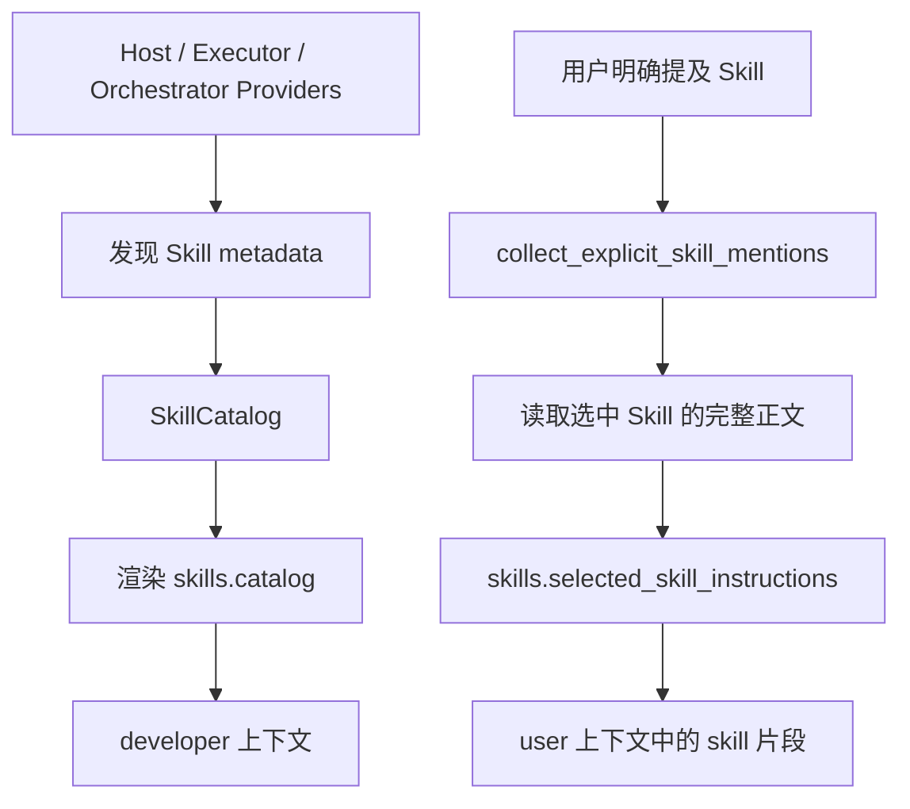

# Skills：源码实现与渐进式加载

## Skill 是什么

Skill 是一组可复用的工作指令和相关资源。一个 Skill 通常以 `SKILL.md` 为入口，还可以包含脚本、参考资料和素材。

Skill 不是 Tool：

- Tool 提供可调用接口和参数 schema。
- Skill 教模型什么时候、按什么步骤使用已有能力。
- Skill 可以要求调用 Tool，但它自己通常不成为 Tool schema。

## 当前源码中的 Skills 数量

### 产品内嵌系统 Skills：6 个

位置：[`codex-rs/skills/src/assets/samples`](https://github.com/openai/codex/tree/633ab199cfd724aa78013c006b27a2b3d049fc3b/codex-rs/skills/src/assets/samples/)

- `imagegen`
- `openai-docs`
- `plugin-creator`
- `review-agent`
- `skill-creator`
- `skill-installer`

### 仓库维护 Skills：11 个

位置：[`.codex/skills`](https://github.com/openai/codex/tree/633ab199cfd724aa78013c006b27a2b3d049fc3b/.codex/skills/)

这些用于开发、测试和维护 Codex 仓库，不等同于产品内嵌系统 Skills。

```text
产品系统 Skills： 6
仓库维护 Skills：11
SKILL.md 总数：  17
```

## Skills 从哪里发现

Skills extension 把来源抽象成 `SkillProvider`。当前主要来源包括：

| Provider | 含义 |
| --- | --- |
| Host | 本机 `CODEX_HOME`、项目目录、系统 Skills、已加载 Plugin roots |
| Executor | 当前执行环境提供的 Skills |
| Orchestrator | 宿主/编排层提供的 Skills |
| Custom | 扩展注册的自定义来源 |

App Server 安装 Skills extension 时，会把 Host、Executor 和 Orchestrator providers 注入进去。

## `skills.catalog` 到底是什么

Catalog 是可用 Skill 的轻量目录，不是所有 `SKILL.md` 正文的拼接。

每个 catalog entry 主要携带：

- Skill 名称
- 简短说明
- 路径或资源标识
- 来源与 authority
- 是否启用
- Plugin 归属等元数据

Catalog 被渲染成 `developer` 角色的上下文片段，`content_kind` 是：

```text
skills.catalog
```

这一步让模型知道“有哪些 Skill 可以选”，不会把所有 Skill 的长篇正文一次性塞入上下文。

## 完整 `SKILL.md` 什么时候加载



分成两个阶段：

1. 渐进披露第一层：catalog 元数据进入上下文。
2. 渐进披露第二层：被选中的 Skill 才读取完整 `SKILL.md`。

完整 Skill 片段的数据结构包含：

- `name`
- `path`
- `contents`
- 可选的资源访问 authority

它的 `content_kind` 是：

```text
skills.selected_skill_instructions
```

## Skill 如何获得和安装

### 系统 Skills

编译时通过 `include_dir!` 嵌入二进制；运行时安装到：

```text
CODEX_HOME/skills/.system
```

### 用户或项目 Skills

Host provider 根据配置和当前工作目录解析 Skill roots，并扫描其中的 `SKILL.md`。

### Plugin Skills

Plugin loader 读取 manifest 中声明的 skill roots，形成快照，再交给 Host 或 Executor provider。

### Executor / Orchestrator Skills

不要求一定存在本机路径。对应 provider 可以通过带 authority 的资源读取接口列出和读取 Skill。

## 缓存和维护

Skill 发现结果不是每轮无条件从磁盘重扫。Host service 会：

- 根据有效 Skill roots 和配置构造 cache key。
- 保存不可变 snapshot。
- 监听会影响 Skill 的根目录。
- 配置或文件变化时清理 cache。
- 每个 turn 使用自己的 catalog snapshot，防止不同 session 互相污染。

## 推荐阅读顺序

1. [`skills/src/lib.rs`](https://github.com/openai/codex/blob/633ab199cfd724aa78013c006b27a2b3d049fc3b/codex-rs/skills/src/lib.rs)：系统 Skills 嵌入和安装。
2. [`ext/skills/src/sources.rs`](https://github.com/openai/codex/blob/633ab199cfd724aa78013c006b27a2b3d049fc3b/codex-rs/ext/skills/src/sources.rs)：Provider 抽象。
3. [`ext/skills/src/host_service.rs`](https://github.com/openai/codex/blob/633ab199cfd724aa78013c006b27a2b3d049fc3b/codex-rs/ext/skills/src/host_service.rs)：本机发现、roots、cache。
4. [`ext/skills/src/world_state_catalogs.rs`](https://github.com/openai/codex/blob/633ab199cfd724aa78013c006b27a2b3d049fc3b/codex-rs/ext/skills/src/world_state_catalogs.rs)：多来源 catalog 的发现与渲染。
5. [`ext/skills/src/extension.rs`](https://github.com/openai/codex/blob/633ab199cfd724aa78013c006b27a2b3d049fc3b/codex-rs/ext/skills/src/extension.rs)：turn 上下文注入和选中逻辑。
6. [`ext/skills/src/fragments.rs`](https://github.com/openai/codex/blob/633ab199cfd724aa78013c006b27a2b3d049fc3b/codex-rs/ext/skills/src/fragments.rs)：catalog 与完整 Skill 的消息角色。
7. [关键源码摘录](source-excerpts.md)。

## 与既有 Prompt 文档的关系

- [Skill 如何加载进上下文](../prompt/skill-context-loading.md)
- [完整 Prompt 组成](../prompt/system-prompt.md)
- [端到端请求与 Agent Loop 深读](../context/request-lifecycle.md)：继续跟踪选中 Skill、引用资源读取、Tool Result 与下一次模型采样。
