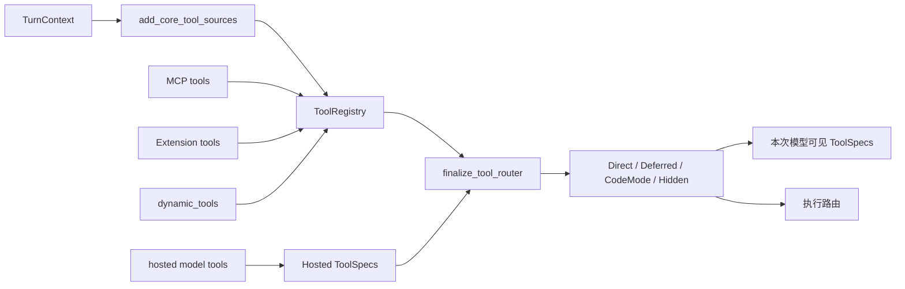
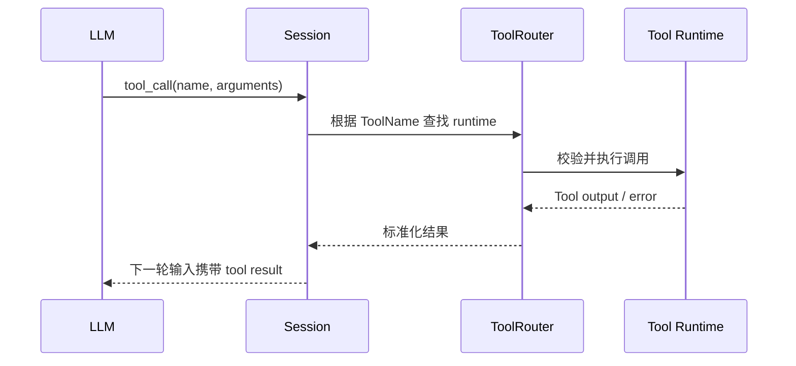

# Tools：源码实现与加载流程

## Tool 是什么

Tool 是模型可以发起的一种结构化调用。它至少需要两部分：

1. `ToolSpec`：告诉模型工具名称、说明、参数 schema。
2. `ToolExecutor` 或 Handler：模型真的调用以后，由 Codex 执行。

仅有说明文字不能构成 Tool；仅有执行代码但没有暴露 schema，模型也看不到它。

## 一次 Turn 中的组装入口

核心入口是：

- [`build_tool_router`](https://github.com/openai/codex/blob/633ab199cfd724aa78013c006b27a2b3d049fc3b/codex-rs/core/src/tools/spec_plan.rs)
- [`add_core_tool_sources`](https://github.com/openai/codex/blob/633ab199cfd724aa78013c006b27a2b3d049fc3b/codex-rs/core/src/tools/spec_plan.rs)
- [`finalize_tool_router`](https://github.com/openai/codex/blob/633ab199cfd724aa78013c006b27a2b3d049fc3b/codex-rs/core/src/tools/spec_plan.rs)

整体顺序：



## Tool 从哪里来

### 1. Core 原生 Tools

`add_core_tool_sources` 按顺序加入：

- Shell tools
- MCP resource tools
- Core utility tools
- Collaboration tools

当前源码的 Core Tool 标识并集是 31。它是所有功能开关和模式分支的并集，并不是同时加载数量。

### 2. MCP Tools

MCP Server 连接成功后，Codex 取得服务器返回的 Tool 定义，再注册成外部 runtime。

MCP Tool 的数量完全取决于当时连接的 MCP Servers。

### 3. Extension Tools

App Server 安装的 extension 可以通过 `tool_contributors()` 为当前 step 贡献工具。当前内置的主要工具贡献包括：

- `web.run`
- `image_gen.imagegen`
- `memories.add_ad_hoc_note`
- `memories.list`
- `memories.read`
- `memories.search`
- History Notes tools
- Goal tools
- Skills extension tools

因此不能只根据 `spec_plan.rs` 和 Web/Image 两个 extension 计算最终总数。Extension 工具需要逐个 contributor 盘点。

### 4. Dynamic Tools

调用方还能通过 `TurnContext.dynamic_tools` 动态传入 Tool 定义。

### 5. Hosted Model Tools

有些工具由模型服务端直接执行，不经过本地 `ToolRegistry` handler。当前这里主要是 hosted `web_search`。

## ToolExposure：为什么工具不会全部塞给模型

每个 runtime 都有暴露策略。核心类型包括：

| Exposure | 含义 |
| --- | --- |
| `Direct` | schema 直接发送给模型，也可供 Code Mode 使用 |
| `DirectModelOnly` | 只直接暴露给模型 |
| `Deferred` | 不先发送完整 schema，可通过搜索发现，也可供 Code Mode 使用 |
| `DeferredModelOnly` | 延迟暴露，仅供模型侧发现 |
| `CodeModeOnly` | 只作为 Code Mode 内部可调用工具 |
| `Hidden` | 本轮不暴露 |

最终是否出现还会受到以下条件影响：

- Feature flags
- 模型能力
- Provider 能力
- 是否存在执行环境
- 权限与 sandbox
- Agent 层级和 session source
- 普通 Tool Mode 或 Code Mode
- Direct/Deferred 策略
- MCP/Plugin 是否已连接或安装

## Tool 如何进入模型上下文

Tool schema 不会拼进一大段系统提示词正文。它会被转换成 Responses API 的 ToolSpec，放进模型请求的 `tools` 字段。

```text
Tool runtime
  -> runtime.spec()
  -> ToolSpec
  -> model_visible_specs
  -> Prompt.tools / Responses API tools
```

如果多个工具处于同一个 namespace，最终可能合并成一个 namespace ToolSpec。因此：

> 可调用工具数量不一定等于请求 JSON 中 `tools` 数组的元素数量。

## 模型调用后怎么执行



## 当前源码数量拆分

| 类别 | 标识并集 |
| --- | ---: |
| Shell | 2 |
| MCP Resource | 3 |
| Core Utility | 14 |
| Collaboration V1/V2 去重并集 | 9 |
| `tool_search` | 1 |
| Code Mode `exec` / `wait` | 2 |
| Core 合计 | 31 |
| 已确认 Memory extension | 4 |
| 其他 App Server extensions | 动态且仍需逐项盘点 |
| Hosted model tool | 当前确认 1 |
| 全源码工具总并集 | 暂不下结论 |

此前文档中的“34”只计算了 Core、Web、Image 和 hosted Web Search，遗漏了 Memory、History Notes、Goal、Skills 等 `ToolContributor`，现已撤回。即使完成静态盘点，也不能把源码并集当成每轮实际可见数量；例如 Collaboration V1/V2 是替代关系，`web.run` 与 hosted `web_search` 也会根据模式择一。

## 推荐阅读顺序

1. [`spec_plan.rs`](https://github.com/openai/codex/blob/633ab199cfd724aa78013c006b27a2b3d049fc3b/codex-rs/core/src/tools/spec_plan.rs)：工具总装配线。
2. [`registry.rs`](https://github.com/openai/codex/blob/633ab199cfd724aa78013c006b27a2b3d049fc3b/codex-rs/core/src/tools/registry.rs)：运行时注册和按名称查找。
3. [`router.rs`](https://github.com/openai/codex/blob/633ab199cfd724aa78013c006b27a2b3d049fc3b/codex-rs/core/src/tools/router.rs)：模型调用后的执行路由。
4. [`handlers/`](https://github.com/openai/codex/tree/633ab199cfd724aa78013c006b27a2b3d049fc3b/codex-rs/core/src/tools/handlers)：各个 Core Tool 的执行实现。
5. [`hosted_spec.rs`](https://github.com/openai/codex/blob/633ab199cfd724aa78013c006b27a2b3d049fc3b/codex-rs/core/src/tools/hosted_spec.rs)：hosted tools。
6. [`app-server/src/extensions.rs`](https://github.com/openai/codex/blob/633ab199cfd724aa78013c006b27a2b3d049fc3b/codex-rs/app-server/src/extensions.rs)：内置 extensions 的安装。
7. [关键源码摘录](source-excerpts.md)。
8. [端到端请求与 Agent Loop 深读](../context/request-lifecycle.md)：查看 Tool Call、文本/图片/音频结果、History 回写和再次采样。
